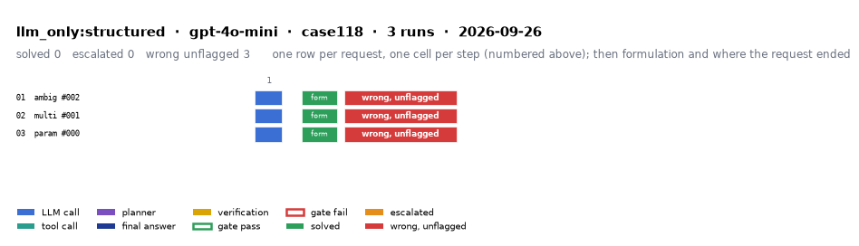

# llm_only:structured on IEEE 118-bus with gpt-4o-mini

Generated 2026-09-26 21:22 by evaluation/postprocess.py from `report.rescored.json`. Runs: 3. Scored by the unified evaluator (v2): every verdict below is read from the answer JSON, the same way for every method.

## Run

| field | value |
|---|---|
| date | 2026-09-26 |
| model | openrouter:openai/gpt-4o-mini |
| method | llm_only:structured |
| case | case118 |
| condition | normal |
| n | 3 |
| seed | 0 |
| k | 1 |
| max_rounds | 8 |
| tool_variant | load_split |
| plan_variant | text |
| temperature | 0.0 |
| system_prompt_hash | 183abd966fbd |
| description | LLM answers from the case tables in the prompt. No tools. Structured prompt: role, full case tables as system data, task, JSON output schema. |
| prompt files | _shared/llm_only_system_prompt.txt, _shared/llm_only_user_template.txt, _shared/llm_only_bus_id_note.txt |

One row per request, one cell per step (blue LLM call, teal tool call, purple planner, gold verification; green or red edge is the gate verdict), then formulation and where the request ended. Each run also has its own figure next to its traces: `traces/NN_<request>.png`.

## Where every request ended

The three outcomes are exclusive and sum to the run count. Escalation takes precedence: a run the method handed to a person is not an autonomous answer, right or wrong.

| outcome | count | share |
|---|---:|---:|
| Solved autonomously | 0 | 0.0% |
| Escalated to a person | 0 | 0.0% |
| Wrong, unflagged | 3 | 100.0% |
| **Total** | **3** | 100% |

## Metrics

| group | metric | value |
|---|---|---|
| Task utility | Formulation exact | 3/3 (100.0%) |
| Task utility | Voltage MAE, all runs | 0.1096 p.u. |
| Task utility | Voltage MAE, formulation-exact runs | 0.1096 p.u. |
| Task utility | Flow MAE, all runs | 48.0943 MW |
| Task utility | Flow MAE, formulation-exact runs | 48.0943 MW |
| Task utility | KCL mismatch, mean | 51.1647 MW |
| Solver-grounded correctness | Solved (computation right, any path) | 0/3 (0.0%) |
| Solver-grounded correctness | V-pass (all conditions, offline) | 0/3 (0.0%) |
| Reporting | Traceable answers | 0/3 (0.0%) |
| Reporting | Traceable numbers, mean share | 0.025 |
| Reporting | Stale state quoted | 0/3 |
| Cost and time | LLM calls / tool calls, mean | 1 / 0 |
| Cost and time | Prompt / completion tokens, mean | 14041 / 5521 |
| Cost and time | Cost, total | $0.0163 |
| Cost and time | Wall time, mean | 53.5 s |

### Cross-check against the runner's own scoreboard

Values the runner aggregated for the same rows (report.json scoreboard). They should agree with the table above; a disagreement means the rows were filtered differently.

| metric | runner scoreboard | this report |
|---|---:|---:|
| common_solved_count | 0 | 0 |
| common_escalated_count | 0 | 0 |
| common_wrong_count | 3 | 3 |
| common_formulation_count | 3 | 3 |
| common_traceable_count | 0 | 0 |
| common_n | 3 | 3 |

## By request difficulty

| difficulty | n | solved | escalated | wrong unflagged | formulation exact |
|---|---:|---:|---:|---:|---:|
| ambiguous | 1 | 0 | 0 | 1 | 1 |
| multistep | 1 | 0 | 0 | 1 | 1 |
| parameterized | 1 | 0 | 0 | 1 | 1 |

## Wrong and unflagged (3)

- `case118-ambiguous-002-s0` formulation exact; declared:  ([narrative](traces/01_case118-ambiguous-002-s0.narrative.txt), [transcript](traces/01_case118-ambiguous-002-s0.transcript.txt))
- `case118-multistep-001-s0` formulation exact; declared:  ([narrative](traces/02_case118-multistep-001-s0.narrative.txt), [transcript](traces/02_case118-multistep-001-s0.transcript.txt))
- `case118-parameterized-000-s0` formulation exact; declared:  ([narrative](traces/03_case118-parameterized-000-s0.narrative.txt), [transcript](traces/03_case118-parameterized-000-s0.transcript.txt))

## Untraceable numbers in the answer (3)

- `case118-ambiguous-002-s0` 592 of 592 numbers; values ['2,000.0 MW', '1,800.0 MW', '200.0 MW', '1.02', '0.0', '1.01', '-5.0', '-10.0', '1.03', '-2.0', '1.01', '-3.0', '-4.0', '1.02', '-1.0', '1.01', '-2.0', '-3.0', '1.01', '-1.0']  ([narrative](traces/01_case118-ambiguous-002-s0.narrative.txt), [transcript](traces/01_case118-ambiguous-002-s0.transcript.txt))
- `case118-multistep-001-s0` 124 of 124 numbers; values ['0.9345 p.u.', '1.035', '1.025', '1.015', '1.020', '1.010', '0.995', '0.980', '0.970', '0.965', '0.960', '0.955', '0.950', '0.940', '0.935', '0.930', '0.925', '0.920', '0.915', '0.910']  ([narrative](traces/02_case118-multistep-001-s0.narrative.txt), [transcript](traces/02_case118-multistep-001-s0.transcript.txt))
- `case118-parameterized-000-s0` 242 of 242 numbers; values ['2,200.0 MW', '2,200.0 MW', '0.0 MW', '1.02', '0.0', '1.01', '-2.0', '1.00', '-4.0', '1.00', '-6.0', '1.00', '-8.0', '1.00', '-10.0', '1.00', '-12.0', '1.00', '-14.0', '1.00']  ([narrative](traces/03_case118-parameterized-000-s0.narrative.txt), [transcript](traces/03_case118-parameterized-000-s0.transcript.txt))

## Files

- `summary.csv`: one line per run, the fields above plus tokens and time.
- `traces/NN_<request>.narrative.txt`: what happened in each run, step by step, with the verdicts.
- `traces/NN_<request>.transcript.txt`: the raw exchange, every message, tool call and tool output.
- `traces/NN_<request>.png`: the run as a picture: steps, gate verdicts, formulation, verification, outcome, with a two-line narrative.
- `overview.png`: all runs of this folder on one page.
- `traces/NN_<request>.json`: the raw trace the runner wrote.
- `raw/`: the runner's own outputs (report.json, rescored report, logs).
- `requests.jsonl`: the request set, with the intended tool calls that define formulation exactness.
