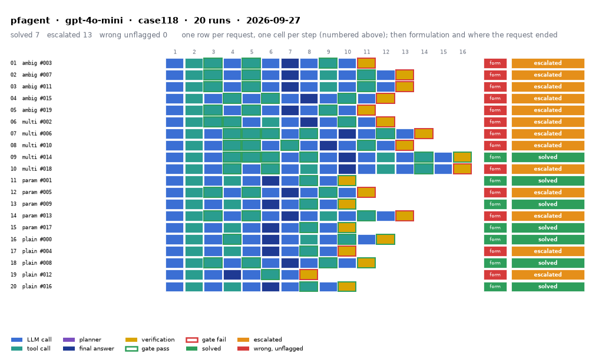

# pfagent on IEEE 118-bus with gpt-4o-mini

Generated 2026-09-28 00:34 by evaluation/postprocess.py from `report.rescored.json`. Runs: 20. Scored by the unified evaluator (v2): every verdict below is read from the answer JSON, the same way for every method.

## Run

| field | value |
|---|---|
| date | 2026-09-27 |
| model | openrouter:openai/gpt-4o-mini |
| method | pfagent |
| case | case118 |
| condition | normal |
| n | 20 |
| seed | 0 |
| k | 1 |
| max_rounds | 8 |
| tool_variant | load_split |
| plan_variant | text |
| temperature | 0.0 |
| system_prompt_hash | 43ef7eaadb12 |
| description | PFAgent: ReAct loop with no in-loop gate plus the task-level verification gate V1-V7 on the final answer (methods/agent/engine.py verify_final_answer). The solver-grounded row. |
| prompt files | _shared/agent_system_prompt.txt, _shared/final_answer_instruction.txt |

One row per request, one cell per step (blue LLM call, teal tool call, purple planner, gold verification; green or red edge is the gate verdict), then formulation and where the request ended. Each run also has its own figure next to its traces: `traces/NN_<request>.png`.

## Where every request ended

The three outcomes are exclusive and sum to the run count. Escalation takes precedence: a run the method handed to a person is not an autonomous answer, right or wrong.

| outcome | count | share |
|---|---:|---:|
| Solved autonomously | 7 | 35.0% |
| Escalated to a person | 13 | 65.0% |
| Wrong, unflagged | 0 | 0.0% |
| **Total** | **20** | 100% |

## Metrics

| group | metric | value |
|---|---|---|
| Task utility | Formulation exact | 7/7 (100.0%) |
| Task utility | Voltage MAE, all runs | 1.35e-07 p.u. |
| Task utility | Voltage MAE, formulation-exact runs | 1.35e-07 p.u. |
| Task utility | Flow MAE, all runs | 1.3541 MW |
| Task utility | Flow MAE, formulation-exact runs | 1.3541 MW |
| Task utility | KCL mismatch, mean | 0.0118 MW |
| Solver-grounded correctness | Solved (computation right, any path) | 7/20 (35.0%) |
| Solver-grounded correctness | V-pass (all conditions, offline) | 20/20 (100.0%) |
| Reporting | Traceable answers | 20/20 (100.0%) |
| Reporting | Traceable numbers, mean share | 1 |
| Reporting | Stale state quoted | 0/20 |
| Cost and time | LLM calls / tool calls, mean | 6.55 / 4.25 |
| Cost and time | Prompt / completion tokens, mean | 1.20e+05 / 25448 |
| Cost and time | Cost, total | $0.6646 |
| Cost and time | Wall time, mean | 199.4 s |

### Cross-check against the runner's own scoreboard

Values the runner aggregated for the same rows (report.json scoreboard). They should agree with the table above; a disagreement means the rows were filtered differently.

| metric | runner scoreboard | this report |
|---|---:|---:|
| common_solved_count | 7 | 7 |
| common_escalated_count | 13 | 13 |
| common_wrong_count | 0 | 0 |
| common_formulation_count | 7 | 7 |
| common_traceable_count | 20 | 20 |
| common_n | 20 | 20 |

## By request difficulty

| difficulty | n | solved | escalated | wrong unflagged | formulation exact |
|---|---:|---:|---:|---:|---:|
| ambiguous | 5 | 0 | 5 | 0 | 0 |
| multistep | 5 | 1 | 4 | 0 | 1 |
| parameterized | 5 | 3 | 2 | 0 | 3 |
| plain | 5 | 3 | 2 | 0 | 3 |

## Escalated (13)

- `case118-ambiguous-003-s0` detected via gate_abstained; formulation None; not scored: the method declared it could not complete the request  ([narrative](traces/01_case118-ambiguous-003-s0.narrative.txt), [transcript](traces/01_case118-ambiguous-003-s0.transcript.txt))
- `case118-ambiguous-007-s0` detected via gate_abstained; formulation None; not scored: the method declared it could not complete the request  ([narrative](traces/02_case118-ambiguous-007-s0.narrative.txt), [transcript](traces/02_case118-ambiguous-007-s0.transcript.txt))
- `case118-ambiguous-011-s0` detected via gate_abstained; formulation None; not scored: the method declared it could not complete the request  ([narrative](traces/03_case118-ambiguous-011-s0.narrative.txt), [transcript](traces/03_case118-ambiguous-011-s0.transcript.txt))
- `case118-ambiguous-015-s0` detected via gate_abstained; formulation None; not scored: the method declared it could not complete the request  ([narrative](traces/04_case118-ambiguous-015-s0.narrative.txt), [transcript](traces/04_case118-ambiguous-015-s0.transcript.txt))
- `case118-ambiguous-019-s0` detected via gate_abstained; formulation None; not scored: the method declared it could not complete the request  ([narrative](traces/05_case118-ambiguous-019-s0.narrative.txt), [transcript](traces/05_case118-ambiguous-019-s0.transcript.txt))
- `case118-multistep-002-s0` detected via gate_abstained; formulation None; not scored: the method declared it could not complete the request  ([narrative](traces/06_case118-multistep-002-s0.narrative.txt), [transcript](traces/06_case118-multistep-002-s0.transcript.txt))
- `case118-multistep-006-s0` detected via gate_abstained; formulation None; not scored: the method declared it could not complete the request  ([narrative](traces/07_case118-multistep-006-s0.narrative.txt), [transcript](traces/07_case118-multistep-006-s0.transcript.txt))
- `case118-multistep-010-s0` detected via gate_abstained; formulation None; not scored: the method declared it could not complete the request  ([narrative](traces/08_case118-multistep-010-s0.narrative.txt), [transcript](traces/08_case118-multistep-010-s0.transcript.txt))
- `case118-multistep-018-s0` detected via gate_abstained; formulation None; not scored: the method declared it could not complete the request  ([narrative](traces/10_case118-multistep-018-s0.narrative.txt), [transcript](traces/10_case118-multistep-018-s0.transcript.txt))
- `case118-parameterized-005-s0` detected via gate_abstained; formulation None; not scored: the method declared it could not complete the request  ([narrative](traces/12_case118-parameterized-005-s0.narrative.txt), [transcript](traces/12_case118-parameterized-005-s0.transcript.txt))
- `case118-parameterized-013-s0` detected via gate_abstained; formulation None; not scored: the method declared it could not complete the request  ([narrative](traces/14_case118-parameterized-013-s0.narrative.txt), [transcript](traces/14_case118-parameterized-013-s0.transcript.txt))
- `case118-plain-004-s0` detected via gate_abstained; formulation None; not scored: the method declared it could not complete the request  ([narrative](traces/17_case118-plain-004-s0.narrative.txt), [transcript](traces/17_case118-plain-004-s0.transcript.txt))
- `case118-plain-012-s0` detected via gate_abstained; formulation None; not scored: the method declared it could not complete the request  ([narrative](traces/19_case118-plain-012-s0.narrative.txt), [transcript](traces/19_case118-plain-012-s0.transcript.txt))

## Files

- `summary.csv`: one line per run, the fields above plus tokens and time.
- `traces/NN_<request>.narrative.txt`: what happened in each run, step by step, with the verdicts.
- `traces/NN_<request>.transcript.txt`: the raw exchange, every message, tool call and tool output.
- `traces/NN_<request>.png`: the run as a picture: steps, gate verdicts, formulation, verification, outcome, with a two-line narrative.
- `overview.png`: all runs of this folder on one page.
- `traces/NN_<request>.json`: the raw trace the runner wrote.
- `raw/`: the runner's own outputs (report.json, rescored report, logs).
- `requests.jsonl`: the request set, with the intended tool calls that define formulation exactness.
