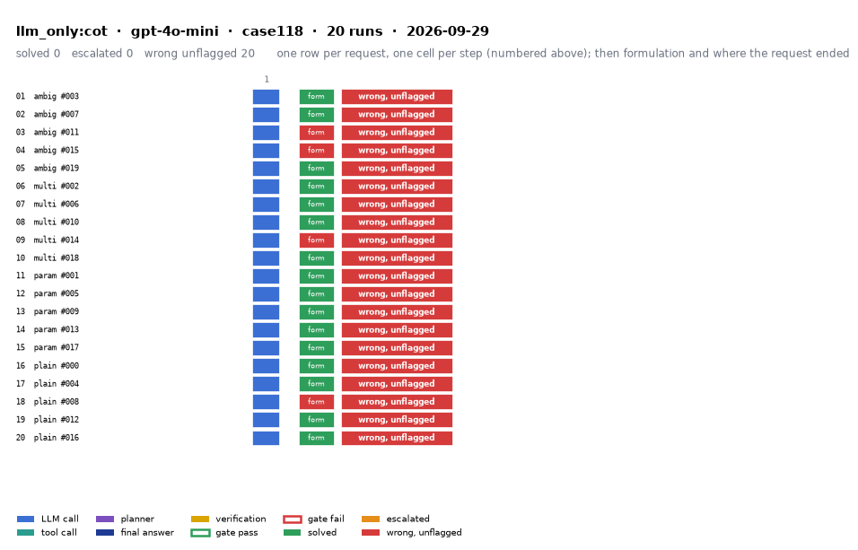

# llm_only:cot on IEEE 118-bus with gpt-4o-mini

Generated 2026-09-29 14:54 by evaluation/postprocess.py from `report.rescored.json`. Runs: 20. Scored by the unified evaluator (v2): every verdict below is read from the answer JSON, the same way for every method.

## Run

| field | value |
|---|---|
| date | 2026-09-29 |
| model | openrouter:openai/gpt-4o-mini |
| method | llm_only:cot |
| case | case118 |
| condition | normal |
| n | 20 |
| seed | 0 |
| k | 1 |
| max_rounds | 8 |
| tool_variant | load_split |
| plan_variant | text |
| temperature | 0.0 |
| system_prompt_hash | be09b0a3b7d2 |
| description | LLM answers from the case tables in the prompt. No tools. Structured prompt plus a reasoning section asking for step-by-step reasoning before the final JSON. |
| prompt files | _shared/llm_only_system_prompt.txt, _shared/llm_only_user_template.txt, _shared/llm_only_bus_id_note.txt, _shared/cot_system_suffix.txt, llm_only_cot/reasoning_section.txt |

One row per request, one cell per step (blue LLM call, teal tool call, purple planner, gold verification; green or red edge is the gate verdict), then formulation and where the request ended. Each run also has its own figure next to its traces: `traces/NN_<request>.png`.

## Where every request ended

The three outcomes are exclusive and cover every request the method answered. Escalation takes precedence: a run the method handed to a person is not an autonomous answer, right or wrong. A request whose API call failed never reached an answer, so it is listed apart and excluded from the rates.

| outcome | count | share |
|---|---:|---:|
| Solved autonomously | 0 | 0.0% |
| Escalated to a person | 0 | 0.0% |
| Wrong, unflagged | 20 | 100.0% |
| **Total** | **20** | 100% |

## Metrics

| group | metric | value |
|---|---|---|
| Task utility | Formulation exact | 16/20 (80.0%) |
| Task utility | Formulation error types | missed_step: 4 |
| Task utility | Voltage MAE, all runs | 0.0714 p.u. |
| Task utility | Voltage MAE, formulation-exact runs | 0.0803 p.u. |
| Task utility | Flow MAE, all runs | 138.4777 MW |
| Task utility | Flow MAE, formulation-exact runs | 155.1386 MW |
| Task utility | KCL mismatch, mean | 94.3037 MW |
| Solver-grounded correctness | Solved (computation right, any path) | 0/20 (0.0%) |
| Solver-grounded correctness | V-pass (all conditions, offline) | 0/20 (0.0%) |
| Reporting | Traceable answers | 0/20 (0.0%) |
| Reporting | Traceable numbers, mean share | 0.164 |
| Reporting | Stale state quoted | 0/20 |
| Cost and time | LLM calls / tool calls, mean | 1 / 0 |
| Cost and time | Prompt / completion tokens, mean | 14237 / 6749 |
| Cost and time | Cost, total | $0.1237 |
| Cost and time | Wall time, mean | 104.7 s |

### Cross-check against the runner's own scoreboard

Values the runner aggregated for the same rows (report.json scoreboard). They should agree with the table above; a disagreement means the rows were filtered differently.

| metric | runner scoreboard | this report |
|---|---:|---:|
| common_solved_count | 0 | 0 |
| common_escalated_count | 0 | 0 |
| common_wrong_count | 20 | 20 |
| common_formulation_count | 16 | 16 |
| common_traceable_count | 0 | 0 |
| common_n | 20 | 20 |

## By request difficulty

| difficulty | n | solved | escalated | wrong unflagged | formulation exact |
|---|---:|---:|---:|---:|---:|
| ambiguous | 5 | 0 | 0 | 5 | 3 |
| multistep | 5 | 0 | 0 | 5 | 4 |
| parameterized | 5 | 0 | 0 | 5 | 5 |
| plain | 5 | 0 | 0 | 5 | 4 |

## Wrong and unflagged (20)

- `case118-ambiguous-003-s0` formulation exact; declared:  ([narrative](traces/01_case118-ambiguous-003-s0.narrative.txt), [transcript](traces/01_case118-ambiguous-003-s0.transcript.txt))
- `case118-ambiguous-007-s0` formulation exact; declared:  ([narrative](traces/02_case118-ambiguous-007-s0.narrative.txt), [transcript](traces/02_case118-ambiguous-007-s0.transcript.txt))
- `case118-ambiguous-011-s0` formulation missed_step; the formulation declared in the answer omits load_case, which the request needs  ([narrative](traces/03_case118-ambiguous-011-s0.narrative.txt), [transcript](traces/03_case118-ambiguous-011-s0.transcript.txt))
- `case118-ambiguous-015-s0` formulation missed_step; the formulation declared in the answer omits load_case, which the request needs  ([narrative](traces/04_case118-ambiguous-015-s0.narrative.txt), [transcript](traces/04_case118-ambiguous-015-s0.transcript.txt))
- `case118-ambiguous-019-s0` formulation exact; declared:  ([narrative](traces/05_case118-ambiguous-019-s0.narrative.txt), [transcript](traces/05_case118-ambiguous-019-s0.transcript.txt))
- `case118-multistep-002-s0` formulation exact; declared:  ([narrative](traces/06_case118-multistep-002-s0.narrative.txt), [transcript](traces/06_case118-multistep-002-s0.transcript.txt))
- `case118-multistep-006-s0` formulation exact; declared:  ([narrative](traces/07_case118-multistep-006-s0.narrative.txt), [transcript](traces/07_case118-multistep-006-s0.transcript.txt))
- `case118-multistep-010-s0` formulation exact; declared:  ([narrative](traces/08_case118-multistep-010-s0.narrative.txt), [transcript](traces/08_case118-multistep-010-s0.transcript.txt))
- `case118-multistep-014-s0` formulation missed_step; the formulation declared in the answer omits load_case, which the request needs  ([narrative](traces/09_case118-multistep-014-s0.narrative.txt), [transcript](traces/09_case118-multistep-014-s0.transcript.txt))
- `case118-multistep-018-s0` formulation exact; declared:  ([narrative](traces/10_case118-multistep-018-s0.narrative.txt), [transcript](traces/10_case118-multistep-018-s0.transcript.txt))
- `case118-parameterized-001-s0` formulation exact; declared:  ([narrative](traces/11_case118-parameterized-001-s0.narrative.txt), [transcript](traces/11_case118-parameterized-001-s0.transcript.txt))
- `case118-parameterized-005-s0` formulation exact; declared:  ([narrative](traces/12_case118-parameterized-005-s0.narrative.txt), [transcript](traces/12_case118-parameterized-005-s0.transcript.txt))
- `case118-parameterized-009-s0` formulation exact; declared:  ([narrative](traces/13_case118-parameterized-009-s0.narrative.txt), [transcript](traces/13_case118-parameterized-009-s0.transcript.txt))
- `case118-parameterized-013-s0` formulation exact; declared:  ([narrative](traces/14_case118-parameterized-013-s0.narrative.txt), [transcript](traces/14_case118-parameterized-013-s0.transcript.txt))
- `case118-parameterized-017-s0` formulation exact; declared:  ([narrative](traces/15_case118-parameterized-017-s0.narrative.txt), [transcript](traces/15_case118-parameterized-017-s0.transcript.txt))
- `case118-plain-000-s0` formulation exact; declared:  ([narrative](traces/16_case118-plain-000-s0.narrative.txt), [transcript](traces/16_case118-plain-000-s0.transcript.txt))
- `case118-plain-004-s0` formulation exact; declared:  ([narrative](traces/17_case118-plain-004-s0.narrative.txt), [transcript](traces/17_case118-plain-004-s0.transcript.txt))
- `case118-plain-008-s0` formulation missed_step; the formulation declared in the answer omits load_case, which the request needs  ([narrative](traces/18_case118-plain-008-s0.narrative.txt), [transcript](traces/18_case118-plain-008-s0.transcript.txt))
- `case118-plain-012-s0` formulation exact; declared:  ([narrative](traces/19_case118-plain-012-s0.narrative.txt), [transcript](traces/19_case118-plain-012-s0.transcript.txt))
- `case118-plain-016-s0` formulation exact; declared:  ([narrative](traces/20_case118-plain-016-s0.narrative.txt), [transcript](traces/20_case118-plain-016-s0.transcript.txt))

## Formulation not exact (4)

- `case118-ambiguous-011-s0` missed_step: the formulation declared in the answer omits load_case, which the request needs  ([narrative](traces/03_case118-ambiguous-011-s0.narrative.txt), [transcript](traces/03_case118-ambiguous-011-s0.transcript.txt))
- `case118-ambiguous-015-s0` missed_step: the formulation declared in the answer omits load_case, which the request needs  ([narrative](traces/04_case118-ambiguous-015-s0.narrative.txt), [transcript](traces/04_case118-ambiguous-015-s0.transcript.txt))
- `case118-multistep-014-s0` missed_step: the formulation declared in the answer omits load_case, which the request needs  ([narrative](traces/09_case118-multistep-014-s0.narrative.txt), [transcript](traces/09_case118-multistep-014-s0.transcript.txt))
- `case118-plain-008-s0` missed_step: the formulation declared in the answer omits load_case, which the request needs  ([narrative](traces/18_case118-plain-008-s0.narrative.txt), [transcript](traces/18_case118-plain-008-s0.transcript.txt))

## Untraceable numbers in the answer (20)

- `case118-ambiguous-003-s0` 597 of 597 numbers; values ['68.49 MW', '22.50 MVar', '37.17 MW', '17.49 MVar', '428.62 MW', '1,200.00 MW', '1,200.00 MW', '0.00 MW', '1.02', '0.0', '1.01', '5.0', '1.00', '10.0', '1.03', '15.0', '1.02', '20.0', '1.01', '25.0']  ([narrative](traces/01_case118-ambiguous-003-s0.narrative.txt), [transcript](traces/01_case118-ambiguous-003-s0.transcript.txt))
- `case118-ambiguous-007-s0` 592 of 592 numbers; values ['2,000.0 MW', '1,800.0 MW', '200.0 MW', '1.02', '0.0', '1.01', '5.0', '10.0', '1.03', '15.0', '1.02', '20.0', '1.01', '25.0', '30.0', '1.04', '35.0', '1.03', '40.0', '1.02']  ([narrative](traces/02_case118-ambiguous-007-s0.narrative.txt), [transcript](traces/02_case118-ambiguous-007-s0.transcript.txt))
- `case118-ambiguous-011-s0` 247 of 247 numbers; values ['2,000.0 MW', '2,000.0 MW', '1.02', '1.01', '-5.0', '1.01', '-10.0', '1.00', '-15.0', '1.00', '-20.0', '1.00', '-25.0', '1.00', '-30.0', '1.00', '-35.0', '1.00', '-40.0', '1.00']  ([narrative](traces/03_case118-ambiguous-011-s0.narrative.txt), [transcript](traces/03_case118-ambiguous-011-s0.transcript.txt))
- `case118-ambiguous-015-s0` 252 of 252 numbers; values ['1234.5 MW', '1234.5 MW', '0.0 MW', '1.02', '0.0', '1.01', '5.0', '1.00', '10.0', '1.00', '15.0', '1.00', '20.0', '1.00', '25.0', '1.00', '30.0', '1.00', '35.0', '1.00']  ([narrative](traces/04_case118-ambiguous-015-s0.narrative.txt), [transcript](traces/04_case118-ambiguous-015-s0.transcript.txt))
- `case118-ambiguous-019-s0` 239 of 239 numbers; values ['1.02', '0.0', '1.01', '-2.0', '1.01', '-4.0', '-6.0', '-8.0', '-10.0', '-12.0', '-14.0', '-16.0', '-18.0', '-20.0', '-22.0', '-24.0', '-26.0', '-28.0', '-30.0', '-32.0']  ([narrative](traces/05_case118-ambiguous-019-s0.narrative.txt), [transcript](traces/05_case118-ambiguous-019-s0.transcript.txt))
- `case118-multistep-002-s0` 123 of 123 numbers; values ['0.9345 p.u.', '1.045', '1.025', '1.030', '1.020', '1.015', '1.010', '0.990', '0.985', '0.980', '0.975', '0.970', '0.965', '0.960', '0.9345', '0.950', '0.940', '0.930', '0.920', '0.910']  ([narrative](traces/06_case118-multistep-002-s0.narrative.txt), [transcript](traces/06_case118-multistep-002-s0.transcript.txt))
- `case118-multistep-006-s0` 599 of 599 numbers; values ['85.3%', '90.1%', '82.5%', '1.02', '0.0', '1.01', '5.0', '1.00', '10.0', '1.03', '15.0', '1.01', '20.0', '1.00', '25.0', '1.02', '30.0', '1.01', '35.0', '1.00']  ([narrative](traces/07_case118-multistep-006-s0.narrative.txt), [transcript](traces/07_case118-multistep-006-s0.transcript.txt))
- `case118-multistep-010-s0` 594 of 594 numbers; values ['110.5%', '102.3%', '1.02', '0.0', '1.01', '-5.0', '1.00', '-10.0', '1.00', '-15.0', '0.99', '-20.0', '0.98', '-25.0', '0.97', '-30.0', '1.03', '-35.0', '1.02', '-40.0']  ([narrative](traces/08_case118-multistep-010-s0.narrative.txt), [transcript](traces/08_case118-multistep-010-s0.transcript.txt))
- `case118-multistep-014-s0` 128 of 128 numbers; values ['0.9475 p.u.', '1.005', '1.002', '1.003', '1.004', '1.006', '1.007', '1.008', '1.009', '1.010', '1.011', '1.012', '1.013', '1.014', '1.015', '1.016', '1.017', '1.018', '1.019', '1.020']  ([narrative](traces/09_case118-multistep-014-s0.narrative.txt), [transcript](traces/09_case118-multistep-014-s0.transcript.txt))
- `case118-multistep-018-s0` 594 of 594 numbers; values ['92.5%', '95.3%', '91.2%', '1.02', '0.0', '1.01', '-5.0', '1.00', '-10.0', '1.00', '-15.0', '1.00', '-20.0', '1.00', '-25.0', '1.00', '-30.0', '1.00', '-35.0', '1.00']  ([narrative](traces/10_case118-multistep-018-s0.narrative.txt), [transcript](traces/10_case118-multistep-018-s0.transcript.txt))
- `case118-parameterized-001-s0` 123 of 123 numbers; values ['0.934 p.u.', '1.02', '1.01', '0.99', '1.01', '0.934', '0.0', '0.0', '0.0', '0.934']  ([narrative](traces/11_case118-parameterized-001-s0.narrative.txt), [transcript](traces/11_case118-parameterized-001-s0.transcript.txt))
- `case118-parameterized-005-s0` 244 of 244 numbers; values ['2,000.0 MW', '1,800.0 MW', '200.0 MW', '1.02', '0.0', '1.01', '5.0', '1.00', '10.0', '1.00', '15.0', '1.00', '20.0', '1.00', '25.0', '1.00', '30.0', '1.00', '35.0', '1.00']  ([narrative](traces/12_case118-parameterized-005-s0.narrative.txt), [transcript](traces/12_case118-parameterized-005-s0.transcript.txt))
- `case118-parameterized-009-s0` 826 of 826 numbers; values ['1.02', '0.0', '1.01', '5.0', '10.0', '0.99', '15.0', '0.98', '20.0', '25.0', '1.01', '30.0', '1.02', '35.0', '1.03', '40.0', '1.04', '45.0', '1.05', '50.0']  ([narrative](traces/13_case118-parameterized-009-s0.narrative.txt), [transcript](traces/13_case118-parameterized-009-s0.transcript.txt))
- `case118-parameterized-013-s0` 589 of 589 numbers; values ['1.02', '0.0', '1.01', '-5.0', '1.00', '-10.0', '1.00', '-15.0', '1.00', '-20.0', '1.00', '-25.0', '1.00', '-30.0', '1.00', '-35.0', '1.00', '-40.0', '1.00', '-45.0']  ([narrative](traces/14_case118-parameterized-013-s0.narrative.txt), [transcript](traces/14_case118-parameterized-013-s0.transcript.txt))
- `case118-parameterized-017-s0` 45 of 45 numbers; values ['1.06', '0.0', '1.05', '0.0', '1.04', '0.0', '1.03', '0.0', '1.02', '0.0', '1.01', '0.0', '0.0', '0.99', '0.0', '0.98', '0.0', '0.97', '0.0', '0.96']  ([narrative](traces/15_case118-parameterized-017-s0.narrative.txt), [transcript](traces/15_case118-parameterized-017-s0.transcript.txt))
- `case118-plain-000-s0` 242 of 242 numbers; values ['0.95', '1.05 p.u.', '0.9254 p.u.', '1.0456', '0.0', '1.0345', '-2.0', '1.0254', '-4.0', '1.0154', '-6.0', '1.0054', '-8.0', '0.9954', '-10.0', '0.9854', '-12.0', '0.9754', '-14.0', '0.9654']  ([narrative](traces/16_case118-plain-000-s0.narrative.txt), [transcript](traces/16_case118-plain-000-s0.transcript.txt))
- `case118-plain-004-s0` 257 of 257 numbers; values ['120.5%', '1.02', '0.0', '1.01', '5.0', '10.0', '15.0', '20.0', '25.0', '30.0', '35.0', '40.0', '45.0', '50.0', '55.0', '60.0', '65.0', '70.0', '75.0', '80.0']  ([narrative](traces/17_case118-plain-004-s0.narrative.txt), [transcript](traces/17_case118-plain-004-s0.transcript.txt))
- `case118-plain-008-s0` 249 of 249 numbers; values ['49.16 MW', '1.02', '0.0', '1.01', '-5.0', '-10.0', '-15.0', '-20.0', '-25.0', '-30.0', '-35.0', '-40.0', '-45.0', '-50.0', '-55.0', '-60.0', '-65.0', '-70.0', '-75.0', '-80.0']  ([narrative](traces/18_case118-plain-008-s0.narrative.txt), [transcript](traces/18_case118-plain-008-s0.transcript.txt))
- `case118-plain-012-s0` 594 of 594 numbers; values ['0.95', '1.05 p.u.', '2,000.0 MW', '1,800.0 MW', '200.0 MW', '1.02', '0.0', '1.01', '5.0', '1.00', '10.0', '1.03', '15.0', '1.02', '20.0', '1.01', '25.0', '1.00', '30.0', '1.04']  ([narrative](traces/19_case118-plain-012-s0.narrative.txt), [transcript](traces/19_case118-plain-012-s0.transcript.txt))
- `case118-plain-016-s0` 257 of 257 numbers; values ['120.5%', '1.02', '0.0', '1.01', '5.0', '10.0', '15.0', '20.0', '25.0', '30.0', '35.0', '40.0', '45.0', '50.0', '55.0', '60.0', '65.0', '70.0', '75.0', '80.0']  ([narrative](traces/20_case118-plain-016-s0.narrative.txt), [transcript](traces/20_case118-plain-016-s0.transcript.txt))

## Files

- `summary.csv`: one line per run, the fields above plus tokens and time.
- `traces/NN_<request>.narrative.txt`: what happened in each run, step by step, with the verdicts.
- `traces/NN_<request>.transcript.txt`: the raw exchange, every message, tool call and tool output.
- `traces/NN_<request>.png`: the run as a picture: steps, gate verdicts, formulation, verification, outcome, with a two-line narrative.
- `overview.png`: all runs of this folder on one page.
- `traces/NN_<request>.json`: the raw trace the runner wrote.
- `raw/`: the runner's own outputs (report.json, rescored report, logs).
- `requests.jsonl`: the request set, with the intended tool calls that define formulation exactness.
