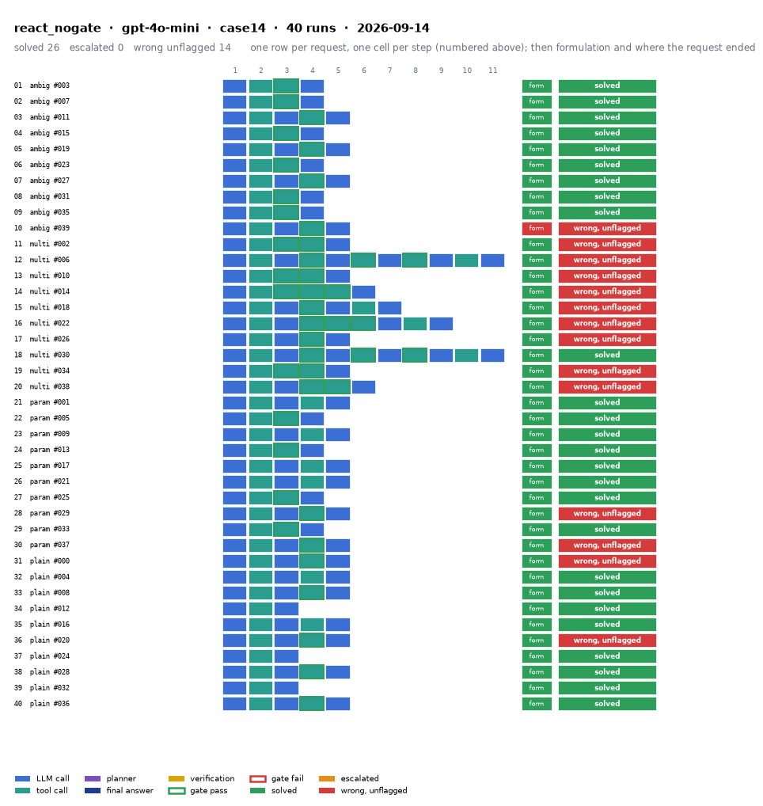

# react_nogate on IEEE 14-bus with gpt-4o-mini

Generated 2026-09-23 22:45 by benchmarks/postprocess.py from `report.rescored.json`. Runs: 40.

## Run

| field | value |
|---|---|
| date | 2026-09-14 |
| model | openrouter:openai/gpt-4o-mini |
| method | react_nogate |
| case | case14 |
| n | 40 |
| seed | 0 |
| k | 1 |
| max_rounds | 8 |
| temperature | 0.0 |
| system_prompt_hash | None |
| source | results_matrix_gpt-4o-mini/react_nogate/case14 |
| source_commit | f8fb5ef 2026-09-21 Re-rescore after the round-limit escalation fix; composite unaffected |
| role_in_paper | split-tool appendix, before side (original modify_load tool) |
| notes | Copied from benchmarks/results_* by scripts/migrate_paper_results.py; the date is the write time of the source report.json. |
| description | ReAct loop with no gate at all. The plain multi-step agent baseline. |
| prompt files | _shared/agent_system_prompt.txt, _shared/final_answer_instruction.txt |

One row per request, one cell per step (blue LLM call, teal tool call, purple planner, gold verification; green or red edge is the gate verdict), then formulation and where the request ended. Each run also has its own figure next to its traces: `traces/NN_<request>.png`.

## Where every request ended

The three outcomes are exclusive and sum to the run count. Escalation takes precedence: a run the method handed to a person is not an autonomous answer, right or wrong.

| outcome | count | share |
|---|---:|---:|
| Solved autonomously | 26 | 65.0% |
| Escalated to a person | 0 | 0.0% |
| Wrong, unflagged | 14 | 35.0% |
| **Total** | **40** | 100% |

## Metrics

| group | metric | value |
|---|---|---|
| Task utility | Formulation exact | 39/40 (97.5%) |
| Task utility | Formulation error types | wrong_id: 1 |
| Task utility | Voltage MAE, all runs | 1.90e-07 p.u. |
| Task utility | Voltage MAE, formulation-exact runs | 0 p.u. |
| Task utility | Flow MAE, all runs | 0.0152 MW |
| Task utility | Flow MAE, formulation-exact runs | 0 MW |
| Task utility | KCL mismatch, mean | 0 MW |
| Solver-grounded correctness | Solved (computation right, any path) | 26/40 (65.0%) |
| Solver-grounded correctness | V-pass (all conditions, offline) | 35/40 (87.5%) |
| Reporting | Traceable answers | 35/40 (87.5%) |
| Reporting | Traceable numbers, mean share | 0.982 |
| Reporting | Stale state quoted | 1/40 |
| Cost and time | LLM calls / tool calls, mean | 2.77 / 2.33 |
| Cost and time | Prompt / completion tokens, mean | 7414 / 206 |
| Cost and time | Cost, total | $0.0494 |
| Cost and time | Wall time, mean | 4.2 s |

### Cross-check against the runner's own scoreboard

Values the runner aggregated for the same rows (report.json scoreboard). They should agree with the table above; a disagreement means the rows were filtered differently.

| metric | runner scoreboard | this report |
|---|---:|---:|
| solved_autonomously_count | 26 | 26 |
| escalated_count | 0 | 0 |
| wrong_silently_count | 14 | 14 |
| formulation_exact_count | 39 | 39 |
| v_pass_count | 35 | 35 |
| faithful_answers_count | 35 | 35 |
| n_items | 40 | 40 |

## By request difficulty

| difficulty | n | solved | escalated | wrong unflagged | formulation exact |
|---|---:|---:|---:|---:|---:|
| ambiguous | 10 | 9 | 0 | 1 | 9 |
| multistep | 10 | 1 | 0 | 9 | 10 |
| parameterized | 10 | 8 | 0 | 2 | 10 |
| plain | 10 | 8 | 0 | 2 | 10 |

## Wrong and unflagged (14)

- `case14-ambiguous-039-s0` formulation wrong_id; modify_load: bus_id intended 2 != executed 1  ([narrative](traces/10_case14-ambiguous-039-s0.narrative.txt), [transcript](traces/10_case14-ambiguous-039-s0.transcript.txt))
- `case14-multistep-002-s0` formulation exact  ([narrative](traces/11_case14-multistep-002-s0.narrative.txt), [transcript](traces/11_case14-multistep-002-s0.transcript.txt))
- `case14-multistep-006-s0` formulation exact  ([narrative](traces/12_case14-multistep-006-s0.narrative.txt), [transcript](traces/12_case14-multistep-006-s0.transcript.txt))
- `case14-multistep-010-s0` formulation exact  ([narrative](traces/13_case14-multistep-010-s0.narrative.txt), [transcript](traces/13_case14-multistep-010-s0.transcript.txt))
- `case14-multistep-014-s0` formulation exact  ([narrative](traces/14_case14-multistep-014-s0.narrative.txt), [transcript](traces/14_case14-multistep-014-s0.transcript.txt))
- `case14-multistep-018-s0` formulation exact  ([narrative](traces/15_case14-multistep-018-s0.narrative.txt), [transcript](traces/15_case14-multistep-018-s0.transcript.txt))
- `case14-multistep-022-s0` formulation exact  ([narrative](traces/16_case14-multistep-022-s0.narrative.txt), [transcript](traces/16_case14-multistep-022-s0.transcript.txt))
- `case14-multistep-026-s0` formulation exact  ([narrative](traces/17_case14-multistep-026-s0.narrative.txt), [transcript](traces/17_case14-multistep-026-s0.transcript.txt))
- `case14-multistep-034-s0` formulation exact  ([narrative](traces/19_case14-multistep-034-s0.narrative.txt), [transcript](traces/19_case14-multistep-034-s0.transcript.txt))
- `case14-multistep-038-s0` formulation exact  ([narrative](traces/20_case14-multistep-038-s0.narrative.txt), [transcript](traces/20_case14-multistep-038-s0.transcript.txt))
- `case14-parameterized-029-s0` formulation exact  ([narrative](traces/28_case14-parameterized-029-s0.narrative.txt), [transcript](traces/28_case14-parameterized-029-s0.transcript.txt))
- `case14-parameterized-037-s0` formulation exact  ([narrative](traces/30_case14-parameterized-037-s0.narrative.txt), [transcript](traces/30_case14-parameterized-037-s0.transcript.txt))
- `case14-plain-000-s0` formulation exact  ([narrative](traces/31_case14-plain-000-s0.narrative.txt), [transcript](traces/31_case14-plain-000-s0.transcript.txt))
- `case14-plain-020-s0` formulation exact  ([narrative](traces/36_case14-plain-020-s0.narrative.txt), [transcript](traces/36_case14-plain-020-s0.transcript.txt))

## Formulation not exact (1)

- `case14-ambiguous-039-s0` wrong_id: modify_load: bus_id intended 2 != executed 1  ([narrative](traces/10_case14-ambiguous-039-s0.narrative.txt), [transcript](traces/10_case14-ambiguous-039-s0.transcript.txt))

## Untraceable numbers in the answer (5)

- `case14-multistep-006-s0` 1 of 6 numbers; values ['141.16%']  ([narrative](traces/12_case14-multistep-006-s0.narrative.txt), [transcript](traces/12_case14-multistep-006-s0.transcript.txt))
- `case14-multistep-018-s0` 2 of 7 numbers; values ['171.36%', '171.36%']  ([narrative](traces/15_case14-multistep-018-s0.narrative.txt), [transcript](traces/15_case14-multistep-018-s0.transcript.txt))
- `case14-multistep-022-s0` 0 of 5 numbers; values []  ([narrative](traces/16_case14-multistep-022-s0.narrative.txt), [transcript](traces/16_case14-multistep-022-s0.transcript.txt))
- `case14-parameterized-029-s0` 1 of 8 numbers; values ['151.22%']  ([narrative](traces/28_case14-parameterized-029-s0.narrative.txt), [transcript](traces/28_case14-parameterized-029-s0.transcript.txt))
- `case14-parameterized-037-s0` 1 of 8 numbers; values ['156.60%']  ([narrative](traces/30_case14-parameterized-037-s0.narrative.txt), [transcript](traces/30_case14-parameterized-037-s0.transcript.txt))

## Files

- `summary.csv`: one line per run, the fields above plus tokens and time.
- `traces/NN_<request>.narrative.txt`: what happened in each run, step by step, with the verdicts.
- `traces/NN_<request>.transcript.txt`: the raw exchange, every message, tool call and tool output.
- `traces/NN_<request>.png`: the run as a picture: steps, gate verdicts, formulation, verification, outcome, with a two-line narrative.
- `overview.png`: all runs of this folder on one page.
- `traces/NN_<request>.json`: the raw trace the runner wrote.
- `raw/`: the runner's own outputs (report.json, rescored report, logs).
- `requests.jsonl`: the request set, with the intended tool calls that define formulation exactness.
