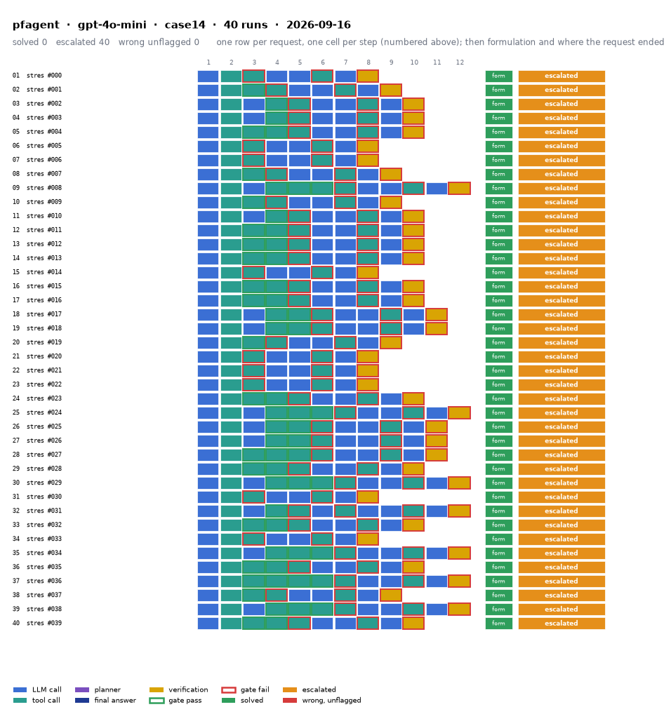

# pfagent on IEEE 14-bus with gpt-4o-mini

Generated 2026-09-23 22:47 by benchmarks/postprocess.py from `report.rescored.json`. Runs: 40.

## Run

| field | value |
|---|---|
| date | 2026-09-16 |
| model | openrouter:openai/gpt-4o-mini |
| method | pfagent |
| case | case14 |
| condition | stress |
| n | 40 |
| seed | 0 |
| k | 1 |
| max_rounds | 8 |
| temperature | 0.0 |
| system_prompt_hash | None |
| source | results_validation_gpt-4o-mini_stress |
| source_commit | 46e27b8 2026-09-22 Backfill GPT-5.4's missing B_mean-solved from its own frozen data |
| role_in_paper | stress table (S6) |
| notes | Copied from benchmarks/results_* by scripts/migrate_paper_results.py; the date is the write time of the source report.json. |
| description | PFAgent: ReAct loop with no in-loop gate plus the task-level verification gate V1-V7 on the final answer (llm/engine.py verify_final_answer). The solver-grounded row. |
| prompt files | _shared/agent_system_prompt.txt, _shared/final_answer_instruction.txt |

One row per request, one cell per step (blue LLM call, teal tool call, purple planner, gold verification; green or red edge is the gate verdict), then formulation and where the request ended. Each run also has its own figure next to its traces: `traces/NN_<request>.png`.

## Where every request ended

The three outcomes are exclusive and sum to the run count. Escalation takes precedence: a run the method handed to a person is not an autonomous answer, right or wrong.

| outcome | count | share |
|---|---:|---:|
| Solved autonomously | 0 | 0.0% |
| Escalated to a person | 40 | 100.0% |
| Wrong, unflagged | 0 | 0.0% |
| **Total** | **40** | 100% |

## Metrics

| group | metric | value |
|---|---|---|
| Task utility | Formulation exact | 40/40 (100.0%) |
| Task utility | Voltage MAE, all runs | nan p.u. |
| Task utility | Voltage MAE, formulation-exact runs | nan p.u. |
| Task utility | Flow MAE, all runs | 0 MW |
| Task utility | Flow MAE, formulation-exact runs | 0 MW |
| Task utility | KCL mismatch, mean | 0 MW |
| Solver-grounded correctness | Solved (computation right, any path) | 40/40 (100.0%) |
| Solver-grounded correctness | V-pass (all conditions, offline) | 0/40 (0.0%) |
| Solver-grounded correctness | Safe failure on real failures | 40/40 (100.0%) |
| Reporting | Traceable answers | 40/40 (100.0%) |
| Reporting | Traceable numbers, mean share | 1 |
| Reporting | Stale state quoted | 0/40 |
| Cost and time | LLM calls / tool calls, mean | 4.35 / 4.55 |
| Cost and time | Prompt / completion tokens, mean | 20514 / 392 |
| Cost and time | Cost, total | $0.1325 |
| Cost and time | Wall time, mean | 6.5 s |

## Escalated (40)

- `case14-stress-000-s0` detected via text; formulation exact  ([narrative](traces/01_case14-stress-000-s0.narrative.txt), [transcript](traces/01_case14-stress-000-s0.transcript.txt))
- `case14-stress-001-s0` detected via text; formulation exact  ([narrative](traces/02_case14-stress-001-s0.narrative.txt), [transcript](traces/02_case14-stress-001-s0.transcript.txt))
- `case14-stress-002-s0` detected via text; formulation exact  ([narrative](traces/03_case14-stress-002-s0.narrative.txt), [transcript](traces/03_case14-stress-002-s0.transcript.txt))
- `case14-stress-003-s0` detected via text; formulation exact  ([narrative](traces/04_case14-stress-003-s0.narrative.txt), [transcript](traces/04_case14-stress-003-s0.transcript.txt))
- `case14-stress-004-s0` detected via text; formulation exact  ([narrative](traces/05_case14-stress-004-s0.narrative.txt), [transcript](traces/05_case14-stress-004-s0.transcript.txt))
- `case14-stress-005-s0` detected via text; formulation exact  ([narrative](traces/06_case14-stress-005-s0.narrative.txt), [transcript](traces/06_case14-stress-005-s0.transcript.txt))
- `case14-stress-006-s0` detected via text; formulation exact  ([narrative](traces/07_case14-stress-006-s0.narrative.txt), [transcript](traces/07_case14-stress-006-s0.transcript.txt))
- `case14-stress-007-s0` detected via text; formulation exact  ([narrative](traces/08_case14-stress-007-s0.narrative.txt), [transcript](traces/08_case14-stress-007-s0.transcript.txt))
- `case14-stress-008-s0` detected via text; formulation exact  ([narrative](traces/09_case14-stress-008-s0.narrative.txt), [transcript](traces/09_case14-stress-008-s0.transcript.txt))
- `case14-stress-009-s0` detected via text; formulation exact  ([narrative](traces/10_case14-stress-009-s0.narrative.txt), [transcript](traces/10_case14-stress-009-s0.transcript.txt))
- `case14-stress-010-s0` detected via text; formulation exact  ([narrative](traces/11_case14-stress-010-s0.narrative.txt), [transcript](traces/11_case14-stress-010-s0.transcript.txt))
- `case14-stress-011-s0` detected via text; formulation exact  ([narrative](traces/12_case14-stress-011-s0.narrative.txt), [transcript](traces/12_case14-stress-011-s0.transcript.txt))
- `case14-stress-012-s0` detected via text; formulation exact  ([narrative](traces/13_case14-stress-012-s0.narrative.txt), [transcript](traces/13_case14-stress-012-s0.transcript.txt))
- `case14-stress-013-s0` detected via text; formulation exact  ([narrative](traces/14_case14-stress-013-s0.narrative.txt), [transcript](traces/14_case14-stress-013-s0.transcript.txt))
- `case14-stress-014-s0` detected via text; formulation exact  ([narrative](traces/15_case14-stress-014-s0.narrative.txt), [transcript](traces/15_case14-stress-014-s0.transcript.txt))
- `case14-stress-015-s0` detected via text; formulation exact  ([narrative](traces/16_case14-stress-015-s0.narrative.txt), [transcript](traces/16_case14-stress-015-s0.transcript.txt))
- `case14-stress-016-s0` detected via text; formulation exact  ([narrative](traces/17_case14-stress-016-s0.narrative.txt), [transcript](traces/17_case14-stress-016-s0.transcript.txt))
- `case14-stress-017-s0` detected via text; formulation exact  ([narrative](traces/18_case14-stress-017-s0.narrative.txt), [transcript](traces/18_case14-stress-017-s0.transcript.txt))
- `case14-stress-018-s0` detected via text; formulation exact  ([narrative](traces/19_case14-stress-018-s0.narrative.txt), [transcript](traces/19_case14-stress-018-s0.transcript.txt))
- `case14-stress-019-s0` detected via text; formulation exact  ([narrative](traces/20_case14-stress-019-s0.narrative.txt), [transcript](traces/20_case14-stress-019-s0.transcript.txt))
- `case14-stress-020-s0` detected via text; formulation exact  ([narrative](traces/21_case14-stress-020-s0.narrative.txt), [transcript](traces/21_case14-stress-020-s0.transcript.txt))
- `case14-stress-021-s0` detected via text; formulation exact  ([narrative](traces/22_case14-stress-021-s0.narrative.txt), [transcript](traces/22_case14-stress-021-s0.transcript.txt))
- `case14-stress-022-s0` detected via text; formulation exact  ([narrative](traces/23_case14-stress-022-s0.narrative.txt), [transcript](traces/23_case14-stress-022-s0.transcript.txt))
- `case14-stress-023-s0` detected via text; formulation exact  ([narrative](traces/24_case14-stress-023-s0.narrative.txt), [transcript](traces/24_case14-stress-023-s0.transcript.txt))
- `case14-stress-024-s0` detected via text; formulation exact  ([narrative](traces/25_case14-stress-024-s0.narrative.txt), [transcript](traces/25_case14-stress-024-s0.transcript.txt))
- `case14-stress-025-s0` detected via text; formulation exact  ([narrative](traces/26_case14-stress-025-s0.narrative.txt), [transcript](traces/26_case14-stress-025-s0.transcript.txt))
- `case14-stress-026-s0` detected via text; formulation exact  ([narrative](traces/27_case14-stress-026-s0.narrative.txt), [transcript](traces/27_case14-stress-026-s0.transcript.txt))
- `case14-stress-027-s0` detected via text; formulation exact  ([narrative](traces/28_case14-stress-027-s0.narrative.txt), [transcript](traces/28_case14-stress-027-s0.transcript.txt))
- `case14-stress-028-s0` detected via text; formulation exact  ([narrative](traces/29_case14-stress-028-s0.narrative.txt), [transcript](traces/29_case14-stress-028-s0.transcript.txt))
- `case14-stress-029-s0` detected via text; formulation exact  ([narrative](traces/30_case14-stress-029-s0.narrative.txt), [transcript](traces/30_case14-stress-029-s0.transcript.txt))
- `case14-stress-030-s0` detected via text; formulation exact  ([narrative](traces/31_case14-stress-030-s0.narrative.txt), [transcript](traces/31_case14-stress-030-s0.transcript.txt))
- `case14-stress-031-s0` detected via text; formulation exact  ([narrative](traces/32_case14-stress-031-s0.narrative.txt), [transcript](traces/32_case14-stress-031-s0.transcript.txt))
- `case14-stress-032-s0` detected via text; formulation exact  ([narrative](traces/33_case14-stress-032-s0.narrative.txt), [transcript](traces/33_case14-stress-032-s0.transcript.txt))
- `case14-stress-033-s0` detected via text; formulation exact  ([narrative](traces/34_case14-stress-033-s0.narrative.txt), [transcript](traces/34_case14-stress-033-s0.transcript.txt))
- `case14-stress-034-s0` detected via text; formulation exact  ([narrative](traces/35_case14-stress-034-s0.narrative.txt), [transcript](traces/35_case14-stress-034-s0.transcript.txt))
- `case14-stress-035-s0` detected via text; formulation exact  ([narrative](traces/36_case14-stress-035-s0.narrative.txt), [transcript](traces/36_case14-stress-035-s0.transcript.txt))
- `case14-stress-036-s0` detected via text; formulation exact  ([narrative](traces/37_case14-stress-036-s0.narrative.txt), [transcript](traces/37_case14-stress-036-s0.transcript.txt))
- `case14-stress-037-s0` detected via text; formulation exact  ([narrative](traces/38_case14-stress-037-s0.narrative.txt), [transcript](traces/38_case14-stress-037-s0.transcript.txt))
- `case14-stress-038-s0` detected via text; formulation exact  ([narrative](traces/39_case14-stress-038-s0.narrative.txt), [transcript](traces/39_case14-stress-038-s0.transcript.txt))
- `case14-stress-039-s0` detected via text; formulation exact  ([narrative](traces/40_case14-stress-039-s0.narrative.txt), [transcript](traces/40_case14-stress-039-s0.transcript.txt))

## Files

- `summary.csv`: one line per run, the fields above plus tokens and time.
- `traces/NN_<request>.narrative.txt`: what happened in each run, step by step, with the verdicts.
- `traces/NN_<request>.transcript.txt`: the raw exchange, every message, tool call and tool output.
- `traces/NN_<request>.png`: the run as a picture: steps, gate verdicts, formulation, verification, outcome, with a two-line narrative.
- `overview.png`: all runs of this folder on one page.
- `traces/NN_<request>.json`: the raw trace the runner wrote.
- `raw/`: the runner's own outputs (report.json, rescored report, logs).
- `requests.jsonl`: the request set, with the intended tool calls that define formulation exactness.
