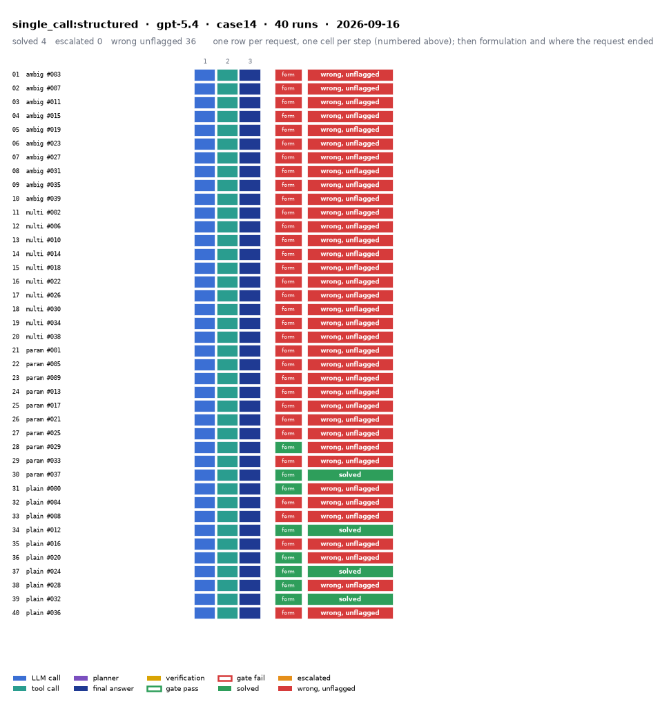

# single_call:structured on IEEE 14-bus with gpt-5.4

Generated 2026-09-23 11:46 by benchmarks/postprocess.py from `report.rescored.json`. Runs: 40.

## Run

| field | value |
|---|---|
| date | 2026-09-16 |
| model | openrouter:openai/gpt-5.4 |
| method | single_call:structured |
| case | case14 |
| condition | normal |
| n | 40 |
| seed | 0 |
| k | 1 |
| max_rounds | 8 |
| temperature | 0.0 |
| system_prompt_hash | None |
| source | results_validation_n40/gpt-5.4/single_call_structured |
| source_commit | 46e27b8 2026-09-22 Backfill GPT-5.4's missing B_mean-solved from its own frozen data |
| role_in_paper | main protocol table (Table 5 / S8) |
| notes | Copied from benchmarks/results_* by scripts/migrate_paper_results.py; the date is the write time of the source report.json. |
| description | One function-calling round: the model must emit every tool call at once, no memory, no second turn. Structured prompt: role, full case tables as system data, task, JSON output schema. |
| prompt files | _shared/agent_system_prompt.txt, single_call_structured/task_statement.txt, single_call_structured/output_section.txt |

One row per request, one cell per step (blue LLM call, teal tool call, purple planner, gold verification; green or red edge is the gate verdict), then formulation and where the request ended. Each run also has its own figure next to its traces: `traces/NN_<request>.png`.

## Where every request ended

The three outcomes are exclusive and sum to the run count. Escalation takes precedence: a run the method handed to a person is not an autonomous answer, right or wrong.

| outcome | count | share |
|---|---:|---:|
| Solved autonomously | 4 | 10.0% |
| Escalated to a person | 0 | 0.0% |
| Wrong, unflagged | 36 | 90.0% |
| **Total** | **40** | 100% |

## Metrics

| group | metric | value |
|---|---|---|
| Task utility | Formulation exact | 8/40 (20.0%) |
| Task utility | Formulation error types | missed_step: 32 |
| Task utility | Voltage MAE, all runs | 0.0018 p.u. |
| Task utility | Voltage MAE, formulation-exact runs | 0 p.u. |
| Task utility | Flow MAE, all runs | 2.7475 MW |
| Task utility | Flow MAE, formulation-exact runs | 0 MW |
| Task utility | KCL mismatch, mean | 0.0479 MW |
| Solver-grounded correctness | Solved (computation right, any path) | 4/40 (10.0%) |
| Solver-grounded correctness | V-pass (all conditions, offline) | 35/40 (87.5%) |
| Reporting | Traceable answers | 35/40 (87.5%) |
| Reporting | Traceable numbers, mean share | 0.965 |
| Reporting | Stale state quoted | 0/40 |
| Cost and time | LLM calls / tool calls, mean | 2 / 1 |
| Cost and time | Prompt / completion tokens, mean | 4449 / 188 |
| Cost and time | Cost, total | $0.5575 |
| Cost and time | Wall time, mean | 3.9 s |

### Cross-check against the runner's own scoreboard

Values the runner aggregated for the same rows (report.json scoreboard). They should agree with the table above; a disagreement means the rows were filtered differently.

| metric | runner scoreboard | this report |
|---|---:|---:|
| solved_autonomously_count | 4 | 4 |
| escalated_count | 0 | 0 |
| wrong_silently_count | 36 | 36 |
| formulation_exact_count | 8 | 8 |
| v_pass_count | 35 | 35 |
| faithful_answers_count | 35 | 35 |
| n_items | 40 | 40 |

## By request difficulty

| difficulty | n | solved | escalated | wrong unflagged | formulation exact |
|---|---:|---:|---:|---:|---:|
| ambiguous | 10 | 0 | 0 | 10 | 0 |
| multistep | 10 | 0 | 0 | 10 | 0 |
| parameterized | 10 | 1 | 0 | 9 | 2 |
| plain | 10 | 3 | 0 | 7 | 6 |

## Wrong and unflagged (36)

- `case14-ambiguous-003-s0` formulation missed_step; missing tools: ['disconnect_line']  ([narrative](traces/01_case14-ambiguous-003-s0.narrative.txt), [transcript](traces/01_case14-ambiguous-003-s0.transcript.txt))
- `case14-ambiguous-007-s0` formulation missed_step; missing tools: ['disconnect_line']  ([narrative](traces/02_case14-ambiguous-007-s0.narrative.txt), [transcript](traces/02_case14-ambiguous-007-s0.transcript.txt))
- `case14-ambiguous-011-s0` formulation missed_step; missing tools: ['modify_load']  ([narrative](traces/03_case14-ambiguous-011-s0.narrative.txt), [transcript](traces/03_case14-ambiguous-011-s0.transcript.txt))
- `case14-ambiguous-015-s0` formulation missed_step; missing tools: ['modify_load']  ([narrative](traces/04_case14-ambiguous-015-s0.narrative.txt), [transcript](traces/04_case14-ambiguous-015-s0.transcript.txt))
- `case14-ambiguous-019-s0` formulation missed_step; missing tools: ['disconnect_line']  ([narrative](traces/05_case14-ambiguous-019-s0.narrative.txt), [transcript](traces/05_case14-ambiguous-019-s0.transcript.txt))
- `case14-ambiguous-023-s0` formulation missed_step; missing tools: ['modify_load']  ([narrative](traces/06_case14-ambiguous-023-s0.narrative.txt), [transcript](traces/06_case14-ambiguous-023-s0.transcript.txt))
- `case14-ambiguous-027-s0` formulation missed_step; missing tools: ['modify_load']  ([narrative](traces/07_case14-ambiguous-027-s0.narrative.txt), [transcript](traces/07_case14-ambiguous-027-s0.transcript.txt))
- `case14-ambiguous-031-s0` formulation missed_step; missing tools: ['disconnect_line']  ([narrative](traces/08_case14-ambiguous-031-s0.narrative.txt), [transcript](traces/08_case14-ambiguous-031-s0.transcript.txt))
- `case14-ambiguous-035-s0` formulation missed_step; missing tools: ['modify_load']  ([narrative](traces/09_case14-ambiguous-035-s0.narrative.txt), [transcript](traces/09_case14-ambiguous-035-s0.transcript.txt))
- `case14-ambiguous-039-s0` formulation missed_step; missing tools: ['modify_load']  ([narrative](traces/10_case14-ambiguous-039-s0.narrative.txt), [transcript](traces/10_case14-ambiguous-039-s0.transcript.txt))
- `case14-multistep-002-s0` formulation missed_step; missing tools: ['disconnect_line', 'disconnect_line']  ([narrative](traces/11_case14-multistep-002-s0.narrative.txt), [transcript](traces/11_case14-multistep-002-s0.transcript.txt))
- `case14-multistep-006-s0` formulation missed_step; missing tools: ['modify_load', 'disconnect_line', 'reconnect_line']  ([narrative](traces/12_case14-multistep-006-s0.narrative.txt), [transcript](traces/12_case14-multistep-006-s0.transcript.txt))
- `case14-multistep-010-s0` formulation missed_step; missing tools: ['disconnect_line', 'disconnect_line']  ([narrative](traces/13_case14-multistep-010-s0.narrative.txt), [transcript](traces/13_case14-multistep-010-s0.transcript.txt))
- `case14-multistep-014-s0` formulation missed_step; missing tools: ['modify_load', 'modify_load', 'modify_load']  ([narrative](traces/14_case14-multistep-014-s0.narrative.txt), [transcript](traces/14_case14-multistep-014-s0.transcript.txt))
- `case14-multistep-018-s0` formulation missed_step; missing tools: ['disconnect_line']  ([narrative](traces/15_case14-multistep-018-s0.narrative.txt), [transcript](traces/15_case14-multistep-018-s0.transcript.txt))
- `case14-multistep-022-s0` formulation missed_step; missing tools: ['disconnect_line', 'modify_load', 'modify_load', 'run_n1_contingency']  ([narrative](traces/16_case14-multistep-022-s0.narrative.txt), [transcript](traces/16_case14-multistep-022-s0.transcript.txt))
- `case14-multistep-026-s0` formulation missed_step; missing tools: ['disconnect_line']  ([narrative](traces/17_case14-multistep-026-s0.narrative.txt), [transcript](traces/17_case14-multistep-026-s0.transcript.txt))
- `case14-multistep-030-s0` formulation missed_step; missing tools: ['modify_load', 'disconnect_line', 'reconnect_line', 'run_n1_contingency']  ([narrative](traces/18_case14-multistep-030-s0.narrative.txt), [transcript](traces/18_case14-multistep-030-s0.transcript.txt))
- `case14-multistep-034-s0` formulation missed_step; missing tools: ['disconnect_line', 'modify_load']  ([narrative](traces/19_case14-multistep-034-s0.narrative.txt), [transcript](traces/19_case14-multistep-034-s0.transcript.txt))
- `case14-multistep-038-s0` formulation missed_step; missing tools: ['modify_load', 'modify_load']  ([narrative](traces/20_case14-multistep-038-s0.narrative.txt), [transcript](traces/20_case14-multistep-038-s0.transcript.txt))
- `case14-parameterized-001-s0` formulation missed_step; missing tools: ['run_n1_contingency']  ([narrative](traces/21_case14-parameterized-001-s0.narrative.txt), [transcript](traces/21_case14-parameterized-001-s0.transcript.txt))
- `case14-parameterized-005-s0` formulation missed_step; missing tools: ['disconnect_line']  ([narrative](traces/22_case14-parameterized-005-s0.narrative.txt), [transcript](traces/22_case14-parameterized-005-s0.transcript.txt))
- `case14-parameterized-009-s0` formulation missed_step; missing tools: ['run_n1_contingency']  ([narrative](traces/23_case14-parameterized-009-s0.narrative.txt), [transcript](traces/23_case14-parameterized-009-s0.transcript.txt))
- `case14-parameterized-013-s0` formulation missed_step; missing tools: ['disconnect_line']  ([narrative](traces/24_case14-parameterized-013-s0.narrative.txt), [transcript](traces/24_case14-parameterized-013-s0.transcript.txt))
- `case14-parameterized-017-s0` formulation missed_step; missing tools: ['run_n1_contingency']  ([narrative](traces/25_case14-parameterized-017-s0.narrative.txt), [transcript](traces/25_case14-parameterized-017-s0.transcript.txt))
- `case14-parameterized-021-s0` formulation missed_step; missing tools: ['run_n1_contingency']  ([narrative](traces/26_case14-parameterized-021-s0.narrative.txt), [transcript](traces/26_case14-parameterized-021-s0.transcript.txt))
- `case14-parameterized-025-s0` formulation missed_step; missing tools: ['disconnect_line']  ([narrative](traces/27_case14-parameterized-025-s0.narrative.txt), [transcript](traces/27_case14-parameterized-025-s0.transcript.txt))
- `case14-parameterized-029-s0` formulation exact  ([narrative](traces/28_case14-parameterized-029-s0.narrative.txt), [transcript](traces/28_case14-parameterized-029-s0.transcript.txt))
- `case14-parameterized-033-s0` formulation missed_step; missing tools: ['modify_load']  ([narrative](traces/29_case14-parameterized-033-s0.narrative.txt), [transcript](traces/29_case14-parameterized-033-s0.transcript.txt))
- `case14-plain-000-s0` formulation exact  ([narrative](traces/31_case14-plain-000-s0.narrative.txt), [transcript](traces/31_case14-plain-000-s0.transcript.txt))
- `case14-plain-004-s0` formulation missed_step; missing tools: ['run_n1_contingency']  ([narrative](traces/32_case14-plain-004-s0.narrative.txt), [transcript](traces/32_case14-plain-004-s0.transcript.txt))
- `case14-plain-008-s0` formulation missed_step; missing tools: ['modify_load']  ([narrative](traces/33_case14-plain-008-s0.narrative.txt), [transcript](traces/33_case14-plain-008-s0.transcript.txt))
- `case14-plain-016-s0` formulation missed_step; missing tools: ['run_n1_contingency']  ([narrative](traces/35_case14-plain-016-s0.narrative.txt), [transcript](traces/35_case14-plain-016-s0.transcript.txt))
- `case14-plain-020-s0` formulation exact  ([narrative](traces/36_case14-plain-020-s0.narrative.txt), [transcript](traces/36_case14-plain-020-s0.transcript.txt))
- `case14-plain-028-s0` formulation exact  ([narrative](traces/38_case14-plain-028-s0.narrative.txt), [transcript](traces/38_case14-plain-028-s0.transcript.txt))
- `case14-plain-036-s0` formulation missed_step; missing tools: ['modify_load']  ([narrative](traces/40_case14-plain-036-s0.narrative.txt), [transcript](traces/40_case14-plain-036-s0.transcript.txt))

## Formulation not exact (32)

- `case14-ambiguous-003-s0` missed_step: missing tools: ['disconnect_line']  ([narrative](traces/01_case14-ambiguous-003-s0.narrative.txt), [transcript](traces/01_case14-ambiguous-003-s0.transcript.txt))
- `case14-ambiguous-007-s0` missed_step: missing tools: ['disconnect_line']  ([narrative](traces/02_case14-ambiguous-007-s0.narrative.txt), [transcript](traces/02_case14-ambiguous-007-s0.transcript.txt))
- `case14-ambiguous-011-s0` missed_step: missing tools: ['modify_load']  ([narrative](traces/03_case14-ambiguous-011-s0.narrative.txt), [transcript](traces/03_case14-ambiguous-011-s0.transcript.txt))
- `case14-ambiguous-015-s0` missed_step: missing tools: ['modify_load']  ([narrative](traces/04_case14-ambiguous-015-s0.narrative.txt), [transcript](traces/04_case14-ambiguous-015-s0.transcript.txt))
- `case14-ambiguous-019-s0` missed_step: missing tools: ['disconnect_line']  ([narrative](traces/05_case14-ambiguous-019-s0.narrative.txt), [transcript](traces/05_case14-ambiguous-019-s0.transcript.txt))
- `case14-ambiguous-023-s0` missed_step: missing tools: ['modify_load']  ([narrative](traces/06_case14-ambiguous-023-s0.narrative.txt), [transcript](traces/06_case14-ambiguous-023-s0.transcript.txt))
- `case14-ambiguous-027-s0` missed_step: missing tools: ['modify_load']  ([narrative](traces/07_case14-ambiguous-027-s0.narrative.txt), [transcript](traces/07_case14-ambiguous-027-s0.transcript.txt))
- `case14-ambiguous-031-s0` missed_step: missing tools: ['disconnect_line']  ([narrative](traces/08_case14-ambiguous-031-s0.narrative.txt), [transcript](traces/08_case14-ambiguous-031-s0.transcript.txt))
- `case14-ambiguous-035-s0` missed_step: missing tools: ['modify_load']  ([narrative](traces/09_case14-ambiguous-035-s0.narrative.txt), [transcript](traces/09_case14-ambiguous-035-s0.transcript.txt))
- `case14-ambiguous-039-s0` missed_step: missing tools: ['modify_load']  ([narrative](traces/10_case14-ambiguous-039-s0.narrative.txt), [transcript](traces/10_case14-ambiguous-039-s0.transcript.txt))
- `case14-multistep-002-s0` missed_step: missing tools: ['disconnect_line', 'disconnect_line']  ([narrative](traces/11_case14-multistep-002-s0.narrative.txt), [transcript](traces/11_case14-multistep-002-s0.transcript.txt))
- `case14-multistep-006-s0` missed_step: missing tools: ['modify_load', 'disconnect_line', 'reconnect_line']  ([narrative](traces/12_case14-multistep-006-s0.narrative.txt), [transcript](traces/12_case14-multistep-006-s0.transcript.txt))
- `case14-multistep-010-s0` missed_step: missing tools: ['disconnect_line', 'disconnect_line']  ([narrative](traces/13_case14-multistep-010-s0.narrative.txt), [transcript](traces/13_case14-multistep-010-s0.transcript.txt))
- `case14-multistep-014-s0` missed_step: missing tools: ['modify_load', 'modify_load', 'modify_load']  ([narrative](traces/14_case14-multistep-014-s0.narrative.txt), [transcript](traces/14_case14-multistep-014-s0.transcript.txt))
- `case14-multistep-018-s0` missed_step: missing tools: ['disconnect_line']  ([narrative](traces/15_case14-multistep-018-s0.narrative.txt), [transcript](traces/15_case14-multistep-018-s0.transcript.txt))
- `case14-multistep-022-s0` missed_step: missing tools: ['disconnect_line', 'modify_load', 'modify_load', 'run_n1_contingency']  ([narrative](traces/16_case14-multistep-022-s0.narrative.txt), [transcript](traces/16_case14-multistep-022-s0.transcript.txt))
- `case14-multistep-026-s0` missed_step: missing tools: ['disconnect_line']  ([narrative](traces/17_case14-multistep-026-s0.narrative.txt), [transcript](traces/17_case14-multistep-026-s0.transcript.txt))
- `case14-multistep-030-s0` missed_step: missing tools: ['modify_load', 'disconnect_line', 'reconnect_line', 'run_n1_contingency']  ([narrative](traces/18_case14-multistep-030-s0.narrative.txt), [transcript](traces/18_case14-multistep-030-s0.transcript.txt))
- `case14-multistep-034-s0` missed_step: missing tools: ['disconnect_line', 'modify_load']  ([narrative](traces/19_case14-multistep-034-s0.narrative.txt), [transcript](traces/19_case14-multistep-034-s0.transcript.txt))
- `case14-multistep-038-s0` missed_step: missing tools: ['modify_load', 'modify_load']  ([narrative](traces/20_case14-multistep-038-s0.narrative.txt), [transcript](traces/20_case14-multistep-038-s0.transcript.txt))
- `case14-parameterized-001-s0` missed_step: missing tools: ['run_n1_contingency']  ([narrative](traces/21_case14-parameterized-001-s0.narrative.txt), [transcript](traces/21_case14-parameterized-001-s0.transcript.txt))
- `case14-parameterized-005-s0` missed_step: missing tools: ['disconnect_line']  ([narrative](traces/22_case14-parameterized-005-s0.narrative.txt), [transcript](traces/22_case14-parameterized-005-s0.transcript.txt))
- `case14-parameterized-009-s0` missed_step: missing tools: ['run_n1_contingency']  ([narrative](traces/23_case14-parameterized-009-s0.narrative.txt), [transcript](traces/23_case14-parameterized-009-s0.transcript.txt))
- `case14-parameterized-013-s0` missed_step: missing tools: ['disconnect_line']  ([narrative](traces/24_case14-parameterized-013-s0.narrative.txt), [transcript](traces/24_case14-parameterized-013-s0.transcript.txt))
- `case14-parameterized-017-s0` missed_step: missing tools: ['run_n1_contingency']  ([narrative](traces/25_case14-parameterized-017-s0.narrative.txt), [transcript](traces/25_case14-parameterized-017-s0.transcript.txt))
- `case14-parameterized-021-s0` missed_step: missing tools: ['run_n1_contingency']  ([narrative](traces/26_case14-parameterized-021-s0.narrative.txt), [transcript](traces/26_case14-parameterized-021-s0.transcript.txt))
- `case14-parameterized-025-s0` missed_step: missing tools: ['disconnect_line']  ([narrative](traces/27_case14-parameterized-025-s0.narrative.txt), [transcript](traces/27_case14-parameterized-025-s0.transcript.txt))
- `case14-parameterized-033-s0` missed_step: missing tools: ['modify_load']  ([narrative](traces/29_case14-parameterized-033-s0.narrative.txt), [transcript](traces/29_case14-parameterized-033-s0.transcript.txt))
- `case14-plain-004-s0` missed_step: missing tools: ['run_n1_contingency']  ([narrative](traces/32_case14-plain-004-s0.narrative.txt), [transcript](traces/32_case14-plain-004-s0.transcript.txt))
- `case14-plain-008-s0` missed_step: missing tools: ['modify_load']  ([narrative](traces/33_case14-plain-008-s0.narrative.txt), [transcript](traces/33_case14-plain-008-s0.transcript.txt))
- `case14-plain-016-s0` missed_step: missing tools: ['run_n1_contingency']  ([narrative](traces/35_case14-plain-016-s0.narrative.txt), [transcript](traces/35_case14-plain-016-s0.transcript.txt))
- `case14-plain-036-s0` missed_step: missing tools: ['modify_load']  ([narrative](traces/40_case14-plain-036-s0.narrative.txt), [transcript](traces/40_case14-plain-036-s0.transcript.txt))

## Untraceable numbers in the answer (5)

- `case14-ambiguous-015-s0` 1 of 2 numbers; values ['1.464']  ([narrative](traces/04_case14-ambiguous-015-s0.narrative.txt), [transcript](traces/04_case14-ambiguous-015-s0.transcript.txt))
- `case14-multistep-030-s0` 1 of 4 numbers; values ['4.695']  ([narrative](traces/18_case14-multistep-030-s0.narrative.txt), [transcript](traces/18_case14-multistep-030-s0.transcript.txt))
- `case14-parameterized-033-s0` 1 of 5 numbers; values ['5.356']  ([narrative](traces/29_case14-parameterized-033-s0.narrative.txt), [transcript](traces/29_case14-parameterized-033-s0.transcript.txt))
- `case14-plain-008-s0` 1 of 5 numbers; values ['12.24']  ([narrative](traces/33_case14-plain-008-s0.narrative.txt), [transcript](traces/33_case14-plain-008-s0.transcript.txt))
- `case14-plain-036-s0` 1 of 4 numbers; values ['12.37']  ([narrative](traces/40_case14-plain-036-s0.narrative.txt), [transcript](traces/40_case14-plain-036-s0.transcript.txt))

## Files

- `summary.csv`: one line per run, the fields above plus tokens and time.
- `traces/NN_<request>.narrative.txt`: what happened in each run, step by step, with the verdicts.
- `traces/NN_<request>.transcript.txt`: the raw exchange, every message, tool call and tool output.
- `traces/NN_<request>.png`: the run as a picture: steps, gate verdicts, formulation, verification, outcome, with a two-line narrative.
- `overview.png`: all runs of this folder on one page.
- `traces/NN_<request>.json`: the raw trace the runner wrote.
- `raw/`: the runner's own outputs (report.json, rescored report, logs).
- `requests.jsonl`: the request set, with the intended tool calls that define formulation exactness.
