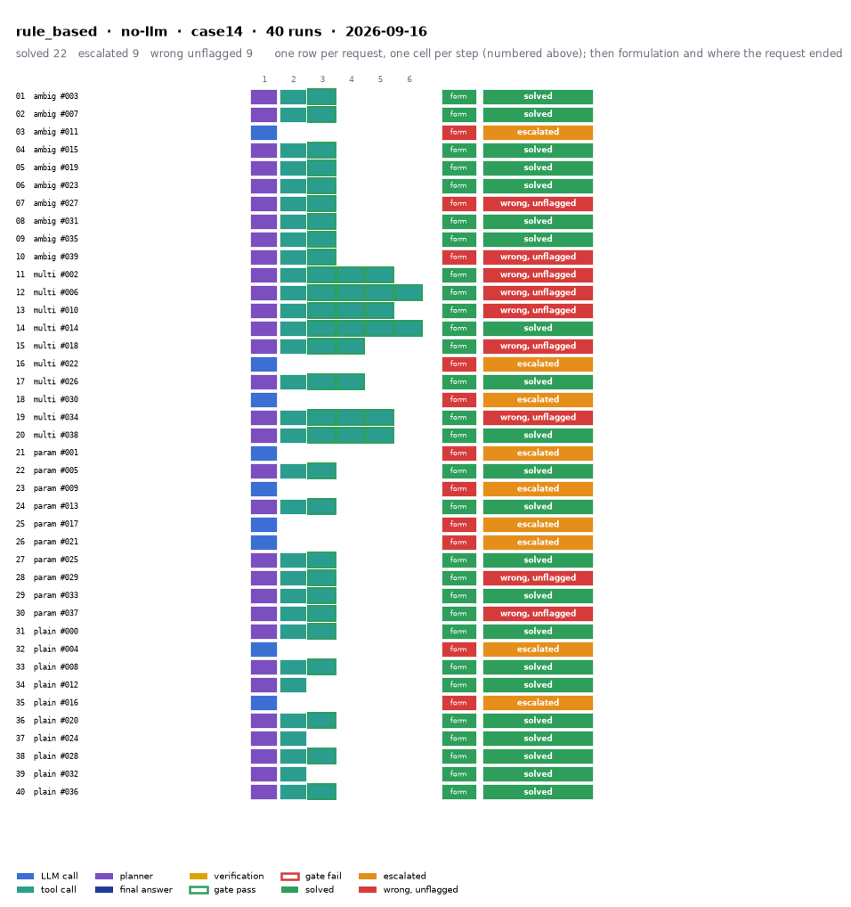

# rule_based on IEEE 14-bus with no-llm

Generated 2026-09-23 11:47 by benchmarks/postprocess.py from `report.rescored.json`. Runs: 40.

## Run

| field | value |
|---|---|
| date | 2026-09-16 |
| model | none:rule_based |
| method | rule_based |
| case | case14 |
| condition | normal |
| n | 40 |
| seed | 0 |
| k | 1 |
| max_rounds | 8 |
| temperature | 0.0 |
| system_prompt_hash | None |
| source | results_validation_n40/gpt-5.4/rule_based |
| source_commit | 46e27b8 2026-09-22 Backfill GPT-5.4's missing B_mean-solved from its own frozen data |
| role_in_paper | main protocol table (Table 5 / S8) |
| notes | Copied from benchmarks/results_* by scripts/migrate_paper_results.py; the date is the write time of the source report.json. |
| description | Deterministic regex parser maps the request to tool calls, no LLM (baselines/rule_based.py). The conventional-workflow row. |
| prompt files | none (no LLM) |

One row per request, one cell per step (blue LLM call, teal tool call, purple planner, gold verification; green or red edge is the gate verdict), then formulation and where the request ended. Each run also has its own figure next to its traces: `traces/NN_<request>.png`.

## Where every request ended

The three outcomes are exclusive and sum to the run count. Escalation takes precedence: a run the method handed to a person is not an autonomous answer, right or wrong.

| outcome | count | share |
|---|---:|---:|
| Solved autonomously | 22 | 55.0% |
| Escalated to a person | 9 | 22.5% |
| Wrong, unflagged | 9 | 22.5% |
| **Total** | **40** | 100% |

## Metrics

| group | metric | value |
|---|---|---|
| Task utility | Formulation exact | 29/40 (72.5%) |
| Task utility | Formulation error types | unparsed: 9, wrong_id: 2 |
| Task utility | Voltage MAE, all runs | 1.89e-05 p.u. |
| Task utility | Voltage MAE, formulation-exact runs | 0 p.u. |
| Task utility | Flow MAE, all runs | 0.0591 MW |
| Task utility | Flow MAE, formulation-exact runs | 0 MW |
| Task utility | KCL mismatch, mean | 0 MW |
| Solver-grounded correctness | Solved (computation right, any path) | 22/40 (55.0%) |
| Solver-grounded correctness | V-pass (all conditions, offline) | 40/40 (100.0%) |
| Reporting | Traceable answers | 40/40 (100.0%) |
| Reporting | Traceable numbers, mean share | 1 |
| Reporting | Stale state quoted | 0/40 |
| Cost and time | LLM calls / tool calls, mean | 0 / 1.88 |
| Cost and time | Prompt / completion tokens, mean | 0 / 0 |
| Cost and time | Cost, total | $0.0000 |
| Cost and time | Wall time, mean | 0.2 s |

### Cross-check against the runner's own scoreboard

Values the runner aggregated for the same rows (report.json scoreboard). They should agree with the table above; a disagreement means the rows were filtered differently.

| metric | runner scoreboard | this report |
|---|---:|---:|
| solved_autonomously_count | 22 | 22 |
| escalated_count | 9 | 9 |
| wrong_silently_count | 9 | 9 |
| formulation_exact_count | 29 | 29 |
| v_pass_count | 40 | 40 |
| faithful_answers_count | 40 | 40 |
| n_items | 40 | 40 |

## By request difficulty

| difficulty | n | solved | escalated | wrong unflagged | formulation exact |
|---|---:|---:|---:|---:|---:|
| ambiguous | 10 | 7 | 1 | 2 | 7 |
| multistep | 10 | 3 | 2 | 5 | 8 |
| parameterized | 10 | 4 | 4 | 2 | 6 |
| plain | 10 | 8 | 2 | 0 | 8 |

## Wrong and unflagged (9)

- `case14-ambiguous-027-s0` formulation wrong_id; modify_load: bus_id intended 11 != executed 10  ([narrative](traces/07_case14-ambiguous-027-s0.narrative.txt), [transcript](traces/07_case14-ambiguous-027-s0.transcript.txt))
- `case14-ambiguous-039-s0` formulation wrong_id; modify_load: bus_id intended 2 != executed 1  ([narrative](traces/10_case14-ambiguous-039-s0.narrative.txt), [transcript](traces/10_case14-ambiguous-039-s0.transcript.txt))
- `case14-multistep-002-s0` formulation exact  ([narrative](traces/11_case14-multistep-002-s0.narrative.txt), [transcript](traces/11_case14-multistep-002-s0.transcript.txt))
- `case14-multistep-006-s0` formulation exact  ([narrative](traces/12_case14-multistep-006-s0.narrative.txt), [transcript](traces/12_case14-multistep-006-s0.transcript.txt))
- `case14-multistep-010-s0` formulation exact  ([narrative](traces/13_case14-multistep-010-s0.narrative.txt), [transcript](traces/13_case14-multistep-010-s0.transcript.txt))
- `case14-multistep-018-s0` formulation exact  ([narrative](traces/15_case14-multistep-018-s0.narrative.txt), [transcript](traces/15_case14-multistep-018-s0.transcript.txt))
- `case14-multistep-034-s0` formulation exact  ([narrative](traces/19_case14-multistep-034-s0.narrative.txt), [transcript](traces/19_case14-multistep-034-s0.transcript.txt))
- `case14-parameterized-029-s0` formulation exact  ([narrative](traces/28_case14-parameterized-029-s0.narrative.txt), [transcript](traces/28_case14-parameterized-029-s0.transcript.txt))
- `case14-parameterized-037-s0` formulation exact  ([narrative](traces/30_case14-parameterized-037-s0.narrative.txt), [transcript](traces/30_case14-parameterized-037-s0.transcript.txt))

## Escalated (9)

- `case14-ambiguous-011-s0` detected via text; formulation unparsed; no tool calls could be formulated  ([narrative](traces/03_case14-ambiguous-011-s0.narrative.txt), [transcript](traces/03_case14-ambiguous-011-s0.transcript.txt))
- `case14-multistep-022-s0` detected via text; formulation unparsed; no tool calls could be formulated  ([narrative](traces/16_case14-multistep-022-s0.narrative.txt), [transcript](traces/16_case14-multistep-022-s0.transcript.txt))
- `case14-multistep-030-s0` detected via text; formulation unparsed; no tool calls could be formulated  ([narrative](traces/18_case14-multistep-030-s0.narrative.txt), [transcript](traces/18_case14-multistep-030-s0.transcript.txt))
- `case14-parameterized-001-s0` detected via text; formulation unparsed; no tool calls could be formulated  ([narrative](traces/21_case14-parameterized-001-s0.narrative.txt), [transcript](traces/21_case14-parameterized-001-s0.transcript.txt))
- `case14-parameterized-009-s0` detected via text; formulation unparsed; no tool calls could be formulated  ([narrative](traces/23_case14-parameterized-009-s0.narrative.txt), [transcript](traces/23_case14-parameterized-009-s0.transcript.txt))
- `case14-parameterized-017-s0` detected via text; formulation unparsed; no tool calls could be formulated  ([narrative](traces/25_case14-parameterized-017-s0.narrative.txt), [transcript](traces/25_case14-parameterized-017-s0.transcript.txt))
- `case14-parameterized-021-s0` detected via text; formulation unparsed; no tool calls could be formulated  ([narrative](traces/26_case14-parameterized-021-s0.narrative.txt), [transcript](traces/26_case14-parameterized-021-s0.transcript.txt))
- `case14-plain-004-s0` detected via text; formulation unparsed; no tool calls could be formulated  ([narrative](traces/32_case14-plain-004-s0.narrative.txt), [transcript](traces/32_case14-plain-004-s0.transcript.txt))
- `case14-plain-016-s0` detected via text; formulation unparsed; no tool calls could be formulated  ([narrative](traces/35_case14-plain-016-s0.narrative.txt), [transcript](traces/35_case14-plain-016-s0.transcript.txt))

## Formulation not exact (11)

- `case14-ambiguous-011-s0` unparsed: no tool calls could be formulated  ([narrative](traces/03_case14-ambiguous-011-s0.narrative.txt), [transcript](traces/03_case14-ambiguous-011-s0.transcript.txt))
- `case14-ambiguous-027-s0` wrong_id: modify_load: bus_id intended 11 != executed 10  ([narrative](traces/07_case14-ambiguous-027-s0.narrative.txt), [transcript](traces/07_case14-ambiguous-027-s0.transcript.txt))
- `case14-ambiguous-039-s0` wrong_id: modify_load: bus_id intended 2 != executed 1  ([narrative](traces/10_case14-ambiguous-039-s0.narrative.txt), [transcript](traces/10_case14-ambiguous-039-s0.transcript.txt))
- `case14-multistep-022-s0` unparsed: no tool calls could be formulated  ([narrative](traces/16_case14-multistep-022-s0.narrative.txt), [transcript](traces/16_case14-multistep-022-s0.transcript.txt))
- `case14-multistep-030-s0` unparsed: no tool calls could be formulated  ([narrative](traces/18_case14-multistep-030-s0.narrative.txt), [transcript](traces/18_case14-multistep-030-s0.transcript.txt))
- `case14-parameterized-001-s0` unparsed: no tool calls could be formulated  ([narrative](traces/21_case14-parameterized-001-s0.narrative.txt), [transcript](traces/21_case14-parameterized-001-s0.transcript.txt))
- `case14-parameterized-009-s0` unparsed: no tool calls could be formulated  ([narrative](traces/23_case14-parameterized-009-s0.narrative.txt), [transcript](traces/23_case14-parameterized-009-s0.transcript.txt))
- `case14-parameterized-017-s0` unparsed: no tool calls could be formulated  ([narrative](traces/25_case14-parameterized-017-s0.narrative.txt), [transcript](traces/25_case14-parameterized-017-s0.transcript.txt))
- `case14-parameterized-021-s0` unparsed: no tool calls could be formulated  ([narrative](traces/26_case14-parameterized-021-s0.narrative.txt), [transcript](traces/26_case14-parameterized-021-s0.transcript.txt))
- `case14-plain-004-s0` unparsed: no tool calls could be formulated  ([narrative](traces/32_case14-plain-004-s0.narrative.txt), [transcript](traces/32_case14-plain-004-s0.transcript.txt))
- `case14-plain-016-s0` unparsed: no tool calls could be formulated  ([narrative](traces/35_case14-plain-016-s0.narrative.txt), [transcript](traces/35_case14-plain-016-s0.transcript.txt))

## Run errors (9)

- `case14-ambiguous-011-s0` RuntimeError: formulation_failure: no tool calls could be formulated  ([narrative](traces/03_case14-ambiguous-011-s0.narrative.txt), [transcript](traces/03_case14-ambiguous-011-s0.transcript.txt))
- `case14-multistep-022-s0` RuntimeError: formulation_failure: no tool calls could be formulated  ([narrative](traces/16_case14-multistep-022-s0.narrative.txt), [transcript](traces/16_case14-multistep-022-s0.transcript.txt))
- `case14-multistep-030-s0` RuntimeError: formulation_failure: no tool calls could be formulated  ([narrative](traces/18_case14-multistep-030-s0.narrative.txt), [transcript](traces/18_case14-multistep-030-s0.transcript.txt))
- `case14-parameterized-001-s0` RuntimeError: formulation_failure: no tool calls could be formulated  ([narrative](traces/21_case14-parameterized-001-s0.narrative.txt), [transcript](traces/21_case14-parameterized-001-s0.transcript.txt))
- `case14-parameterized-009-s0` RuntimeError: formulation_failure: no tool calls could be formulated  ([narrative](traces/23_case14-parameterized-009-s0.narrative.txt), [transcript](traces/23_case14-parameterized-009-s0.transcript.txt))
- `case14-parameterized-017-s0` RuntimeError: formulation_failure: no tool calls could be formulated  ([narrative](traces/25_case14-parameterized-017-s0.narrative.txt), [transcript](traces/25_case14-parameterized-017-s0.transcript.txt))
- `case14-parameterized-021-s0` RuntimeError: formulation_failure: no tool calls could be formulated  ([narrative](traces/26_case14-parameterized-021-s0.narrative.txt), [transcript](traces/26_case14-parameterized-021-s0.transcript.txt))
- `case14-plain-004-s0` RuntimeError: formulation_failure: no tool calls could be formulated  ([narrative](traces/32_case14-plain-004-s0.narrative.txt), [transcript](traces/32_case14-plain-004-s0.transcript.txt))
- `case14-plain-016-s0` RuntimeError: formulation_failure: no tool calls could be formulated  ([narrative](traces/35_case14-plain-016-s0.narrative.txt), [transcript](traces/35_case14-plain-016-s0.transcript.txt))

## Files

- `summary.csv`: one line per run, the fields above plus tokens and time.
- `traces/NN_<request>.narrative.txt`: what happened in each run, step by step, with the verdicts.
- `traces/NN_<request>.transcript.txt`: the raw exchange, every message, tool call and tool output.
- `traces/NN_<request>.png`: the run as a picture: steps, gate verdicts, formulation, verification, outcome, with a two-line narrative.
- `overview.png`: all runs of this folder on one page.
- `traces/NN_<request>.json`: the raw trace the runner wrote.
- `raw/`: the runner's own outputs (report.json, rescored report, logs).
- `requests.jsonl`: the request set, with the intended tool calls that define formulation exactness.
