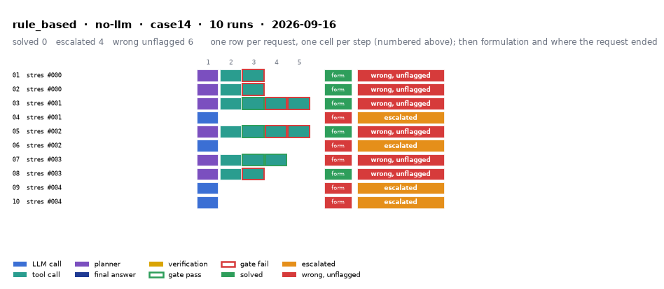

# rule_based on IEEE 14-bus with no-llm

Generated 2026-09-24 20:28 by benchmarks/postprocess.py from `report.rescored.json`. Runs: 10.

## Run

| field | value |
|---|---|
| date | 2026-09-16 |
| model | none:rule_based |
| method | rule_based |
| case | case14 |
| condition | stress |
| n | 10 |
| seed | 0,1 |
| k | 1 |
| max_rounds | 8 |
| temperature | 0.0 |
| system_prompt_hash | None |
| source | results_validation_gpt-5.4_stress_rule_based |
| source_commit | 46e27b8 2026-09-22 Backfill GPT-5.4's missing B_mean-solved from its own frozen data |
| role_in_paper | stress table (S6) |
| notes | Copied from benchmarks/results_* by scripts/migrate_paper_results.py; the date is the write time of the source report.json. |
| description | Deterministic regex parser maps the request to tool calls, no LLM (baselines/rule_based.py). The conventional-workflow row. |
| prompt files | none (no LLM) |

One row per request, one cell per step (blue LLM call, teal tool call, purple planner, gold verification; green or red edge is the gate verdict), then formulation and where the request ended. Each run also has its own figure next to its traces: `traces/NN_<request>.png`.

## Where every request ended

The three outcomes are exclusive and sum to the run count. Escalation takes precedence: a run the method handed to a person is not an autonomous answer, right or wrong.

| outcome | count | share |
|---|---:|---:|
| Solved autonomously | 0 | 0.0% |
| Escalated to a person | 4 | 40.0% |
| Wrong, unflagged | 6 | 60.0% |
| **Total** | **10** | 100% |

## Metrics

| group | metric | value |
|---|---|---|
| Task utility | Formulation exact | 5/10 (50.0%) |
| Task utility | Formulation error types | unparsed: 4, missed_step: 1 |
| Task utility | Voltage MAE, all runs | nan p.u. |
| Task utility | Voltage MAE, formulation-exact runs | nan p.u. |
| Task utility | Flow MAE, all runs | 0 MW |
| Task utility | Flow MAE, formulation-exact runs | 0 MW |
| Task utility | KCL mismatch, mean | 0 MW |
| Solver-grounded correctness | Solved (computation right, any path) | 0/10 (0.0%) |
| Solver-grounded correctness | V-pass (all conditions, offline) | 5/10 (50.0%) |
| Solver-grounded correctness | Safe failure on real failures | 4/10 (40.0%) |
| Reporting | Traceable answers | 10/10 (100.0%) |
| Reporting | Traceable numbers, mean share | 1 |
| Reporting | Stale state quoted | 0/10 |
| Cost and time | LLM calls / tool calls, mean | 0 / 1.7 |
| Cost and time | Prompt / completion tokens, mean | 0 / 0 |
| Cost and time | Cost, total | $0.0000 |
| Cost and time | Wall time, mean | 0.1 s |

## Wrong and unflagged (6)

- `case14-stress-000-s0` formulation exact  ([narrative](traces/01_case14-stress-000-s0.narrative.txt), [transcript](traces/01_case14-stress-000-s0.transcript.txt))
- `case14-stress-000-s1` formulation exact  ([narrative](traces/02_case14-stress-000-s1.narrative.txt), [transcript](traces/02_case14-stress-000-s1.transcript.txt))
- `case14-stress-001-s0` formulation exact  ([narrative](traces/03_case14-stress-001-s0.narrative.txt), [transcript](traces/03_case14-stress-001-s0.transcript.txt))
- `case14-stress-002-s0` formulation exact  ([narrative](traces/05_case14-stress-002-s0.narrative.txt), [transcript](traces/05_case14-stress-002-s0.transcript.txt))
- `case14-stress-003-s0` formulation missed_step; missing tools: ['modify_load']  ([narrative](traces/07_case14-stress-003-s0.narrative.txt), [transcript](traces/07_case14-stress-003-s0.transcript.txt))
- `case14-stress-003-s1` formulation exact  ([narrative](traces/08_case14-stress-003-s1.narrative.txt), [transcript](traces/08_case14-stress-003-s1.transcript.txt))

## Escalated (4)

- `case14-stress-001-s1` detected via text; formulation unparsed; no tool calls could be formulated  ([narrative](traces/04_case14-stress-001-s1.narrative.txt), [transcript](traces/04_case14-stress-001-s1.transcript.txt))
- `case14-stress-002-s1` detected via text; formulation unparsed; no tool calls could be formulated  ([narrative](traces/06_case14-stress-002-s1.narrative.txt), [transcript](traces/06_case14-stress-002-s1.transcript.txt))
- `case14-stress-004-s0` detected via text; formulation unparsed; no tool calls could be formulated  ([narrative](traces/09_case14-stress-004-s0.narrative.txt), [transcript](traces/09_case14-stress-004-s0.transcript.txt))
- `case14-stress-004-s1` detected via text; formulation unparsed; no tool calls could be formulated  ([narrative](traces/10_case14-stress-004-s1.narrative.txt), [transcript](traces/10_case14-stress-004-s1.transcript.txt))

## Formulation not exact (5)

- `case14-stress-001-s1` unparsed: no tool calls could be formulated  ([narrative](traces/04_case14-stress-001-s1.narrative.txt), [transcript](traces/04_case14-stress-001-s1.transcript.txt))
- `case14-stress-002-s1` unparsed: no tool calls could be formulated  ([narrative](traces/06_case14-stress-002-s1.narrative.txt), [transcript](traces/06_case14-stress-002-s1.transcript.txt))
- `case14-stress-003-s0` missed_step: missing tools: ['modify_load']  ([narrative](traces/07_case14-stress-003-s0.narrative.txt), [transcript](traces/07_case14-stress-003-s0.transcript.txt))
- `case14-stress-004-s0` unparsed: no tool calls could be formulated  ([narrative](traces/09_case14-stress-004-s0.narrative.txt), [transcript](traces/09_case14-stress-004-s0.transcript.txt))
- `case14-stress-004-s1` unparsed: no tool calls could be formulated  ([narrative](traces/10_case14-stress-004-s1.narrative.txt), [transcript](traces/10_case14-stress-004-s1.transcript.txt))

## Run errors (4)

- `case14-stress-001-s1` RuntimeError: formulation_failure: no tool calls could be formulated  ([narrative](traces/04_case14-stress-001-s1.narrative.txt), [transcript](traces/04_case14-stress-001-s1.transcript.txt))
- `case14-stress-002-s1` RuntimeError: formulation_failure: no tool calls could be formulated  ([narrative](traces/06_case14-stress-002-s1.narrative.txt), [transcript](traces/06_case14-stress-002-s1.transcript.txt))
- `case14-stress-004-s0` RuntimeError: formulation_failure: no tool calls could be formulated  ([narrative](traces/09_case14-stress-004-s0.narrative.txt), [transcript](traces/09_case14-stress-004-s0.transcript.txt))
- `case14-stress-004-s1` RuntimeError: formulation_failure: no tool calls could be formulated  ([narrative](traces/10_case14-stress-004-s1.narrative.txt), [transcript](traces/10_case14-stress-004-s1.transcript.txt))

## Files

- `summary.csv`: one line per run, the fields above plus tokens and time.
- `traces/NN_<request>.narrative.txt`: what happened in each run, step by step, with the verdicts.
- `traces/NN_<request>.transcript.txt`: the raw exchange, every message, tool call and tool output.
- `traces/NN_<request>.png`: the run as a picture: steps, gate verdicts, formulation, verification, outcome, with a two-line narrative.
- `overview.png`: all runs of this folder on one page.
- `traces/NN_<request>.json`: the raw trace the runner wrote.
- `raw/`: the runner's own outputs (report.json, rescored report, logs).
- `requests.jsonl`: the request set, with the intended tool calls that define formulation exactness.
