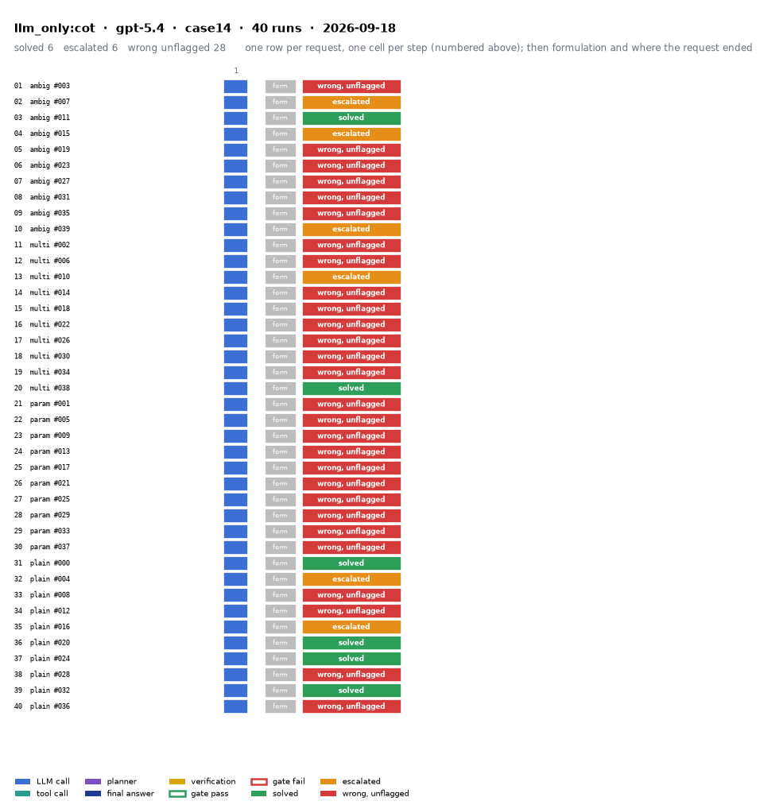

# llm_only:cot on IEEE 14-bus with gpt-5.4

Generated 2026-09-23 22:52 by benchmarks/postprocess.py from `report.rescored.json`. Runs: 40.

## Run

| field | value |
|---|---|
| date | 2026-09-18 |
| model | openrouter:openai/gpt-5.4 |
| method | llm_only:cot |
| case | case14 |
| condition | normal |
| n | 40 |
| seed | 0 |
| k | 1 |
| max_rounds | 8 |
| temperature | 0.0 |
| system_prompt_hash | 063482ad676f |
| source | results_validation_n40/gpt-5.4/llm_only_cot |
| source_commit | 46e27b8 2026-09-22 Backfill GPT-5.4's missing B_mean-solved from its own frozen data |
| role_in_paper | main protocol table (Table 5 / S8) |
| notes | Copied from benchmarks/results_* by scripts/migrate_paper_results.py; the date is the write time of the source report.json. |
| description | LLM answers from the case tables in the prompt. No tools. Structured prompt plus a reasoning section asking for step-by-step reasoning before the final JSON. |
| prompt files | _shared/llm_only_system_prompt.txt, _shared/llm_only_user_template.txt, _shared/llm_only_bus_id_note.txt, _shared/cot_system_suffix.txt, llm_only_cot/reasoning_section.txt |

One row per request, one cell per step (blue LLM call, teal tool call, purple planner, gold verification; green or red edge is the gate verdict), then formulation and where the request ended. Each run also has its own figure next to its traces: `traces/NN_<request>.png`.

## Where every request ended

The three outcomes are exclusive and sum to the run count. Escalation takes precedence: a run the method handed to a person is not an autonomous answer, right or wrong.

| outcome | count | share |
|---|---:|---:|
| Solved autonomously | 6 | 15.0% |
| Escalated to a person | 0 | 0.0% |
| Wrong, unflagged | 34 | 85.0% |
| **Total** | **40** | 100% |

## Metrics

| group | metric | value |
|---|---|---|
| Task utility | Formulation exact | n/a (no tool calls) |
| Task utility | Voltage MAE, all runs | 0.0012 p.u. |
| Task utility | Voltage MAE, formulation-exact runs | n/a p.u. |
| Task utility | Flow MAE, all runs | 2.4983 MW |
| Task utility | Flow MAE, formulation-exact runs | n/a MW |
| Task utility | KCL mismatch, mean | 3.7193 MW |
| Solver-grounded correctness | Solved (computation right, any path) | 6/40 (15.0%) |
| Solver-grounded correctness | V-pass (all conditions, offline) | 0/40 (0.0%) |
| Reporting | Traceable answers | 0/40 (0.0%) |
| Reporting | Traceable numbers, mean share | 0.045 |
| Reporting | Stale state quoted | 0/40 |
| Cost and time | LLM calls / tool calls, mean | 1 / 0 |
| Cost and time | Prompt / completion tokens, mean | 2196 / 715 |
| Cost and time | Cost, total | $0.6488 |
| Cost and time | Wall time, mean | 6.4 s |

### Cross-check against the runner's own scoreboard

Values the runner aggregated for the same rows (report.json scoreboard). They should agree with the table above; a disagreement means the rows were filtered differently.

| metric | runner scoreboard | this report |
|---|---:|---:|
| solved_autonomously_count | 6 | 6 |
| escalated_count | 0 | 0 |
| wrong_silently_count | 34 | 34 |
| formulation_exact_count | 0 | 0 |
| v_pass_count | 0 | 0 |
| faithful_answers_count | 0 | 0 |
| n_items | 40 | 40 |

## By request difficulty

| difficulty | n | solved | escalated | wrong unflagged | formulation exact |
|---|---:|---:|---:|---:|---:|
| ambiguous | 10 | 1 | 0 | 9 | 0 |
| multistep | 10 | 1 | 0 | 9 | 0 |
| parameterized | 10 | 0 | 0 | 10 | 0 |
| plain | 10 | 4 | 0 | 6 | 0 |

## Wrong and unflagged (34)

- `case14-ambiguous-003-s0` formulation None; no tool stage  ([narrative](traces/01_case14-ambiguous-003-s0.narrative.txt), [transcript](traces/01_case14-ambiguous-003-s0.transcript.txt))
- `case14-ambiguous-007-s0` formulation None; no tool stage  ([narrative](traces/02_case14-ambiguous-007-s0.narrative.txt), [transcript](traces/02_case14-ambiguous-007-s0.transcript.txt))
- `case14-ambiguous-015-s0` formulation None; no tool stage  ([narrative](traces/04_case14-ambiguous-015-s0.narrative.txt), [transcript](traces/04_case14-ambiguous-015-s0.transcript.txt))
- `case14-ambiguous-019-s0` formulation None; no tool stage  ([narrative](traces/05_case14-ambiguous-019-s0.narrative.txt), [transcript](traces/05_case14-ambiguous-019-s0.transcript.txt))
- `case14-ambiguous-023-s0` formulation None; no tool stage  ([narrative](traces/06_case14-ambiguous-023-s0.narrative.txt), [transcript](traces/06_case14-ambiguous-023-s0.transcript.txt))
- `case14-ambiguous-027-s0` formulation None; no tool stage  ([narrative](traces/07_case14-ambiguous-027-s0.narrative.txt), [transcript](traces/07_case14-ambiguous-027-s0.transcript.txt))
- `case14-ambiguous-031-s0` formulation None; no tool stage  ([narrative](traces/08_case14-ambiguous-031-s0.narrative.txt), [transcript](traces/08_case14-ambiguous-031-s0.transcript.txt))
- `case14-ambiguous-035-s0` formulation None; no tool stage  ([narrative](traces/09_case14-ambiguous-035-s0.narrative.txt), [transcript](traces/09_case14-ambiguous-035-s0.transcript.txt))
- `case14-ambiguous-039-s0` formulation None; no tool stage  ([narrative](traces/10_case14-ambiguous-039-s0.narrative.txt), [transcript](traces/10_case14-ambiguous-039-s0.transcript.txt))
- `case14-multistep-002-s0` formulation None; no tool stage  ([narrative](traces/11_case14-multistep-002-s0.narrative.txt), [transcript](traces/11_case14-multistep-002-s0.transcript.txt))
- `case14-multistep-006-s0` formulation None; no tool stage  ([narrative](traces/12_case14-multistep-006-s0.narrative.txt), [transcript](traces/12_case14-multistep-006-s0.transcript.txt))
- `case14-multistep-010-s0` formulation None; no tool stage  ([narrative](traces/13_case14-multistep-010-s0.narrative.txt), [transcript](traces/13_case14-multistep-010-s0.transcript.txt))
- `case14-multistep-014-s0` formulation None; no tool stage  ([narrative](traces/14_case14-multistep-014-s0.narrative.txt), [transcript](traces/14_case14-multistep-014-s0.transcript.txt))
- `case14-multistep-018-s0` formulation None; no tool stage  ([narrative](traces/15_case14-multistep-018-s0.narrative.txt), [transcript](traces/15_case14-multistep-018-s0.transcript.txt))
- `case14-multistep-022-s0` formulation None; no tool stage  ([narrative](traces/16_case14-multistep-022-s0.narrative.txt), [transcript](traces/16_case14-multistep-022-s0.transcript.txt))
- `case14-multistep-026-s0` formulation None; no tool stage  ([narrative](traces/17_case14-multistep-026-s0.narrative.txt), [transcript](traces/17_case14-multistep-026-s0.transcript.txt))
- `case14-multistep-030-s0` formulation None; no tool stage  ([narrative](traces/18_case14-multistep-030-s0.narrative.txt), [transcript](traces/18_case14-multistep-030-s0.transcript.txt))
- `case14-multistep-034-s0` formulation None; no tool stage  ([narrative](traces/19_case14-multistep-034-s0.narrative.txt), [transcript](traces/19_case14-multistep-034-s0.transcript.txt))
- `case14-parameterized-001-s0` formulation None; no tool stage  ([narrative](traces/21_case14-parameterized-001-s0.narrative.txt), [transcript](traces/21_case14-parameterized-001-s0.transcript.txt))
- `case14-parameterized-005-s0` formulation None; no tool stage  ([narrative](traces/22_case14-parameterized-005-s0.narrative.txt), [transcript](traces/22_case14-parameterized-005-s0.transcript.txt))
- `case14-parameterized-009-s0` formulation None; no tool stage  ([narrative](traces/23_case14-parameterized-009-s0.narrative.txt), [transcript](traces/23_case14-parameterized-009-s0.transcript.txt))
- `case14-parameterized-013-s0` formulation None; no tool stage  ([narrative](traces/24_case14-parameterized-013-s0.narrative.txt), [transcript](traces/24_case14-parameterized-013-s0.transcript.txt))
- `case14-parameterized-017-s0` formulation None; no tool stage  ([narrative](traces/25_case14-parameterized-017-s0.narrative.txt), [transcript](traces/25_case14-parameterized-017-s0.transcript.txt))
- `case14-parameterized-021-s0` formulation None; no tool stage  ([narrative](traces/26_case14-parameterized-021-s0.narrative.txt), [transcript](traces/26_case14-parameterized-021-s0.transcript.txt))
- `case14-parameterized-025-s0` formulation None; no tool stage  ([narrative](traces/27_case14-parameterized-025-s0.narrative.txt), [transcript](traces/27_case14-parameterized-025-s0.transcript.txt))
- `case14-parameterized-029-s0` formulation None; no tool stage  ([narrative](traces/28_case14-parameterized-029-s0.narrative.txt), [transcript](traces/28_case14-parameterized-029-s0.transcript.txt))
- `case14-parameterized-033-s0` formulation None; no tool stage  ([narrative](traces/29_case14-parameterized-033-s0.narrative.txt), [transcript](traces/29_case14-parameterized-033-s0.transcript.txt))
- `case14-parameterized-037-s0` formulation None; no tool stage  ([narrative](traces/30_case14-parameterized-037-s0.narrative.txt), [transcript](traces/30_case14-parameterized-037-s0.transcript.txt))
- `case14-plain-004-s0` formulation None; no tool stage  ([narrative](traces/32_case14-plain-004-s0.narrative.txt), [transcript](traces/32_case14-plain-004-s0.transcript.txt))
- `case14-plain-008-s0` formulation None; no tool stage  ([narrative](traces/33_case14-plain-008-s0.narrative.txt), [transcript](traces/33_case14-plain-008-s0.transcript.txt))
- `case14-plain-012-s0` formulation None; no tool stage  ([narrative](traces/34_case14-plain-012-s0.narrative.txt), [transcript](traces/34_case14-plain-012-s0.transcript.txt))
- `case14-plain-016-s0` formulation None; no tool stage  ([narrative](traces/35_case14-plain-016-s0.narrative.txt), [transcript](traces/35_case14-plain-016-s0.transcript.txt))
- `case14-plain-028-s0` formulation None; no tool stage  ([narrative](traces/38_case14-plain-028-s0.narrative.txt), [transcript](traces/38_case14-plain-028-s0.transcript.txt))
- `case14-plain-036-s0` formulation None; no tool stage  ([narrative](traces/40_case14-plain-036-s0.narrative.txt), [transcript](traces/40_case14-plain-036-s0.transcript.txt))

## Untraceable numbers in the answer (40)

- `case14-ambiguous-003-s0` 5 of 5 numbers; values ['1.06 p.u.', '0 degrees', '0.0', '0.0', '0.0']  ([narrative](traces/01_case14-ambiguous-003-s0.narrative.txt), [transcript](traces/01_case14-ambiguous-003-s0.transcript.txt))
- `case14-ambiguous-007-s0` 9 of 9 numbers; values ['1.06 p.u.', '0 deg', '0.95', '1.05 p.u.', '100 percent', '100 MVA', '0.0', '0.0', '0.0']  ([narrative](traces/02_case14-ambiguous-007-s0.narrative.txt), [transcript](traces/02_case14-ambiguous-007-s0.transcript.txt))
- `case14-ambiguous-011-s0` 83 of 83 numbers; values ['1.06', '0 degrees', '1.045', '1.01', '1.07', '1.09', '14.700 MW', '10.690739 MW', '0.95', '1.05', '100 percent', '4.009261 MW', '1.06', '0.0', '1.045', '-4.99', '1.01', '-12.73', '1.017', '-10.31']  ([narrative](traces/03_case14-ambiguous-011-s0.narrative.txt), [transcript](traces/03_case14-ambiguous-011-s0.transcript.txt))
- `case14-ambiguous-015-s0` 82 of 84 numbers; values ['1.06 p.u.', '0 deg', '1.045', '1.010', '1.070', '1.090 p.u.', '6.952678 MW', '2.552678 MW', '0.95', '1.05 p.u.', '100 percent', '1.06', '0.0', '1.045', '-4.9826', '1.01', '-12.7251', '1.0150', '-10.3129', '1.0186']  ([narrative](traces/04_case14-ambiguous-015-s0.narrative.txt), [transcript](traces/04_case14-ambiguous-015-s0.transcript.txt))
- `case14-ambiguous-019-s0` 75 of 75 numbers; values ['1.06 p.u.', '0 deg', '0.95', '1.05 p.u.', '1.06', '0.0', '1.045', '-4.92', '1.01', '-12.73', '1.012', '-10.31', '1.016', '-8.77', '1.07', '-14.18', '1.051', '-13.43', '1.09', '-13.43']  ([narrative](traces/05_case14-ambiguous-019-s0.narrative.txt), [transcript](traces/05_case14-ambiguous-019-s0.transcript.txt))
- `case14-ambiguous-023-s0` 81 of 82 numbers; values ['1.06 p.u.', '0 deg', '1.045', '1.01', '1.07', '1.09 p.u.', '7.255558 MW', '1.527486 Mvar', '1.355558 MW', '1.355558 MW', '1.06', '0.0', '1.045', '-4.989', '1.01', '-12.725', '1.017', '-10.313', '1.019', '-8.774']  ([narrative](traces/06_case14-ambiguous-023-s0.narrative.txt), [transcript](traces/06_case14-ambiguous-023-s0.transcript.txt))
- `case14-ambiguous-027-s0` 52 of 76 numbers; values ['1.06 p.u.', '15.151996 MW', '10.451996 MW', '1.06', '1.045', '-4.81', '1.01', '-12.72', '1.017', '-10.33', '1.019', '-8.74', '1.07', '-14.18', '1.062', '-13.87', '1.09', '-13.87', '1.056', '-15.98']  ([narrative](traces/07_case14-ambiguous-027-s0.narrative.txt), [transcript](traces/07_case14-ambiguous-027-s0.transcript.txt))
- `case14-ambiguous-031-s0` 5 of 5 numbers; values ['1.06 p.u.', '0 degrees', '0.0', '252.617709', '0.0']  ([narrative](traces/08_case14-ambiguous-031-s0.narrative.txt), [transcript](traces/08_case14-ambiguous-031-s0.transcript.txt))
- `case14-ambiguous-035-s0` 7 of 10 numbers; values ['1.06 pu', '0 deg', '8.212783', '4.412783 MW', '0.0', '0.0', '0.0']  ([narrative](traces/09_case14-ambiguous-035-s0.narrative.txt), [transcript](traces/09_case14-ambiguous-035-s0.transcript.txt))
- `case14-ambiguous-039-s0` 56 of 80 numbers; values ['1.06 p.u.', '19.974973 MW', '0.95', '1.05 p.u.', '100 percent', '8.974973 MW', '250.833117 MW', '1.06', '1.045', '-4.32', '1.01', '-12.53', '1.017', '-10.27', '1.019', '-8.76', '1.07', '-14.22', '1.062', '-13.37']  ([narrative](traces/10_case14-ambiguous-039-s0.narrative.txt), [transcript](traces/10_case14-ambiguous-039-s0.transcript.txt))
- `case14-multistep-002-s0` 3 of 3 numbers; values ['0.0', '256.901649', '0.0']  ([narrative](traces/11_case14-multistep-002-s0.narrative.txt), [transcript](traces/11_case14-multistep-002-s0.transcript.txt))
- `case14-multistep-006-s0` 3 of 3 numbers; values ['0.0', '0.0', '0.0']  ([narrative](traces/12_case14-multistep-006-s0.narrative.txt), [transcript](traces/12_case14-multistep-006-s0.transcript.txt))
- `case14-multistep-010-s0` 5 of 5 numbers; values ['1.06 p.u.', '0 degrees', '0.0', '0.0', '0.0']  ([narrative](traces/13_case14-multistep-010-s0.narrative.txt), [transcript](traces/13_case14-multistep-010-s0.transcript.txt))
- `case14-multistep-014-s0` 77 of 80 numbers; values ['1.06 p.u.', '0 degrees', '14.299132 MW', '48.716736 MW', '27.901811 MW', '272.113365 MW', '1.06', '0.0', '1.045', '-4.92', '1.01', '-12.73', '1.0104', '-10.31', '1.0185', '-8.77', '1.07', '-14.22', '1.0613', '-13.37']  ([narrative](traces/14_case14-multistep-014-s0.narrative.txt), [transcript](traces/14_case14-multistep-014-s0.transcript.txt))
- `case14-multistep-018-s0` 3 of 3 numbers; values ['0.0', '257.684795', '0.0']  ([narrative](traces/15_case14-multistep-018-s0.narrative.txt), [transcript](traces/15_case14-multistep-018-s0.transcript.txt))
- `case14-multistep-022-s0` 3 of 3 numbers; values ['0.0', '0.0', '0.0']  ([narrative](traces/16_case14-multistep-022-s0.narrative.txt), [transcript](traces/16_case14-multistep-022-s0.transcript.txt))
- `case14-multistep-026-s0` 72 of 72 numbers; values ['1.06 p.u.', '1.06', '0.0', '1.045', '-4.62', '1.01', '-12.73', '1.013', '-10.31', '1.016', '-8.69', '1.07', '-14.11', '1.053', '-13.87', '1.09', '-13.87', '1.049', '-15.89', '1.043']  ([narrative](traces/17_case14-multistep-026-s0.narrative.txt), [transcript](traces/17_case14-multistep-026-s0.transcript.txt))
- `case14-multistep-030-s0` 8 of 11 numbers; values ['1.06 p.u.', '0 degrees', '0.95 p.u.', '1.05 p.u.', '100 percent', '0.0', '0.0', '0.0']  ([narrative](traces/18_case14-multistep-030-s0.narrative.txt), [transcript](traces/18_case14-multistep-030-s0.transcript.txt))
- `case14-multistep-034-s0` 8 of 11 numbers; values ['1.06 p.u.', '0.95', '1.05 p.u.', '29.95388 MW', '10.05388 MW', '0.0', '243.516506', '0.0']  ([narrative](traces/19_case14-multistep-034-s0.narrative.txt), [transcript](traces/19_case14-multistep-034-s0.transcript.txt))
- `case14-multistep-038-s0` 71 of 71 numbers; values ['1.06', '0.0', '1.045', '-4.98', '1.01', '-12.72', '1.017', '-10.33', '1.02', '-8.78', '1.07', '-14.22', '1.062', '-13.37', '1.09', '-13.37', '1.056', '-14.94', '1.051', '-15.1']  ([narrative](traces/20_case14-multistep-038-s0.narrative.txt), [transcript](traces/20_case14-multistep-038-s0.transcript.txt))
- `case14-parameterized-001-s0` 3 of 3 numbers; values ['0.0', '270.136178', '0.0']  ([narrative](traces/21_case14-parameterized-001-s0.narrative.txt), [transcript](traces/21_case14-parameterized-001-s0.transcript.txt))
- `case14-parameterized-005-s0` 5 of 5 numbers; values ['1.06 p.u.', '0 degrees', '0.0', '250.787533', '0.0']  ([narrative](traces/22_case14-parameterized-005-s0.narrative.txt), [transcript](traces/22_case14-parameterized-005-s0.transcript.txt))
- `case14-parameterized-009-s0` 3 of 3 numbers; values ['0.0', '0.0', '0.0']  ([narrative](traces/23_case14-parameterized-009-s0.narrative.txt), [transcript](traces/23_case14-parameterized-009-s0.transcript.txt))
- `case14-parameterized-013-s0` 3 of 3 numbers; values ['0.0', '269.300337', '0.0']  ([narrative](traces/24_case14-parameterized-013-s0.narrative.txt), [transcript](traces/24_case14-parameterized-013-s0.transcript.txt))
- `case14-parameterized-017-s0` 3 of 3 numbers; values ['0.0', '264.521315', '0.0']  ([narrative](traces/25_case14-parameterized-017-s0.narrative.txt), [transcript](traces/25_case14-parameterized-017-s0.transcript.txt))
- `case14-parameterized-021-s0` 8 of 8 numbers; values ['1.06 p.u.', '0 degrees', '0.95', '1.05 p.u.', '100 percent', '0.0', '0.0', '0.0']  ([narrative](traces/26_case14-parameterized-021-s0.narrative.txt), [transcript](traces/26_case14-parameterized-021-s0.transcript.txt))
- `case14-parameterized-025-s0` 5 of 5 numbers; values ['1.06 p.u.', '0 degrees', '0.0', '254.31526', '0.0']  ([narrative](traces/27_case14-parameterized-025-s0.narrative.txt), [transcript](traces/27_case14-parameterized-025-s0.transcript.txt))
- `case14-parameterized-029-s0` 71 of 71 numbers; values ['1.06', '0.0', '1.045', '-4.9826', '1.01', '-12.7251', '1.0177', '-10.3129', '1.0195', '-8.7739', '1.07', '-14.2209', '1.0615', '-13.3596', '1.09', '-13.3596', '1.0559', '-14.9385', '1.051', '-15.0973']  ([narrative](traces/28_case14-parameterized-029-s0.narrative.txt), [transcript](traces/28_case14-parameterized-029-s0.transcript.txt))
- `case14-parameterized-033-s0` 76 of 77 numbers; values ['1.06 p.u.', '0 deg', '15.959706 MW', '5.355606 Mvar', '0.759706 MW', '1.06', '0.0', '1.045', '-4.9824', '1.01', '-12.7251', '1.0173', '-10.3129', '1.0194', '-8.7739', '1.07', '-14.2209', '1.0615', '-13.3596', '1.09']  ([narrative](traces/29_case14-parameterized-033-s0.narrative.txt), [transcript](traces/29_case14-parameterized-033-s0.transcript.txt))
- `case14-parameterized-037-s0` 71 of 71 numbers; values ['1.06', '0.0', '1.045', '-4.98', '1.01', '-12.72', '1.017', '-10.33', '1.02', '-8.78', '1.07', '-14.22', '1.062', '-13.37', '1.09', '-13.36', '1.056', '-14.94', '1.051', '-15.1']  ([narrative](traces/30_case14-parameterized-037-s0.narrative.txt), [transcript](traces/30_case14-parameterized-037-s0.transcript.txt))
- `case14-plain-000-s0` 77 of 77 numbers; values ['1.06 p.u.', '0 degrees', '0.95 p.u.', '1.05 p.u.', '100 percent', '100 MVA', '1.06', '0.0', '1.045', '-4.98', '1.01', '-12.72', '1.017', '-10.33', '1.019', '-8.78', '1.07', '-14.22', '1.062', '-13.37']  ([narrative](traces/31_case14-plain-000-s0.narrative.txt), [transcript](traces/31_case14-plain-000-s0.transcript.txt))
- `case14-plain-004-s0` 8 of 8 numbers; values ['1.06 p.u.', '0.0 degrees', '0.95', '1.05 p.u.', '100 percent', '38.752482', '262.993218', '0.0']  ([narrative](traces/32_case14-plain-004-s0.narrative.txt), [transcript](traces/32_case14-plain-004-s0.transcript.txt))
- `case14-plain-008-s0` 10 of 11 numbers; values ['1.06 pu', '0 deg', '20.917473 MW', '0.95', '1.05 pu.', '100 percent', '0.782527 MW', '0.0', '0.0', '0.0']  ([narrative](traces/33_case14-plain-008-s0.narrative.txt), [transcript](traces/33_case14-plain-008-s0.transcript.txt))
- `case14-plain-012-s0` 3 of 3 numbers; values ['0.0', '258.214383', '0.0']  ([narrative](traces/34_case14-plain-012-s0.narrative.txt), [transcript](traces/34_case14-plain-012-s0.transcript.txt))
- `case14-plain-016-s0` 8 of 8 numbers; values ['1.06 p.u.', '0 degrees', '0.95', '1.05 p.u.', '100 percent', '0.0', '0.0', '0.0']  ([narrative](traces/35_case14-plain-016-s0.narrative.txt), [transcript](traces/35_case14-plain-016-s0.transcript.txt))
- `case14-plain-020-s0` 71 of 71 numbers; values ['1.06', '0.0', '1.045', '-4.98', '1.01', '-12.72', '1.017', '-10.33', '1.019', '-8.78', '1.07', '-14.22', '1.062', '-13.37', '1.09', '-13.36', '1.056', '-14.94', '1.051', '-15.1']  ([narrative](traces/36_case14-plain-020-s0.narrative.txt), [transcript](traces/36_case14-plain-020-s0.transcript.txt))
- `case14-plain-024-s0` 74 of 74 numbers; values ['1.06 p.u.', '0 degrees', '100 MVA', '1.06', '0.0', '1.045', '-4.98', '1.01', '-12.72', '1.017', '-10.33', '1.02', '-8.78', '1.07', '-14.22', '1.062', '-13.37', '1.09', '-13.36', '1.056']  ([narrative](traces/37_case14-plain-024-s0.narrative.txt), [transcript](traces/37_case14-plain-024-s0.transcript.txt))
- `case14-plain-028-s0` 71 of 71 numbers; values ['1.06', '0.0', '1.045', '-4.98', '1.01', '-12.72', '1.017', '-10.33', '1.019', '-8.78', '1.07', '-14.22', '1.062', '-13.37', '1.09', '-13.36', '1.056', '-14.94', '1.051', '-15.1']  ([narrative](traces/38_case14-plain-028-s0.narrative.txt), [transcript](traces/38_case14-plain-028-s0.transcript.txt))
- `case14-plain-032-s0` 71 of 71 numbers; values ['1.06', '0.0', '1.045', '-4.98', '1.01', '-12.72', '1.017', '-10.33', '1.019', '-8.78', '1.07', '-14.22', '1.062', '-13.37', '1.09', '-13.36', '1.056', '-14.94', '1.051', '-15.1']  ([narrative](traces/39_case14-plain-032-s0.narrative.txt), [transcript](traces/39_case14-plain-032-s0.transcript.txt))
- `case14-plain-036-s0` 6 of 7 numbers; values ['1.06 p.u.', '21.133138 MW', '0.566862 MW', '0.0', '0.0', '0.0']  ([narrative](traces/40_case14-plain-036-s0.narrative.txt), [transcript](traces/40_case14-plain-036-s0.transcript.txt))

## Files

- `summary.csv`: one line per run, the fields above plus tokens and time.
- `traces/NN_<request>.narrative.txt`: what happened in each run, step by step, with the verdicts.
- `traces/NN_<request>.transcript.txt`: the raw exchange, every message, tool call and tool output.
- `traces/NN_<request>.png`: the run as a picture: steps, gate verdicts, formulation, verification, outcome, with a two-line narrative.
- `overview.png`: all runs of this folder on one page.
- `traces/NN_<request>.json`: the raw trace the runner wrote.
- `raw/`: the runner's own outputs (report.json, rescored report, logs).
- `requests.jsonl`: the request set, with the intended tool calls that define formulation exactness.
