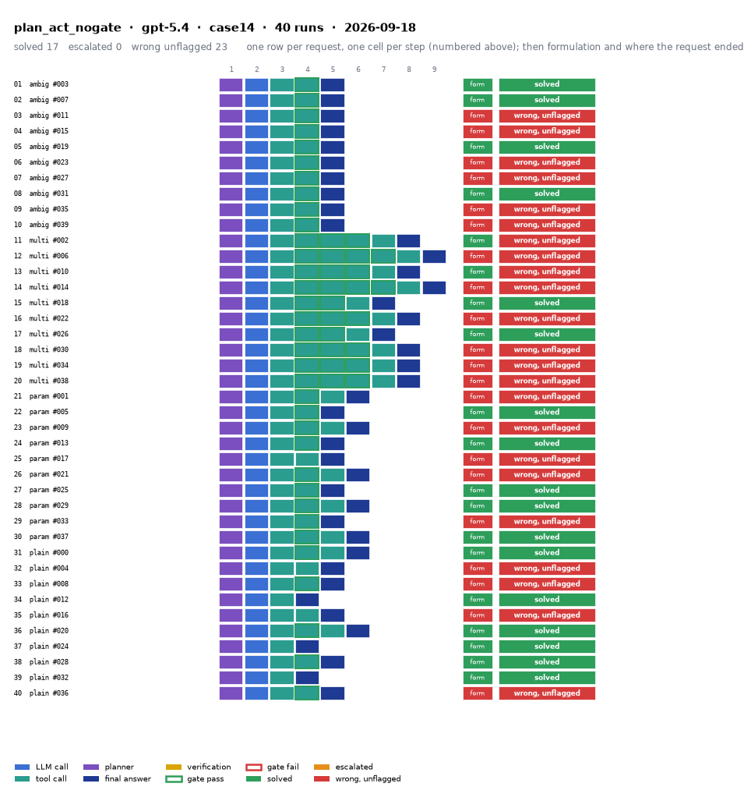

# plan_act_nogate on IEEE 14-bus with gpt-5.4

Generated 2026-09-24 20:32 by benchmarks/postprocess.py from `report.rescored.json`. Runs: 40.

## Run

| field | value |
|---|---|
| date | 2026-09-18 |
| model | openrouter:openai/gpt-5.4 |
| method | plan_act_nogate |
| case | case14 |
| condition | normal |
| n | 40 |
| seed | 0 |
| k | 1 |
| max_rounds | 8 |
| temperature | 0.0 |
| system_prompt_hash | 7da5e2a37ec4 |
| source | results_validation_n40/gpt-5.4/plan_act_nogate |
| source_commit | 46e27b8 2026-09-22 Backfill GPT-5.4's missing B_mean-solved from its own frozen data |
| role_in_paper | main protocol table (Table 5 / S8) |
| notes | Copied from benchmarks/results_* by scripts/migrate_paper_results.py; the date is the write time of the source report.json. |
| description | Plan-and-Act with no gate. |
| prompt files | _shared/agent_system_prompt.txt, _shared/final_answer_instruction.txt, plan_act/plan_system_prompt_prefix.txt, plan_act/plan_system_prompt_structured.txt |

One row per request, one cell per step (blue LLM call, teal tool call, purple planner, gold verification; green or red edge is the gate verdict), then formulation and where the request ended. Each run also has its own figure next to its traces: `traces/NN_<request>.png`.

## Where every request ended

The three outcomes are exclusive and sum to the run count. Escalation takes precedence: a run the method handed to a person is not an autonomous answer, right or wrong.

| outcome | count | share |
|---|---:|---:|
| Solved autonomously | 17 | 42.5% |
| Escalated to a person | 0 | 0.0% |
| Wrong, unflagged | 23 | 57.5% |
| **Total** | **40** | 100% |

## Metrics

| group | metric | value |
|---|---|---|
| Task utility | Formulation exact | 19/40 (47.5%) |
| Task utility | Formulation error types | extra_arg_changes_result: 13, invalid_value: 6, wrong_id: 2 |
| Task utility | Voltage MAE, all runs | 4.36e-04 p.u. |
| Task utility | Voltage MAE, formulation-exact runs | 0 p.u. |
| Task utility | Flow MAE, all runs | 0.0746 MW |
| Task utility | Flow MAE, formulation-exact runs | 0 MW |
| Task utility | KCL mismatch, mean | 0 MW |
| Solver-grounded correctness | Solved (computation right, any path) | 17/40 (42.5%) |
| Solver-grounded correctness | V-pass (all conditions, offline) | 39/40 (97.5%) |
| Reporting | Traceable answers | 39/40 (97.5%) |
| Reporting | Traceable numbers, mean share | 1 |
| Reporting | Stale state quoted | 1/40 |
| Cost and time | LLM calls / tool calls, mean | 2 / 2.85 |
| Cost and time | Prompt / completion tokens, mean | 5813 / 396 |
| Cost and time | Cost, total | $0.8189 |
| Cost and time | Wall time, mean | 6.9 s |

### Cross-check against the runner's own scoreboard

Values the runner aggregated for the same rows (report.json scoreboard). They should agree with the table above; a disagreement means the rows were filtered differently.

| metric | runner scoreboard | this report |
|---|---:|---:|
| solved_autonomously_count | 17 | 17 |
| escalated_count | 0 | 0 |
| wrong_silently_count | 23 | 23 |
| formulation_exact_count | 19 | 19 |
| v_pass_count | 39 | 39 |
| faithful_answers_count | 39 | 39 |
| n_items | 40 | 40 |

## By request difficulty

| difficulty | n | solved | escalated | wrong unflagged | formulation exact |
|---|---:|---:|---:|---:|---:|
| ambiguous | 10 | 4 | 0 | 6 | 4 |
| multistep | 10 | 2 | 0 | 8 | 4 |
| parameterized | 10 | 5 | 0 | 5 | 5 |
| plain | 10 | 6 | 0 | 4 | 6 |

## Wrong and unflagged (23)

- `case14-ambiguous-011-s0` formulation extra_arg_changes_result; modify_load: extra argument q_mvar=11.2 changes the solver outcome (request did not ask for it)  ([narrative](traces/03_case14-ambiguous-011-s0.narrative.txt), [transcript](traces/03_case14-ambiguous-011-s0.transcript.txt))
- `case14-ambiguous-015-s0` formulation extra_arg_changes_result; modify_load: extra argument q_mvar=0.0 changes the solver outcome (request did not ask for it)  ([narrative](traces/04_case14-ambiguous-015-s0.narrative.txt), [transcript](traces/04_case14-ambiguous-015-s0.transcript.txt))
- `case14-ambiguous-023-s0` formulation extra_arg_changes_result; modify_load: extra argument q_mvar=0.0 changes the solver outcome (request did not ask for it)  ([narrative](traces/06_case14-ambiguous-023-s0.narrative.txt), [transcript](traces/06_case14-ambiguous-023-s0.transcript.txt))
- `case14-ambiguous-027-s0` formulation wrong_id; modify_load: bus_id intended 11 != executed 10; modify_load: extra argument q_mvar=0.0 changes the solver outcome (request did not ask for it)  ([narrative](traces/07_case14-ambiguous-027-s0.narrative.txt), [transcript](traces/07_case14-ambiguous-027-s0.transcript.txt))
- `case14-ambiguous-035-s0` formulation extra_arg_changes_result; modify_load: extra argument q_mvar=0.0 changes the solver outcome (request did not ask for it)  ([narrative](traces/09_case14-ambiguous-035-s0.narrative.txt), [transcript](traces/09_case14-ambiguous-035-s0.transcript.txt))
- `case14-ambiguous-039-s0` formulation wrong_id; modify_load: bus_id intended 2 != executed 1; modify_load: extra argument q_mvar=0.0 changes the solver outcome (request did not ask for it)  ([narrative](traces/10_case14-ambiguous-039-s0.narrative.txt), [transcript](traces/10_case14-ambiguous-039-s0.transcript.txt))
- `case14-multistep-002-s0` formulation exact  ([narrative](traces/11_case14-multistep-002-s0.narrative.txt), [transcript](traces/11_case14-multistep-002-s0.transcript.txt))
- `case14-multistep-006-s0` formulation extra_arg_changes_result; modify_load: extra argument q_mvar=0.0 changes the solver outcome (request did not ask for it)  ([narrative](traces/12_case14-multistep-006-s0.narrative.txt), [transcript](traces/12_case14-multistep-006-s0.transcript.txt))
- `case14-multistep-010-s0` formulation exact  ([narrative](traces/13_case14-multistep-010-s0.narrative.txt), [transcript](traces/13_case14-multistep-010-s0.transcript.txt))
- `case14-multistep-014-s0` formulation extra_arg_changes_result; modify_load: extra argument q_mvar=0.0 changes the solver outcome (request did not ask for it)  ([narrative](traces/14_case14-multistep-014-s0.narrative.txt), [transcript](traces/14_case14-multistep-014-s0.transcript.txt))
- `case14-multistep-022-s0` formulation extra_arg_changes_result; modify_load: extra argument q_mvar=0.0 changes the solver outcome (request did not ask for it)  ([narrative](traces/16_case14-multistep-022-s0.narrative.txt), [transcript](traces/16_case14-multistep-022-s0.transcript.txt))
- `case14-multistep-030-s0` formulation extra_arg_changes_result; modify_load: extra argument q_mvar=0.0 changes the solver outcome (request did not ask for it)  ([narrative](traces/18_case14-multistep-030-s0.narrative.txt), [transcript](traces/18_case14-multistep-030-s0.transcript.txt))
- `case14-multistep-034-s0` formulation extra_arg_changes_result; modify_load: extra argument q_mvar=0.0 changes the solver outcome (request did not ask for it)  ([narrative](traces/19_case14-multistep-034-s0.narrative.txt), [transcript](traces/19_case14-multistep-034-s0.transcript.txt))
- `case14-multistep-038-s0` formulation extra_arg_changes_result; modify_load: extra argument q_mvar=0.0 changes the solver outcome (request did not ask for it)  ([narrative](traces/20_case14-multistep-038-s0.narrative.txt), [transcript](traces/20_case14-multistep-038-s0.transcript.txt))
- `case14-parameterized-001-s0` formulation invalid_value; run_n1_contingency: criteria='min voltage' not in ['max_violations', 'max_overload', 'min_voltage'] (tool falls back to its default)  ([narrative](traces/21_case14-parameterized-001-s0.narrative.txt), [transcript](traces/21_case14-parameterized-001-s0.transcript.txt))
- `case14-parameterized-009-s0` formulation invalid_value; run_n1_contingency: criteria='max violations' not in ['max_violations', 'max_overload', 'min_voltage'] (tool falls back to its default); run_n1_contingency: max_candidates=3 scans only 3 of 20 branches, so the ranking is over a sample and not the network (request did not ask for it)  ([narrative](traces/23_case14-parameterized-009-s0.narrative.txt), [transcript](traces/23_case14-parameterized-009-s0.transcript.txt))
- `case14-parameterized-017-s0` formulation invalid_value; run_n1_contingency: criteria='max violations' not in ['max_violations', 'max_overload', 'min_voltage'] (tool falls back to its default); run_n1_contingency: max_candidates=8 scans only 8 of 20 branches, so the ranking is over a sample and not the network (request did not ask for it)  ([narrative](traces/25_case14-parameterized-017-s0.narrative.txt), [transcript](traces/25_case14-parameterized-017-s0.transcript.txt))
- `case14-parameterized-021-s0` formulation invalid_value; run_n1_contingency: criteria='max violations' not in ['max_violations', 'max_overload', 'min_voltage'] (tool falls back to its default)  ([narrative](traces/26_case14-parameterized-021-s0.narrative.txt), [transcript](traces/26_case14-parameterized-021-s0.transcript.txt))
- `case14-parameterized-033-s0` formulation extra_arg_changes_result; modify_load: extra argument q_mvar=0.0 changes the solver outcome (request did not ask for it)  ([narrative](traces/29_case14-parameterized-033-s0.narrative.txt), [transcript](traces/29_case14-parameterized-033-s0.transcript.txt))
- `case14-plain-004-s0` formulation invalid_value; run_n1_contingency: criteria='worst single outage' not in ['max_violations', 'max_overload', 'min_voltage'] (tool falls back to its default)  ([narrative](traces/32_case14-plain-004-s0.narrative.txt), [transcript](traces/32_case14-plain-004-s0.transcript.txt))
- `case14-plain-008-s0` formulation extra_arg_changes_result; modify_load: extra argument q_mvar=0.0 changes the solver outcome (request did not ask for it)  ([narrative](traces/33_case14-plain-008-s0.narrative.txt), [transcript](traces/33_case14-plain-008-s0.transcript.txt))
- `case14-plain-016-s0` formulation invalid_value; run_n1_contingency: criteria='worst single outage' not in ['max_violations', 'max_overload', 'min_voltage'] (tool falls back to its default)  ([narrative](traces/35_case14-plain-016-s0.narrative.txt), [transcript](traces/35_case14-plain-016-s0.transcript.txt))
- `case14-plain-036-s0` formulation extra_arg_changes_result; modify_load: extra argument q_mvar=0.0 changes the solver outcome (request did not ask for it)  ([narrative](traces/40_case14-plain-036-s0.narrative.txt), [transcript](traces/40_case14-plain-036-s0.transcript.txt))

## Formulation not exact (21)

- `case14-ambiguous-011-s0` extra_arg_changes_result: modify_load: extra argument q_mvar=11.2 changes the solver outcome (request did not ask for it)  ([narrative](traces/03_case14-ambiguous-011-s0.narrative.txt), [transcript](traces/03_case14-ambiguous-011-s0.transcript.txt))
- `case14-ambiguous-015-s0` extra_arg_changes_result: modify_load: extra argument q_mvar=0.0 changes the solver outcome (request did not ask for it)  ([narrative](traces/04_case14-ambiguous-015-s0.narrative.txt), [transcript](traces/04_case14-ambiguous-015-s0.transcript.txt))
- `case14-ambiguous-023-s0` extra_arg_changes_result: modify_load: extra argument q_mvar=0.0 changes the solver outcome (request did not ask for it)  ([narrative](traces/06_case14-ambiguous-023-s0.narrative.txt), [transcript](traces/06_case14-ambiguous-023-s0.transcript.txt))
- `case14-ambiguous-027-s0` wrong_id: modify_load: bus_id intended 11 != executed 10; modify_load: extra argument q_mvar=0.0 changes the solver outcome (request did not ask for it)  ([narrative](traces/07_case14-ambiguous-027-s0.narrative.txt), [transcript](traces/07_case14-ambiguous-027-s0.transcript.txt))
- `case14-ambiguous-035-s0` extra_arg_changes_result: modify_load: extra argument q_mvar=0.0 changes the solver outcome (request did not ask for it)  ([narrative](traces/09_case14-ambiguous-035-s0.narrative.txt), [transcript](traces/09_case14-ambiguous-035-s0.transcript.txt))
- `case14-ambiguous-039-s0` wrong_id: modify_load: bus_id intended 2 != executed 1; modify_load: extra argument q_mvar=0.0 changes the solver outcome (request did not ask for it)  ([narrative](traces/10_case14-ambiguous-039-s0.narrative.txt), [transcript](traces/10_case14-ambiguous-039-s0.transcript.txt))
- `case14-multistep-006-s0` extra_arg_changes_result: modify_load: extra argument q_mvar=0.0 changes the solver outcome (request did not ask for it)  ([narrative](traces/12_case14-multistep-006-s0.narrative.txt), [transcript](traces/12_case14-multistep-006-s0.transcript.txt))
- `case14-multistep-014-s0` extra_arg_changes_result: modify_load: extra argument q_mvar=0.0 changes the solver outcome (request did not ask for it)  ([narrative](traces/14_case14-multistep-014-s0.narrative.txt), [transcript](traces/14_case14-multistep-014-s0.transcript.txt))
- `case14-multistep-022-s0` extra_arg_changes_result: modify_load: extra argument q_mvar=0.0 changes the solver outcome (request did not ask for it)  ([narrative](traces/16_case14-multistep-022-s0.narrative.txt), [transcript](traces/16_case14-multistep-022-s0.transcript.txt))
- `case14-multistep-030-s0` extra_arg_changes_result: modify_load: extra argument q_mvar=0.0 changes the solver outcome (request did not ask for it)  ([narrative](traces/18_case14-multistep-030-s0.narrative.txt), [transcript](traces/18_case14-multistep-030-s0.transcript.txt))
- `case14-multistep-034-s0` extra_arg_changes_result: modify_load: extra argument q_mvar=0.0 changes the solver outcome (request did not ask for it)  ([narrative](traces/19_case14-multistep-034-s0.narrative.txt), [transcript](traces/19_case14-multistep-034-s0.transcript.txt))
- `case14-multistep-038-s0` extra_arg_changes_result: modify_load: extra argument q_mvar=0.0 changes the solver outcome (request did not ask for it)  ([narrative](traces/20_case14-multistep-038-s0.narrative.txt), [transcript](traces/20_case14-multistep-038-s0.transcript.txt))
- `case14-parameterized-001-s0` invalid_value: run_n1_contingency: criteria='min voltage' not in ['max_violations', 'max_overload', 'min_voltage'] (tool falls back to its default)  ([narrative](traces/21_case14-parameterized-001-s0.narrative.txt), [transcript](traces/21_case14-parameterized-001-s0.transcript.txt))
- `case14-parameterized-009-s0` invalid_value: run_n1_contingency: criteria='max violations' not in ['max_violations', 'max_overload', 'min_voltage'] (tool falls back to its default); run_n1_contingency: max_candidates=3 scans only 3 of 20 branches, so the ranking is over a sample and not the network (request did not ask for it)  ([narrative](traces/23_case14-parameterized-009-s0.narrative.txt), [transcript](traces/23_case14-parameterized-009-s0.transcript.txt))
- `case14-parameterized-017-s0` invalid_value: run_n1_contingency: criteria='max violations' not in ['max_violations', 'max_overload', 'min_voltage'] (tool falls back to its default); run_n1_contingency: max_candidates=8 scans only 8 of 20 branches, so the ranking is over a sample and not the network (request did not ask for it)  ([narrative](traces/25_case14-parameterized-017-s0.narrative.txt), [transcript](traces/25_case14-parameterized-017-s0.transcript.txt))
- `case14-parameterized-021-s0` invalid_value: run_n1_contingency: criteria='max violations' not in ['max_violations', 'max_overload', 'min_voltage'] (tool falls back to its default)  ([narrative](traces/26_case14-parameterized-021-s0.narrative.txt), [transcript](traces/26_case14-parameterized-021-s0.transcript.txt))
- `case14-parameterized-033-s0` extra_arg_changes_result: modify_load: extra argument q_mvar=0.0 changes the solver outcome (request did not ask for it)  ([narrative](traces/29_case14-parameterized-033-s0.narrative.txt), [transcript](traces/29_case14-parameterized-033-s0.transcript.txt))
- `case14-plain-004-s0` invalid_value: run_n1_contingency: criteria='worst single outage' not in ['max_violations', 'max_overload', 'min_voltage'] (tool falls back to its default)  ([narrative](traces/32_case14-plain-004-s0.narrative.txt), [transcript](traces/32_case14-plain-004-s0.transcript.txt))
- `case14-plain-008-s0` extra_arg_changes_result: modify_load: extra argument q_mvar=0.0 changes the solver outcome (request did not ask for it)  ([narrative](traces/33_case14-plain-008-s0.narrative.txt), [transcript](traces/33_case14-plain-008-s0.transcript.txt))
- `case14-plain-016-s0` invalid_value: run_n1_contingency: criteria='worst single outage' not in ['max_violations', 'max_overload', 'min_voltage'] (tool falls back to its default)  ([narrative](traces/35_case14-plain-016-s0.narrative.txt), [transcript](traces/35_case14-plain-016-s0.transcript.txt))
- `case14-plain-036-s0` extra_arg_changes_result: modify_load: extra argument q_mvar=0.0 changes the solver outcome (request did not ask for it)  ([narrative](traces/40_case14-plain-036-s0.narrative.txt), [transcript](traces/40_case14-plain-036-s0.transcript.txt))

## Untraceable numbers in the answer (1)

- `case14-multistep-030-s0` 0 of 22 numbers; values []  ([narrative](traces/18_case14-multistep-030-s0.narrative.txt), [transcript](traces/18_case14-multistep-030-s0.transcript.txt))

## Files

- `summary.csv`: one line per run, the fields above plus tokens and time.
- `traces/NN_<request>.narrative.txt`: what happened in each run, step by step, with the verdicts.
- `traces/NN_<request>.transcript.txt`: the raw exchange, every message, tool call and tool output.
- `traces/NN_<request>.png`: the run as a picture: steps, gate verdicts, formulation, verification, outcome, with a two-line narrative.
- `overview.png`: all runs of this folder on one page.
- `traces/NN_<request>.json`: the raw trace the runner wrote.
- `raw/`: the runner's own outputs (report.json, rescored report, logs).
- `requests.jsonl`: the request set, with the intended tool calls that define formulation exactness.
