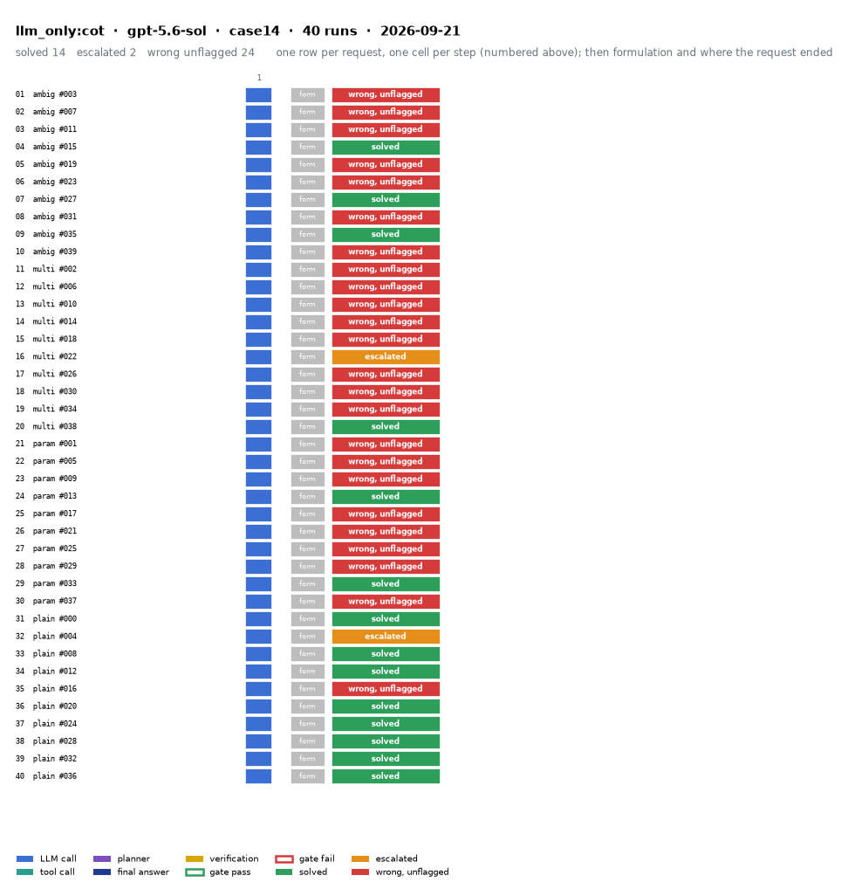

# llm_only:cot on IEEE 14-bus with gpt-5.6-sol

Generated 2026-09-24 20:37 by benchmarks/postprocess.py from `report.rescored.json`. Runs: 40.

## Run

| field | value |
|---|---|
| date | 2026-09-21 |
| model | openrouter:openai/gpt-5.6-sol |
| method | llm_only:cot |
| case | case14 |
| condition | normal |
| n | 40 |
| seed | 0 |
| k | 1 |
| max_rounds | 8 |
| tool_variant | v1 |
| plan_variant | text |
| temperature | 0.0 |
| system_prompt_hash | 063482ad676f |
| source | results_validation_sol_n40_clean/llm_only_cot/case14 |
| source_commit | 46e27b8 2026-09-22 Backfill GPT-5.4's missing B_mean-solved from its own frozen data |
| role_in_paper | main protocol table (Table 5 / S8) |
| notes | Copied from benchmarks/results_* by scripts/migrate_paper_results.py; the date is the write time of the source report.json. |
| description | LLM answers from the case tables in the prompt. No tools. Structured prompt plus a reasoning section asking for step-by-step reasoning before the final JSON. |
| prompt files | _shared/llm_only_system_prompt.txt, _shared/llm_only_user_template.txt, _shared/llm_only_bus_id_note.txt, _shared/cot_system_suffix.txt, llm_only_cot/reasoning_section.txt |

One row per request, one cell per step (blue LLM call, teal tool call, purple planner, gold verification; green or red edge is the gate verdict), then formulation and where the request ended. Each run also has its own figure next to its traces: `traces/NN_<request>.png`.

## Where every request ended

The three outcomes are exclusive and sum to the run count. Escalation takes precedence: a run the method handed to a person is not an autonomous answer, right or wrong.

| outcome | count | share |
|---|---:|---:|
| Solved autonomously | 14 | 35.0% |
| Escalated to a person | 2 | 5.0% |
| Wrong, unflagged | 24 | 60.0% |
| **Total** | **40** | 100% |

## Metrics

| group | metric | value |
|---|---|---|
| Task utility | Formulation exact | n/a (no tool calls) |
| Task utility | Voltage MAE, all runs | 0.0015 p.u. |
| Task utility | Voltage MAE, formulation-exact runs | n/a p.u. |
| Task utility | Flow MAE, all runs | 0.5349 MW |
| Task utility | Flow MAE, formulation-exact runs | n/a MW |
| Task utility | KCL mismatch, mean | 0.1686 MW |
| Solver-grounded correctness | Solved (computation right, any path) | 14/40 (35.0%) |
| Solver-grounded correctness | V-pass (all conditions, offline) | 0/40 (0.0%) |
| Reporting | Traceable answers | 0/40 (0.0%) |
| Reporting | Traceable numbers, mean share | 0.02 |
| Reporting | Stale state quoted | 0/40 |
| Cost and time | LLM calls / tool calls, mean | 1 / 0 |
| Cost and time | Prompt / completion tokens, mean | 2196 / 7856 |
| Cost and time | Cost, total | $3.3181 |
| Cost and time | Wall time, mean | 184.2 s |

### Cross-check against the runner's own scoreboard

Values the runner aggregated for the same rows (report.json scoreboard). They should agree with the table above; a disagreement means the rows were filtered differently.

| metric | runner scoreboard | this report |
|---|---:|---:|
| solved_autonomously_count | 14 | 14 |
| escalated_count | 2 | 2 |
| wrong_silently_count | 24 | 24 |
| formulation_exact_count | 0 | 0 |
| v_pass_count | 0 | 0 |
| faithful_answers_count | 0 | 0 |
| n_items | 40 | 40 |

## By request difficulty

| difficulty | n | solved | escalated | wrong unflagged | formulation exact |
|---|---:|---:|---:|---:|---:|
| ambiguous | 10 | 3 | 0 | 7 | 0 |
| multistep | 10 | 1 | 1 | 8 | 0 |
| parameterized | 10 | 2 | 0 | 8 | 0 |
| plain | 10 | 8 | 1 | 1 | 0 |

## Wrong and unflagged (24)

- `case14-ambiguous-003-s0` formulation None; no tool stage  ([narrative](traces/01_case14-ambiguous-003-s0.narrative.txt), [transcript](traces/01_case14-ambiguous-003-s0.transcript.txt))
- `case14-ambiguous-007-s0` formulation None; no tool stage  ([narrative](traces/02_case14-ambiguous-007-s0.narrative.txt), [transcript](traces/02_case14-ambiguous-007-s0.transcript.txt))
- `case14-ambiguous-011-s0` formulation None; no tool stage  ([narrative](traces/03_case14-ambiguous-011-s0.narrative.txt), [transcript](traces/03_case14-ambiguous-011-s0.transcript.txt))
- `case14-ambiguous-019-s0` formulation None; no tool stage  ([narrative](traces/05_case14-ambiguous-019-s0.narrative.txt), [transcript](traces/05_case14-ambiguous-019-s0.transcript.txt))
- `case14-ambiguous-023-s0` formulation None; no tool stage  ([narrative](traces/06_case14-ambiguous-023-s0.narrative.txt), [transcript](traces/06_case14-ambiguous-023-s0.transcript.txt))
- `case14-ambiguous-031-s0` formulation None; no tool stage  ([narrative](traces/08_case14-ambiguous-031-s0.narrative.txt), [transcript](traces/08_case14-ambiguous-031-s0.transcript.txt))
- `case14-ambiguous-039-s0` formulation None; no tool stage  ([narrative](traces/10_case14-ambiguous-039-s0.narrative.txt), [transcript](traces/10_case14-ambiguous-039-s0.transcript.txt))
- `case14-multistep-002-s0` formulation None; no tool stage  ([narrative](traces/11_case14-multistep-002-s0.narrative.txt), [transcript](traces/11_case14-multistep-002-s0.transcript.txt))
- `case14-multistep-006-s0` formulation None; no tool stage  ([narrative](traces/12_case14-multistep-006-s0.narrative.txt), [transcript](traces/12_case14-multistep-006-s0.transcript.txt))
- `case14-multistep-010-s0` formulation None; no tool stage  ([narrative](traces/13_case14-multistep-010-s0.narrative.txt), [transcript](traces/13_case14-multistep-010-s0.transcript.txt))
- `case14-multistep-014-s0` formulation None; no tool stage  ([narrative](traces/14_case14-multistep-014-s0.narrative.txt), [transcript](traces/14_case14-multistep-014-s0.transcript.txt))
- `case14-multistep-018-s0` formulation None; no tool stage  ([narrative](traces/15_case14-multistep-018-s0.narrative.txt), [transcript](traces/15_case14-multistep-018-s0.transcript.txt))
- `case14-multistep-026-s0` formulation None; no tool stage  ([narrative](traces/17_case14-multistep-026-s0.narrative.txt), [transcript](traces/17_case14-multistep-026-s0.transcript.txt))
- `case14-multistep-030-s0` formulation None; no tool stage  ([narrative](traces/18_case14-multistep-030-s0.narrative.txt), [transcript](traces/18_case14-multistep-030-s0.transcript.txt))
- `case14-multistep-034-s0` formulation None; no tool stage  ([narrative](traces/19_case14-multistep-034-s0.narrative.txt), [transcript](traces/19_case14-multistep-034-s0.transcript.txt))
- `case14-parameterized-001-s0` formulation None; no tool stage  ([narrative](traces/21_case14-parameterized-001-s0.narrative.txt), [transcript](traces/21_case14-parameterized-001-s0.transcript.txt))
- `case14-parameterized-005-s0` formulation None; no tool stage  ([narrative](traces/22_case14-parameterized-005-s0.narrative.txt), [transcript](traces/22_case14-parameterized-005-s0.transcript.txt))
- `case14-parameterized-009-s0` formulation None; no tool stage  ([narrative](traces/23_case14-parameterized-009-s0.narrative.txt), [transcript](traces/23_case14-parameterized-009-s0.transcript.txt))
- `case14-parameterized-017-s0` formulation None; no tool stage  ([narrative](traces/25_case14-parameterized-017-s0.narrative.txt), [transcript](traces/25_case14-parameterized-017-s0.transcript.txt))
- `case14-parameterized-021-s0` formulation None; no tool stage  ([narrative](traces/26_case14-parameterized-021-s0.narrative.txt), [transcript](traces/26_case14-parameterized-021-s0.transcript.txt))
- `case14-parameterized-025-s0` formulation None; no tool stage  ([narrative](traces/27_case14-parameterized-025-s0.narrative.txt), [transcript](traces/27_case14-parameterized-025-s0.transcript.txt))
- `case14-parameterized-029-s0` formulation None; no tool stage  ([narrative](traces/28_case14-parameterized-029-s0.narrative.txt), [transcript](traces/28_case14-parameterized-029-s0.transcript.txt))
- `case14-parameterized-037-s0` formulation None; no tool stage  ([narrative](traces/30_case14-parameterized-037-s0.narrative.txt), [transcript](traces/30_case14-parameterized-037-s0.transcript.txt))
- `case14-plain-016-s0` formulation None; no tool stage  ([narrative](traces/35_case14-plain-016-s0.narrative.txt), [transcript](traces/35_case14-plain-016-s0.transcript.txt))

## Escalated (2)

- `case14-multistep-022-s0` detected via json; formulation None; no tool stage  ([narrative](traces/16_case14-multistep-022-s0.narrative.txt), [transcript](traces/16_case14-multistep-022-s0.transcript.txt))
- `case14-plain-004-s0` detected via json; formulation None; no tool stage  ([narrative](traces/32_case14-plain-004-s0.narrative.txt), [transcript](traces/32_case14-plain-004-s0.transcript.txt))

## Untraceable numbers in the answer (40)

- `case14-ambiguous-003-s0` 71 of 71 numbers; values ['1.06', '0.0', '1.045', '-4.791', '1.01', '-12.078', '1.0193', '-10.102', '1.0212', '-8.624', '1.07', '-14.094', '1.0618', '-13.7', '1.09', '-13.7', '1.055', '-15.57', '1.0466', '-15.865']  ([narrative](traces/01_case14-ambiguous-003-s0.narrative.txt), [transcript](traces/01_case14-ambiguous-003-s0.transcript.txt))
- `case14-ambiguous-007-s0` 70 of 71 numbers; values ['1.06', '0.0', '1.045', '-5.08', '1.01', '-12.95', '1.013', '-10.45', '1.017', '-8.95', '1.07', '-14.25', '1.06', '-13.9', '1.09', '-13.9', '1.052', '-15.55', '1.047', '-15.8']  ([narrative](traces/02_case14-ambiguous-007-s0.narrative.txt), [transcript](traces/02_case14-ambiguous-007-s0.transcript.txt))
- `case14-ambiguous-011-s0` 71 of 71 numbers; values ['1.06', '0.0', '1.045', '-5.2156', '1.01', '-13.3581', '1.0168', '-10.7239', '1.0188', '-9.1419', '1.07', '-14.9899', '1.0605', '-13.8136', '1.09', '-13.8136', '1.0545', '-15.4165', '1.0492', '-15.5963']  ([narrative](traces/03_case14-ambiguous-011-s0.narrative.txt), [transcript](traces/03_case14-ambiguous-011-s0.transcript.txt))
- `case14-ambiguous-015-s0` 71 of 71 numbers; values ['1.0600', '0.0000', '1.0450', '-5.0700', '1.0100', '-13.1200', '1.0172', '-10.3400', '1.0190', '-8.7400', '1.0700', '-14.3300', '1.0604', '-13.4000', '1.0900', '-13.4000', '1.0545', '-14.9990', '1.0495', '-15.1430']  ([narrative](traces/04_case14-ambiguous-015-s0.narrative.txt), [transcript](traces/04_case14-ambiguous-015-s0.transcript.txt))
- `case14-ambiguous-019-s0` 69 of 71 numbers; values ['1.06', '0.0', '1.045', '-5.12', '1.01', '-13.35', '1.015', '-10.72', '1.017', '-9.2', '1.07', '-15.4', '1.058', '-13.57', '1.09', '-13.57', '1.052', '-15.05', '1.047', '-15.39']  ([narrative](traces/05_case14-ambiguous-019-s0.narrative.txt), [transcript](traces/05_case14-ambiguous-019-s0.transcript.txt))
- `case14-ambiguous-023-s0` 71 of 71 numbers; values ['1.06', '0.0', '1.045', '-5.321', '1.01', '-13.521', '1.015', '-10.827', '1.018', '-9.168', '1.07', '-14.674', '1.059', '-13.91', '1.09', '-13.91', '1.052', '-15.48', '1.048', '-15.62']  ([narrative](traces/06_case14-ambiguous-023-s0.narrative.txt), [transcript](traces/06_case14-ambiguous-023-s0.transcript.txt))
- `case14-ambiguous-027-s0` 48 of 71 numbers; values ['1.06', '1.045', '-5.021', '1.01', '-13.188', '1.018', '-10.513', '1.02', '-8.912', '1.07', '-14.332', '1.063', '-13.466', '1.09', '-13.466', '1.058', '-14.995', '1.053', '-15.164', '1.058']  ([narrative](traces/07_case14-ambiguous-027-s0.narrative.txt), [transcript](traces/07_case14-ambiguous-027-s0.transcript.txt))
- `case14-ambiguous-031-s0` 69 of 71 numbers; values ['1.06', '0.0', '1.045', '-5.05', '1.01', '-12.87', '1.0165', '-10.47', '1.0185', '-8.91', '1.07', '-14.35', '1.0605', '-14.1', '1.09', '-14.1', '1.052', '-16.0', '1.0455', '-16.57']  ([narrative](traces/08_case14-ambiguous-031-s0.narrative.txt), [transcript](traces/08_case14-ambiguous-031-s0.transcript.txt))
- `case14-ambiguous-035-s0` 71 of 71 numbers; values ['1.06', '0.0', '1.045', '-4.90', '1.01', '-12.33', '1.018', '-10.23', '1.020', '-8.65', '1.07', '-14.10', '1.062', '-13.32', '1.09', '-13.32', '1.056', '-14.92', '1.051', '-15.04']  ([narrative](traces/09_case14-ambiguous-035-s0.narrative.txt), [transcript](traces/09_case14-ambiguous-035-s0.transcript.txt))
- `case14-ambiguous-039-s0` 49 of 71 numbers; values ['1.06', '1.045', '-4.592', '1.01', '-11.881', '1.019', '-9.991', '1.021', '-8.511', '1.07', '-14.096', '1.063', '-13.096', '1.09', '-13.096', '1.057', '-14.71', '1.052', '-14.9', '1.058']  ([narrative](traces/10_case14-ambiguous-039-s0.narrative.txt), [transcript](traces/10_case14-ambiguous-039-s0.transcript.txt))
- `case14-multistep-002-s0` 71 of 71 numbers; values ['1.06', '0.0', '1.045', '-5.12', '1.01', '-12.78', '1.0158', '-10.52', '1.0207', '-8.83', '1.07', '-13.33', '1.0584', '-14.63', '1.09', '-14.63', '1.037', '-16.74', '1.0455', '-15.62']  ([narrative](traces/11_case14-multistep-002-s0.narrative.txt), [transcript](traces/11_case14-multistep-002-s0.transcript.txt))
- `case14-multistep-006-s0` 71 of 71 numbers; values ['1.06', '0.0', '1.045', '-4.686', '1.01', '-11.869', '1.019', '-9.748', '1.021', '-8.34', '1.07', '-13.68', '1.062', '-12.82', '1.09', '-12.82', '1.057', '-14.4', '1.052', '-14.56']  ([narrative](traces/12_case14-multistep-006-s0.narrative.txt), [transcript](traces/12_case14-multistep-006-s0.transcript.txt))
- `case14-multistep-010-s0` 71 of 71 numbers; values ['1.06', '0.0', '1.045', '-35.8', '1.01', '-40.1', '0.986', '-34.1', '0.965', '-30.2', '1.07', '-36.9', '1.07', '-37.0', '1.09', '-37.0', '1.045', '-39.0', '1.04', '-39.2']  ([narrative](traces/13_case14-multistep-010-s0.narrative.txt), [transcript](traces/13_case14-multistep-010-s0.transcript.txt))
- `case14-multistep-014-s0` 70 of 71 numbers; values ['1.06', '0.0', '1.045', '-5.455', '1.01', '-13.7', '1.0144', '-11.17', '1.0174', '-9.57', '1.07', '-15.34', '1.0597', '-13.98', '1.09', '-13.98', '1.054', '-15.44', '1.0494', '-15.67']  ([narrative](traces/14_case14-multistep-014-s0.narrative.txt), [transcript](traces/14_case14-multistep-014-s0.transcript.txt))
- `case14-multistep-018-s0` 70 of 71 numbers; values ['1.06', '0.0', '1.045', '-5.63', '1.01', '-15.23', '0.9958', '-14.44', '1.0247', '-6.82', '1.07', '-15.08', '1.0615', '-16.95', '1.09', '-16.95', '1.0522', '-18.26', '1.051', '-18.11']  ([narrative](traces/15_case14-multistep-018-s0.narrative.txt), [transcript](traces/15_case14-multistep-018-s0.transcript.txt))
- `case14-multistep-022-s0` 4 of 4 numbers; values ['286.749703 MW', '0.0', '286.749703', '0.0']  ([narrative](traces/16_case14-multistep-022-s0.narrative.txt), [transcript](traces/16_case14-multistep-022-s0.transcript.txt))
- `case14-multistep-026-s0` 70 of 71 numbers; values ['1.0600', '0.000', '1.0450', '-4.93', '1.0100', '-15.46', '1.0108', '-14.47', '1.0144', '-11.43', '1.0700', '-16.36', '1.0587', '-16.98', '1.0900', '-16.98', '1.0472', '-18.80', '1.0426', '-19.15']  ([narrative](traces/17_case14-multistep-026-s0.narrative.txt), [transcript](traces/17_case14-multistep-026-s0.transcript.txt))
- `case14-multistep-030-s0` 3 of 3 numbers; values ['0.0', '275.14143', '0.0']  ([narrative](traces/18_case14-multistep-030-s0.narrative.txt), [transcript](traces/18_case14-multistep-030-s0.transcript.txt))
- `case14-multistep-034-s0` 71 of 71 numbers; values ['1.0600', '0.0000', '1.0450', '-4.2500', '1.0100', '-12.9200', '1.0112', '-11.3900', '1.0158', '-10.5100', '1.0700', '-15.5500', '1.0617', '-14.2500', '1.0900', '-14.2500', '1.0500', '-15.7700', '1.0450', '-16.2200']  ([narrative](traces/19_case14-multistep-034-s0.narrative.txt), [transcript](traces/19_case14-multistep-034-s0.transcript.txt))
- `case14-multistep-038-s0` 71 of 71 numbers; values ['1.0600', '0.000', '1.0450', '-4.663', '1.0100', '-12.444', '1.0190', '-9.715', '1.0206', '-8.240', '1.0700', '-13.208', '1.0630', '-12.673', '1.0900', '-12.673', '1.0570', '-14.205', '1.0522', '-14.293']  ([narrative](traces/20_case14-multistep-038-s0.narrative.txt), [transcript](traces/20_case14-multistep-038-s0.transcript.txt))
- `case14-parameterized-001-s0` 3 of 3 numbers; values ['0.0', '270.136178', '0.0']  ([narrative](traces/21_case14-parameterized-001-s0.narrative.txt), [transcript](traces/21_case14-parameterized-001-s0.transcript.txt))
- `case14-parameterized-005-s0` 71 of 71 numbers; values ['1.0600', '0.0000', '1.0450', '-5.6500', '1.0100', '-14.9500', '1.0075', '-14.3000', '1.0170', '-6.8500', '1.0700', '-13.9000', '1.0450', '-16.5000', '1.0900', '-16.5000', '1.0240', '-17.8000', '1.0250', '-17.6500']  ([narrative](traces/22_case14-parameterized-005-s0.narrative.txt), [transcript](traces/22_case14-parameterized-005-s0.transcript.txt))
- `case14-parameterized-009-s0` 3 of 3 numbers; values ['0.0', '251.3526', '0.0']  ([narrative](traces/23_case14-parameterized-009-s0.narrative.txt), [transcript](traces/23_case14-parameterized-009-s0.transcript.txt))
- `case14-parameterized-013-s0` 70 of 71 numbers; values ['1.06', '0.0', '1.045', '-5.03', '1.01', '-13.05', '1.016', '-10.62', '1.018', '-9.07', '1.07', '-14.24', '1.0603', '-13.91', '1.09', '-13.91', '1.053', '-15.55', '1.0491', '-15.74']  ([narrative](traces/24_case14-parameterized-013-s0.narrative.txt), [transcript](traces/24_case14-parameterized-013-s0.transcript.txt))
- `case14-parameterized-017-s0` 3 of 3 numbers; values ['0.0', '250.521315', '0.0']  ([narrative](traces/25_case14-parameterized-017-s0.narrative.txt), [transcript](traces/25_case14-parameterized-017-s0.transcript.txt))
- `case14-parameterized-021-s0` 3 of 3 numbers; values ['0.0', '0.0', '0.0']  ([narrative](traces/26_case14-parameterized-021-s0.narrative.txt), [transcript](traces/26_case14-parameterized-021-s0.transcript.txt))
- `case14-parameterized-025-s0` 71 of 71 numbers; values ['1.0600', '0.000', '1.0450', '-4.740', '1.0100', '-12.220', '1.0200', '-10.080', '1.0220', '-8.680', '1.0700', '-14.520', '1.0640', '-12.900', '1.0900', '-12.900', '1.0580', '-14.300', '1.0290', '-15.810']  ([narrative](traces/27_case14-parameterized-025-s0.narrative.txt), [transcript](traces/27_case14-parameterized-025-s0.transcript.txt))
- `case14-parameterized-029-s0` 71 of 71 numbers; values ['1.06', '0.0', '1.045', '-5.013', '1.01', '-12.53', '1.018', '-10.45', '1.0195', '-8.844', '1.07', '-14.33', '1.061', '-13.43', '1.09', '-13.43', '1.0548', '-15.04', '1.0502', '-15.19']  ([narrative](traces/28_case14-parameterized-029-s0.narrative.txt), [transcript](traces/28_case14-parameterized-029-s0.transcript.txt))
- `case14-parameterized-033-s0` 70 of 71 numbers; values ['1.06', '0.0', '1.045', '-4.944', '1.01', '-12.9208', '1.0172', '-10.2743', '1.0197', '-8.7242', '1.07', '-14.0588', '1.062', '-13.1588', '1.09', '-13.1588', '1.059', '-14.6524', '1.0535', '-14.8329']  ([narrative](traces/29_case14-parameterized-033-s0.narrative.txt), [transcript](traces/29_case14-parameterized-033-s0.transcript.txt))
- `case14-parameterized-037-s0` 70 of 71 numbers; values ['1.0600', '0.0000', '1.0450', '-5.1688', '1.0100', '-13.0983', '1.0168', '-10.4912', '1.0188', '-8.9444', '1.0700', '-14.5352', '1.0608', '-13.5705', '1.0900', '-13.5705', '1.0553', '-15.1666', '1.0499', '-15.3699']  ([narrative](traces/30_case14-parameterized-037-s0.narrative.txt), [transcript](traces/30_case14-parameterized-037-s0.transcript.txt))
- `case14-plain-000-s0` 71 of 71 numbers; values ['1.06', '0.0', '1.045', '-4.89', '1.01', '-12.43', '1.0181', '-10.1', '1.0198', '-8.6', '1.07', '-14.05', '1.0617', '-13.18', '1.09', '-13.18', '1.0562', '-14.75', '1.0514', '-14.86']  ([narrative](traces/31_case14-plain-000-s0.narrative.txt), [transcript](traces/31_case14-plain-000-s0.transcript.txt))
- `case14-plain-004-s0` 3 of 3 numbers; values ['0.0', '261.993218', '0.0']  ([narrative](traces/32_case14-plain-004-s0.narrative.txt), [transcript](traces/32_case14-plain-004-s0.transcript.txt))
- `case14-plain-008-s0` 71 of 71 numbers; values ['1.06', '0.0', '1.045', '-4.792', '1.01', '-12.164', '1.018', '-10.189', '1.019', '-8.675', '1.07', '-14.09', '1.061', '-13.324', '1.09', '-13.324', '1.055', '-14.945', '1.05', '-15.08']  ([narrative](traces/33_case14-plain-008-s0.narrative.txt), [transcript](traces/33_case14-plain-008-s0.transcript.txt))
- `case14-plain-012-s0` 71 of 71 numbers; values ['1.060000', '0.000000', '1.045000', '-4.841000', '1.010000', '-12.490000', '1.017800', '-10.251000', '1.019700', '-8.719000', '1.070000', '-14.181000', '1.061000', '-13.391000', '1.090000', '-13.391000', '1.054500', '-15.023000', '1.049800', '-15.140000']  ([narrative](traces/34_case14-plain-012-s0.narrative.txt), [transcript](traces/34_case14-plain-012-s0.transcript.txt))
- `case14-plain-016-s0` 3 of 3 numbers; values ['0.0', '251.474232', '0.0']  ([narrative](traces/35_case14-plain-016-s0.narrative.txt), [transcript](traces/35_case14-plain-016-s0.transcript.txt))
- `case14-plain-020-s0` 70 of 71 numbers; values ['1.060000', '0.000000', '1.045000', '-5.148300', '1.010000', '-12.941800', '1.016700', '-10.638500', '1.018800', '-9.045200', '1.070000', '-14.604900', '1.061200', '-13.728100', '1.090000', '-13.728100', '1.055300', '-15.329500', '1.050200', '-15.508300']  ([narrative](traces/36_case14-plain-020-s0.narrative.txt), [transcript](traces/36_case14-plain-020-s0.transcript.txt))
- `case14-plain-024-s0` 71 of 71 numbers; values ['1.06000', '0.00000', '1.04500', '-5.01176', '1.01000', '-13.02920', '1.01767', '-10.30970', '1.01951', '-8.78180', '1.07000', '-14.21770', '1.06152', '-13.35010', '1.09000', '-13.35010', '1.05593', '-14.92560', '1.05098', '-15.11280']  ([narrative](traces/37_case14-plain-024-s0.narrative.txt), [transcript](traces/37_case14-plain-024-s0.transcript.txt))
- `case14-plain-028-s0` 71 of 71 numbers; values ['1.06', '0.0', '1.045', '-5.034', '1.01', '-12.7862', '1.0172', '-10.4447', '1.0192', '-8.8771', '1.07', '-14.4494', '1.0608', '-13.6121', '1.09', '-13.6121', '1.0541', '-15.2552', '1.049', '-15.4243']  ([narrative](traces/38_case14-plain-028-s0.narrative.txt), [transcript](traces/38_case14-plain-028-s0.transcript.txt))
- `case14-plain-032-s0` 71 of 71 numbers; values ['1.06', '0.0', '1.045', '-4.853', '1.01', '-12.494', '1.018', '-10.283', '1.02', '-8.723', '1.07', '-14.091', '1.062', '-13.29', '1.09', '-13.29', '1.057', '-14.849', '1.052', '-15.007']  ([narrative](traces/39_case14-plain-032-s0.narrative.txt), [transcript](traces/39_case14-plain-032-s0.transcript.txt))
- `case14-plain-036-s0` 71 of 71 numbers; values ['1.06', '0.0', '1.045', '-4.99', '1.01', '-12.5', '1.0182', '-10.474', '1.02', '-8.898', '1.07', '-14.432', '1.0612', '-13.675', '1.09', '-13.675', '1.0551', '-15.335', '1.0499', '-15.491']  ([narrative](traces/40_case14-plain-036-s0.narrative.txt), [transcript](traces/40_case14-plain-036-s0.transcript.txt))

## Files

- `summary.csv`: one line per run, the fields above plus tokens and time.
- `traces/NN_<request>.narrative.txt`: what happened in each run, step by step, with the verdicts.
- `traces/NN_<request>.transcript.txt`: the raw exchange, every message, tool call and tool output.
- `traces/NN_<request>.png`: the run as a picture: steps, gate verdicts, formulation, verification, outcome, with a two-line narrative.
- `overview.png`: all runs of this folder on one page.
- `traces/NN_<request>.json`: the raw trace the runner wrote.
- `raw/`: the runner's own outputs (report.json, rescored report, logs).
- `requests.jsonl`: the request set, with the intended tool calls that define formulation exactness.
