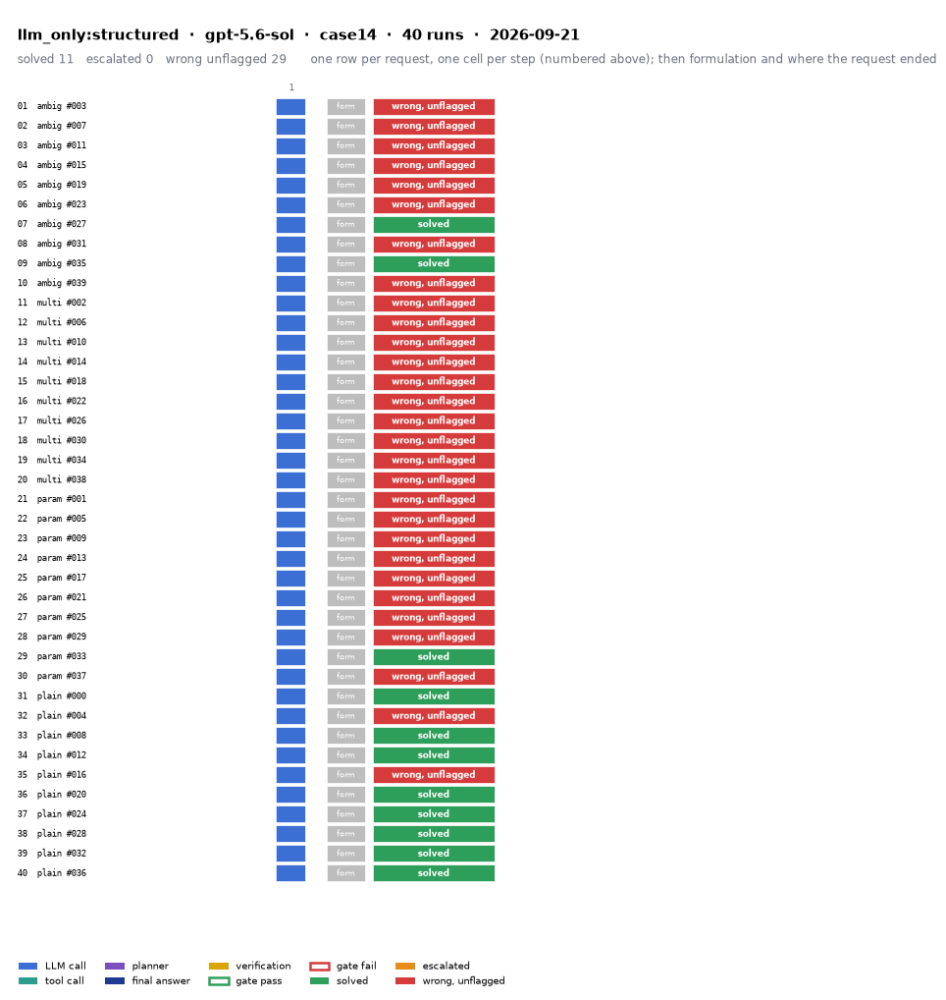

# llm_only:structured on IEEE 14-bus with gpt-5.6-sol

Generated 2026-09-24 20:37 by benchmarks/postprocess.py from `report.rescored.json`. Runs: 40.

## Run

| field | value |
|---|---|
| date | 2026-09-21 |
| model | openrouter:openai/gpt-5.6-sol |
| method | llm_only:structured |
| case | case14 |
| condition | normal |
| n | 40 |
| seed | 0 |
| k | 1 |
| max_rounds | 8 |
| tool_variant | v1 |
| plan_variant | text |
| temperature | 0.0 |
| system_prompt_hash | 1b4712c641b5 |
| source | results_validation_sol_n40_clean/llm_only_structured/case14 |
| source_commit | 46e27b8 2026-09-22 Backfill GPT-5.4's missing B_mean-solved from its own frozen data |
| role_in_paper | main protocol table (Table 5 / S8) |
| notes | Copied from benchmarks/results_* by scripts/migrate_paper_results.py; the date is the write time of the source report.json. |
| description | LLM answers from the case tables in the prompt. No tools. Structured prompt: role, full case tables as system data, task, JSON output schema. |
| prompt files | _shared/llm_only_system_prompt.txt, _shared/llm_only_user_template.txt, _shared/llm_only_bus_id_note.txt |

One row per request, one cell per step (blue LLM call, teal tool call, purple planner, gold verification; green or red edge is the gate verdict), then formulation and where the request ended. Each run also has its own figure next to its traces: `traces/NN_<request>.png`.

## Where every request ended

The three outcomes are exclusive and sum to the run count. Escalation takes precedence: a run the method handed to a person is not an autonomous answer, right or wrong.

| outcome | count | share |
|---|---:|---:|
| Solved autonomously | 11 | 27.5% |
| Escalated to a person | 0 | 0.0% |
| Wrong, unflagged | 29 | 72.5% |
| **Total** | **40** | 100% |

## Metrics

| group | metric | value |
|---|---|---|
| Task utility | Formulation exact | n/a (no tool calls) |
| Task utility | Voltage MAE, all runs | 0.0018 p.u. |
| Task utility | Voltage MAE, formulation-exact runs | n/a p.u. |
| Task utility | Flow MAE, all runs | 0.4983 MW |
| Task utility | Flow MAE, formulation-exact runs | n/a MW |
| Task utility | KCL mismatch, mean | 0.1725 MW |
| Solver-grounded correctness | Solved (computation right, any path) | 11/40 (27.5%) |
| Solver-grounded correctness | V-pass (all conditions, offline) | 0/40 (0.0%) |
| Reporting | Traceable answers | 0/40 (0.0%) |
| Reporting | Traceable numbers, mean share | 0.02 |
| Reporting | Stale state quoted | 0/40 |
| Cost and time | LLM calls / tool calls, mean | 1 / 0 |
| Cost and time | Prompt / completion tokens, mean | 202 / 8344 |
| Cost and time | Cost, total | $3.4994 |
| Cost and time | Wall time, mean | 148 s |

### Cross-check against the runner's own scoreboard

Values the runner aggregated for the same rows (report.json scoreboard). They should agree with the table above; a disagreement means the rows were filtered differently.

| metric | runner scoreboard | this report |
|---|---:|---:|
| solved_autonomously_count | 11 | 11 |
| escalated_count | 0 | 0 |
| wrong_silently_count | 29 | 29 |
| formulation_exact_count | 0 | 0 |
| v_pass_count | 0 | 0 |
| faithful_answers_count | 0 | 0 |
| n_items | 40 | 40 |

## By request difficulty

| difficulty | n | solved | escalated | wrong unflagged | formulation exact |
|---|---:|---:|---:|---:|---:|
| ambiguous | 10 | 2 | 0 | 8 | 0 |
| multistep | 10 | 0 | 0 | 10 | 0 |
| parameterized | 10 | 1 | 0 | 9 | 0 |
| plain | 10 | 8 | 0 | 2 | 0 |

## Wrong and unflagged (29)

- `case14-ambiguous-003-s0` formulation None; no tool stage  ([narrative](traces/01_case14-ambiguous-003-s0.narrative.txt), [transcript](traces/01_case14-ambiguous-003-s0.transcript.txt))
- `case14-ambiguous-007-s0` formulation None; no tool stage  ([narrative](traces/02_case14-ambiguous-007-s0.narrative.txt), [transcript](traces/02_case14-ambiguous-007-s0.transcript.txt))
- `case14-ambiguous-011-s0` formulation None; no tool stage  ([narrative](traces/03_case14-ambiguous-011-s0.narrative.txt), [transcript](traces/03_case14-ambiguous-011-s0.transcript.txt))
- `case14-ambiguous-015-s0` formulation None; no tool stage  ([narrative](traces/04_case14-ambiguous-015-s0.narrative.txt), [transcript](traces/04_case14-ambiguous-015-s0.transcript.txt))
- `case14-ambiguous-019-s0` formulation None; no tool stage  ([narrative](traces/05_case14-ambiguous-019-s0.narrative.txt), [transcript](traces/05_case14-ambiguous-019-s0.transcript.txt))
- `case14-ambiguous-023-s0` formulation None; no tool stage  ([narrative](traces/06_case14-ambiguous-023-s0.narrative.txt), [transcript](traces/06_case14-ambiguous-023-s0.transcript.txt))
- `case14-ambiguous-031-s0` formulation None; no tool stage  ([narrative](traces/08_case14-ambiguous-031-s0.narrative.txt), [transcript](traces/08_case14-ambiguous-031-s0.transcript.txt))
- `case14-ambiguous-039-s0` formulation None; no tool stage  ([narrative](traces/10_case14-ambiguous-039-s0.narrative.txt), [transcript](traces/10_case14-ambiguous-039-s0.transcript.txt))
- `case14-multistep-002-s0` formulation None; no tool stage  ([narrative](traces/11_case14-multistep-002-s0.narrative.txt), [transcript](traces/11_case14-multistep-002-s0.transcript.txt))
- `case14-multistep-006-s0` formulation None; no tool stage  ([narrative](traces/12_case14-multistep-006-s0.narrative.txt), [transcript](traces/12_case14-multistep-006-s0.transcript.txt))
- `case14-multistep-010-s0` formulation None; no tool stage  ([narrative](traces/13_case14-multistep-010-s0.narrative.txt), [transcript](traces/13_case14-multistep-010-s0.transcript.txt))
- `case14-multistep-014-s0` formulation None; no tool stage  ([narrative](traces/14_case14-multistep-014-s0.narrative.txt), [transcript](traces/14_case14-multistep-014-s0.transcript.txt))
- `case14-multistep-018-s0` formulation None; no tool stage  ([narrative](traces/15_case14-multistep-018-s0.narrative.txt), [transcript](traces/15_case14-multistep-018-s0.transcript.txt))
- `case14-multistep-022-s0` formulation None; no tool stage  ([narrative](traces/16_case14-multistep-022-s0.narrative.txt), [transcript](traces/16_case14-multistep-022-s0.transcript.txt))
- `case14-multistep-026-s0` formulation None; no tool stage  ([narrative](traces/17_case14-multistep-026-s0.narrative.txt), [transcript](traces/17_case14-multistep-026-s0.transcript.txt))
- `case14-multistep-030-s0` formulation None; no tool stage  ([narrative](traces/18_case14-multistep-030-s0.narrative.txt), [transcript](traces/18_case14-multistep-030-s0.transcript.txt))
- `case14-multistep-034-s0` formulation None; no tool stage  ([narrative](traces/19_case14-multistep-034-s0.narrative.txt), [transcript](traces/19_case14-multistep-034-s0.transcript.txt))
- `case14-multistep-038-s0` formulation None; no tool stage  ([narrative](traces/20_case14-multistep-038-s0.narrative.txt), [transcript](traces/20_case14-multistep-038-s0.transcript.txt))
- `case14-parameterized-001-s0` formulation None; no tool stage  ([narrative](traces/21_case14-parameterized-001-s0.narrative.txt), [transcript](traces/21_case14-parameterized-001-s0.transcript.txt))
- `case14-parameterized-005-s0` formulation None; no tool stage  ([narrative](traces/22_case14-parameterized-005-s0.narrative.txt), [transcript](traces/22_case14-parameterized-005-s0.transcript.txt))
- `case14-parameterized-009-s0` formulation None; no tool stage  ([narrative](traces/23_case14-parameterized-009-s0.narrative.txt), [transcript](traces/23_case14-parameterized-009-s0.transcript.txt))
- `case14-parameterized-013-s0` formulation None; no tool stage  ([narrative](traces/24_case14-parameterized-013-s0.narrative.txt), [transcript](traces/24_case14-parameterized-013-s0.transcript.txt))
- `case14-parameterized-017-s0` formulation None; no tool stage  ([narrative](traces/25_case14-parameterized-017-s0.narrative.txt), [transcript](traces/25_case14-parameterized-017-s0.transcript.txt))
- `case14-parameterized-021-s0` formulation None; no tool stage  ([narrative](traces/26_case14-parameterized-021-s0.narrative.txt), [transcript](traces/26_case14-parameterized-021-s0.transcript.txt))
- `case14-parameterized-025-s0` formulation None; no tool stage  ([narrative](traces/27_case14-parameterized-025-s0.narrative.txt), [transcript](traces/27_case14-parameterized-025-s0.transcript.txt))
- `case14-parameterized-029-s0` formulation None; no tool stage  ([narrative](traces/28_case14-parameterized-029-s0.narrative.txt), [transcript](traces/28_case14-parameterized-029-s0.transcript.txt))
- `case14-parameterized-037-s0` formulation None; no tool stage  ([narrative](traces/30_case14-parameterized-037-s0.narrative.txt), [transcript](traces/30_case14-parameterized-037-s0.transcript.txt))
- `case14-plain-004-s0` formulation None; no tool stage  ([narrative](traces/32_case14-plain-004-s0.narrative.txt), [transcript](traces/32_case14-plain-004-s0.transcript.txt))
- `case14-plain-016-s0` formulation None; no tool stage  ([narrative](traces/35_case14-plain-016-s0.narrative.txt), [transcript](traces/35_case14-plain-016-s0.transcript.txt))

## Untraceable numbers in the answer (40)

- `case14-ambiguous-003-s0` 71 of 71 numbers; values ['1.06', '0.0', '1.045', '-4.79', '1.01', '-12.4', '1.019', '-10.38', '1.021', '-8.91', '1.07', '-14.65', '1.062', '-14.08', '1.09', '-14.08', '1.051', '-16.02', '1.045', '-16.47']  ([narrative](traces/01_case14-ambiguous-003-s0.narrative.txt), [transcript](traces/01_case14-ambiguous-003-s0.transcript.txt))
- `case14-ambiguous-007-s0` 71 of 71 numbers; values ['1.06', '0.0', '1.045', '-5.075', '1.01', '-12.989', '1.015', '-10.497', '1.017', '-8.857', '1.07', '-14.244', '1.061', '-13.92', '1.09', '-13.92', '1.052', '-15.657', '1.047', '-15.712']  ([narrative](traces/02_case14-ambiguous-007-s0.narrative.txt), [transcript](traces/02_case14-ambiguous-007-s0.transcript.txt))
- `case14-ambiguous-011-s0` 71 of 71 numbers; values ['1.06', '0.0', '1.045', '-5.2025', '1.01', '-13.3557', '1.0172', '-10.7267', '1.0192', '-9.1412', '1.07', '-15.0272', '1.0615', '-13.8386', '1.09', '-13.8386', '1.0562', '-15.4155', '1.0514', '-15.597']  ([narrative](traces/03_case14-ambiguous-011-s0.narrative.txt), [transcript](traces/03_case14-ambiguous-011-s0.transcript.txt))
- `case14-ambiguous-015-s0` 71 of 71 numbers; values ['1.06', '0.0', '1.045', '-5.0544', '1.01', '-13.0961', '1.0165', '-10.2849', '1.0189', '-8.7219', '1.07', '-14.2771', '1.0608', '-13.3797', '1.09', '-13.3797', '1.0544', '-14.9775', '1.0493', '-15.1162']  ([narrative](traces/04_case14-ambiguous-015-s0.narrative.txt), [transcript](traces/04_case14-ambiguous-015-s0.transcript.txt))
- `case14-ambiguous-019-s0` 69 of 71 numbers; values ['1.06', '0.0', '1.045', '-5.2', '1.01', '-13.22', '1.015', '-10.7', '1.0168', '-9.22', '1.07', '-15.05', '1.059', '-13.35', '1.09', '-13.35', '1.053', '-15.35', '1.049', '-15.87']  ([narrative](traces/05_case14-ambiguous-019-s0.narrative.txt), [transcript](traces/05_case14-ambiguous-019-s0.transcript.txt))
- `case14-ambiguous-023-s0` 71 of 71 numbers; values ['1.06', '0.0', '1.045', '-5.35', '1.01', '-13.56', '1.015', '-10.86', '1.0175', '-9.2', '1.07', '-14.72', '1.059', '-13.94', '1.09', '-13.94', '1.0528', '-15.53', '1.048', '-15.65']  ([narrative](traces/06_case14-ambiguous-023-s0.narrative.txt), [transcript](traces/06_case14-ambiguous-023-s0.transcript.txt))
- `case14-ambiguous-027-s0` 48 of 71 numbers; values ['1.06', '1.045', '-5.02', '1.01', '-13.188', '1.018', '-10.51', '1.02', '-8.913', '1.07', '-14.331', '1.062', '-13.464', '1.09', '-13.464', '1.057', '-14.995', '1.052', '-15.162', '1.058']  ([narrative](traces/07_case14-ambiguous-027-s0.narrative.txt), [transcript](traces/07_case14-ambiguous-027-s0.transcript.txt))
- `case14-ambiguous-031-s0` 70 of 71 numbers; values ['1.06', '0.0', '1.045', '-4.88', '1.01', '-12.55', '1.019', '-10.18', '1.021', '-8.8', '1.07', '-13.73', '1.06', '-13.58', '1.09', '-13.58', '1.053', '-15.33', '1.047', '-15.83']  ([narrative](traces/08_case14-ambiguous-031-s0.narrative.txt), [transcript](traces/08_case14-ambiguous-031-s0.transcript.txt))
- `case14-ambiguous-035-s0` 71 of 71 numbers; values ['1.06', '0.0', '1.045', '-4.915', '1.01', '-12.34', '1.018', '-10.19', '1.0202', '-8.59', '1.07', '-14.075', '1.0618', '-13.255', '1.09', '-13.255', '1.0562', '-14.82', '1.0513', '-14.98']  ([narrative](traces/09_case14-ambiguous-035-s0.narrative.txt), [transcript](traces/09_case14-ambiguous-035-s0.transcript.txt))
- `case14-ambiguous-039-s0` 49 of 71 numbers; values ['1.06', '1.045', '-4.407', '1.01', '-11.558', '1.019', '-9.547', '1.021', '-8.162', '1.07', '-13.656', '1.063', '-12.655', '1.09', '-12.655', '1.057', '-14.267', '1.052', '-14.472', '1.058']  ([narrative](traces/10_case14-ambiguous-039-s0.narrative.txt), [transcript](traces/10_case14-ambiguous-039-s0.transcript.txt))
- `case14-multistep-002-s0` 71 of 71 numbers; values ['1.06', '0.0', '1.045', '-5.13', '1.01', '-12.95', '1.0135', '-10.78', '1.0162', '-8.92', '1.07', '-13.1', '1.062', '-14.62', '1.09', '-14.62', '1.045', '-16.68', '1.047', '-16.52']  ([narrative](traces/11_case14-multistep-002-s0.narrative.txt), [transcript](traces/11_case14-multistep-002-s0.transcript.txt))
- `case14-multistep-006-s0` 71 of 71 numbers; values ['1.06', '0.0', '1.045', '-4.688', '1.01', '-11.872', '1.0193', '-9.753', '1.0205', '-8.344', '1.07', '-13.794', '1.0625', '-12.804', '1.09', '-12.804', '1.0568', '-14.386', '1.0518', '-14.572']  ([narrative](traces/12_case14-multistep-006-s0.narrative.txt), [transcript](traces/12_case14-multistep-006-s0.transcript.txt))
- `case14-multistep-010-s0` 70 of 71 numbers; values ['1.06', '0.0', '1.045', '-36.6', '1.01', '-41.0', '-35.1', '0.95', '-31.2', '1.07', '-38.0', '1.057', '-38.2', '1.09', '-38.2', '1.027', '-39.8', '1.021', '-40.0', '1.042']  ([narrative](traces/13_case14-multistep-010-s0.narrative.txt), [transcript](traces/13_case14-multistep-010-s0.transcript.txt))
- `case14-multistep-014-s0` 70 of 71 numbers; values ['1.06', '0.0', '1.045', '-5.432', '1.01', '-13.644', '1.0154', '-11.15', '1.0165', '-9.482', '1.07', '-15.252', '1.0601', '-13.986', '1.09', '-13.986', '1.0532', '-15.454', '1.0478', '-15.67']  ([narrative](traces/14_case14-multistep-014-s0.narrative.txt), [transcript](traces/14_case14-multistep-014-s0.transcript.txt))
- `case14-multistep-018-s0` 71 of 71 numbers; values ['1.06', '0.0', '1.045', '-5.65', '1.01', '-15.25', '0.98', '-14.4', '1.02', '-7.1', '1.07', '-15.65', '1.056', '-16.7', '1.09', '-16.7', '1.043', '-18.2', '1.041', '-18.15']  ([narrative](traces/15_case14-multistep-018-s0.narrative.txt), [transcript](traces/15_case14-multistep-018-s0.transcript.txt))
- `case14-multistep-022-s0` 69 of 71 numbers; values ['1.06', '0.0', '1.045', '-5.65', '1.01', '-15.2', '-11.65', '-10.02', '1.07', '-16.56', '1.064', '-14.68', '1.09', '-14.68', '1.056', '-16.28', '1.023', '-19.02', '1.042', '-18.01']  ([narrative](traces/16_case14-multistep-022-s0.narrative.txt), [transcript](traces/16_case14-multistep-022-s0.transcript.txt))
- `case14-multistep-026-s0` 71 of 71 numbers; values ['1.06', '0.0', '1.045', '-4.85', '1.01', '-14.18', '0.9962', '-13.06', '1.0027', '-10.73', '1.07', '-16.2', '1.0528', '-16.11', '1.09', '-16.11', '1.0437', '-17.69', '1.0386', '-17.94']  ([narrative](traces/17_case14-multistep-026-s0.narrative.txt), [transcript](traces/17_case14-multistep-026-s0.transcript.txt))
- `case14-multistep-030-s0` 71 of 71 numbers; values ['1.06', '0.0', '1.045', '-5.4109', '1.01', '-13.7804', '1.0142', '-10.9929', '1.0168', '-9.3519', '1.07', '-14.9955', '1.0575', '-14.1359', '1.09', '-14.1359', '1.0503', '-15.7652', '1.0451', '-15.8838']  ([narrative](traces/18_case14-multistep-030-s0.narrative.txt), [transcript](traces/18_case14-multistep-030-s0.transcript.txt))
- `case14-multistep-034-s0` 70 of 71 numbers; values ['1.06', '0.0', '1.045', '-4.19', '1.01', '-12.61', '1.015', '-11.06', '1.018', '-10.25', '1.07', '-15.11', '1.062', '-13.94', '1.09', '-13.94', '1.058', '-15.42', '1.054', '-15.79']  ([narrative](traces/19_case14-multistep-034-s0.narrative.txt), [transcript](traces/19_case14-multistep-034-s0.transcript.txt))
- `case14-multistep-038-s0` 70 of 71 numbers; values ['1.06', '0.0', '1.045', '-4.758', '1.01', '-12.528', '1.0192', '-9.79', '1.0213', '-8.31', '1.07', '-13.281', '1.064', '-12.765', '1.09', '-12.765', '1.0586', '-14.225', '1.0536', '-14.3']  ([narrative](traces/20_case14-multistep-038-s0.narrative.txt), [transcript](traces/20_case14-multistep-038-s0.transcript.txt))
- `case14-parameterized-001-s0` 71 of 71 numbers; values ['1.06', '0.0', '1.045', '-5.19', '1.01', '-13.44', '1.0159', '-10.78', '1.0184', '-9.15', '1.07', '-14.74', '1.0602', '-13.89', '1.09', '-13.89', '1.0532', '-15.49', '1.0482', '-15.65']  ([narrative](traces/21_case14-parameterized-001-s0.narrative.txt), [transcript](traces/21_case14-parameterized-001-s0.transcript.txt))
- `case14-parameterized-005-s0` 71 of 71 numbers; values ['1.06', '0.0', '1.045', '-5.48', '1.01', '-14.57', '1.008', '-13.83', '1.033', '-6.72', '1.07', '-14.9', '1.064', '-16.35', '1.09', '-16.35', '1.052', '-17.76', '1.046', '-17.77']  ([narrative](traces/22_case14-parameterized-005-s0.narrative.txt), [transcript](traces/22_case14-parameterized-005-s0.transcript.txt))
- `case14-parameterized-009-s0` 71 of 71 numbers; values ['1.06', '0.0', '1.045', '-4.726', '1.01', '-11.977', '1.019', '-9.98', '1.021', '-8.489', '1.07', '-13.928', '1.063', '-13.02', '1.09', '-13.02', '1.058', '-14.589', '1.053', '-14.747']  ([narrative](traces/23_case14-parameterized-009-s0.narrative.txt), [transcript](traces/23_case14-parameterized-009-s0.transcript.txt))
- `case14-parameterized-013-s0` 70 of 71 numbers; values ['1.06', '0.0', '1.045', '-5.5', '1.01', '-14.3', '1.014', '-11.2', '1.017', '-9.6', '1.07', '-15.2', '1.058', '-14.8', '1.09', '-14.8', '1.049', '-16.6', '1.045', '-16.8']  ([narrative](traces/24_case14-parameterized-013-s0.narrative.txt), [transcript](traces/24_case14-parameterized-013-s0.transcript.txt))
- `case14-parameterized-017-s0` 71 of 71 numbers; values ['1.06', '0.0', '1.045', '-4.68', '1.01', '-12.0', '1.019', '-9.76', '1.02', '-8.44', '1.07', '-14.03', '1.062', '-12.83', '1.09', '-12.83', '1.056', '-14.44', '1.05', '-14.6']  ([narrative](traces/25_case14-parameterized-017-s0.narrative.txt), [transcript](traces/25_case14-parameterized-017-s0.transcript.txt))
- `case14-parameterized-021-s0` 3 of 3 numbers; values ['0.0', '263.12559', '0.0']  ([narrative](traces/26_case14-parameterized-021-s0.narrative.txt), [transcript](traces/26_case14-parameterized-021-s0.transcript.txt))
- `case14-parameterized-025-s0` 71 of 71 numbers; values ['1.06', '0.0', '1.045', '-5.05', '1.01', '-12.88', '1.0165', '-10.63', '1.0198', '-9.16', '1.07', '-15.62', '1.0595', '-13.69', '1.09', '-13.69', '1.055', '-15.3', '1.044', '-17.95']  ([narrative](traces/27_case14-parameterized-025-s0.narrative.txt), [transcript](traces/27_case14-parameterized-025-s0.transcript.txt))
- `case14-parameterized-029-s0` 71 of 71 numbers; values ['1.06', '0.0', '1.045', '-4.9916', '1.01', '-12.481', '1.0177', '-10.436', '1.0195', '-8.874', '1.07', '-14.417', '1.0615', '-13.570', '1.09', '-13.570', '1.0559', '-15.199', '1.051', '-15.320']  ([narrative](traces/28_case14-parameterized-029-s0.narrative.txt), [transcript](traces/28_case14-parameterized-029-s0.transcript.txt))
- `case14-parameterized-033-s0` 70 of 71 numbers; values ['1.06', '0.0', '1.045', '-4.944', '1.01', '-12.921', '1.01793', '-10.274', '1.01968', '-8.724', '1.07', '-14.059', '1.0623', '-13.159', '1.09', '-13.159', '1.05748', '-14.652', '1.05224', '-14.832']  ([narrative](traces/29_case14-parameterized-033-s0.narrative.txt), [transcript](traces/29_case14-parameterized-033-s0.transcript.txt))
- `case14-parameterized-037-s0` 70 of 71 numbers; values ['1.06', '0.0', '1.045', '-5.183', '1.01', '-13.122', '1.0167', '-10.517', '1.0187', '-8.974', '1.07', '-14.571', '1.0607', '-13.597', '1.09', '-13.597', '1.0558', '-15.199', '1.0501', '-15.404']  ([narrative](traces/30_case14-parameterized-037-s0.narrative.txt), [transcript](traces/30_case14-parameterized-037-s0.transcript.txt))
- `case14-plain-000-s0` 71 of 71 numbers; values ['1.06', '0.0', '1.045', '-4.898', '1.01', '-12.388', '1.018', '-10.03', '1.0196', '-8.551', '1.07', '-13.976', '1.0617', '-13.057', '1.09', '-13.057', '1.056', '-14.622', '1.0516', '-14.765']  ([narrative](traces/31_case14-plain-000-s0.narrative.txt), [transcript](traces/31_case14-plain-000-s0.transcript.txt))
- `case14-plain-004-s0` 3 of 3 numbers; values ['0.0', '261.993218', '0.0']  ([narrative](traces/32_case14-plain-004-s0.narrative.txt), [transcript](traces/32_case14-plain-004-s0.transcript.txt))
- `case14-plain-008-s0` 71 of 71 numbers; values ['1.06', '0.0', '1.045', '-4.7967', '1.01', '-12.1832', '1.017', '-10.2212', '1.0195', '-8.6553', '1.07', '-13.8006', '1.0612', '-13.2455', '1.09', '-13.2455', '1.0545', '-14.8125', '1.0498', '-14.917']  ([narrative](traces/33_case14-plain-008-s0.narrative.txt), [transcript](traces/33_case14-plain-008-s0.transcript.txt))
- `case14-plain-012-s0` 71 of 71 numbers; values ['1.06', '0.0', '1.045', '-4.84', '1.01', '-12.38', '1.0175', '-10.12', '1.0194', '-8.68', '1.07', '-14.14', '1.0612', '-13.28', '1.09', '-13.28', '1.0538', '-14.88', '1.0491', '-15.02']  ([narrative](traces/34_case14-plain-012-s0.narrative.txt), [transcript](traces/34_case14-plain-012-s0.transcript.txt))
- `case14-plain-016-s0` 3 of 3 numbers; values ['0.0', '251.474232', '0.0']  ([narrative](traces/35_case14-plain-016-s0.narrative.txt), [transcript](traces/35_case14-plain-016-s0.transcript.txt))
- `case14-plain-020-s0` 71 of 71 numbers; values ['1.06', '0.0', '1.045', '-5.149', '1.01', '-12.942', '1.01731', '-10.639', '1.01924', '-9.046', '1.07', '-14.605', '1.06125', '-13.728', '1.09', '-13.728', '1.05531', '-15.33', '1.05005', '-15.509']  ([narrative](traces/36_case14-plain-020-s0.narrative.txt), [transcript](traces/36_case14-plain-020-s0.transcript.txt))
- `case14-plain-024-s0` 71 of 71 numbers; values ['1.06', '0.0', '1.045', '-5.02', '1.01', '-13.027', '1.0177', '-10.309', '1.0195', '-8.781', '1.07', '-14.215', '1.0615', '-13.348', '1.09', '-13.348', '1.0559', '-14.924', '1.051', '-15.11']  ([narrative](traces/37_case14-plain-024-s0.narrative.txt), [transcript](traces/37_case14-plain-024-s0.transcript.txt))
- `case14-plain-028-s0` 71 of 71 numbers; values ['1.06', '0.0', '1.045', '-5.033', '1.01', '-12.784', '1.0176', '-10.441', '1.0197', '-8.88', '1.07', '-14.421', '1.0613', '-13.66', '1.09', '-13.66', '1.0553', '-15.283', '1.05', '-15.417']  ([narrative](traces/38_case14-plain-028-s0.narrative.txt), [transcript](traces/38_case14-plain-028-s0.transcript.txt))
- `case14-plain-032-s0` 71 of 71 numbers; values ['1.06', '0.0', '1.045', '-4.853', '1.01', '-12.495', '1.0173', '-10.283', '1.0197', '-8.723', '1.07', '-14.115', '1.0619', '-13.286', '1.09', '-13.286', '1.0567', '-14.842', '1.0518', '-15.005']  ([narrative](traces/39_case14-plain-032-s0.narrative.txt), [transcript](traces/39_case14-plain-032-s0.transcript.txt))
- `case14-plain-036-s0` 71 of 71 numbers; values ['1.06', '0.0', '1.045', '-4.9874', '1.01', '-12.4445', '1.018', '-10.4319', '1.0199', '-8.8596', '1.07', '-14.3921', '1.0617', '-13.6332', '1.09', '-13.6332', '1.0544', '-15.2934', '1.0493', '-15.4506']  ([narrative](traces/40_case14-plain-036-s0.narrative.txt), [transcript](traces/40_case14-plain-036-s0.transcript.txt))

## Files

- `summary.csv`: one line per run, the fields above plus tokens and time.
- `traces/NN_<request>.narrative.txt`: what happened in each run, step by step, with the verdicts.
- `traces/NN_<request>.transcript.txt`: the raw exchange, every message, tool call and tool output.
- `traces/NN_<request>.png`: the run as a picture: steps, gate verdicts, formulation, verification, outcome, with a two-line narrative.
- `overview.png`: all runs of this folder on one page.
- `traces/NN_<request>.json`: the raw trace the runner wrote.
- `raw/`: the runner's own outputs (report.json, rescored report, logs).
- `requests.jsonl`: the request set, with the intended tool calls that define formulation exactness.
