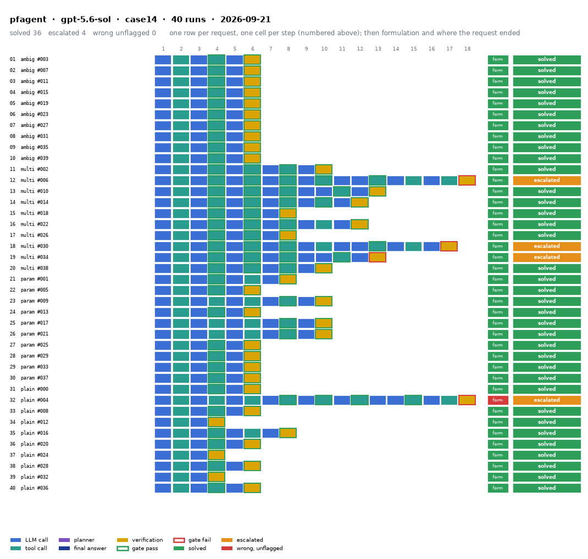

# pfagent on IEEE 14-bus with gpt-5.6-sol

Generated 2026-09-23 11:50 by benchmarks/postprocess.py from `report.rescored.json`. Runs: 40.

## Run

| field | value |
|---|---|
| date | 2026-09-21 |
| model | openrouter:openai/gpt-5.6-sol |
| method | pfagent |
| case | case14 |
| condition | normal |
| n | 40 |
| seed | 0 |
| k | 1 |
| max_rounds | 8 |
| tool_variant | load_split |
| plan_variant | text |
| temperature | 0.0 |
| system_prompt_hash | 7da5e2a37ec4 |
| source | results_validation_split_tool_launch/gpt-5.6-sol/pfagent/case14 |
| source_commit | 46e27b8 2026-09-22 Backfill GPT-5.4's missing B_mean-solved from its own frozen data |
| role_in_paper | main protocol table (Table 5 / S8); split-tool appendix, after side (set_active_load/set_load) |
| notes | Copied from benchmarks/results_* by scripts/migrate_paper_results.py; the date is the write time of the source report.json. |
| description | PFAgent: ReAct loop with no in-loop gate plus the task-level verification gate V1-V7 on the final answer (llm/engine.py verify_final_answer). The solver-grounded row. |
| prompt files | _shared/agent_system_prompt.txt, _shared/final_answer_instruction.txt |

One row per request, one cell per step (blue LLM call, teal tool call, purple planner, gold verification; green or red edge is the gate verdict), then formulation and where the request ended. Each run also has its own figure next to its traces: `traces/NN_<request>.png`.

## Where every request ended

The three outcomes are exclusive and sum to the run count. Escalation takes precedence: a run the method handed to a person is not an autonomous answer, right or wrong.

| outcome | count | share |
|---|---:|---:|
| Solved autonomously | 36 | 90.0% |
| Escalated to a person | 4 | 10.0% |
| Wrong, unflagged | 0 | 0.0% |
| **Total** | **40** | 100% |

## Metrics

| group | metric | value |
|---|---|---|
| Task utility | Formulation exact | 39/40 (97.5%) |
| Task utility | Formulation error types | extra_step: 1 |
| Task utility | Voltage MAE, all runs | 0 p.u. |
| Task utility | Voltage MAE, formulation-exact runs | 0 p.u. |
| Task utility | Flow MAE, all runs | 0 MW |
| Task utility | Flow MAE, formulation-exact runs | 0 MW |
| Task utility | KCL mismatch, mean | 0 MW |
| Solver-grounded correctness | Solved (computation right, any path) | 36/40 (90.0%) |
| Solver-grounded correctness | V-pass (all conditions, offline) | 40/40 (100.0%) |
| Reporting | Traceable answers | 40/40 (100.0%) |
| Reporting | Traceable numbers, mean share | 1 |
| Reporting | Stale state quoted | 0/40 |
| Cost and time | LLM calls / tool calls, mean | 4.08 / 3 |
| Cost and time | Prompt / completion tokens, mean | 17738 / 473 |
| Cost and time | Cost, total | n/a (no price for this model in pricing.json) |
| Cost and time | Wall time, mean | 13.6 s |

### Cross-check against the runner's own scoreboard

Values the runner aggregated for the same rows (report.json scoreboard). They should agree with the table above; a disagreement means the rows were filtered differently.

| metric | runner scoreboard | this report |
|---|---:|---:|
| solved_autonomously_count | 36 | 36 |
| escalated_count | 4 | 4 |
| wrong_silently_count | 0 | 0 |
| formulation_exact_count | 39 | 39 |
| v_pass_count | 40 | 40 |
| faithful_answers_count | 40 | 40 |
| n_items | 40 | 40 |

## By request difficulty

| difficulty | n | solved | escalated | wrong unflagged | formulation exact |
|---|---:|---:|---:|---:|---:|
| ambiguous | 10 | 10 | 0 | 0 | 10 |
| multistep | 10 | 7 | 3 | 0 | 10 |
| parameterized | 10 | 10 | 0 | 0 | 10 |
| plain | 10 | 9 | 1 | 0 | 9 |

## Escalated (4)

- `case14-multistep-006-s0` detected via text; formulation exact  ([narrative](traces/12_case14-multistep-006-s0.narrative.txt), [transcript](traces/12_case14-multistep-006-s0.transcript.txt))
- `case14-multistep-030-s0` detected via text; formulation exact  ([narrative](traces/18_case14-multistep-030-s0.narrative.txt), [transcript](traces/18_case14-multistep-030-s0.transcript.txt))
- `case14-multistep-034-s0` detected via text; formulation exact  ([narrative](traces/19_case14-multistep-034-s0.narrative.txt), [transcript](traces/19_case14-multistep-034-s0.transcript.txt))
- `case14-plain-004-s0` detected via text; formulation extra_step; unintended tools: ['disconnect_line', 'reconnect_line']  ([narrative](traces/32_case14-plain-004-s0.narrative.txt), [transcript](traces/32_case14-plain-004-s0.transcript.txt))

## Formulation not exact (1)

- `case14-plain-004-s0` extra_step: unintended tools: ['disconnect_line', 'reconnect_line']  ([narrative](traces/32_case14-plain-004-s0.narrative.txt), [transcript](traces/32_case14-plain-004-s0.transcript.txt))

## Files

- `summary.csv`: one line per run, the fields above plus tokens and time.
- `traces/NN_<request>.narrative.txt`: what happened in each run, step by step, with the verdicts.
- `traces/NN_<request>.transcript.txt`: the raw exchange, every message, tool call and tool output.
- `traces/NN_<request>.png`: the run as a picture: steps, gate verdicts, formulation, verification, outcome, with a two-line narrative.
- `overview.png`: all runs of this folder on one page.
- `traces/NN_<request>.json`: the raw trace the runner wrote.
- `raw/`: the runner's own outputs (report.json, rescored report, logs).
- `requests.jsonl`: the request set, with the intended tool calls that define formulation exactness.
