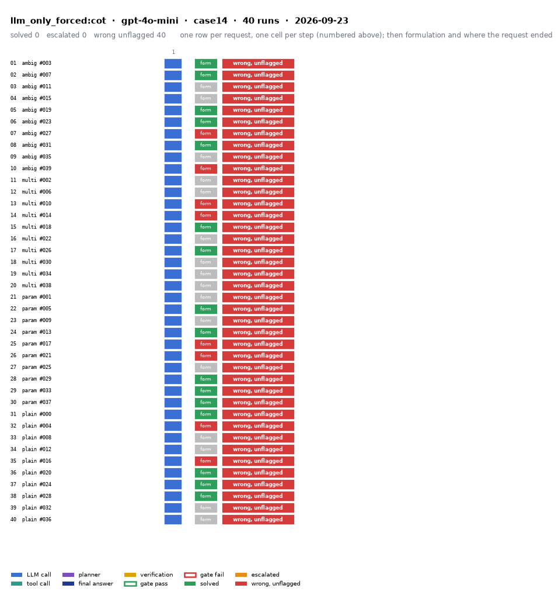

# llm_only_forced:cot on IEEE 14-bus with gpt-4o-mini

Generated 2026-09-24 20:49 by benchmarks/postprocess.py from `report.rescored.json`. Runs: 40.

## Run

| field | value |
|---|---|
| date | 2026-09-23 |
| model | openrouter:openai/gpt-4o-mini |
| method | llm_only_forced:cot |
| case | case14 |
| condition | normal |
| n | 40 |
| seed | 0 |
| k | 1 |
| max_rounds | 8 |
| tool_variant | load_split |
| plan_variant | text |
| temperature | 0.0 |
| system_prompt_hash | 650972f0de23 |
| description | Chain-of-thought LLM-only without the abstention clause: the model must report best-effort numbers. |
| prompt files | _shared/llm_only_system_prompt.txt, llm_only_forced_structured/escape_clause_removed.txt, llm_only_forced_structured/forced_replacement.txt, _shared/llm_only_user_template.txt, _shared/llm_only_bus_id_note.txt, _shared/cot_system_suffix.txt, llm_only_cot/reasoning_section.txt |

One row per request, one cell per step (blue LLM call, teal tool call, purple planner, gold verification; green or red edge is the gate verdict), then formulation and where the request ended. Each run also has its own figure next to its traces: `traces/NN_<request>.png`.

## Where every request ended

The three outcomes are exclusive and sum to the run count. Escalation takes precedence: a run the method handed to a person is not an autonomous answer, right or wrong.

| outcome | count | share |
|---|---:|---:|
| Solved autonomously | 0 | 0.0% |
| Escalated to a person | 0 | 0.0% |
| Wrong, unflagged | 40 | 100.0% |
| **Total** | **40** | 100% |

## Metrics

| group | metric | value |
|---|---|---|
| Task utility | Formulation exact | 16/24 (66.7%) |
| Task utility | Formulation error types | wrong_id: 4, invalid_value: 4 |
| Task utility | Voltage MAE, all runs | 0.0277 p.u. |
| Task utility | Voltage MAE, formulation-exact runs | 0.0273 p.u. |
| Task utility | Flow MAE, all runs | 35.1753 MW |
| Task utility | Flow MAE, formulation-exact runs | 35.5501 MW |
| Task utility | KCL mismatch, mean | 12.715 MW |
| Solver-grounded correctness | Solved (computation right, any path) | 0/40 (0.0%) |
| Solver-grounded correctness | V-pass (all conditions, offline) | 0/40 (0.0%) |
| Reporting | Traceable answers | 0/40 (0.0%) |
| Reporting | Traceable numbers, mean share | 0.093 |
| Reporting | Stale state quoted | 0/40 |
| Cost and time | LLM calls / tool calls, mean | 1 / 0 |
| Cost and time | Prompt / completion tokens, mean | 285 / 1267 |
| Cost and time | Cost, total | $0.0475 |
| Cost and time | Wall time, mean | 15 s |

### Cross-check against the runner's own scoreboard

Values the runner aggregated for the same rows (report.json scoreboard). They should agree with the table above; a disagreement means the rows were filtered differently.

| metric | runner scoreboard | this report |
|---|---:|---:|
| solved_autonomously_count | 0 | 0 |
| escalated_count | 0 | 0 |
| wrong_silently_count | 40 | 40 |
| formulation_exact_count | 16 | 16 |
| v_pass_count | 0 | 0 |
| faithful_answers_count | 0 | 0 |
| n_items | 40 | 40 |

## By request difficulty

| difficulty | n | solved | escalated | wrong unflagged | formulation exact |
|---|---:|---:|---:|---:|---:|
| ambiguous | 10 | 0 | 0 | 10 | 5 |
| multistep | 10 | 0 | 0 | 10 | 2 |
| parameterized | 10 | 0 | 0 | 10 | 5 |
| plain | 10 | 0 | 0 | 10 | 4 |

## Wrong and unflagged (40)

- `case14-ambiguous-003-s0` formulation exact; declared formulation:  ([narrative](traces/01_case14-ambiguous-003-s0.narrative.txt), [transcript](traces/01_case14-ambiguous-003-s0.transcript.txt))
- `case14-ambiguous-007-s0` formulation exact; declared formulation:  ([narrative](traces/02_case14-ambiguous-007-s0.narrative.txt), [transcript](traces/02_case14-ambiguous-007-s0.transcript.txt))
- `case14-ambiguous-011-s0` formulation unparsed; ValueError: json_parse_failed  ([narrative](traces/03_case14-ambiguous-011-s0.narrative.txt), [transcript](traces/03_case14-ambiguous-011-s0.transcript.txt))
- `case14-ambiguous-015-s0` formulation unparsed; ValueError: json_parse_failed  ([narrative](traces/04_case14-ambiguous-015-s0.narrative.txt), [transcript](traces/04_case14-ambiguous-015-s0.transcript.txt))
- `case14-ambiguous-019-s0` formulation exact; declared formulation:  ([narrative](traces/05_case14-ambiguous-019-s0.narrative.txt), [transcript](traces/05_case14-ambiguous-019-s0.transcript.txt))
- `case14-ambiguous-023-s0` formulation exact; declared formulation:  ([narrative](traces/06_case14-ambiguous-023-s0.narrative.txt), [transcript](traces/06_case14-ambiguous-023-s0.transcript.txt))
- `case14-ambiguous-027-s0` formulation wrong_id; declared formulation: modify_load: bus_id intended 11 != executed 10  ([narrative](traces/07_case14-ambiguous-027-s0.narrative.txt), [transcript](traces/07_case14-ambiguous-027-s0.transcript.txt))
- `case14-ambiguous-031-s0` formulation exact; declared formulation:  ([narrative](traces/08_case14-ambiguous-031-s0.narrative.txt), [transcript](traces/08_case14-ambiguous-031-s0.transcript.txt))
- `case14-ambiguous-035-s0` formulation unparsed; ValueError: json_parse_failed  ([narrative](traces/09_case14-ambiguous-035-s0.narrative.txt), [transcript](traces/09_case14-ambiguous-035-s0.transcript.txt))
- `case14-ambiguous-039-s0` formulation wrong_id; declared formulation: modify_load: bus_id intended 2 != executed 1  ([narrative](traces/10_case14-ambiguous-039-s0.narrative.txt), [transcript](traces/10_case14-ambiguous-039-s0.transcript.txt))
- `case14-multistep-002-s0` formulation unparsed; ValueError: json_parse_failed  ([narrative](traces/11_case14-multistep-002-s0.narrative.txt), [transcript](traces/11_case14-multistep-002-s0.transcript.txt))
- `case14-multistep-006-s0` formulation unparsed; ValueError: json_parse_failed  ([narrative](traces/12_case14-multistep-006-s0.narrative.txt), [transcript](traces/12_case14-multistep-006-s0.transcript.txt))
- `case14-multistep-010-s0` formulation wrong_id; declared formulation: disconnect_line: from_bus intended 2 != executed 1; disconnect_line: to_bus intended 5 != executed 2  ([narrative](traces/13_case14-multistep-010-s0.narrative.txt), [transcript](traces/13_case14-multistep-010-s0.transcript.txt))
- `case14-multistep-014-s0` formulation wrong_id; declared formulation: modify_load: bus_id intended 13 != executed 4; modify_load: p_mw intended 18.9 != executed 59.1  ([narrative](traces/14_case14-multistep-014-s0.narrative.txt), [transcript](traces/14_case14-multistep-014-s0.transcript.txt))
- `case14-multistep-018-s0` formulation exact; declared formulation:  ([narrative](traces/15_case14-multistep-018-s0.narrative.txt), [transcript](traces/15_case14-multistep-018-s0.transcript.txt))
- `case14-multistep-022-s0` formulation unparsed; ValueError: json_parse_failed  ([narrative](traces/16_case14-multistep-022-s0.narrative.txt), [transcript](traces/16_case14-multistep-022-s0.transcript.txt))
- `case14-multistep-026-s0` formulation exact; declared formulation:  ([narrative](traces/17_case14-multistep-026-s0.narrative.txt), [transcript](traces/17_case14-multistep-026-s0.transcript.txt))
- `case14-multistep-030-s0` formulation unparsed; ValueError: json_parse_failed  ([narrative](traces/18_case14-multistep-030-s0.narrative.txt), [transcript](traces/18_case14-multistep-030-s0.transcript.txt))
- `case14-multistep-034-s0` formulation unparsed; ValueError: json_parse_failed  ([narrative](traces/19_case14-multistep-034-s0.narrative.txt), [transcript](traces/19_case14-multistep-034-s0.transcript.txt))
- `case14-multistep-038-s0` formulation unparsed; ValueError: json_parse_failed  ([narrative](traces/20_case14-multistep-038-s0.narrative.txt), [transcript](traces/20_case14-multistep-038-s0.transcript.txt))
- `case14-parameterized-001-s0` formulation unparsed; ValueError: json_parse_failed  ([narrative](traces/21_case14-parameterized-001-s0.narrative.txt), [transcript](traces/21_case14-parameterized-001-s0.transcript.txt))
- `case14-parameterized-005-s0` formulation exact; declared formulation:  ([narrative](traces/22_case14-parameterized-005-s0.narrative.txt), [transcript](traces/22_case14-parameterized-005-s0.transcript.txt))
- `case14-parameterized-009-s0` formulation unparsed; ValueError: json_parse_failed  ([narrative](traces/23_case14-parameterized-009-s0.narrative.txt), [transcript](traces/23_case14-parameterized-009-s0.transcript.txt))
- `case14-parameterized-013-s0` formulation exact; declared formulation:  ([narrative](traces/24_case14-parameterized-013-s0.narrative.txt), [transcript](traces/24_case14-parameterized-013-s0.transcript.txt))
- `case14-parameterized-017-s0` formulation invalid_value; declared formulation: run_n1_contingency: criteria='max violations' not in ['max_violations', 'max_overload', 'min_voltage'] (tool falls back to its default); run_n1_contingency: max_candidates=14 scans only 14 of 20 branches, so the ranking is over a sample and not the network (request did not ask for it)  ([narrative](traces/25_case14-parameterized-017-s0.narrative.txt), [transcript](traces/25_case14-parameterized-017-s0.transcript.txt))
- `case14-parameterized-021-s0` formulation invalid_value; declared formulation: run_n1_contingency: criteria='max violations' not in ['max_violations', 'max_overload', 'min_voltage'] (tool falls back to its default); run_n1_contingency: max_candidates=10 scans only 10 of 20 branches, so the ranking is over a sample and not the network (request did not ask for it)  ([narrative](traces/26_case14-parameterized-021-s0.narrative.txt), [transcript](traces/26_case14-parameterized-021-s0.transcript.txt))
- `case14-parameterized-025-s0` formulation unparsed; ValueError: json_parse_failed  ([narrative](traces/27_case14-parameterized-025-s0.narrative.txt), [transcript](traces/27_case14-parameterized-025-s0.transcript.txt))
- `case14-parameterized-029-s0` formulation exact; declared formulation:  ([narrative](traces/28_case14-parameterized-029-s0.narrative.txt), [transcript](traces/28_case14-parameterized-029-s0.transcript.txt))
- `case14-parameterized-033-s0` formulation exact; declared formulation:  ([narrative](traces/29_case14-parameterized-033-s0.narrative.txt), [transcript](traces/29_case14-parameterized-033-s0.transcript.txt))
- `case14-parameterized-037-s0` formulation exact; declared formulation:  ([narrative](traces/30_case14-parameterized-037-s0.narrative.txt), [transcript](traces/30_case14-parameterized-037-s0.transcript.txt))
- `case14-plain-000-s0` formulation exact; declared formulation:  ([narrative](traces/31_case14-plain-000-s0.narrative.txt), [transcript](traces/31_case14-plain-000-s0.transcript.txt))
- `case14-plain-004-s0` formulation invalid_value; declared formulation: run_n1_contingency: criteria='worst' not in ['max_violations', 'max_overload', 'min_voltage'] (tool falls back to its default); run_n1_contingency: max_candidates=1 scans only 1 of 20 branches, so the ranking is over a sample and not the network (request did not ask for it)  ([narrative](traces/32_case14-plain-004-s0.narrative.txt), [transcript](traces/32_case14-plain-004-s0.transcript.txt))
- `case14-plain-008-s0` formulation unparsed; ValueError: json_parse_failed  ([narrative](traces/33_case14-plain-008-s0.narrative.txt), [transcript](traces/33_case14-plain-008-s0.transcript.txt))
- `case14-plain-012-s0` formulation unparsed; ValueError: json_parse_failed  ([narrative](traces/34_case14-plain-012-s0.narrative.txt), [transcript](traces/34_case14-plain-012-s0.transcript.txt))
- `case14-plain-016-s0` formulation invalid_value; declared formulation: run_n1_contingency: criteria='loading' not in ['max_violations', 'max_overload', 'min_voltage'] (tool falls back to its default); run_n1_contingency: max_candidates=1 scans only 1 of 20 branches, so the ranking is over a sample and not the network (request did not ask for it)  ([narrative](traces/35_case14-plain-016-s0.narrative.txt), [transcript](traces/35_case14-plain-016-s0.transcript.txt))
- `case14-plain-020-s0` formulation exact; declared formulation:  ([narrative](traces/36_case14-plain-020-s0.narrative.txt), [transcript](traces/36_case14-plain-020-s0.transcript.txt))
- `case14-plain-024-s0` formulation exact; declared formulation:  ([narrative](traces/37_case14-plain-024-s0.narrative.txt), [transcript](traces/37_case14-plain-024-s0.transcript.txt))
- `case14-plain-028-s0` formulation exact; declared formulation:  ([narrative](traces/38_case14-plain-028-s0.narrative.txt), [transcript](traces/38_case14-plain-028-s0.transcript.txt))
- `case14-plain-032-s0` formulation unparsed; ValueError: json_parse_failed  ([narrative](traces/39_case14-plain-032-s0.narrative.txt), [transcript](traces/39_case14-plain-032-s0.transcript.txt))
- `case14-plain-036-s0` formulation unparsed; ValueError: json_parse_failed  ([narrative](traces/40_case14-plain-036-s0.narrative.txt), [transcript](traces/40_case14-plain-036-s0.transcript.txt))

## Formulation not exact (8)

- `case14-ambiguous-027-s0` wrong_id: declared formulation: modify_load: bus_id intended 11 != executed 10  ([narrative](traces/07_case14-ambiguous-027-s0.narrative.txt), [transcript](traces/07_case14-ambiguous-027-s0.transcript.txt))
- `case14-ambiguous-039-s0` wrong_id: declared formulation: modify_load: bus_id intended 2 != executed 1  ([narrative](traces/10_case14-ambiguous-039-s0.narrative.txt), [transcript](traces/10_case14-ambiguous-039-s0.transcript.txt))
- `case14-multistep-010-s0` wrong_id: declared formulation: disconnect_line: from_bus intended 2 != executed 1; disconnect_line: to_bus intended 5 != executed 2  ([narrative](traces/13_case14-multistep-010-s0.narrative.txt), [transcript](traces/13_case14-multistep-010-s0.transcript.txt))
- `case14-multistep-014-s0` wrong_id: declared formulation: modify_load: bus_id intended 13 != executed 4; modify_load: p_mw intended 18.9 != executed 59.1  ([narrative](traces/14_case14-multistep-014-s0.narrative.txt), [transcript](traces/14_case14-multistep-014-s0.transcript.txt))
- `case14-parameterized-017-s0` invalid_value: declared formulation: run_n1_contingency: criteria='max violations' not in ['max_violations', 'max_overload', 'min_voltage'] (tool falls back to its default); run_n1_contingency: max_candidates=14 scans only 14 of 20 branches, so the ranking is over a sample and not the network (request did not ask for it)  ([narrative](traces/25_case14-parameterized-017-s0.narrative.txt), [transcript](traces/25_case14-parameterized-017-s0.transcript.txt))
- `case14-parameterized-021-s0` invalid_value: declared formulation: run_n1_contingency: criteria='max violations' not in ['max_violations', 'max_overload', 'min_voltage'] (tool falls back to its default); run_n1_contingency: max_candidates=10 scans only 10 of 20 branches, so the ranking is over a sample and not the network (request did not ask for it)  ([narrative](traces/26_case14-parameterized-021-s0.narrative.txt), [transcript](traces/26_case14-parameterized-021-s0.transcript.txt))
- `case14-plain-004-s0` invalid_value: declared formulation: run_n1_contingency: criteria='worst' not in ['max_violations', 'max_overload', 'min_voltage'] (tool falls back to its default); run_n1_contingency: max_candidates=1 scans only 1 of 20 branches, so the ranking is over a sample and not the network (request did not ask for it)  ([narrative](traces/32_case14-plain-004-s0.narrative.txt), [transcript](traces/32_case14-plain-004-s0.transcript.txt))
- `case14-plain-016-s0` invalid_value: declared formulation: run_n1_contingency: criteria='loading' not in ['max_violations', 'max_overload', 'min_voltage'] (tool falls back to its default); run_n1_contingency: max_candidates=1 scans only 1 of 20 branches, so the ranking is over a sample and not the network (request did not ask for it)  ([narrative](traces/35_case14-plain-016-s0.narrative.txt), [transcript](traces/35_case14-plain-016-s0.transcript.txt))

## Untraceable numbers in the answer (40)

- `case14-ambiguous-003-s0` 61 of 61 numbers; values ['1.06', '0.0', '1.045', '-0.5', '1.01', '-1.0', '1.0', '-2.0', '1.0', '-3.0', '1.07', '-4.0', '1.0', '-5.0', '1.09', '-6.0', '1.0', '-7.0', '1.0', '-8.0']  ([narrative](traces/01_case14-ambiguous-003-s0.narrative.txt), [transcript](traces/01_case14-ambiguous-003-s0.transcript.txt))
- `case14-ambiguous-007-s0` 52 of 61 numbers; values ['1.06', '0.0', '1.045', '-0.5', '1.01', '-1.0', '-2.0', '-3.0', '1.07', '-4.0', '-5.0', '1.09', '-6.0', '-7.0', '-8.0', '-9.0', '-10.0', '-11.0', '-12.0', '0.0']  ([narrative](traces/02_case14-ambiguous-007-s0.narrative.txt), [transcript](traces/02_case14-ambiguous-007-s0.transcript.txt))
- `case14-ambiguous-011-s0` 73 of 73 numbers; values ['14.7 MW', '14.7', '1.06', '0.0', '1.045', '-4.0', '1.01', '-6.0', '1.0', '-8.0', '1.0', '-10.0', '1.07', '-5.0', '1.0', '-7.0', '1.09', '-3.0', '1.0', '-9.0']  ([narrative](traces/03_case14-ambiguous-011-s0.narrative.txt), [transcript](traces/03_case14-ambiguous-011-s0.transcript.txt))
- `case14-ambiguous-015-s0` 70 of 75 numbers; values ['1.06', '0.0', '1.045', '-4.0', '1.01', '-6.0', '1.0', '-8.0', '1.0', '-10.0', '1.07', '-12.0', '1.0', '-14.0', '1.09', '-16.0', '1.0', '-18.0', '1.0', '-20.0']  ([narrative](traces/04_case14-ambiguous-015-s0.narrative.txt), [transcript](traces/04_case14-ambiguous-015-s0.transcript.txt))
- `case14-ambiguous-019-s0` 53 of 62 numbers; values ['0.95', '1.05 p.u.', '100%', '1.06', '0.0', '1.045', '-0.5', '1.01', '-1.0', '-2.0', '-3.0', '1.07', '-4.0', '-5.0', '1.09', '-6.0', '-7.0', '-8.0', '-9.0', '-10.0']  ([narrative](traces/05_case14-ambiguous-019-s0.narrative.txt), [transcript](traces/05_case14-ambiguous-019-s0.transcript.txt))
- `case14-ambiguous-023-s0` 53 of 63 numbers; values ['1.06', '0.0', '1.045', '-2.0', '1.01', '-4.0', '1.02', '-5.0', '-6.0', '1.07', '-7.0', '-8.0', '1.09', '-9.0', '-10.0', '-11.0', '-12.0', '-13.0', '-14.0', '-15.0']  ([narrative](traces/06_case14-ambiguous-023-s0.narrative.txt), [transcript](traces/06_case14-ambiguous-023-s0.transcript.txt))
- `case14-ambiguous-027-s0` 33 of 64 numbers; values ['1.06', '1.045', '-4.0', '1.01', '-6.0', '1.0', '-8.0', '1.0', '-10.0', '1.07', '-12.0', '1.0', '-14.0', '1.09', '-16.0', '1.0', '-18.0', '1.0', '-20.0', '1.0']  ([narrative](traces/07_case14-ambiguous-027-s0.narrative.txt), [transcript](traces/07_case14-ambiguous-027-s0.transcript.txt))
- `case14-ambiguous-031-s0` 61 of 61 numbers; values ['1.06', '0.0', '1.045', '-2.0', '1.01', '-4.0', '1.0', '-6.0', '1.0', '-8.0', '1.07', '-10.0', '1.0', '-12.0', '1.09', '-14.0', '1.0', '-16.0', '1.0', '-18.0']  ([narrative](traces/08_case14-ambiguous-031-s0.narrative.txt), [transcript](traces/08_case14-ambiguous-031-s0.transcript.txt))
- `case14-ambiguous-035-s0` 69 of 74 numbers; values ['8.212783 MW', '1.06', '0.0', '1.045', '-2.0', '1.01', '-5.0', '1.0', '-7.0', '1.0', '-8.0', '1.07', '-3.0', '1.0', '-4.0', '1.09', '-2.0', '1.0', '-6.0', '1.0']  ([narrative](traces/09_case14-ambiguous-035-s0.narrative.txt), [transcript](traces/09_case14-ambiguous-035-s0.transcript.txt))
- `case14-ambiguous-039-s0` 19 of 64 numbers; values ['1.06', '1.045', '-4.0', '1.01', '-8.0', '-12.0', '-15.0', '1.07', '-10.0', '-20.0', '1.09', '-18.0', '-25.0', '-30.0', '-35.0', '-40.0', '-45.0', '-50.0', '38.806323']  ([narrative](traces/10_case14-ambiguous-039-s0.narrative.txt), [transcript](traces/10_case14-ambiguous-039-s0.transcript.txt))
- `case14-multistep-002-s0` 76 of 77 numbers; values ['0.95', '1.05 p.u.', '1.06', '0.0', '1.045', '-4.0', '1.01', '-6.0', '1.0', '-8.0', '1.0', '-10.0', '1.07', '-12.0', '1.0', '-14.0', '1.09', '-16.0', '1.0', '-18.0']  ([narrative](traces/11_case14-multistep-002-s0.narrative.txt), [transcript](traces/11_case14-multistep-002-s0.transcript.txt))
- `case14-multistep-006-s0` 77 of 80 numbers; values ['0.95', '1.05 p.u.', '100%', '46.782084 MW', '1.06', '0.0', '1.045', '-2.0', '1.01', '-5.0', '1.0', '-10.0', '1.0', '-15.0', '1.07', '-8.0', '1.0', '-12.0', '1.09', '-6.0']  ([narrative](traces/12_case14-multistep-006-s0.narrative.txt), [transcript](traces/12_case14-multistep-006-s0.transcript.txt))
- `case14-multistep-010-s0` 52 of 61 numbers; values ['1.06', '0.0', '1.045', '-2.0', '1.01', '-4.0', '-6.0', '-8.0', '1.07', '-10.0', '-12.0', '1.09', '-14.0', '-16.0', '-18.0', '-20.0', '-22.0', '-24.0', '-26.0', '0.0']  ([narrative](traces/13_case14-multistep-010-s0.narrative.txt), [transcript](traces/13_case14-multistep-010-s0.transcript.txt))
- `case14-multistep-014-s0` 61 of 70 numbers; values ['1.06', '0.0', '1.045', '-2.0', '1.01', '-4.0', '1.0', '-6.0', '1.0', '-8.0', '1.07', '-10.0', '1.0', '-12.0', '1.09', '-14.0', '1.0', '-16.0', '1.0', '-18.0']  ([narrative](traces/14_case14-multistep-014-s0.narrative.txt), [transcript](traces/14_case14-multistep-014-s0.transcript.txt))
- `case14-multistep-018-s0` 59 of 61 numbers; values ['1.06', '0.0', '1.045', '-2.0', '1.01', '-4.0', '1.0', '-6.0', '1.0', '-8.0', '1.07', '-10.0', '1.0', '-12.0', '1.09', '-14.0', '1.0', '-16.0', '1.0', '-18.0']  ([narrative](traces/15_case14-multistep-018-s0.narrative.txt), [transcript](traces/15_case14-multistep-018-s0.transcript.txt))
- `case14-multistep-022-s0` 69 of 83 numbers; values ['0.95', '1.05 p.u.', '100%', '97.724754 MW', '51.811285 MW', '1.06', '0.0', '1.045', '-2.0', '1.01', '-5.0', '1.02', '-3.0', '1.015', '-1.0', '1.07', '2.0', '0.0', '1.09', '0.0']  ([narrative](traces/16_case14-multistep-022-s0.narrative.txt), [transcript](traces/16_case14-multistep-022-s0.transcript.txt))
- `case14-multistep-026-s0` 61 of 61 numbers; values ['1.06', '0.0', '1.025', '-5.0', '1.01', '-10.0', '0.98', '-15.0', '1.02', '-2.0', '1.07', '5.0', '1.0', '0.0', '1.09', '10.0', '1.0', '0.0', '1.0', '0.0']  ([narrative](traces/17_case14-multistep-026-s0.narrative.txt), [transcript](traces/17_case14-multistep-026-s0.transcript.txt))
- `case14-multistep-030-s0` 64 of 77 numbers; values ['0.95', '1.05 p.u.', '100%', '1.06', '0.0', '1.045', '-2.0', '1.01', '-3.0', '1.02', '-4.0', '-5.0', '1.07', '-6.0', '-7.0', '1.09', '-8.0', '-9.0', '-10.0', '-11.0']  ([narrative](traces/18_case14-multistep-030-s0.narrative.txt), [transcript](traces/18_case14-multistep-030-s0.transcript.txt))
- `case14-multistep-034-s0` 71 of 74 numbers; values ['29.953880 MW', '1.06', '0.0', '1.045', '-2.0', '1.01', '-4.0', '1.0', '-6.0', '1.0', '-8.0', '1.07', '-10.0', '1.0', '-12.0', '1.09', '-14.0', '1.0', '-16.0', '1.0']  ([narrative](traces/19_case14-multistep-034-s0.narrative.txt), [transcript](traces/19_case14-multistep-034-s0.transcript.txt))
- `case14-multistep-038-s0` 67 of 75 numbers; values ['1.06', '0.0', '1.045', '-4.0', '1.01', '-6.0', '0.98', '-8.0', '1.0', '-5.0', '1.07', '-2.0', '1.0', '0.0', '1.09', '1.0', '1.0', '0.0', '1.0', '0.0']  ([narrative](traces/20_case14-multistep-038-s0.narrative.txt), [transcript](traces/20_case14-multistep-038-s0.transcript.txt))
- `case14-parameterized-001-s0` 65 of 74 numbers; values ['1.06', '0.0', '1.045', '-4.0', '1.01', '-12.0', '-15.0', '-20.0', '1.07', '-10.0', '-25.0', '1.09', '-5.0', '-30.0', '-35.0', '-40.0', '-45.0', '-50.0', '-55.0', '0.0']  ([narrative](traces/21_case14-parameterized-001-s0.narrative.txt), [transcript](traces/21_case14-parameterized-001-s0.transcript.txt))
- `case14-parameterized-005-s0` 61 of 61 numbers; values ['1.06', '0.0', '1.045', '-0.5', '1.01', '-1.0', '1.0', '-2.0', '1.0', '-3.0', '1.07', '-4.0', '1.0', '-5.0', '1.09', '-6.0', '1.0', '-7.0', '1.0', '-8.0']  ([narrative](traces/22_case14-parameterized-005-s0.narrative.txt), [transcript](traces/22_case14-parameterized-005-s0.transcript.txt))
- `case14-parameterized-009-s0` 66 of 77 numbers; values ['0.95 p.u.', '1.05 p.u.', '100%', '1.06', '0.0', '1.045', '-2.0', '1.01', '-4.0', '-6.0', '-8.0', '1.07', '-10.0', '-12.0', '1.09', '-14.0', '-16.0', '-18.0', '-20.0', '-22.0']  ([narrative](traces/23_case14-parameterized-009-s0.narrative.txt), [transcript](traces/23_case14-parameterized-009-s0.transcript.txt))
- `case14-parameterized-013-s0` 59 of 59 numbers; values ['1.06', '0.0', '1.045', '-0.0', '1.01', '-0.0', '1.0', '-0.0', '1.0', '-0.0', '1.07', '-0.0', '1.0', '-0.0', '1.09', '-0.0', '1.0', '-0.0', '1.0', '-0.0']  ([narrative](traces/24_case14-parameterized-013-s0.narrative.txt), [transcript](traces/24_case14-parameterized-013-s0.transcript.txt))
- `case14-parameterized-017-s0` 52 of 61 numbers; values ['1.06', '0.0', '1.045', '-4.0', '1.01', '-6.0', '-8.0', '-10.0', '1.07', '-12.0', '-14.0', '1.09', '-16.0', '-18.0', '-20.0', '-22.0', '-24.0', '-26.0', '-28.0', '0.0']  ([narrative](traces/25_case14-parameterized-017-s0.narrative.txt), [transcript](traces/25_case14-parameterized-017-s0.transcript.txt))
- `case14-parameterized-021-s0` 52 of 61 numbers; values ['1.06', '0.0', '1.045', '-2.0', '1.01', '-4.0', '-6.0', '-8.0', '1.07', '-10.0', '-12.0', '1.09', '-14.0', '-16.0', '-18.0', '-20.0', '-22.0', '-24.0', '-26.0', '0.0']  ([narrative](traces/26_case14-parameterized-021-s0.narrative.txt), [transcript](traces/26_case14-parameterized-021-s0.transcript.txt))
- `case14-parameterized-025-s0` 68 of 69 numbers; values ['1.06', '0.0', '1.045', '-0.5', '1.01', '-1.0', '1.0', '-2.0', '1.0', '-3.0', '1.07', '-4.0', '1.0', '-5.0', '1.09', '-6.0', '1.0', '-7.0', '1.0', '-8.0']  ([narrative](traces/27_case14-parameterized-025-s0.narrative.txt), [transcript](traces/27_case14-parameterized-025-s0.transcript.txt))
- `case14-parameterized-029-s0` 59 of 59 numbers; values ['1.06', '0.0', '1.045', '-2.0', '1.01', '-4.0', '1.0', '-6.0', '1.0', '-8.0', '1.07', '-10.0', '1.0', '-12.0', '1.09', '-14.0', '1.0', '-16.0', '1.0', '-18.0']  ([narrative](traces/28_case14-parameterized-029-s0.narrative.txt), [transcript](traces/28_case14-parameterized-029-s0.transcript.txt))
- `case14-parameterized-033-s0` 60 of 64 numbers; values ['1.06', '0.0', '1.045', '-4.0', '1.01', '-6.0', '1.0', '-8.0', '1.0', '-10.0', '1.07', '-12.0', '1.0', '-14.0', '1.09', '-16.0', '1.0', '-18.0', '1.0', '-20.0']  ([narrative](traces/29_case14-parameterized-033-s0.narrative.txt), [transcript](traces/29_case14-parameterized-033-s0.transcript.txt))
- `case14-parameterized-037-s0` 63 of 65 numbers; values ['0.95', '1.05 p.u.', '1.06', '0.0', '1.045', '-2.0', '1.01', '-4.0', '1.0', '-6.0', '1.0', '-8.0', '1.07', '-10.0', '1.0', '-12.0', '1.09', '-14.0', '1.0', '-16.0']  ([narrative](traces/30_case14-parameterized-037-s0.narrative.txt), [transcript](traces/30_case14-parameterized-037-s0.transcript.txt))
- `case14-plain-000-s0` 59 of 59 numbers; values ['1.06', '0.0', '1.045', '-2.0', '1.01', '-4.0', '1.0', '-6.0', '1.0', '-8.0', '1.07', '-10.0', '1.0', '-12.0', '1.09', '-14.0', '1.0', '-16.0', '1.0', '-18.0']  ([narrative](traces/31_case14-plain-000-s0.narrative.txt), [transcript](traces/31_case14-plain-000-s0.transcript.txt))
- `case14-plain-004-s0` 53 of 62 numbers; values ['0%', '1.06', '0.0', '1.045', '-0.5', '1.01', '-1.0', '-2.0', '-3.0', '1.07', '-4.0', '-5.0', '1.09', '-6.0', '-7.0', '-8.0', '-9.0', '-10.0', '-11.0', '-12.0']  ([narrative](traces/32_case14-plain-004-s0.narrative.txt), [transcript](traces/32_case14-plain-004-s0.transcript.txt))
- `case14-plain-008-s0` 70 of 74 numbers; values ['20.917473 MW', '1.06', '0.0', '1.045', '-2.0', '1.01', '-4.0', '1.0', '-6.0', '1.0', '-8.0', '1.07', '-10.0', '1.0', '-12.0', '1.09', '-14.0', '1.0', '-16.0', '1.0']  ([narrative](traces/33_case14-plain-008-s0.narrative.txt), [transcript](traces/33_case14-plain-008-s0.transcript.txt))
- `case14-plain-012-s0` 74 of 74 numbers; values ['0.95', '1.05 p.u.', '100%', '1.06', '0.0', '1.045', '-2.0', '1.01', '-4.0', '1.0', '-6.0', '1.0', '-8.0', '1.07', '-10.0', '1.0', '-12.0', '1.09', '-14.0', '1.0']  ([narrative](traces/34_case14-plain-012-s0.narrative.txt), [transcript](traces/34_case14-plain-012-s0.transcript.txt))
- `case14-plain-016-s0` 54 of 64 numbers; values ['0.95', '1.05 p.u.', '100%', '1.06', '0.0', '1.045', '-4.0', '1.01', '-6.0', '-8.0', '-10.0', '1.07', '-12.0', '-14.0', '1.09', '-16.0', '-18.0', '-20.0', '-22.0', '-24.0']  ([narrative](traces/35_case14-plain-016-s0.narrative.txt), [transcript](traces/35_case14-plain-016-s0.transcript.txt))
- `case14-plain-020-s0` 62 of 62 numbers; values ['100 MVA', '1.06', '0.0', '1.045', '-4.0', '1.01', '-12.0', '1.0', '-15.0', '1.0', '-20.0', '1.07', '-10.0', '1.0', '-25.0', '1.09', '-5.0', '1.0', '-30.0', '1.0']  ([narrative](traces/36_case14-plain-020-s0.narrative.txt), [transcript](traces/36_case14-plain-020-s0.transcript.txt))
- `case14-plain-024-s0` 61 of 61 numbers; values ['1.06', '0.0', '1.045', '-4.0', '1.01', '-8.0', '1.0', '-12.0', '1.0', '-15.0', '1.07', '-10.0', '1.0', '-20.0', '1.09', '-18.0', '1.0', '-25.0', '1.0', '-30.0']  ([narrative](traces/37_case14-plain-024-s0.narrative.txt), [transcript](traces/37_case14-plain-024-s0.transcript.txt))
- `case14-plain-028-s0` 62 of 62 numbers; values ['0.95', '1.05 p.u.', '100%', '1.06', '0.0', '1.045', '-2.0', '1.01', '-4.0', '1.0', '-6.0', '1.0', '-8.0', '1.07', '-10.0', '1.0', '-12.0', '1.09', '-14.0', '1.0']  ([narrative](traces/38_case14-plain-028-s0.narrative.txt), [transcript](traces/38_case14-plain-028-s0.transcript.txt))
- `case14-plain-032-s0` 76 of 77 numbers; values ['0.95', '1.05 p.u.', '100%', '1.06', '0.0', '1.045', '-2.0', '1.01', '-4.0', '1.0', '-6.0', '1.0', '-8.0', '1.07', '-10.0', '1.0', '-12.0', '1.09', '-14.0', '1.0']  ([narrative](traces/39_case14-plain-032-s0.narrative.txt), [transcript](traces/39_case14-plain-032-s0.transcript.txt))
- `case14-plain-036-s0` 71 of 75 numbers; values ['21.133138 MW', '1.06', '0.0', '1.045', '-2.0', '1.01', '-4.0', '1.0', '-6.0', '1.0', '-8.0', '1.07', '-10.0', '1.0', '-12.0', '1.09', '-14.0', '1.0', '-16.0', '1.0']  ([narrative](traces/40_case14-plain-036-s0.narrative.txt), [transcript](traces/40_case14-plain-036-s0.transcript.txt))

## Run errors (16)

- `case14-ambiguous-011-s0` ValueError: json_parse_failed  ([narrative](traces/03_case14-ambiguous-011-s0.narrative.txt), [transcript](traces/03_case14-ambiguous-011-s0.transcript.txt))
- `case14-ambiguous-015-s0` ValueError: json_parse_failed  ([narrative](traces/04_case14-ambiguous-015-s0.narrative.txt), [transcript](traces/04_case14-ambiguous-015-s0.transcript.txt))
- `case14-ambiguous-035-s0` ValueError: json_parse_failed  ([narrative](traces/09_case14-ambiguous-035-s0.narrative.txt), [transcript](traces/09_case14-ambiguous-035-s0.transcript.txt))
- `case14-multistep-002-s0` ValueError: json_parse_failed  ([narrative](traces/11_case14-multistep-002-s0.narrative.txt), [transcript](traces/11_case14-multistep-002-s0.transcript.txt))
- `case14-multistep-006-s0` ValueError: json_parse_failed  ([narrative](traces/12_case14-multistep-006-s0.narrative.txt), [transcript](traces/12_case14-multistep-006-s0.transcript.txt))
- `case14-multistep-022-s0` ValueError: json_parse_failed  ([narrative](traces/16_case14-multistep-022-s0.narrative.txt), [transcript](traces/16_case14-multistep-022-s0.transcript.txt))
- `case14-multistep-030-s0` ValueError: json_parse_failed  ([narrative](traces/18_case14-multistep-030-s0.narrative.txt), [transcript](traces/18_case14-multistep-030-s0.transcript.txt))
- `case14-multistep-034-s0` ValueError: json_parse_failed  ([narrative](traces/19_case14-multistep-034-s0.narrative.txt), [transcript](traces/19_case14-multistep-034-s0.transcript.txt))
- `case14-multistep-038-s0` ValueError: json_parse_failed  ([narrative](traces/20_case14-multistep-038-s0.narrative.txt), [transcript](traces/20_case14-multistep-038-s0.transcript.txt))
- `case14-parameterized-001-s0` ValueError: json_parse_failed  ([narrative](traces/21_case14-parameterized-001-s0.narrative.txt), [transcript](traces/21_case14-parameterized-001-s0.transcript.txt))
- `case14-parameterized-009-s0` ValueError: json_parse_failed  ([narrative](traces/23_case14-parameterized-009-s0.narrative.txt), [transcript](traces/23_case14-parameterized-009-s0.transcript.txt))
- `case14-parameterized-025-s0` ValueError: json_parse_failed  ([narrative](traces/27_case14-parameterized-025-s0.narrative.txt), [transcript](traces/27_case14-parameterized-025-s0.transcript.txt))
- `case14-plain-008-s0` ValueError: json_parse_failed  ([narrative](traces/33_case14-plain-008-s0.narrative.txt), [transcript](traces/33_case14-plain-008-s0.transcript.txt))
- `case14-plain-012-s0` ValueError: json_parse_failed  ([narrative](traces/34_case14-plain-012-s0.narrative.txt), [transcript](traces/34_case14-plain-012-s0.transcript.txt))
- `case14-plain-032-s0` ValueError: json_parse_failed  ([narrative](traces/39_case14-plain-032-s0.narrative.txt), [transcript](traces/39_case14-plain-032-s0.transcript.txt))
- `case14-plain-036-s0` ValueError: json_parse_failed  ([narrative](traces/40_case14-plain-036-s0.narrative.txt), [transcript](traces/40_case14-plain-036-s0.transcript.txt))

## Files

- `summary.csv`: one line per run, the fields above plus tokens and time.
- `traces/NN_<request>.narrative.txt`: what happened in each run, step by step, with the verdicts.
- `traces/NN_<request>.transcript.txt`: the raw exchange, every message, tool call and tool output.
- `traces/NN_<request>.png`: the run as a picture: steps, gate verdicts, formulation, verification, outcome, with a two-line narrative.
- `overview.png`: all runs of this folder on one page.
- `traces/NN_<request>.json`: the raw trace the runner wrote.
- `raw/`: the runner's own outputs (report.json, rescored report, logs).
- `requests.jsonl`: the request set, with the intended tool calls that define formulation exactness.
