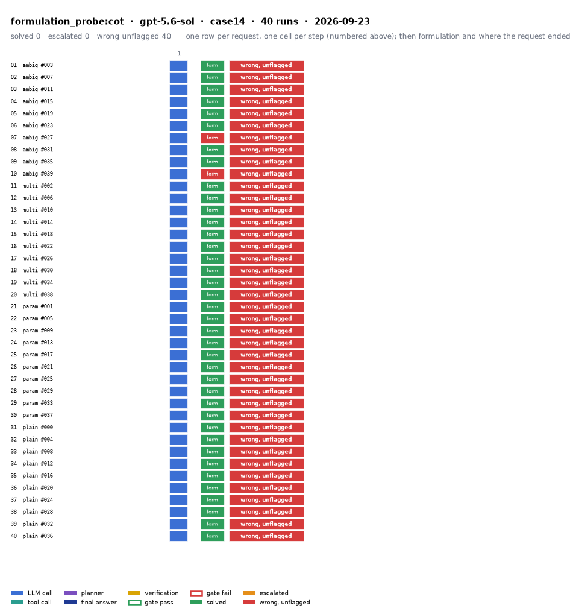

# formulation_probe:cot on IEEE 14-bus with gpt-5.6-sol

Generated 2026-09-24 20:55 by benchmarks/postprocess.py from `report.rescored.json`. Runs: 40.

## Run

| field | value |
|---|---|
| date | 2026-09-23 |
| model | openrouter:openai/gpt-5.6-sol |
| method | formulation_probe:cot |
| case | case14 |
| condition | normal |
| n | 40 |
| seed | 0 |
| k | 1 |
| max_rounds | 8 |
| tool_variant | load_split |
| plan_variant | text |
| temperature | 0.0 |
| system_prompt_hash | ecf6dde0930c |
| description | Same case tables and request as llm_only:cot, but the only output is the declared formulation (the ordered solver operations the request needs). Fills the Formulation cell of the prompting rows without changing how those rows answer. Reasons step by step first. |
| prompt files | _shared/formulation_probe_system_prompt.txt, _shared/formulation_probe_section.txt, _shared/formulation_probe_output_section.txt, _shared/llm_only_user_template.txt, _shared/cot_system_suffix.txt, llm_only_cot/reasoning_section.txt |

> **Formulation probe.** This companion run asks the model only for the declared formulation of each request, never for numbers. Only the Formulation metrics below are meaningful; the outcome, error, and reporting rows are not, since no answer was requested.

One row per request, one cell per step (blue LLM call, teal tool call, purple planner, gold verification; green or red edge is the gate verdict), then formulation and where the request ended. Each run also has its own figure next to its traces: `traces/NN_<request>.png`.

## Where every request ended

The three outcomes are exclusive and sum to the run count. Escalation takes precedence: a run the method handed to a person is not an autonomous answer, right or wrong.

| outcome | count | share |
|---|---:|---:|
| Solved autonomously | 0 | 0.0% |
| Escalated to a person | 0 | 0.0% |
| Wrong, unflagged | 40 | 100.0% |
| **Total** | **40** | 100% |

## Metrics

| group | metric | value |
|---|---|---|
| Task utility | Formulation exact | 38/40 (95.0%) |
| Task utility | Formulation error types | wrong_id: 2 |
| Task utility | Voltage MAE, all runs | n/a p.u. |
| Task utility | Voltage MAE, formulation-exact runs | n/a p.u. |
| Task utility | Flow MAE, all runs | n/a MW |
| Task utility | Flow MAE, formulation-exact runs | n/a MW |
| Task utility | KCL mismatch, mean | n/a MW |
| Solver-grounded correctness | Solved (computation right, any path) | 0/40 (0.0%) |
| Solver-grounded correctness | V-pass (all conditions, offline) | 39/40 (97.5%) |
| Reporting | Traceable answers | 39/40 (97.5%) |
| Reporting | Traceable numbers, mean share | 0.929 |
| Reporting | Stale state quoted | 0/40 |
| Cost and time | LLM calls / tool calls, mean | 1 / 0 |
| Cost and time | Prompt / completion tokens, mean | 2462 / 198 |
| Cost and time | Cost, total | $0.2762 |
| Cost and time | Wall time, mean | 3.6 s |

### Cross-check against the runner's own scoreboard

Values the runner aggregated for the same rows (report.json scoreboard). They should agree with the table above; a disagreement means the rows were filtered differently.

| metric | runner scoreboard | this report |
|---|---:|---:|
| solved_autonomously_count | 0 | 0 |
| escalated_count | 0 | 0 |
| wrong_silently_count | 40 | 40 |
| formulation_exact_count | 38 | 38 |
| v_pass_count | 39 | 39 |
| faithful_answers_count | 39 | 39 |
| n_items | 40 | 40 |

## By request difficulty

| difficulty | n | solved | escalated | wrong unflagged | formulation exact |
|---|---:|---:|---:|---:|---:|
| ambiguous | 10 | 0 | 0 | 10 | 8 |
| multistep | 10 | 0 | 0 | 10 | 10 |
| parameterized | 10 | 0 | 0 | 10 | 10 |
| plain | 10 | 0 | 0 | 10 | 10 |

## Wrong and unflagged (40)

- `case14-ambiguous-003-s0` formulation exact; declared formulation:  ([narrative](traces/01_case14-ambiguous-003-s0.narrative.txt), [transcript](traces/01_case14-ambiguous-003-s0.transcript.txt))
- `case14-ambiguous-007-s0` formulation exact; declared formulation:  ([narrative](traces/02_case14-ambiguous-007-s0.narrative.txt), [transcript](traces/02_case14-ambiguous-007-s0.transcript.txt))
- `case14-ambiguous-011-s0` formulation exact; declared formulation:  ([narrative](traces/03_case14-ambiguous-011-s0.narrative.txt), [transcript](traces/03_case14-ambiguous-011-s0.transcript.txt))
- `case14-ambiguous-015-s0` formulation exact; declared formulation:  ([narrative](traces/04_case14-ambiguous-015-s0.narrative.txt), [transcript](traces/04_case14-ambiguous-015-s0.transcript.txt))
- `case14-ambiguous-019-s0` formulation exact; declared formulation:  ([narrative](traces/05_case14-ambiguous-019-s0.narrative.txt), [transcript](traces/05_case14-ambiguous-019-s0.transcript.txt))
- `case14-ambiguous-023-s0` formulation exact; declared formulation:  ([narrative](traces/06_case14-ambiguous-023-s0.narrative.txt), [transcript](traces/06_case14-ambiguous-023-s0.transcript.txt))
- `case14-ambiguous-027-s0` formulation wrong_id; declared formulation: modify_load: bus_id intended 11 != executed 10  ([narrative](traces/07_case14-ambiguous-027-s0.narrative.txt), [transcript](traces/07_case14-ambiguous-027-s0.transcript.txt))
- `case14-ambiguous-031-s0` formulation exact; declared formulation:  ([narrative](traces/08_case14-ambiguous-031-s0.narrative.txt), [transcript](traces/08_case14-ambiguous-031-s0.transcript.txt))
- `case14-ambiguous-035-s0` formulation exact; declared formulation:  ([narrative](traces/09_case14-ambiguous-035-s0.narrative.txt), [transcript](traces/09_case14-ambiguous-035-s0.transcript.txt))
- `case14-ambiguous-039-s0` formulation wrong_id; declared formulation: modify_load: bus_id intended 2 != executed 1  ([narrative](traces/10_case14-ambiguous-039-s0.narrative.txt), [transcript](traces/10_case14-ambiguous-039-s0.transcript.txt))
- `case14-multistep-002-s0` formulation exact; declared formulation:  ([narrative](traces/11_case14-multistep-002-s0.narrative.txt), [transcript](traces/11_case14-multistep-002-s0.transcript.txt))
- `case14-multistep-006-s0` formulation exact; declared formulation:  ([narrative](traces/12_case14-multistep-006-s0.narrative.txt), [transcript](traces/12_case14-multistep-006-s0.transcript.txt))
- `case14-multistep-010-s0` formulation exact; declared formulation:  ([narrative](traces/13_case14-multistep-010-s0.narrative.txt), [transcript](traces/13_case14-multistep-010-s0.transcript.txt))
- `case14-multistep-014-s0` formulation exact; declared formulation:  ([narrative](traces/14_case14-multistep-014-s0.narrative.txt), [transcript](traces/14_case14-multistep-014-s0.transcript.txt))
- `case14-multistep-018-s0` formulation exact; declared formulation:  ([narrative](traces/15_case14-multistep-018-s0.narrative.txt), [transcript](traces/15_case14-multistep-018-s0.transcript.txt))
- `case14-multistep-022-s0` formulation exact; declared formulation:  ([narrative](traces/16_case14-multistep-022-s0.narrative.txt), [transcript](traces/16_case14-multistep-022-s0.transcript.txt))
- `case14-multistep-026-s0` formulation exact; declared formulation:  ([narrative](traces/17_case14-multistep-026-s0.narrative.txt), [transcript](traces/17_case14-multistep-026-s0.transcript.txt))
- `case14-multistep-030-s0` formulation exact; declared formulation:  ([narrative](traces/18_case14-multistep-030-s0.narrative.txt), [transcript](traces/18_case14-multistep-030-s0.transcript.txt))
- `case14-multistep-034-s0` formulation exact; declared formulation:  ([narrative](traces/19_case14-multistep-034-s0.narrative.txt), [transcript](traces/19_case14-multistep-034-s0.transcript.txt))
- `case14-multistep-038-s0` formulation exact; declared formulation:  ([narrative](traces/20_case14-multistep-038-s0.narrative.txt), [transcript](traces/20_case14-multistep-038-s0.transcript.txt))
- `case14-parameterized-001-s0` formulation exact; declared formulation:  ([narrative](traces/21_case14-parameterized-001-s0.narrative.txt), [transcript](traces/21_case14-parameterized-001-s0.transcript.txt))
- `case14-parameterized-005-s0` formulation exact; declared formulation:  ([narrative](traces/22_case14-parameterized-005-s0.narrative.txt), [transcript](traces/22_case14-parameterized-005-s0.transcript.txt))
- `case14-parameterized-009-s0` formulation exact; declared formulation:  ([narrative](traces/23_case14-parameterized-009-s0.narrative.txt), [transcript](traces/23_case14-parameterized-009-s0.transcript.txt))
- `case14-parameterized-013-s0` formulation exact; declared formulation:  ([narrative](traces/24_case14-parameterized-013-s0.narrative.txt), [transcript](traces/24_case14-parameterized-013-s0.transcript.txt))
- `case14-parameterized-017-s0` formulation exact; declared formulation:  ([narrative](traces/25_case14-parameterized-017-s0.narrative.txt), [transcript](traces/25_case14-parameterized-017-s0.transcript.txt))
- `case14-parameterized-021-s0` formulation exact; declared formulation:  ([narrative](traces/26_case14-parameterized-021-s0.narrative.txt), [transcript](traces/26_case14-parameterized-021-s0.transcript.txt))
- `case14-parameterized-025-s0` formulation exact; declared formulation:  ([narrative](traces/27_case14-parameterized-025-s0.narrative.txt), [transcript](traces/27_case14-parameterized-025-s0.transcript.txt))
- `case14-parameterized-029-s0` formulation exact; declared formulation:  ([narrative](traces/28_case14-parameterized-029-s0.narrative.txt), [transcript](traces/28_case14-parameterized-029-s0.transcript.txt))
- `case14-parameterized-033-s0` formulation exact; declared formulation:  ([narrative](traces/29_case14-parameterized-033-s0.narrative.txt), [transcript](traces/29_case14-parameterized-033-s0.transcript.txt))
- `case14-parameterized-037-s0` formulation exact; declared formulation:  ([narrative](traces/30_case14-parameterized-037-s0.narrative.txt), [transcript](traces/30_case14-parameterized-037-s0.transcript.txt))
- `case14-plain-000-s0` formulation exact; declared formulation:  ([narrative](traces/31_case14-plain-000-s0.narrative.txt), [transcript](traces/31_case14-plain-000-s0.transcript.txt))
- `case14-plain-004-s0` formulation exact; declared formulation:  ([narrative](traces/32_case14-plain-004-s0.narrative.txt), [transcript](traces/32_case14-plain-004-s0.transcript.txt))
- `case14-plain-008-s0` formulation exact; declared formulation:  ([narrative](traces/33_case14-plain-008-s0.narrative.txt), [transcript](traces/33_case14-plain-008-s0.transcript.txt))
- `case14-plain-012-s0` formulation exact; declared formulation:  ([narrative](traces/34_case14-plain-012-s0.narrative.txt), [transcript](traces/34_case14-plain-012-s0.transcript.txt))
- `case14-plain-016-s0` formulation exact; declared formulation:  ([narrative](traces/35_case14-plain-016-s0.narrative.txt), [transcript](traces/35_case14-plain-016-s0.transcript.txt))
- `case14-plain-020-s0` formulation exact; declared formulation:  ([narrative](traces/36_case14-plain-020-s0.narrative.txt), [transcript](traces/36_case14-plain-020-s0.transcript.txt))
- `case14-plain-024-s0` formulation exact; declared formulation:  ([narrative](traces/37_case14-plain-024-s0.narrative.txt), [transcript](traces/37_case14-plain-024-s0.transcript.txt))
- `case14-plain-028-s0` formulation exact; declared formulation:  ([narrative](traces/38_case14-plain-028-s0.narrative.txt), [transcript](traces/38_case14-plain-028-s0.transcript.txt))
- `case14-plain-032-s0` formulation exact; declared formulation:  ([narrative](traces/39_case14-plain-032-s0.narrative.txt), [transcript](traces/39_case14-plain-032-s0.transcript.txt))
- `case14-plain-036-s0` formulation exact; declared formulation:  ([narrative](traces/40_case14-plain-036-s0.narrative.txt), [transcript](traces/40_case14-plain-036-s0.transcript.txt))

## Formulation not exact (2)

- `case14-ambiguous-027-s0` wrong_id: declared formulation: modify_load: bus_id intended 11 != executed 10  ([narrative](traces/07_case14-ambiguous-027-s0.narrative.txt), [transcript](traces/07_case14-ambiguous-027-s0.transcript.txt))
- `case14-ambiguous-039-s0` wrong_id: declared formulation: modify_load: bus_id intended 2 != executed 1  ([narrative](traces/10_case14-ambiguous-039-s0.narrative.txt), [transcript](traces/10_case14-ambiguous-039-s0.transcript.txt))

## Untraceable numbers in the answer (1)

- `case14-ambiguous-011-s0` 1 of 1 numbers; values ['14.7']  ([narrative](traces/03_case14-ambiguous-011-s0.narrative.txt), [transcript](traces/03_case14-ambiguous-011-s0.transcript.txt))

## Files

- `summary.csv`: one line per run, the fields above plus tokens and time.
- `traces/NN_<request>.narrative.txt`: what happened in each run, step by step, with the verdicts.
- `traces/NN_<request>.transcript.txt`: the raw exchange, every message, tool call and tool output.
- `traces/NN_<request>.png`: the run as a picture: steps, gate verdicts, formulation, verification, outcome, with a two-line narrative.
- `overview.png`: all runs of this folder on one page.
- `traces/NN_<request>.json`: the raw trace the runner wrote.
- `raw/`: the runner's own outputs (report.json, rescored report, logs).
- `requests.jsonl`: the request set, with the intended tool calls that define formulation exactness.
