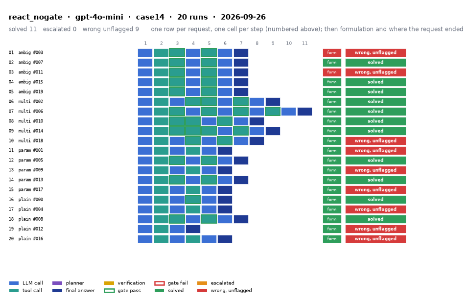

# react_nogate on IEEE 14-bus with gpt-4o-mini

Generated 2026-09-28 11:27 by evaluation/postprocess.py from `report.rescored.json`. Runs: 20. Scored by the unified evaluator (v2): every verdict below is read from the answer JSON, the same way for every method.

## Run

| field | value |
|---|---|
| date | 2026-09-26 |
| model | openrouter:openai/gpt-4o-mini |
| method | react_nogate |
| case | case14 |
| condition | normal |
| n | 20 |
| seed | 0 |
| k | 1 |
| max_rounds | 8 |
| tool_variant | load_split |
| plan_variant | text |
| temperature | 0.0 |
| system_prompt_hash | 43ef7eaadb12 |
| description | ReAct loop with no gate at all. The plain multi-step agent baseline. |
| prompt files | _shared/agent_system_prompt.txt, _shared/final_answer_instruction.txt |

One row per request, one cell per step (blue LLM call, teal tool call, purple planner, gold verification; green or red edge is the gate verdict), then formulation and where the request ended. Each run also has its own figure next to its traces: `traces/NN_<request>.png`.

## Where every request ended

The three outcomes are exclusive and cover every request the method answered. Escalation takes precedence: a run the method handed to a person is not an autonomous answer, right or wrong. A request whose API call failed never reached an answer, so it is listed apart and excluded from the rates.

| outcome | count | share |
|---|---:|---:|
| Solved autonomously | 11 | 55.0% |
| Escalated to a person | 0 | 0.0% |
| Wrong, unflagged | 9 | 45.0% |
| **Total** | **20** | 100% |

## Metrics

| group | metric | value |
|---|---|---|
| Task utility | Formulation exact | 18/20 (90.0%) |
| Task utility | Formulation error types | missed_step: 2 |
| Task utility | Voltage MAE, all runs | 0.0026 p.u. |
| Task utility | Voltage MAE, formulation-exact runs | 0.0031 p.u. |
| Task utility | Flow MAE, all runs | 1.0463 MW |
| Task utility | Flow MAE, formulation-exact runs | 1.2206 MW |
| Task utility | KCL mismatch, mean | 0.6728 MW |
| Solver-grounded correctness | Solved (computation right, any path) | 11/20 (55.0%) |
| Solver-grounded correctness | V-pass (all conditions, offline) | 19/20 (95.0%) |
| Reporting | Traceable answers | 19/20 (95.0%) |
| Reporting | Traceable numbers, mean share | 0.956 |
| Reporting | Stale state quoted | 0/20 |
| Cost and time | LLM calls / tool calls, mean | 4.15 / 2.9 |
| Cost and time | Prompt / completion tokens, mean | 12328 / 2739 |
| Cost and time | Cost, total | $0.0699 |
| Cost and time | Wall time, mean | 21.1 s |

### Cross-check against the runner's own scoreboard

Values the runner aggregated for the same rows (report.json scoreboard). They should agree with the table above; a disagreement means the rows were filtered differently.

| metric | runner scoreboard | this report |
|---|---:|---:|
| common_solved_count | 11 | 11 |
| common_escalated_count | 0 | 0 |
| common_wrong_count | 9 | 9 |
| common_formulation_count | 18 | 18 |
| common_traceable_count | 19 | 19 |
| common_n | 20 | 20 |

## By request difficulty

| difficulty | n | solved | escalated | wrong unflagged | formulation exact |
|---|---:|---:|---:|---:|---:|
| ambiguous | 5 | 3 | 0 | 2 | 3 |
| multistep | 5 | 4 | 0 | 1 | 5 |
| parameterized | 5 | 2 | 0 | 3 | 5 |
| plain | 5 | 2 | 0 | 3 | 5 |

## Wrong and unflagged (9)

- `case14-ambiguous-003-s0` formulation missed_step; the formulation declared in the answer omits disconnect_line, which the request needs and which the trace shows the method did run  ([narrative](traces/01_case14-ambiguous-003-s0.narrative.txt), [transcript](traces/01_case14-ambiguous-003-s0.transcript.txt))
- `case14-ambiguous-011-s0` formulation missed_step; the formulation declared in the answer omits set_active_load / modify_load, which the request needs and which the trace shows the method did run  ([narrative](traces/03_case14-ambiguous-011-s0.narrative.txt), [transcript](traces/03_case14-ambiguous-011-s0.transcript.txt))
- `case14-multistep-018-s0` formulation exact; declared:  ([narrative](traces/10_case14-multistep-018-s0.narrative.txt), [transcript](traces/10_case14-multistep-018-s0.transcript.txt))
- `case14-parameterized-001-s0` formulation exact; declared:  ([narrative](traces/11_case14-parameterized-001-s0.narrative.txt), [transcript](traces/11_case14-parameterized-001-s0.transcript.txt))
- `case14-parameterized-009-s0` formulation exact; declared:  ([narrative](traces/13_case14-parameterized-009-s0.narrative.txt), [transcript](traces/13_case14-parameterized-009-s0.transcript.txt))
- `case14-parameterized-017-s0` formulation exact; declared:  ([narrative](traces/15_case14-parameterized-017-s0.narrative.txt), [transcript](traces/15_case14-parameterized-017-s0.transcript.txt))
- `case14-plain-004-s0` formulation exact; declared:  ([narrative](traces/17_case14-plain-004-s0.narrative.txt), [transcript](traces/17_case14-plain-004-s0.transcript.txt))
- `case14-plain-012-s0` formulation exact; declared:  ([narrative](traces/19_case14-plain-012-s0.narrative.txt), [transcript](traces/19_case14-plain-012-s0.transcript.txt))
- `case14-plain-016-s0` formulation exact; declared:  ([narrative](traces/20_case14-plain-016-s0.narrative.txt), [transcript](traces/20_case14-plain-016-s0.transcript.txt))

## Formulation not exact (2)

- `case14-ambiguous-003-s0` missed_step: the formulation declared in the answer omits disconnect_line, which the request needs and which the trace shows the method did run  ([narrative](traces/01_case14-ambiguous-003-s0.narrative.txt), [transcript](traces/01_case14-ambiguous-003-s0.transcript.txt))
- `case14-ambiguous-011-s0` missed_step: the formulation declared in the answer omits set_active_load / modify_load, which the request needs and which the trace shows the method did run  ([narrative](traces/03_case14-ambiguous-011-s0.narrative.txt), [transcript](traces/03_case14-ambiguous-011-s0.transcript.txt))

## Untraceable numbers in the answer (1)

- `case14-plain-012-s0` 52 of 59 numbers; values ['1.06', '0.0', '1.045', '-4.98', '1.01', '-12.53', '1.0', '-15.0', '1.0', '-20.0', '1.0', '-30.0', '1.0', '-30.0', '1.0', '-30.0', '1.0', '-30.0', '1.0', '-30.0']  ([narrative](traces/19_case14-plain-012-s0.narrative.txt), [transcript](traces/19_case14-plain-012-s0.transcript.txt))

## Files

- `summary.csv`: one line per run, the fields above plus tokens and time.
- `traces/NN_<request>.narrative.txt`: what happened in each run, step by step, with the verdicts.
- `traces/NN_<request>.transcript.txt`: the raw exchange, every message, tool call and tool output.
- `traces/NN_<request>.png`: the run as a picture: steps, gate verdicts, formulation, verification, outcome, with a two-line narrative.
- `overview.png`: all runs of this folder on one page.
- `traces/NN_<request>.json`: the raw trace the runner wrote.
- `raw/`: the runner's own outputs (report.json, rescored report, logs).
- `requests.jsonl`: the request set, with the intended tool calls that define formulation exactness.
