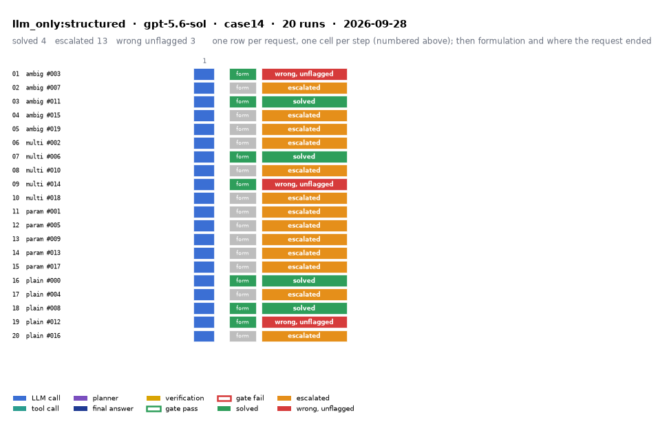

# llm_only:structured on IEEE 14-bus with gpt-5.6-sol

Generated 2026-09-28 11:27 by evaluation/postprocess.py from `report.rescored.json`. Runs: 20. Scored by the unified evaluator (v2): every verdict below is read from the answer JSON, the same way for every method.

## Run

| field | value |
|---|---|
| date | 2026-09-28 |
| model | openrouter:openai/gpt-5.6-sol |
| method | llm_only:structured |
| case | case14 |
| condition | normal |
| n | 20 |
| seed | 0 |
| k | 1 |
| max_rounds | 8 |
| tool_variant | load_split |
| plan_variant | text |
| temperature | 0.0 |
| system_prompt_hash | 183abd966fbd |
| description | LLM answers from the case tables in the prompt. No tools. Structured prompt: role, full case tables as system data, task, JSON output schema. |
| prompt files | _shared/llm_only_system_prompt.txt, _shared/llm_only_user_template.txt, _shared/llm_only_bus_id_note.txt |

One row per request, one cell per step (blue LLM call, teal tool call, purple planner, gold verification; green or red edge is the gate verdict), then formulation and where the request ended. Each run also has its own figure next to its traces: `traces/NN_<request>.png`.

## Where every request ended

The three outcomes are exclusive and cover every request the method answered. Escalation takes precedence: a run the method handed to a person is not an autonomous answer, right or wrong. A request whose API call failed never reached an answer, so it is listed apart and excluded from the rates.

| outcome | count | share |
|---|---:|---:|
| Solved autonomously | 4 | 20.0% |
| Escalated to a person | 13 | 65.0% |
| Wrong, unflagged | 3 | 15.0% |
| **Total** | **20** | 100% |

## Metrics

| group | metric | value |
|---|---|---|
| Task utility | Formulation exact | 20/20 (100.0%) |
| Task utility | Voltage MAE, all runs | 9.83e-04 p.u. |
| Task utility | Voltage MAE, formulation-exact runs | 9.83e-04 p.u. |
| Task utility | Flow MAE, all runs | 0.3224 MW |
| Task utility | Flow MAE, formulation-exact runs | 0.3224 MW |
| Task utility | KCL mismatch, mean | 0.0872 MW |
| Solver-grounded correctness | Solved (computation right, any path) | 4/20 (20.0%) |
| Solver-grounded correctness | V-pass (all conditions, offline) | 0/20 (0.0%) |
| Reporting | Traceable answers | 0/20 (0.0%) |
| Reporting | Traceable numbers, mean share | 0.082 |
| Reporting | Stale state quoted | 0/20 |
| Cost and time | LLM calls / tool calls, mean | 1 / 0 |
| Cost and time | Prompt / completion tokens, mean | 31 / 6073 |
| Cost and time | Cost, total | $1.3386 |
| Cost and time | Wall time, mean | 88.3 s |

### Cross-check against the runner's own scoreboard

Values the runner aggregated for the same rows (report.json scoreboard). They should agree with the table above; a disagreement means the rows were filtered differently.

| metric | runner scoreboard | this report |
|---|---:|---:|
| common_solved_count | 4 | 4 |
| common_escalated_count | 13 | 13 |
| common_wrong_count | 3 | 3 |
| common_formulation_count | 20 | 20 |
| common_traceable_count | 0 | 0 |
| common_n | 20 | 20 |

## By request difficulty

| difficulty | n | solved | escalated | wrong unflagged | formulation exact |
|---|---:|---:|---:|---:|---:|
| ambiguous | 5 | 1 | 3 | 1 | 5 |
| multistep | 5 | 1 | 3 | 1 | 5 |
| parameterized | 5 | 0 | 5 | 0 | 5 |
| plain | 5 | 2 | 2 | 1 | 5 |

## Wrong and unflagged (3)

- `case14-ambiguous-003-s0` formulation exact; declared:  ([narrative](traces/01_case14-ambiguous-003-s0.narrative.txt), [transcript](traces/01_case14-ambiguous-003-s0.transcript.txt))
- `case14-multistep-014-s0` formulation exact; declared:  ([narrative](traces/09_case14-multistep-014-s0.narrative.txt), [transcript](traces/09_case14-multistep-014-s0.transcript.txt))
- `case14-plain-012-s0` formulation exact; declared:  ([narrative](traces/19_case14-plain-012-s0.narrative.txt), [transcript](traces/19_case14-plain-012-s0.transcript.txt))

## Escalated (13)

- `case14-ambiguous-007-s0` detected via cannot_answer, abstention_json, declared_inability; formulation exact; declared:  ([narrative](traces/02_case14-ambiguous-007-s0.narrative.txt), [transcript](traces/02_case14-ambiguous-007-s0.transcript.txt))
- `case14-ambiguous-015-s0` detected via cannot_answer, abstention_json; formulation exact; declared:  ([narrative](traces/04_case14-ambiguous-015-s0.narrative.txt), [transcript](traces/04_case14-ambiguous-015-s0.transcript.txt))
- `case14-ambiguous-019-s0` detected via cannot_answer, abstention_json, declared_inability; formulation exact; declared:  ([narrative](traces/05_case14-ambiguous-019-s0.narrative.txt), [transcript](traces/05_case14-ambiguous-019-s0.transcript.txt))
- `case14-multistep-002-s0` detected via cannot_answer, abstention_json, declared_inability; formulation exact; declared:  ([narrative](traces/06_case14-multistep-002-s0.narrative.txt), [transcript](traces/06_case14-multistep-002-s0.transcript.txt))
- `case14-multistep-010-s0` detected via cannot_answer, abstention_json, declared_inability; formulation exact; declared:  ([narrative](traces/08_case14-multistep-010-s0.narrative.txt), [transcript](traces/08_case14-multistep-010-s0.transcript.txt))
- `case14-multistep-018-s0` detected via cannot_answer, abstention_json, declared_inability; formulation exact; declared:  ([narrative](traces/10_case14-multistep-018-s0.narrative.txt), [transcript](traces/10_case14-multistep-018-s0.transcript.txt))
- `case14-parameterized-001-s0` detected via cannot_answer, abstention_json, declared_inability; formulation exact; declared:  ([narrative](traces/11_case14-parameterized-001-s0.narrative.txt), [transcript](traces/11_case14-parameterized-001-s0.transcript.txt))
- `case14-parameterized-005-s0` detected via cannot_answer, abstention_json, declared_inability; formulation exact; declared:  ([narrative](traces/12_case14-parameterized-005-s0.narrative.txt), [transcript](traces/12_case14-parameterized-005-s0.transcript.txt))
- `case14-parameterized-009-s0` detected via cannot_answer, abstention_json, declared_inability; formulation exact; declared:  ([narrative](traces/13_case14-parameterized-009-s0.narrative.txt), [transcript](traces/13_case14-parameterized-009-s0.transcript.txt))
- `case14-parameterized-013-s0` detected via cannot_answer, abstention_json, declared_inability; formulation exact; declared:  ([narrative](traces/14_case14-parameterized-013-s0.narrative.txt), [transcript](traces/14_case14-parameterized-013-s0.transcript.txt))
- `case14-parameterized-017-s0` detected via cannot_answer, abstention_json; formulation exact; declared:  ([narrative](traces/15_case14-parameterized-017-s0.narrative.txt), [transcript](traces/15_case14-parameterized-017-s0.transcript.txt))
- `case14-plain-004-s0` detected via cannot_answer, abstention_json, declared_inability; formulation exact; declared:  ([narrative](traces/17_case14-plain-004-s0.narrative.txt), [transcript](traces/17_case14-plain-004-s0.transcript.txt))
- `case14-plain-016-s0` detected via cannot_answer, abstention_json, declared_inability; formulation exact; declared:  ([narrative](traces/20_case14-plain-016-s0.narrative.txt), [transcript](traces/20_case14-plain-016-s0.transcript.txt))

## Untraceable numbers in the answer (20)

- `case14-ambiguous-003-s0` 82 of 82 numbers; values ['9.84 MW', '6.36 Mvar', '118.45%', '1.06', '0.0', '1.045', '-4.78', '1.01', '-12.03', '1.0197', '-10.11', '1.0217', '-8.77', '1.07', '-13.95', '1.0617', '-13.45', '1.09', '-13.45', '1.052']  ([narrative](traces/01_case14-ambiguous-003-s0.narrative.txt), [transcript](traces/01_case14-ambiguous-003-s0.transcript.txt))
- `case14-ambiguous-007-s0` 3 of 3 numbers; values ['0.0', '0.0', '0.0']  ([narrative](traces/02_case14-ambiguous-007-s0.narrative.txt), [transcript](traces/02_case14-ambiguous-007-s0.transcript.txt))
- `case14-ambiguous-011-s0` 105 of 105 numbers; values ['14.7', '14.7 MW', '7.158977 Mvar', '14.7 MW', '1.0700 p.u.', '-15.0954 degrees', '1.06', '0.0', '1.045', '-5.2259', '1.01', '-13.3938', '1.01781', '-10.7768', '1.01958', '-9.1938', '1.07', '-15.0954', '1.06192', '-13.8872']  ([narrative](traces/03_case14-ambiguous-011-s0.narrative.txt), [transcript](traces/03_case14-ambiguous-011-s0.transcript.txt))
- `case14-ambiguous-015-s0` 6 of 6 numbers; values ['0.0', '0.0', '0.0']  ([narrative](traces/04_case14-ambiguous-015-s0.narrative.txt), [transcript](traces/04_case14-ambiguous-015-s0.transcript.txt))
- `case14-ambiguous-019-s0` 3 of 3 numbers; values ['0.0', '0.0', '0.0']  ([narrative](traces/05_case14-ambiguous-019-s0.narrative.txt), [transcript](traces/05_case14-ambiguous-019-s0.transcript.txt))
- `case14-multistep-002-s0` 4 of 4 numbers; values ['0.0', '0.0', '0.0']  ([narrative](traces/06_case14-multistep-002-s0.narrative.txt), [transcript](traces/06_case14-multistep-002-s0.transcript.txt))
- `case14-multistep-006-s0` 110 of 110 numbers; values ['81.79%', '100%', '1.06', '0.0', '1.045', '-4.6851', '1.01', '-11.8686', '1.01767', '-9.7472', '1.01947', '-8.3389', '1.07', '-13.7907', '1.0617', '-12.8', '1.09', '-12.8', '1.05633', '-14.3817']  ([narrative](traces/07_case14-multistep-006-s0.narrative.txt), [transcript](traces/07_case14-multistep-006-s0.transcript.txt))
- `case14-multistep-010-s0` 4 of 4 numbers; values ['0.0', '0.0', '0.0']  ([narrative](traces/08_case14-multistep-010-s0.narrative.txt), [transcript](traces/08_case14-multistep-010-s0.transcript.txt))
- `case14-multistep-014-s0` 83 of 83 numbers; values ['1.0100 p.u.', '1.06', '0.0', '1.045', '-5.43', '1.01', '-13.66', '1.0137', '-11.16', '1.0152', '-9.42', '1.07', '-15.7', '1.0582', '-14.2', '1.09', '-14.2', '1.0528', '-15.6', '1.0476']  ([narrative](traces/09_case14-multistep-014-s0.narrative.txt), [transcript](traces/09_case14-multistep-014-s0.transcript.txt))
- `case14-multistep-018-s0` 5 of 5 numbers; values ['0.0', '0.0', '0.0']  ([narrative](traces/10_case14-multistep-018-s0.narrative.txt), [transcript](traces/10_case14-multistep-018-s0.transcript.txt))
- `case14-parameterized-001-s0` 3 of 3 numbers; values ['0.0', '0.0', '0.0']  ([narrative](traces/11_case14-parameterized-001-s0.narrative.txt), [transcript](traces/11_case14-parameterized-001-s0.transcript.txt))
- `case14-parameterized-005-s0` 3 of 3 numbers; values ['0.0', '0.0', '0.0']  ([narrative](traces/12_case14-parameterized-005-s0.narrative.txt), [transcript](traces/12_case14-parameterized-005-s0.transcript.txt))
- `case14-parameterized-009-s0` 3 of 3 numbers; values ['0.0', '0.0', '0.0']  ([narrative](traces/13_case14-parameterized-009-s0.narrative.txt), [transcript](traces/13_case14-parameterized-009-s0.transcript.txt))
- `case14-parameterized-013-s0` 3 of 3 numbers; values ['0.0', '0.0', '0.0']  ([narrative](traces/14_case14-parameterized-013-s0.narrative.txt), [transcript](traces/14_case14-parameterized-013-s0.transcript.txt))
- `case14-parameterized-017-s0` 3 of 3 numbers; values ['0.0', '0.0', '0.0']  ([narrative](traces/15_case14-parameterized-017-s0.narrative.txt), [transcript](traces/15_case14-parameterized-017-s0.transcript.txt))
- `case14-plain-000-s0` 101 of 101 numbers; values ['1.0100 p.u.', '1.06', '0.0', '1.045', '-4.9067', '1.01', '-12.4009', '1.018', '-10.0464', '1.0198', '-8.5741', '1.07', '-13.9812', '1.0617', '-13.063', '1.09', '-13.063', '1.0561', '-14.6261', '1.0512']  ([narrative](traces/16_case14-plain-000-s0.narrative.txt), [transcript](traces/16_case14-plain-000-s0.transcript.txt))
- `case14-plain-004-s0` 3 of 3 numbers; values ['0.0', '0.0', '0.0']  ([narrative](traces/17_case14-plain-004-s0.narrative.txt), [transcript](traces/17_case14-plain-004-s0.transcript.txt))
- `case14-plain-008-s0` 86 of 86 numbers; values ['12.242023 Mvar', '256.5403 MW', '269.2403 MW', '12.7000 MW', '1.06', '0.0', '1.045', '-4.8049', '1.01', '-12.1882', '1.0174', '-10.2201', '1.0195', '-8.6908', '1.07', '-14.135', '1.0612', '-13.3619', '1.09', '-13.3619']  ([narrative](traces/18_case14-plain-008-s0.narrative.txt), [transcript](traces/18_case14-plain-008-s0.transcript.txt))
- `case14-plain-012-s0` 85 of 85 numbers; values ['100 MVA', '258.2144 MW', '13.148 MW', '1.0100 p.u.', '1.06', '0.0', '1.045', '-4.8524', '1.01', '-12.5064', '1.02087', '-10.2725', '1.02166', '-8.7408', '1.07', '-14.2409', '1.06238', '-13.4116', '1.09', '-13.4116']  ([narrative](traces/19_case14-plain-012-s0.narrative.txt), [transcript](traces/19_case14-plain-012-s0.transcript.txt))
- `case14-plain-016-s0` 3 of 3 numbers; values ['0.0', '0.0', '0.0']  ([narrative](traces/20_case14-plain-016-s0.narrative.txt), [transcript](traces/20_case14-plain-016-s0.transcript.txt))

## Files

- `summary.csv`: one line per run, the fields above plus tokens and time.
- `traces/NN_<request>.narrative.txt`: what happened in each run, step by step, with the verdicts.
- `traces/NN_<request>.transcript.txt`: the raw exchange, every message, tool call and tool output.
- `traces/NN_<request>.png`: the run as a picture: steps, gate verdicts, formulation, verification, outcome, with a two-line narrative.
- `overview.png`: all runs of this folder on one page.
- `traces/NN_<request>.json`: the raw trace the runner wrote.
- `raw/`: the runner's own outputs (report.json, rescored report, logs).
- `requests.jsonl`: the request set, with the intended tool calls that define formulation exactness.
