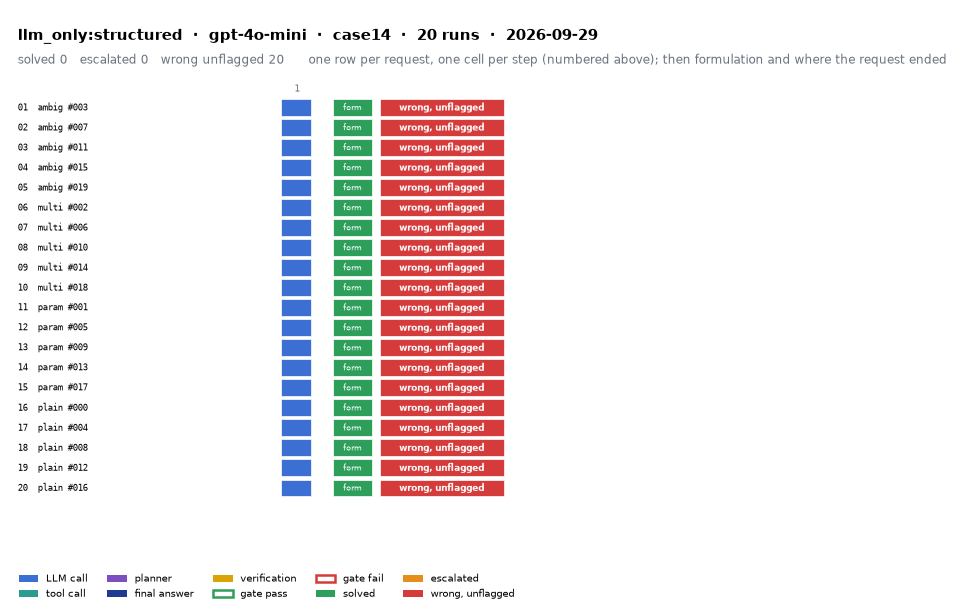

# llm_only:structured on IEEE 14-bus with gpt-4o-mini

Generated 2026-09-29 14:54 by evaluation/postprocess.py from `report.rescored.json`. Runs: 20. Scored by the unified evaluator (v2): every verdict below is read from the answer JSON, the same way for every method.

## Run

| field | value |
|---|---|
| date | 2026-09-29 |
| model | openrouter:openai/gpt-4o-mini |
| method | llm_only:structured |
| case | case14 |
| condition | normal |
| n | 20 |
| seed | 0 |
| k | 1 |
| max_rounds | 8 |
| tool_variant | load_split |
| plan_variant | text |
| temperature | 0.0 |
| system_prompt_hash | 183abd966fbd |
| description | LLM answers from the case tables in the prompt. No tools. Structured prompt: role, full case tables as system data, task, JSON output schema. |
| prompt files | _shared/llm_only_system_prompt.txt, _shared/llm_only_user_template.txt, _shared/llm_only_bus_id_note.txt |

One row per request, one cell per step (blue LLM call, teal tool call, purple planner, gold verification; green or red edge is the gate verdict), then formulation and where the request ended. Each run also has its own figure next to its traces: `traces/NN_<request>.png`.

## Where every request ended

The three outcomes are exclusive and cover every request the method answered. Escalation takes precedence: a run the method handed to a person is not an autonomous answer, right or wrong. A request whose API call failed never reached an answer, so it is listed apart and excluded from the rates.

| outcome | count | share |
|---|---:|---:|
| Solved autonomously | 0 | 0.0% |
| Escalated to a person | 0 | 0.0% |
| Wrong, unflagged | 20 | 100.0% |
| **Total** | **20** | 100% |

## Metrics

| group | metric | value |
|---|---|---|
| Task utility | Formulation exact | 20/20 (100.0%) |
| Task utility | Voltage MAE, all runs | 0.0261 p.u. |
| Task utility | Voltage MAE, formulation-exact runs | 0.0261 p.u. |
| Task utility | Flow MAE, all runs | 20.6012 MW |
| Task utility | Flow MAE, formulation-exact runs | 20.6012 MW |
| Task utility | KCL mismatch, mean | 15.0936 MW |
| Solver-grounded correctness | Solved (computation right, any path) | 0/20 (0.0%) |
| Solver-grounded correctness | V-pass (all conditions, offline) | 0/20 (0.0%) |
| Reporting | Traceable answers | 0/20 (0.0%) |
| Reporting | Traceable numbers, mean share | 0.079 |
| Reporting | Stale state quoted | 0/20 |
| Cost and time | LLM calls / tool calls, mean | 1 / 0 |
| Cost and time | Prompt / completion tokens, mean | 3101 / 1261 |
| Cost and time | Cost, total | $0.0244 |
| Cost and time | Wall time, mean | 15.7 s |

### Cross-check against the runner's own scoreboard

Values the runner aggregated for the same rows (report.json scoreboard). They should agree with the table above; a disagreement means the rows were filtered differently.

| metric | runner scoreboard | this report |
|---|---:|---:|
| common_solved_count | 0 | 0 |
| common_escalated_count | 0 | 0 |
| common_wrong_count | 20 | 20 |
| common_formulation_count | 20 | 20 |
| common_traceable_count | 0 | 0 |
| common_n | 20 | 20 |

## By request difficulty

| difficulty | n | solved | escalated | wrong unflagged | formulation exact |
|---|---:|---:|---:|---:|---:|
| ambiguous | 5 | 0 | 0 | 5 | 5 |
| multistep | 5 | 0 | 0 | 5 | 5 |
| parameterized | 5 | 0 | 0 | 5 | 5 |
| plain | 5 | 0 | 0 | 5 | 5 |

## Wrong and unflagged (20)

- `case14-ambiguous-003-s0` formulation exact; declared:  ([narrative](traces/01_case14-ambiguous-003-s0.narrative.txt), [transcript](traces/01_case14-ambiguous-003-s0.transcript.txt))
- `case14-ambiguous-007-s0` formulation exact; declared:  ([narrative](traces/02_case14-ambiguous-007-s0.narrative.txt), [transcript](traces/02_case14-ambiguous-007-s0.transcript.txt))
- `case14-ambiguous-011-s0` formulation exact; declared:  ([narrative](traces/03_case14-ambiguous-011-s0.narrative.txt), [transcript](traces/03_case14-ambiguous-011-s0.transcript.txt))
- `case14-ambiguous-015-s0` formulation exact; declared:  ([narrative](traces/04_case14-ambiguous-015-s0.narrative.txt), [transcript](traces/04_case14-ambiguous-015-s0.transcript.txt))
- `case14-ambiguous-019-s0` formulation exact; declared:  ([narrative](traces/05_case14-ambiguous-019-s0.narrative.txt), [transcript](traces/05_case14-ambiguous-019-s0.transcript.txt))
- `case14-multistep-002-s0` formulation exact; declared:  ([narrative](traces/06_case14-multistep-002-s0.narrative.txt), [transcript](traces/06_case14-multistep-002-s0.transcript.txt))
- `case14-multistep-006-s0` formulation exact; declared:  ([narrative](traces/07_case14-multistep-006-s0.narrative.txt), [transcript](traces/07_case14-multistep-006-s0.transcript.txt))
- `case14-multistep-010-s0` formulation exact; declared:  ([narrative](traces/08_case14-multistep-010-s0.narrative.txt), [transcript](traces/08_case14-multistep-010-s0.transcript.txt))
- `case14-multistep-014-s0` formulation exact; declared:  ([narrative](traces/09_case14-multistep-014-s0.narrative.txt), [transcript](traces/09_case14-multistep-014-s0.transcript.txt))
- `case14-multistep-018-s0` formulation exact; declared:  ([narrative](traces/10_case14-multistep-018-s0.narrative.txt), [transcript](traces/10_case14-multistep-018-s0.transcript.txt))
- `case14-parameterized-001-s0` formulation exact; declared:  ([narrative](traces/11_case14-parameterized-001-s0.narrative.txt), [transcript](traces/11_case14-parameterized-001-s0.transcript.txt))
- `case14-parameterized-005-s0` formulation exact; declared:  ([narrative](traces/12_case14-parameterized-005-s0.narrative.txt), [transcript](traces/12_case14-parameterized-005-s0.transcript.txt))
- `case14-parameterized-009-s0` formulation exact; declared:  ([narrative](traces/13_case14-parameterized-009-s0.narrative.txt), [transcript](traces/13_case14-parameterized-009-s0.transcript.txt))
- `case14-parameterized-013-s0` formulation exact; declared:  ([narrative](traces/14_case14-parameterized-013-s0.narrative.txt), [transcript](traces/14_case14-parameterized-013-s0.transcript.txt))
- `case14-parameterized-017-s0` formulation exact; declared:  ([narrative](traces/15_case14-parameterized-017-s0.narrative.txt), [transcript](traces/15_case14-parameterized-017-s0.transcript.txt))
- `case14-plain-000-s0` formulation exact; declared:  ([narrative](traces/16_case14-plain-000-s0.narrative.txt), [transcript](traces/16_case14-plain-000-s0.transcript.txt))
- `case14-plain-004-s0` formulation exact; declared:  ([narrative](traces/17_case14-plain-004-s0.narrative.txt), [transcript](traces/17_case14-plain-004-s0.transcript.txt))
- `case14-plain-008-s0` formulation exact; declared:  ([narrative](traces/18_case14-plain-008-s0.narrative.txt), [transcript](traces/18_case14-plain-008-s0.transcript.txt))
- `case14-plain-012-s0` formulation exact; declared:  ([narrative](traces/19_case14-plain-012-s0.narrative.txt), [transcript](traces/19_case14-plain-012-s0.transcript.txt))
- `case14-plain-016-s0` formulation exact; declared:  ([narrative](traces/20_case14-plain-016-s0.narrative.txt), [transcript](traces/20_case14-plain-016-s0.transcript.txt))

## Untraceable numbers in the answer (20)

- `case14-ambiguous-003-s0` 64 of 64 numbers; values ['41.63 MW', '185.88 MW', '0.0 MW', '1.06', '0.0', '1.045', '-0.0', '1.01', '-0.0', '1.0', '-0.0', '1.0', '-0.0', '1.07', '-0.0', '1.0', '-0.0', '1.09', '-0.0', '1.0']  ([narrative](traces/01_case14-ambiguous-003-s0.narrative.txt), [transcript](traces/01_case14-ambiguous-003-s0.transcript.txt))
- `case14-ambiguous-007-s0` 64 of 64 numbers; values ['62.86 MW', '188.43 MW', '5.57 MW', '1.06', '0.0', '1.045', '-2.5', '1.01', '-5.0', '-7.5', '-10.0', '1.07', '-12.0', '-15.0', '1.09', '-17.5', '-20.0', '-22.5', '-25.0', '-27.5']  ([narrative](traces/02_case14-ambiguous-007-s0.narrative.txt), [transcript](traces/02_case14-ambiguous-007-s0.transcript.txt))
- `case14-ambiguous-011-s0` 65 of 65 numbers; values ['14.7', '38.38 MW', '14.7 MW', '0.0 MW', '1.06', '0.0', '1.045', '-0.0', '1.01', '-0.0', '1.0', '-0.0', '1.0', '-0.0', '1.07', '-0.0', '1.0', '-0.0', '1.09', '-0.0']  ([narrative](traces/03_case14-ambiguous-011-s0.narrative.txt), [transcript](traces/03_case14-ambiguous-011-s0.transcript.txt))
- `case14-ambiguous-015-s0` 66 of 66 numbers; values ['39.967 MW', '0.0 MW', '1.06', '0.0', '1.045', '-0.0', '1.01', '-0.0', '1.0', '-0.0', '1.0', '-0.0', '1.07', '-0.0', '1.0', '-0.0', '1.09', '-0.0', '1.0', '-0.0']  ([narrative](traces/04_case14-ambiguous-015-s0.narrative.txt), [transcript](traces/04_case14-ambiguous-015-s0.transcript.txt))
- `case14-ambiguous-019-s0` 64 of 64 numbers; values ['52.35 MW', '239.00 MW', '5.65 MW', '1.06', '0.0', '1.045', '-2.0', '1.01', '-5.0', '1.02', '-3.0', '1.01', '-1.0', '1.07', '0.0', '0.0', '1.09', '0.0', '0.0', '0.0']  ([narrative](traces/05_case14-ambiguous-019-s0.narrative.txt), [transcript](traces/05_case14-ambiguous-019-s0.transcript.txt))
- `case14-multistep-002-s0` 65 of 65 numbers; values ['102.5%', '101.3%', '1.06', '0.0', '1.045', '-2.5', '1.01', '-5.0', '1.02', '-3.0', '1.03', '-1.0', '1.07', '0.0', '1.04', '0.0', '1.09', '0.0', '1.02', '0.0']  ([narrative](traces/06_case14-multistep-002-s0.narrative.txt), [transcript](traces/06_case14-multistep-002-s0.transcript.txt))
- `case14-multistep-006-s0` 67 of 67 numbers; values ['101.2%', '85.3%', '82.1%', '1.06', '0.0', '1.045', '-1.5', '1.01', '-3.0', '1.02', '-2.0', '1.03', '-1.0', '1.07', '0.0', '1.04', '0.0', '1.09', '0.0', '1.02']  ([narrative](traces/07_case14-multistep-006-s0.narrative.txt), [transcript](traces/07_case14-multistep-006-s0.transcript.txt))
- `case14-multistep-010-s0` 39 of 39 numbers; values ['110.5%', '102.3%', '1.06', '0.0', '1.045', '-2.5', '1.02', '-5.0', '1.01', '-7.0', '-10.0', '1.07', '-3.0', '-5.0', '1.09', '-2.0', '-4.0', '-6.0', '-8.0', '-9.0']  ([narrative](traces/08_case14-multistep-010-s0.narrative.txt), [transcript](traces/08_case14-multistep-010-s0.transcript.txt))
- `case14-multistep-014-s0` 75 of 75 numbers; values ['0.9512 p.u.', '1.06', '0.0', '1.0345', '-2.5', '1.0123', '-5.0', '0.9756', '-10.0', '1.0201', '-3.0', '0.9512', '-15.0', '1.0450', '-1.0', '1.0900', '0.0', '1.0050', '-4.0', '1.0200']  ([narrative](traces/09_case14-multistep-014-s0.narrative.txt), [transcript](traces/09_case14-multistep-014-s0.transcript.txt))
- `case14-multistep-018-s0` 65 of 65 numbers; values ['101.2%', '100.5%', '1.06', '0.0', '1.045', '-2.0', '1.01', '-5.0', '1.02', '-3.0', '1.01', '-1.0', '1.07', '0.0', '1.0', '0.0', '1.09', '0.0', '1.0', '0.0']  ([narrative](traces/10_case14-multistep-018-s0.narrative.txt), [transcript](traces/10_case14-multistep-018-s0.transcript.txt))
- `case14-parameterized-001-s0` 76 of 76 numbers; values ['0.9345 p.u.', '1.06', '0.0', '1.045', '-0.0', '1.01', '-0.0', '-0.0', '-0.0', '1.07', '-0.0', '-0.0', '1.09', '-0.0', '-0.0', '-0.0', '0.9345', '-0.0', '-0.0', '-0.0']  ([narrative](traces/11_case14-parameterized-001-s0.narrative.txt), [transcript](traces/11_case14-parameterized-001-s0.transcript.txt))
- `case14-parameterized-005-s0` 61 of 61 numbers; values ['1.06', '0.0', '1.045', '-4.0', '1.01', '-6.0', '1.0', '-8.0', '1.0', '-10.0', '1.07', '-12.0', '1.0', '-14.0', '1.09', '-16.0', '1.0', '-18.0', '1.0', '-20.0']  ([narrative](traces/12_case14-parameterized-005-s0.narrative.txt), [transcript](traces/12_case14-parameterized-005-s0.transcript.txt))
- `case14-parameterized-009-s0` 77 of 77 numbers; values ['1.06', '0.0', '1.045', '-2.0', '1.01', '-5.0', '1.02', '-3.0', '1.015', '-1.0', '1.07', '2.0', '1.03', '1.09', '0.0', '1.02', '-4.0', '1.01', '-2.0', '-1.0']  ([narrative](traces/13_case14-parameterized-009-s0.narrative.txt), [transcript](traces/13_case14-parameterized-009-s0.transcript.txt))
- `case14-parameterized-013-s0` 64 of 64 numbers; values ['53.98 MW', '243.36 MW', '5.12 MW', '1.06', '0.0', '1.045', '-0.5', '1.01', '-1.0', '1.02', '-2.0', '1.015', '-3.0', '1.07', '-4.0', '1.08', '-5.0', '1.09', '-6.0', '1.02']  ([narrative](traces/14_case14-parameterized-013-s0.narrative.txt), [transcript](traces/14_case14-parameterized-013-s0.transcript.txt))
- `case14-parameterized-017-s0` 76 of 76 numbers; values ['1.06', '0.0', '1.045', '-0.0', '1.01', '-0.0', '-0.0', '-0.0', '1.07', '-0.0', '-0.0', '1.09', '-0.0', '-0.0', '-0.0', '-0.0', '-0.0', '-0.0', '-0.0', '156.9']  ([narrative](traces/15_case14-parameterized-017-s0.narrative.txt), [transcript](traces/15_case14-parameterized-017-s0.transcript.txt))
- `case14-plain-000-s0` 62 of 62 numbers; values ['0.9745 p.u.', '1.06', '0.0', '1.045', '-4.0', '1.01', '-6.0', '1.0', '-8.0', '1.0', '-10.0', '0.9745', '-12.0', '1.0', '-14.0', '1.0', '-16.0', '1.0', '-18.0', '1.0']  ([narrative](traces/16_case14-plain-000-s0.narrative.txt), [transcript](traces/16_case14-plain-000-s0.transcript.txt))
- `case14-plain-004-s0` 63 of 63 numbers; values ['120.5%', '1.06', '0.0', '1.045', '-2.5', '1.01', '-5.0', '1.02', '-3.0', '1.03', '-1.5', '1.07', '2.0', '1.04', '1.09', '3.0', '1.02', '-1.0', '1.01', '0.0']  ([narrative](traces/17_case14-plain-004-s0.narrative.txt), [transcript](traces/17_case14-plain-004-s0.transcript.txt))
- `case14-plain-008-s0` 66 of 66 numbers; values ['57.95 MW', '57.95 MW', '0.00 MW', '1.06', '0.0', '1.045', '-0.0', '1.01', '-0.0', '1.0', '-0.0', '1.0', '-0.0', '1.07', '-0.0', '1.0', '-0.0', '1.09', '-0.0', '1.0']  ([narrative](traces/18_case14-plain-008-s0.narrative.txt), [transcript](traces/18_case14-plain-008-s0.transcript.txt))
- `case14-plain-012-s0` 64 of 64 numbers; values ['56.8 MW', '208.0 MW', '5.2 MW', '1.06', '0.0', '1.045', '-4.0', '1.01', '-8.0', '1.0', '-12.0', '1.0', '-15.0', '1.07', '-10.0', '1.0', '-20.0', '1.09', '-5.0', '1.0']  ([narrative](traces/19_case14-plain-012-s0.narrative.txt), [transcript](traces/19_case14-plain-012-s0.transcript.txt))
- `case14-plain-016-s0` 63 of 63 numbers; values ['120.5%', '1.06', '0.0', '1.045', '-2.5', '1.01', '-5.0', '1.02', '-3.0', '1.01', '-1.0', '1.07', '0.0', '0.0', '1.09', '0.0', '0.0', '0.0', '0.0', '0.0']  ([narrative](traces/20_case14-plain-016-s0.narrative.txt), [transcript](traces/20_case14-plain-016-s0.transcript.txt))

## Run errors (2)

- `case14-multistep-014-s0` ValueError: json_parse_failed  ([narrative](traces/09_case14-multistep-014-s0.narrative.txt), [transcript](traces/09_case14-multistep-014-s0.transcript.txt))
- `case14-parameterized-001-s0` ValueError: json_parse_failed  ([narrative](traces/11_case14-parameterized-001-s0.narrative.txt), [transcript](traces/11_case14-parameterized-001-s0.transcript.txt))

## Files

- `summary.csv`: one line per run, the fields above plus tokens and time.
- `traces/NN_<request>.narrative.txt`: what happened in each run, step by step, with the verdicts.
- `traces/NN_<request>.transcript.txt`: the raw exchange, every message, tool call and tool output.
- `traces/NN_<request>.png`: the run as a picture: steps, gate verdicts, formulation, verification, outcome, with a two-line narrative.
- `overview.png`: all runs of this folder on one page.
- `traces/NN_<request>.json`: the raw trace the runner wrote.
- `raw/`: the runner's own outputs (report.json, rescored report, logs).
- `requests.jsonl`: the request set, with the intended tool calls that define formulation exactness.
