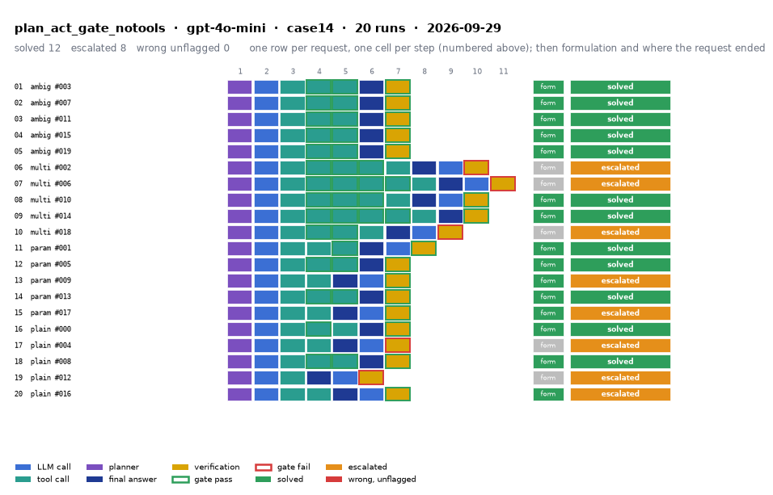

# plan_act_gate_notools on IEEE 14-bus with gpt-4o-mini

Generated 2026-09-29 17:29 by evaluation/postprocess.py from `report.rescored.json`. Runs: 20. Scored by the unified evaluator (v2): every verdict below is read from the answer JSON, the same way for every method.

## Run

| field | value |
|---|---|
| date | 2026-09-29 |
| model | openrouter:openai/gpt-4o-mini |
| method | plan_act_gate_notools |
| case | case14 |
| condition | normal |
| n | 20 |
| seed | 0 |
| k | 1 |
| max_rounds | 8 |
| tool_variant | load_split |
| plan_variant | text |
| temperature | 0.0 |
| system_prompt_hash | 43ef7eaadb12 |
| description | Plan-and-Act with the task-level verification gate on the final answer, and a retry that has no tools. The agreed semantics across the four case studies: the retry gives the model exactly the capabilities its architecture gives it when it answers, and Plan-and-Act answers after the plan is spent. Ablation, not a table row: it asks whether the gate is better placed on a planner than on a ReAct loop. The sibling plan_act_gate keeps read-only tools in the retry and is kept only to measure what that extra observation step is worth. |
| prompt files | _shared/agent_system_prompt.txt, _shared/final_answer_instruction.txt, plan_act_nogate/plan_system_prompt_prefix.txt, plan_act_nogate/plan_system_prompt_structured.txt, plan_act_nogate/replan_instruction.txt, _shared/gate_retry_no_tools.txt |

One row per request, one cell per step (blue LLM call, teal tool call, purple planner, gold verification; green or red edge is the gate verdict), then formulation and where the request ended. Each run also has its own figure next to its traces: `traces/NN_<request>.png`.

## Where every request ended

The three outcomes are exclusive and cover every request the method answered. Escalation takes precedence: a run the method handed to a person is not an autonomous answer, right or wrong. A request whose API call failed never reached an answer, so it is listed apart and excluded from the rates.

| outcome | count | share |
|---|---:|---:|
| Solved autonomously | 12 | 60.0% |
| Escalated to a person | 8 | 40.0% |
| Wrong, unflagged | 0 | 0.0% |
| **Total** | **20** | 100% |

## Metrics

| group | metric | value |
|---|---|---|
| Task utility | Formulation exact | 15/15 (100.0%) |
| Task utility | Voltage MAE, all runs | 3.79e-06 p.u. |
| Task utility | Voltage MAE, formulation-exact runs | 3.79e-06 p.u. |
| Task utility | Flow MAE, all runs | 2.38e-04 MW |
| Task utility | Flow MAE, formulation-exact runs | 2.38e-04 MW |
| Task utility | KCL mismatch, mean | 1.69e-04 MW |
| Solver-grounded correctness | Solved (computation right, any path) | 12/20 (60.0%) |
| Solver-grounded correctness | V-pass (all conditions, offline) | 18/20 (90.0%) |
| Reporting | Traceable answers | 18/20 (90.0%) |
| Reporting | Traceable numbers, mean share | 0.882 |
| Reporting | Stale state quoted | 0/20 |
| Cost and time | LLM calls / tool calls, mean | 2.5 / 3.25 |
| Cost and time | Prompt / completion tokens, mean | 7879 / 1824 |
| Cost and time | Cost, total | $0.0455 |
| Cost and time | Wall time, mean | 18.5 s |

### Cross-check against the runner's own scoreboard

Values the runner aggregated for the same rows (report.json scoreboard). They should agree with the table above; a disagreement means the rows were filtered differently.

| metric | runner scoreboard | this report |
|---|---:|---:|
| common_solved_count | 12 | 12 |
| common_escalated_count | 8 | 8 |
| common_wrong_count | 0 | 0 |
| common_formulation_count | 15 | 15 |
| common_traceable_count | 18 | 18 |
| common_n | 20 | 20 |

## By request difficulty

| difficulty | n | solved | escalated | wrong unflagged | formulation exact |
|---|---:|---:|---:|---:|---:|
| ambiguous | 5 | 5 | 0 | 0 | 5 |
| multistep | 5 | 2 | 3 | 0 | 2 |
| parameterized | 5 | 3 | 2 | 0 | 5 |
| plain | 5 | 2 | 3 | 0 | 3 |

## Escalated (8)

- `case14-multistep-002-s0` detected via gate_abstained; formulation None; not scored: the answer declares no formulation (it reports that the request could not be completed)  ([narrative](traces/06_case14-multistep-002-s0.narrative.txt), [transcript](traces/06_case14-multistep-002-s0.transcript.txt))
- `case14-multistep-006-s0` detected via gate_abstained; formulation None; not scored: the answer declares no formulation (it reports that the request could not be completed)  ([narrative](traces/07_case14-multistep-006-s0.narrative.txt), [transcript](traces/07_case14-multistep-006-s0.transcript.txt))
- `case14-multistep-018-s0` detected via gate_abstained; formulation None; not scored: the answer declares no formulation (it reports that the request could not be completed)  ([narrative](traces/10_case14-multistep-018-s0.narrative.txt), [transcript](traces/10_case14-multistep-018-s0.transcript.txt))
- `case14-parameterized-009-s0` detected via cannot_answer; formulation exact; declared:  ([narrative](traces/13_case14-parameterized-009-s0.narrative.txt), [transcript](traces/13_case14-parameterized-009-s0.transcript.txt))
- `case14-parameterized-017-s0` detected via cannot_answer; formulation exact; declared:  ([narrative](traces/15_case14-parameterized-017-s0.narrative.txt), [transcript](traces/15_case14-parameterized-017-s0.transcript.txt))
- `case14-plain-004-s0` detected via gate_abstained, declared_inability; formulation None; not scored: the answer declares no formulation (it reports that the request could not be completed)  ([narrative](traces/17_case14-plain-004-s0.narrative.txt), [transcript](traces/17_case14-plain-004-s0.transcript.txt))
- `case14-plain-012-s0` detected via gate_abstained, declared_inability; formulation None; not scored: the answer declares no formulation (it reports that the request could not be completed)  ([narrative](traces/19_case14-plain-012-s0.narrative.txt), [transcript](traces/19_case14-plain-012-s0.transcript.txt))
- `case14-plain-016-s0` detected via cannot_answer, abstention_json; formulation exact; declared:  ([narrative](traces/20_case14-plain-016-s0.narrative.txt), [transcript](traces/20_case14-plain-016-s0.transcript.txt))

## Untraceable numbers in the answer (2)

- `case14-plain-004-s0` 1 of 1 numbers; values ['100%']  ([narrative](traces/17_case14-plain-004-s0.narrative.txt), [transcript](traces/17_case14-plain-004-s0.transcript.txt))
- `case14-plain-012-s0` 1 of 1 numbers; values ['100%']  ([narrative](traces/19_case14-plain-012-s0.narrative.txt), [transcript](traces/19_case14-plain-012-s0.transcript.txt))

## Files

- `summary.csv`: one line per run, the fields above plus tokens and time.
- `traces/NN_<request>.narrative.txt`: what happened in each run, step by step, with the verdicts.
- `traces/NN_<request>.transcript.txt`: the raw exchange, every message, tool call and tool output.
- `traces/NN_<request>.png`: the run as a picture: steps, gate verdicts, formulation, verification, outcome, with a two-line narrative.
- `overview.png`: all runs of this folder on one page.
- `traces/NN_<request>.json`: the raw trace the runner wrote.
- `raw/`: the runner's own outputs (report.json, rescored report, logs).
- `requests.jsonl`: the request set, with the intended tool calls that define formulation exactness.
