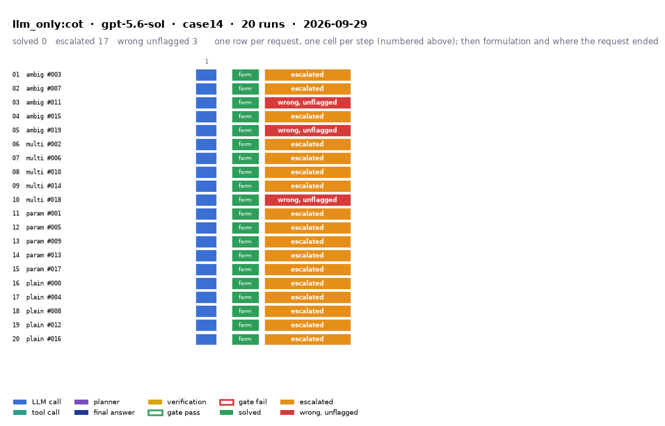

# llm_only:cot on IEEE 14-bus with gpt-5.6-sol

Generated 2026-09-29 14:54 by evaluation/postprocess.py from `report.rescored.json`. Runs: 20. Scored by the unified evaluator (v2): every verdict below is read from the answer JSON, the same way for every method.

## Run

| field | value |
|---|---|
| date | 2026-09-29 |
| model | openrouter:openai/gpt-5.6-sol |
| method | llm_only:cot |
| case | case14 |
| condition | normal |
| n | 20 |
| seed | 0 |
| k | 1 |
| max_rounds | 8 |
| tool_variant | load_split |
| plan_variant | text |
| temperature | 0.0 |
| system_prompt_hash | be09b0a3b7d2 |
| description | LLM answers from the case tables in the prompt. No tools. Structured prompt plus a reasoning section asking for step-by-step reasoning before the final JSON. |
| prompt files | _shared/llm_only_system_prompt.txt, _shared/llm_only_user_template.txt, _shared/llm_only_bus_id_note.txt, _shared/cot_system_suffix.txt, llm_only_cot/reasoning_section.txt |

One row per request, one cell per step (blue LLM call, teal tool call, purple planner, gold verification; green or red edge is the gate verdict), then formulation and where the request ended. Each run also has its own figure next to its traces: `traces/NN_<request>.png`.

## Where every request ended

The three outcomes are exclusive and cover every request the method answered. Escalation takes precedence: a run the method handed to a person is not an autonomous answer, right or wrong. A request whose API call failed never reached an answer, so it is listed apart and excluded from the rates.

| outcome | count | share |
|---|---:|---:|
| Solved autonomously | 0 | 0.0% |
| Escalated to a person | 17 | 85.0% |
| Wrong, unflagged | 3 | 15.0% |
| **Total** | **20** | 100% |

## Metrics

| group | metric | value |
|---|---|---|
| Task utility | Formulation exact | 20/20 (100.0%) |
| Task utility | Voltage MAE, all runs | 0.0078 p.u. |
| Task utility | Voltage MAE, formulation-exact runs | 0.0078 p.u. |
| Task utility | Flow MAE, all runs | 1.7988 MW |
| Task utility | Flow MAE, formulation-exact runs | 1.7988 MW |
| Task utility | KCL mismatch, mean | 1.9364 MW |
| Solver-grounded correctness | Solved (computation right, any path) | 0/20 (0.0%) |
| Solver-grounded correctness | V-pass (all conditions, offline) | 0/20 (0.0%) |
| Reporting | Traceable answers | 0/20 (0.0%) |
| Reporting | Traceable numbers, mean share | 0.119 |
| Reporting | Stale state quoted | 0/20 |
| Cost and time | LLM calls / tool calls, mean | 1 / 0 |
| Cost and time | Prompt / completion tokens, mean | 3276 / 5067 |
| Cost and time | Cost, total | $1.1445 |
| Cost and time | Wall time, mean | 74.9 s |

### Cross-check against the runner's own scoreboard

Values the runner aggregated for the same rows (report.json scoreboard). They should agree with the table above; a disagreement means the rows were filtered differently.

| metric | runner scoreboard | this report |
|---|---:|---:|
| common_solved_count | 0 | 0 |
| common_escalated_count | 17 | 17 |
| common_wrong_count | 3 | 3 |
| common_formulation_count | 20 | 20 |
| common_traceable_count | 0 | 0 |
| common_n | 20 | 20 |

## By request difficulty

| difficulty | n | solved | escalated | wrong unflagged | formulation exact |
|---|---:|---:|---:|---:|---:|
| ambiguous | 5 | 0 | 3 | 2 | 5 |
| multistep | 5 | 0 | 4 | 1 | 5 |
| parameterized | 5 | 0 | 5 | 0 | 5 |
| plain | 5 | 0 | 5 | 0 | 5 |

## Wrong and unflagged (3)

- `case14-ambiguous-011-s0` formulation exact; declared:  ([narrative](traces/03_case14-ambiguous-011-s0.narrative.txt), [transcript](traces/03_case14-ambiguous-011-s0.transcript.txt))
- `case14-ambiguous-019-s0` formulation exact; declared:  ([narrative](traces/05_case14-ambiguous-019-s0.narrative.txt), [transcript](traces/05_case14-ambiguous-019-s0.transcript.txt))
- `case14-multistep-018-s0` formulation exact; declared:  ([narrative](traces/10_case14-multistep-018-s0.narrative.txt), [transcript](traces/10_case14-multistep-018-s0.transcript.txt))

## Escalated (17)

- `case14-ambiguous-003-s0` detected via cannot_answer, abstention_json, declared_inability; formulation exact; declared:  ([narrative](traces/01_case14-ambiguous-003-s0.narrative.txt), [transcript](traces/01_case14-ambiguous-003-s0.transcript.txt))
- `case14-ambiguous-007-s0` detected via cannot_answer, abstention_json; formulation exact; declared:  ([narrative](traces/02_case14-ambiguous-007-s0.narrative.txt), [transcript](traces/02_case14-ambiguous-007-s0.transcript.txt))
- `case14-ambiguous-015-s0` detected via cannot_answer, abstention_json, declared_inability; formulation exact; declared:  ([narrative](traces/04_case14-ambiguous-015-s0.narrative.txt), [transcript](traces/04_case14-ambiguous-015-s0.transcript.txt))
- `case14-multistep-002-s0` detected via cannot_answer, abstention_json, declared_inability; formulation exact; declared:  ([narrative](traces/06_case14-multistep-002-s0.narrative.txt), [transcript](traces/06_case14-multistep-002-s0.transcript.txt))
- `case14-multistep-006-s0` detected via cannot_answer, abstention_json, declared_inability; formulation exact; declared:  ([narrative](traces/07_case14-multistep-006-s0.narrative.txt), [transcript](traces/07_case14-multistep-006-s0.transcript.txt))
- `case14-multistep-010-s0` detected via cannot_answer, abstention_json, declared_inability; formulation exact; declared:  ([narrative](traces/08_case14-multistep-010-s0.narrative.txt), [transcript](traces/08_case14-multistep-010-s0.transcript.txt))
- `case14-multistep-014-s0` detected via cannot_answer, abstention_json; formulation exact; declared:  ([narrative](traces/09_case14-multistep-014-s0.narrative.txt), [transcript](traces/09_case14-multistep-014-s0.transcript.txt))
- `case14-parameterized-001-s0` detected via cannot_answer, abstention_json; formulation exact; declared:  ([narrative](traces/11_case14-parameterized-001-s0.narrative.txt), [transcript](traces/11_case14-parameterized-001-s0.transcript.txt))
- `case14-parameterized-005-s0` detected via cannot_answer, abstention_json, declared_inability; formulation exact; declared:  ([narrative](traces/12_case14-parameterized-005-s0.narrative.txt), [transcript](traces/12_case14-parameterized-005-s0.transcript.txt))
- `case14-parameterized-009-s0` detected via cannot_answer, abstention_json, declared_inability; formulation exact; declared:  ([narrative](traces/13_case14-parameterized-009-s0.narrative.txt), [transcript](traces/13_case14-parameterized-009-s0.transcript.txt))
- `case14-parameterized-013-s0` detected via cannot_answer, abstention_json; formulation exact; declared:  ([narrative](traces/14_case14-parameterized-013-s0.narrative.txt), [transcript](traces/14_case14-parameterized-013-s0.transcript.txt))
- `case14-parameterized-017-s0` detected via cannot_answer, abstention_json, declared_inability; formulation exact; declared:  ([narrative](traces/15_case14-parameterized-017-s0.narrative.txt), [transcript](traces/15_case14-parameterized-017-s0.transcript.txt))
- `case14-plain-000-s0` detected via cannot_answer, abstention_json, declared_inability; formulation exact; declared:  ([narrative](traces/16_case14-plain-000-s0.narrative.txt), [transcript](traces/16_case14-plain-000-s0.transcript.txt))
- `case14-plain-004-s0` detected via cannot_answer, abstention_json, declared_inability; formulation exact; declared:  ([narrative](traces/17_case14-plain-004-s0.narrative.txt), [transcript](traces/17_case14-plain-004-s0.transcript.txt))
- `case14-plain-008-s0` detected via cannot_answer, abstention_json; formulation exact; declared:  ([narrative](traces/18_case14-plain-008-s0.narrative.txt), [transcript](traces/18_case14-plain-008-s0.transcript.txt))
- `case14-plain-012-s0` detected via cannot_answer, abstention_json, declared_inability; formulation exact; declared:  ([narrative](traces/19_case14-plain-012-s0.narrative.txt), [transcript](traces/19_case14-plain-012-s0.transcript.txt))
- `case14-plain-016-s0` detected via cannot_answer, abstention_json, declared_inability; formulation exact; declared:  ([narrative](traces/20_case14-plain-016-s0.narrative.txt), [transcript](traces/20_case14-plain-016-s0.transcript.txt))

## Untraceable numbers in the answer (20)

- `case14-ambiguous-003-s0` 3 of 3 numbers; values ['0.0', '0.0', '0.0']  ([narrative](traces/01_case14-ambiguous-003-s0.narrative.txt), [transcript](traces/01_case14-ambiguous-003-s0.transcript.txt))
- `case14-ambiguous-007-s0` 3 of 3 numbers; values ['0.0', '0.0', '0.0']  ([narrative](traces/02_case14-ambiguous-007-s0.narrative.txt), [transcript](traces/02_case14-ambiguous-007-s0.transcript.txt))
- `case14-ambiguous-011-s0` 108 of 108 numbers; values ['14.7', '10.690739 MW', '14.700 MW', '7.158977 Mvar', '14.700 MW', '7.158977 Mvar', '267.145067 MW', '281.665 MW', '14.520 MW', '1.06', '0.0', '1.045', '-5.2115', '1.01', '-13.3716', '1.0155', '-10.7479', '1.0173', '-9.1587', '1.07']  ([narrative](traces/03_case14-ambiguous-011-s0.narrative.txt), [transcript](traces/03_case14-ambiguous-011-s0.transcript.txt))
- `case14-ambiguous-015-s0` 7 of 7 numbers; values ['0.0', '0.0', '0.0']  ([narrative](traces/04_case14-ambiguous-015-s0.narrative.txt), [transcript](traces/04_case14-ambiguous-015-s0.transcript.txt))
- `case14-ambiguous-019-s0` 108 of 108 numbers; values ['282.400 MW', '265.226 MW', '17.174 MW', '0.9940 p.u.', '179.3%', '1.06', '0.0', '1.045', '-5.189', '1.01', '-13.324', '1.02466', '-10.761', '1.03109', '-9.379', '1.07', '-16.647', '1.04195', '-15.085', '1.09']  ([narrative](traces/05_case14-ambiguous-019-s0.narrative.txt), [transcript](traces/05_case14-ambiguous-019-s0.transcript.txt))
- `case14-multistep-002-s0` 4 of 4 numbers; values ['0.0', '0.0', '0.0']  ([narrative](traces/06_case14-multistep-002-s0.narrative.txt), [transcript](traces/06_case14-multistep-002-s0.transcript.txt))
- `case14-multistep-006-s0` 6 of 6 numbers; values ['0.0', '0.0', '0.0']  ([narrative](traces/07_case14-multistep-006-s0.narrative.txt), [transcript](traces/07_case14-multistep-006-s0.transcript.txt))
- `case14-multistep-010-s0` 4 of 4 numbers; values ['0.0', '0.0', '0.0']  ([narrative](traces/08_case14-multistep-010-s0.narrative.txt), [transcript](traces/08_case14-multistep-010-s0.transcript.txt))
- `case14-multistep-014-s0` 6 of 6 numbers; values ['0.0', '0.0', '0.0']  ([narrative](traces/09_case14-multistep-014-s0.narrative.txt), [transcript](traces/09_case14-multistep-014-s0.transcript.txt))
- `case14-multistep-018-s0` 93 of 93 numbers; values ['97.3%', '129.4%', '182.0%', '100.4%', '110.4%', '139.6%', '129.2%', '102.2%', '148.5%', '1.06', '0.0', '1.045', '-5.63', '1.01', '-15.23', '1.0143', '-14.45', '1.0423', '-6.82', '1.07']  ([narrative](traces/10_case14-multistep-018-s0.narrative.txt), [transcript](traces/10_case14-multistep-018-s0.transcript.txt))
- `case14-parameterized-001-s0` 3 of 3 numbers; values ['0.0', '0.0', '0.0']  ([narrative](traces/11_case14-parameterized-001-s0.narrative.txt), [transcript](traces/11_case14-parameterized-001-s0.transcript.txt))
- `case14-parameterized-005-s0` 3 of 3 numbers; values ['0.0', '0.0', '0.0']  ([narrative](traces/12_case14-parameterized-005-s0.narrative.txt), [transcript](traces/12_case14-parameterized-005-s0.transcript.txt))
- `case14-parameterized-009-s0` 3 of 3 numbers; values ['0.0', '0.0', '0.0']  ([narrative](traces/13_case14-parameterized-009-s0.narrative.txt), [transcript](traces/13_case14-parameterized-009-s0.transcript.txt))
- `case14-parameterized-013-s0` 3 of 3 numbers; values ['0.0', '0.0', '0.0']  ([narrative](traces/14_case14-parameterized-013-s0.narrative.txt), [transcript](traces/14_case14-parameterized-013-s0.transcript.txt))
- `case14-parameterized-017-s0` 3 of 3 numbers; values ['0.0', '0.0', '0.0']  ([narrative](traces/15_case14-parameterized-017-s0.narrative.txt), [transcript](traces/15_case14-parameterized-017-s0.transcript.txt))
- `case14-plain-000-s0` 3 of 3 numbers; values ['0.0', '0.0', '0.0']  ([narrative](traces/16_case14-plain-000-s0.narrative.txt), [transcript](traces/16_case14-plain-000-s0.transcript.txt))
- `case14-plain-004-s0` 3 of 3 numbers; values ['0.0', '0.0', '0.0']  ([narrative](traces/17_case14-plain-004-s0.narrative.txt), [transcript](traces/17_case14-plain-004-s0.transcript.txt))
- `case14-plain-008-s0` 8 of 8 numbers; values ['12.242023 Mvar', '20.917473 MW', '0.782527 MW', '0.0', '0.0', '0.0']  ([narrative](traces/18_case14-plain-008-s0.narrative.txt), [transcript](traces/18_case14-plain-008-s0.transcript.txt))
- `case14-plain-012-s0` 3 of 3 numbers; values ['0.0', '0.0', '0.0']  ([narrative](traces/19_case14-plain-012-s0.narrative.txt), [transcript](traces/19_case14-plain-012-s0.transcript.txt))
- `case14-plain-016-s0` 3 of 3 numbers; values ['0.0', '0.0', '0.0']  ([narrative](traces/20_case14-plain-016-s0.narrative.txt), [transcript](traces/20_case14-plain-016-s0.transcript.txt))

## Files

- `summary.csv`: one line per run, the fields above plus tokens and time.
- `traces/NN_<request>.narrative.txt`: what happened in each run, step by step, with the verdicts.
- `traces/NN_<request>.transcript.txt`: the raw exchange, every message, tool call and tool output.
- `traces/NN_<request>.png`: the run as a picture: steps, gate verdicts, formulation, verification, outcome, with a two-line narrative.
- `overview.png`: all runs of this folder on one page.
- `traces/NN_<request>.json`: the raw trace the runner wrote.
- `raw/`: the runner's own outputs (report.json, rescored report, logs).
- `requests.jsonl`: the request set, with the intended tool calls that define formulation exactness.
