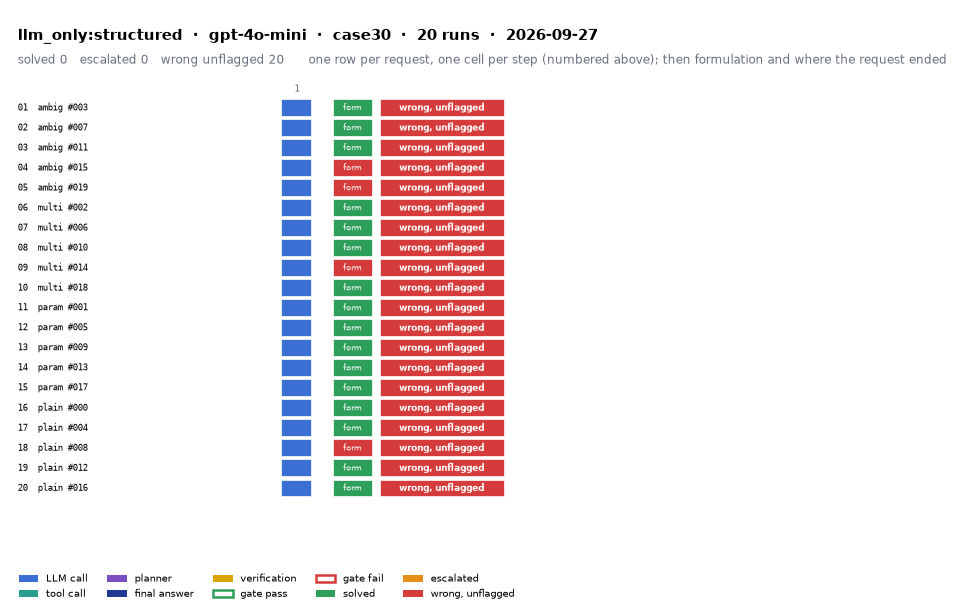

# llm_only:structured on IEEE 30-bus with gpt-4o-mini

Generated 2026-09-28 00:22 by evaluation/postprocess.py from `report.rescored.json`. Runs: 20. Scored by the unified evaluator (v2): every verdict below is read from the answer JSON, the same way for every method.

## Run

| field | value |
|---|---|
| date | 2026-09-27 |
| model | openrouter:openai/gpt-4o-mini |
| method | llm_only:structured |
| case | case30 |
| condition | normal |
| n | 20 |
| seed | 0 |
| k | 1 |
| max_rounds | 8 |
| tool_variant | load_split |
| plan_variant | text |
| temperature | 0.0 |
| system_prompt_hash | 183abd966fbd |
| description | LLM answers from the case tables in the prompt. No tools. Structured prompt: role, full case tables as system data, task, JSON output schema. |
| prompt files | _shared/llm_only_system_prompt.txt, _shared/llm_only_user_template.txt, _shared/llm_only_bus_id_note.txt |

One row per request, one cell per step (blue LLM call, teal tool call, purple planner, gold verification; green or red edge is the gate verdict), then formulation and where the request ended. Each run also has its own figure next to its traces: `traces/NN_<request>.png`.

## Where every request ended

The three outcomes are exclusive and sum to the run count. Escalation takes precedence: a run the method handed to a person is not an autonomous answer, right or wrong.

| outcome | count | share |
|---|---:|---:|
| Solved autonomously | 0 | 0.0% |
| Escalated to a person | 0 | 0.0% |
| Wrong, unflagged | 20 | 100.0% |
| **Total** | **20** | 100% |

## Metrics

| group | metric | value |
|---|---|---|
| Task utility | Formulation exact | 16/20 (80.0%) |
| Task utility | Formulation error types | missed_step: 3, wrong_id: 1 |
| Task utility | Voltage MAE, all runs | 0.0357 p.u. |
| Task utility | Voltage MAE, formulation-exact runs | 0.0397 p.u. |
| Task utility | Flow MAE, all runs | 7.753 MW |
| Task utility | Flow MAE, formulation-exact runs | 7.8485 MW |
| Task utility | KCL mismatch, mean | 10.1663 MW |
| Solver-grounded correctness | Solved (computation right, any path) | 0/20 (0.0%) |
| Solver-grounded correctness | V-pass (all conditions, offline) | 0/20 (0.0%) |
| Reporting | Traceable answers | 0/20 (0.0%) |
| Reporting | Traceable numbers, mean share | 0.12 |
| Reporting | Stale state quoted | 0/20 |
| Cost and time | LLM calls / tool calls, mean | 1 / 0 |
| Cost and time | Prompt / completion tokens, mean | 4107 / 2522 |
| Cost and time | Cost, total | $0.0426 |
| Cost and time | Wall time, mean | 22.1 s |

### Cross-check against the runner's own scoreboard

Values the runner aggregated for the same rows (report.json scoreboard). They should agree with the table above; a disagreement means the rows were filtered differently.

| metric | runner scoreboard | this report |
|---|---:|---:|
| common_solved_count | 0 | 0 |
| common_escalated_count | 0 | 0 |
| common_wrong_count | 20 | 20 |
| common_formulation_count | 16 | 16 |
| common_traceable_count | 0 | 0 |
| common_n | 20 | 20 |

## By request difficulty

| difficulty | n | solved | escalated | wrong unflagged | formulation exact |
|---|---:|---:|---:|---:|---:|
| ambiguous | 5 | 0 | 0 | 5 | 3 |
| multistep | 5 | 0 | 0 | 5 | 4 |
| parameterized | 5 | 0 | 0 | 5 | 5 |
| plain | 5 | 0 | 0 | 5 | 4 |

## Wrong and unflagged (20)

- `case30-ambiguous-003-s0` formulation exact; declared:  ([narrative](traces/01_case30-ambiguous-003-s0.narrative.txt), [transcript](traces/01_case30-ambiguous-003-s0.transcript.txt))
- `case30-ambiguous-007-s0` formulation exact; declared:  ([narrative](traces/02_case30-ambiguous-007-s0.narrative.txt), [transcript](traces/02_case30-ambiguous-007-s0.transcript.txt))
- `case30-ambiguous-011-s0` formulation exact; declared:  ([narrative](traces/03_case30-ambiguous-011-s0.narrative.txt), [transcript](traces/03_case30-ambiguous-011-s0.transcript.txt))
- `case30-ambiguous-015-s0` formulation missed_step; the formulation declared in the answer omits load_case, which the request needs  ([narrative](traces/04_case30-ambiguous-015-s0.narrative.txt), [transcript](traces/04_case30-ambiguous-015-s0.transcript.txt))
- `case30-ambiguous-019-s0` formulation wrong_id; declared: disconnect_line: from_bus intended 8 != executed 7; disconnect_line: to_bus intended 28 != executed 27  ([narrative](traces/05_case30-ambiguous-019-s0.narrative.txt), [transcript](traces/05_case30-ambiguous-019-s0.transcript.txt))
- `case30-multistep-002-s0` formulation exact; declared:  ([narrative](traces/06_case30-multistep-002-s0.narrative.txt), [transcript](traces/06_case30-multistep-002-s0.transcript.txt))
- `case30-multistep-006-s0` formulation exact; declared:  ([narrative](traces/07_case30-multistep-006-s0.narrative.txt), [transcript](traces/07_case30-multistep-006-s0.transcript.txt))
- `case30-multistep-010-s0` formulation exact; declared:  ([narrative](traces/08_case30-multistep-010-s0.narrative.txt), [transcript](traces/08_case30-multistep-010-s0.transcript.txt))
- `case30-multistep-014-s0` formulation missed_step; the formulation declared in the answer omits load_case, which the request needs  ([narrative](traces/09_case30-multistep-014-s0.narrative.txt), [transcript](traces/09_case30-multistep-014-s0.transcript.txt))
- `case30-multistep-018-s0` formulation exact; declared:  ([narrative](traces/10_case30-multistep-018-s0.narrative.txt), [transcript](traces/10_case30-multistep-018-s0.transcript.txt))
- `case30-parameterized-001-s0` formulation exact; declared:  ([narrative](traces/11_case30-parameterized-001-s0.narrative.txt), [transcript](traces/11_case30-parameterized-001-s0.transcript.txt))
- `case30-parameterized-005-s0` formulation exact; declared:  ([narrative](traces/12_case30-parameterized-005-s0.narrative.txt), [transcript](traces/12_case30-parameterized-005-s0.transcript.txt))
- `case30-parameterized-009-s0` formulation exact; declared:  ([narrative](traces/13_case30-parameterized-009-s0.narrative.txt), [transcript](traces/13_case30-parameterized-009-s0.transcript.txt))
- `case30-parameterized-013-s0` formulation exact; declared:  ([narrative](traces/14_case30-parameterized-013-s0.narrative.txt), [transcript](traces/14_case30-parameterized-013-s0.transcript.txt))
- `case30-parameterized-017-s0` formulation exact; declared:  ([narrative](traces/15_case30-parameterized-017-s0.narrative.txt), [transcript](traces/15_case30-parameterized-017-s0.transcript.txt))
- `case30-plain-000-s0` formulation exact; declared:  ([narrative](traces/16_case30-plain-000-s0.narrative.txt), [transcript](traces/16_case30-plain-000-s0.transcript.txt))
- `case30-plain-004-s0` formulation exact; declared:  ([narrative](traces/17_case30-plain-004-s0.narrative.txt), [transcript](traces/17_case30-plain-004-s0.transcript.txt))
- `case30-plain-008-s0` formulation missed_step; the formulation declared in the answer omits load_case, which the request needs  ([narrative](traces/18_case30-plain-008-s0.narrative.txt), [transcript](traces/18_case30-plain-008-s0.transcript.txt))
- `case30-plain-012-s0` formulation exact; declared:  ([narrative](traces/19_case30-plain-012-s0.narrative.txt), [transcript](traces/19_case30-plain-012-s0.transcript.txt))
- `case30-plain-016-s0` formulation exact; declared:  ([narrative](traces/20_case30-plain-016-s0.narrative.txt), [transcript](traces/20_case30-plain-016-s0.transcript.txt))

## Formulation not exact (4)

- `case30-ambiguous-015-s0` missed_step: the formulation declared in the answer omits load_case, which the request needs  ([narrative](traces/04_case30-ambiguous-015-s0.narrative.txt), [transcript](traces/04_case30-ambiguous-015-s0.transcript.txt))
- `case30-ambiguous-019-s0` wrong_id: declared: disconnect_line: from_bus intended 8 != executed 7; disconnect_line: to_bus intended 28 != executed 27  ([narrative](traces/05_case30-ambiguous-019-s0.narrative.txt), [transcript](traces/05_case30-ambiguous-019-s0.transcript.txt))
- `case30-multistep-014-s0` missed_step: the formulation declared in the answer omits load_case, which the request needs  ([narrative](traces/09_case30-multistep-014-s0.narrative.txt), [transcript](traces/09_case30-multistep-014-s0.transcript.txt))
- `case30-plain-008-s0` missed_step: the formulation declared in the answer omits load_case, which the request needs  ([narrative](traces/18_case30-plain-008-s0.narrative.txt), [transcript](traces/18_case30-plain-008-s0.transcript.txt))

## Untraceable numbers in the answer (20)

- `case30-ambiguous-003-s0` 148 of 148 numbers; values ['173.5 MW', '173.5 MW', '0.0 MW', '1.0', '0.0', '1.0', '-0.0', '1.0', '-0.0', '1.0', '-0.0', '1.0', '-0.0', '1.0', '-0.0', '1.0', '-0.0', '1.0', '-0.0', '1.0']  ([narrative](traces/01_case30-ambiguous-003-s0.narrative.txt), [transcript](traces/01_case30-ambiguous-003-s0.transcript.txt))
- `case30-ambiguous-007-s0` 144 of 144 numbers; values ['139.8 MW', '139.5 MW', '0.3 MW', '0.0', '1.01', '-1.5', '1.02', '-2.0', '1.03', '-3.0', '1.01', '-1.0', '0.0', '1.02', '-2.5', '1.01', '-1.5', '0.0', '1.01', '-1.0']  ([narrative](traces/02_case30-ambiguous-007-s0.narrative.txt), [transcript](traces/02_case30-ambiguous-007-s0.transcript.txt))
- `case30-ambiguous-011-s0` 150 of 150 numbers; values ['10.7', '10.7 MW', '153.0 MW', '153.0 MW', '0.0 MW', '1.0', '0.0', '1.01', '-1.5', '1.02', '-2.0', '1.01', '-1.0', '1.0', '0.0', '1.0', '0.0', '1.0', '0.0', '1.0']  ([narrative](traces/03_case30-ambiguous-011-s0.narrative.txt), [transcript](traces/03_case30-ambiguous-011-s0.transcript.txt))
- `case30-ambiguous-015-s0` 150 of 150 numbers; values ['156.9 MW', '156.9 MW', '0.0 MW', '1.0', '0.0', '1.01', '-1.5', '1.02', '-2.0', '1.01', '-1.0', '1.0', '0.0', '1.0', '0.0', '1.0', '0.0', '1.0', '0.0', '1.0']  ([narrative](traces/04_case30-ambiguous-015-s0.narrative.txt), [transcript](traces/04_case30-ambiguous-015-s0.transcript.txt))
- `case30-ambiguous-019-s0` 148 of 148 numbers; values ['139.1 MW', '139.0 MW', '0.1 MW', '1.0', '1.01', '-1.5', '1.02', '-2.0', '1.03', '-3.0', '1.01', '-1.0', '1.00', '1.02', '-2.5', '1.01', '-1.5', '1.00', '1.01', '-1.0']  ([narrative](traces/05_case30-ambiguous-019-s0.narrative.txt), [transcript](traces/05_case30-ambiguous-019-s0.transcript.txt))
- `case30-multistep-002-s0` 65 of 65 numbers; values ['0.9345 p.u.', '0.0', '0.0', '0.0', '0.0', '0.0', '0.0', '0.0', '0.0', '0.0', '0.0', '0.0', '0.0', '0.0', '0.0', '0.0', '0.0', '0.0', '0.9345', '0.0']  ([narrative](traces/06_case30-multistep-002-s0.narrative.txt), [transcript](traces/06_case30-multistep-002-s0.transcript.txt))
- `case30-multistep-006-s0` 153 of 153 numbers; values ['102.5%', '101.3%', '101.1%', '1.0', '0.0', '1.0', '0.0', '1.0', '0.0', '1.0', '0.0', '1.0', '0.0', '1.0', '0.0', '1.0', '0.0', '1.0', '0.0', '1.0']  ([narrative](traces/07_case30-multistep-006-s0.narrative.txt), [transcript](traces/07_case30-multistep-006-s0.transcript.txt))
- `case30-multistep-010-s0` 149 of 149 numbers; values ['105.3%', '102.1%', '0.0', '0.98', '-2.5', '0.97', '-5.0', '0.96', '-7.5', '0.95', '-10.0', '0.97', '-3.0', '0.98', '-1.0', '0.99', '0.0', '0.98', '-2.0', '0.97']  ([narrative](traces/08_case30-multistep-010-s0.narrative.txt), [transcript](traces/08_case30-multistep-010-s0.transcript.txt))
- `case30-multistep-014-s0` 67 of 67 numbers; values ['0.9472 p.u.', '1.0', '0.0', '1.0', '0.0', '1.0', '0.0', '1.0', '0.0', '1.0', '0.0', '1.0', '0.0', '1.0', '0.0', '1.0', '0.0', '1.0', '0.0', '0.9999']  ([narrative](traces/09_case30-multistep-014-s0.narrative.txt), [transcript](traces/09_case30-multistep-014-s0.transcript.txt))
- `case30-multistep-018-s0` 150 of 150 numbers; values ['100.5%', '95.3%', '1.0', '0.0', '1.01', '-1.5', '1.02', '-2.0', '1.03', '-3.0', '1.02', '-1.0', '1.01', '-1.5', '1.00', '0.0', '1.01', '-1.0', '1.00', '0.0']  ([narrative](traces/10_case30-multistep-018-s0.narrative.txt), [transcript](traces/10_case30-multistep-018-s0.transcript.txt))
- `case30-parameterized-001-s0` 150 of 150 numbers; values ['0.9345 p.u.', '0.9421 p.u.', '0.9483 p.u.', '0.0', '0.0', '0.0', '0.9421', '0.0', '0.0', '0.0', '0.9345', '0.0', '0.0', '0.0', '0.0', '0.0', '0.0', '0.0', '0.0', '0.0']  ([narrative](traces/11_case30-parameterized-001-s0.narrative.txt), [transcript](traces/11_case30-parameterized-001-s0.transcript.txt))
- `case30-parameterized-005-s0` 148 of 148 numbers; values ['176.6 MW', '173.5 MW', '3.1 MW', '1.0', '0.0', '1.01', '-0.5', '1.02', '-1.0', '1.03', '-1.5', '1.02', '-2.0', '1.01', '-2.5', '1.00', '-3.0', '1.01', '-3.5', '1.00']  ([narrative](traces/12_case30-parameterized-005-s0.narrative.txt), [transcript](traces/12_case30-parameterized-005-s0.transcript.txt))
- `case30-parameterized-009-s0` 151 of 151 numbers; values ['120.5%', '115.3%', '110.2%', '0.0', '1.01', '-2.5', '1.02', '-5.0', '1.03', '-7.5', '1.04', '-10.0', '1.05', '-12.5', '1.06', '-15.0', '1.07', '-17.5', '1.08', '-20.0']  ([narrative](traces/13_case30-parameterized-009-s0.narrative.txt), [transcript](traces/13_case30-parameterized-009-s0.transcript.txt))
- `case30-parameterized-013-s0` 148 of 148 numbers; values ['147.0 MW', '147.0 MW', '0.0 MW', '1.0', '0.0', '1.01', '-1.5', '1.02', '-2.0', '1.01', '-3.0', '1.0', '-4.0', '1.0', '-5.0', '1.02', '-6.0', '1.03', '-7.0', '1.0']  ([narrative](traces/14_case30-parameterized-013-s0.narrative.txt), [transcript](traces/14_case30-parameterized-013-s0.transcript.txt))
- `case30-parameterized-017-s0` 82 of 82 numbers; values ['120.5%', '0.0', '1.01', '5.0', '1.02', '10.0', '1.03', '15.0', '1.04', '20.0', '1.05', '25.0', '1.06', '1.07', '35.0', '1.08', '40.0', '1.09', '45.0', '1.10']  ([narrative](traces/15_case30-parameterized-017-s0.narrative.txt), [transcript](traces/15_case30-parameterized-017-s0.transcript.txt))
- `case30-plain-000-s0` 147 of 147 numbers; values ['0.9345 p.u.', '1.0', '0.0', '1.0', '0.0', '1.0', '0.0', '1.0', '0.0', '1.0', '0.0', '1.0', '0.0', '1.0', '0.0', '1.0', '0.0', '1.0', '0.0', '1.0']  ([narrative](traces/16_case30-plain-000-s0.narrative.txt), [transcript](traces/16_case30-plain-000-s0.transcript.txt))
- `case30-plain-004-s0` 147 of 147 numbers; values ['120.5%', '0.0', '1.02', '-2.0', '1.01', '-1.5', '1.03', '-1.0', '1.01', '-1.5', '0.0', '0.0', '0.0', '0.0', '0.0', '0.0', '0.0', '0.0', '0.0', '0.0']  ([narrative](traces/17_case30-plain-004-s0.narrative.txt), [transcript](traces/17_case30-plain-004-s0.transcript.txt))
- `case30-plain-008-s0` 150 of 150 numbers; values ['173.1 MW', '173.1 MW', '0.0 MW', '1.0', '0.0', '1.0', '0.0', '1.0', '0.0', '1.0', '0.0', '1.0', '0.0', '1.0', '0.0', '1.0', '0.0', '1.0', '0.0', '1.0']  ([narrative](traces/18_case30-plain-008-s0.narrative.txt), [transcript](traces/18_case30-plain-008-s0.transcript.txt))
- `case30-plain-012-s0` 148 of 148 numbers; values ['155.4 MW', '155.4 MW', '0.0 MW', '1.0', '0.0', '1.0', '0.0', '1.0', '0.0', '1.0', '0.0', '1.0', '0.0', '1.0', '0.0', '1.0', '0.0', '1.0', '0.0', '1.0']  ([narrative](traces/19_case30-plain-012-s0.narrative.txt), [transcript](traces/19_case30-plain-012-s0.transcript.txt))
- `case30-plain-016-s0` 147 of 147 numbers; values ['120.5%', '0.0', '1.01', '-1.5', '1.02', '-2.0', '1.03', '-3.0', '1.02', '-2.5', '1.01', '-1.0', '0.0', '1.01', '-1.5', '0.0', '0.0', '0.0', '0.0', '0.0']  ([narrative](traces/20_case30-plain-016-s0.narrative.txt), [transcript](traces/20_case30-plain-016-s0.transcript.txt))

## Files

- `summary.csv`: one line per run, the fields above plus tokens and time.
- `traces/NN_<request>.narrative.txt`: what happened in each run, step by step, with the verdicts.
- `traces/NN_<request>.transcript.txt`: the raw exchange, every message, tool call and tool output.
- `traces/NN_<request>.png`: the run as a picture: steps, gate verdicts, formulation, verification, outcome, with a two-line narrative.
- `overview.png`: all runs of this folder on one page.
- `traces/NN_<request>.json`: the raw trace the runner wrote.
- `raw/`: the runner's own outputs (report.json, rescored report, logs).
- `requests.jsonl`: the request set, with the intended tool calls that define formulation exactness.
