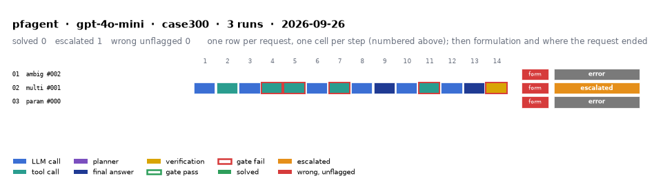

# pfagent on IEEE 300-bus with gpt-4o-mini

Generated 2026-09-26 20:16 by evaluation/postprocess.py from `report.rescored.json`. Runs: 3. Scored by the unified evaluator (v2): every verdict below is read from the answer JSON, the same way for every method.

## Run

| field | value |
|---|---|
| date | 2026-09-26 |
| model | openrouter:openai/gpt-4o-mini |
| method | pfagent |
| case | case300 |
| condition | normal |
| n | 3 |
| seed | 0 |
| k | 1 |
| max_rounds | 8 |
| tool_variant | load_split |
| plan_variant | text |
| temperature | 0.0 |
| system_prompt_hash | 2efb17dd2582 |
| description | PFAgent: ReAct loop with no in-loop gate plus the task-level verification gate V1-V7 on the final answer (methods/agent/engine.py verify_final_answer). The solver-grounded row. |
| prompt files | _shared/agent_system_prompt.txt, _shared/final_answer_instruction.txt |

One row per request, one cell per step (blue LLM call, teal tool call, purple planner, gold verification; green or red edge is the gate verdict), then formulation and where the request ended. Each run also has its own figure next to its traces: `traces/NN_<request>.png`.

## Where every request ended

The three outcomes are exclusive and sum to the run count. Escalation takes precedence: a run the method handed to a person is not an autonomous answer, right or wrong.

| outcome | count | share |
|---|---:|---:|
| Solved autonomously | 0 | 0.0% |
| Escalated to a person | 1 | 33.3% |
| Wrong, unflagged | 0 | 0.0% |
| Run error / other | 2 | 66.7% |
| **Total** | **3** | 100% |

## Metrics

| group | metric | value |
|---|---|---|
| Task utility | Formulation exact | 0/3 (0.0%) |
| Task utility | Formulation error types | unparsed: 3 |
| Task utility | Voltage MAE, all runs | n/a p.u. |
| Task utility | Voltage MAE, formulation-exact runs | n/a p.u. |
| Task utility | Flow MAE, all runs | n/a MW |
| Task utility | Flow MAE, formulation-exact runs | n/a MW |
| Task utility | KCL mismatch, mean | n/a MW |
| Solver-grounded correctness | Solved (computation right, any path) | 0/3 (0.0%) |
| Solver-grounded correctness | V-pass (all conditions, offline) | 2/3 (66.7%) |
| Reporting | Traceable answers | 3/3 (100.0%) |
| Reporting | Traceable numbers, mean share | 1 |
| Reporting | Stale state quoted | 0/3 |
| Cost and time | LLM calls / tool calls, mean | 2.67 / 1.67 |
| Cost and time | Prompt / completion tokens, mean | 3.17e+05 / 37211 |
| Cost and time | Cost, total | $0.0699 |
| Cost and time | Wall time, mean | 311.5 s |

### Cross-check against the runner's own scoreboard

Values the runner aggregated for the same rows (report.json scoreboard). They should agree with the table above; a disagreement means the rows were filtered differently.

| metric | runner scoreboard | this report |
|---|---:|---:|
| common_solved_count | 0 | 0 |
| common_escalated_count | 1 | 1 |
| common_wrong_count | 0 | 0 |
| common_formulation_count | 0 | 0 |
| common_traceable_count | 1 | 3  <-- differs |
| common_n | 1 | 3  <-- differs |

## By request difficulty

| difficulty | n | solved | escalated | wrong unflagged | formulation exact |
|---|---:|---:|---:|---:|---:|
| ambiguous | 1 | 0 | 0 | 0 | 0 |
| multistep | 1 | 0 | 1 | 0 | 0 |
| parameterized | 1 | 0 | 0 | 0 | 0 |

## Escalated (1)

- `case300-multistep-001-s0` detected via gate_abstained; formulation unparsed; no formulation field in the answer  ([narrative](traces/02_case300-multistep-001-s0.narrative.txt), [transcript](traces/02_case300-multistep-001-s0.transcript.txt))

## Formulation not exact (3)

- `case300-ambiguous-002-s0` unparsed: no formulation field in the answer  ([narrative](traces/01_case300-ambiguous-002-s0.narrative.txt), [transcript](traces/01_case300-ambiguous-002-s0.transcript.txt))
- `case300-multistep-001-s0` unparsed: no formulation field in the answer  ([narrative](traces/02_case300-multistep-001-s0.narrative.txt), [transcript](traces/02_case300-multistep-001-s0.transcript.txt))
- `case300-parameterized-000-s0` unparsed: no formulation field in the answer  ([narrative](traces/03_case300-parameterized-000-s0.narrative.txt), [transcript](traces/03_case300-parameterized-000-s0.transcript.txt))

## Run errors (2)

- `case300-ambiguous-002-s0` KeyError: 'voltage_violations'  ([narrative](traces/01_case300-ambiguous-002-s0.narrative.txt), [transcript](traces/01_case300-ambiguous-002-s0.transcript.txt))
- `case300-parameterized-000-s0` KeyError: 'voltage_violations'  ([narrative](traces/03_case300-parameterized-000-s0.narrative.txt), [transcript](traces/03_case300-parameterized-000-s0.transcript.txt))

## Files

- `summary.csv`: one line per run, the fields above plus tokens and time.
- `traces/NN_<request>.narrative.txt`: what happened in each run, step by step, with the verdicts.
- `traces/NN_<request>.transcript.txt`: the raw exchange, every message, tool call and tool output.
- `traces/NN_<request>.png`: the run as a picture: steps, gate verdicts, formulation, verification, outcome, with a two-line narrative.
- `overview.png`: all runs of this folder on one page.
- `traces/NN_<request>.json`: the raw trace the runner wrote.
- `raw/`: the runner's own outputs (report.json, rescored report, logs).
- `requests.jsonl`: the request set, with the intended tool calls that define formulation exactness.
