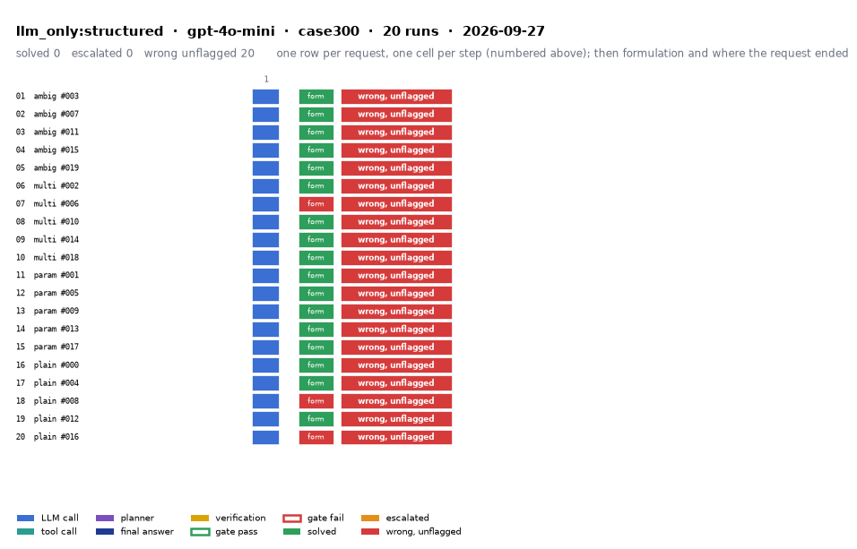

# llm_only:structured on IEEE 300-bus with gpt-4o-mini

Generated 2026-09-28 00:39 by evaluation/postprocess.py from `report.rescored.json`. Runs: 20. Scored by the unified evaluator (v2): every verdict below is read from the answer JSON, the same way for every method.

## Run

| field | value |
|---|---|
| date | 2026-09-27 |
| model | openrouter:openai/gpt-4o-mini |
| method | llm_only:structured |
| case | case300 |
| condition | normal |
| n | 20 |
| seed | 0 |
| k | 1 |
| max_rounds | 8 |
| tool_variant | load_split |
| plan_variant | text |
| temperature | 0.0 |
| system_prompt_hash | 183abd966fbd |
| description | LLM answers from the case tables in the prompt. No tools. Structured prompt: role, full case tables as system data, task, JSON output schema. |
| prompt files | _shared/llm_only_system_prompt.txt, _shared/llm_only_user_template.txt, _shared/llm_only_bus_id_note.txt |

One row per request, one cell per step (blue LLM call, teal tool call, purple planner, gold verification; green or red edge is the gate verdict), then formulation and where the request ended. Each run also has its own figure next to its traces: `traces/NN_<request>.png`.

## Where every request ended

The three outcomes are exclusive and sum to the run count. Escalation takes precedence: a run the method handed to a person is not an autonomous answer, right or wrong.

| outcome | count | share |
|---|---:|---:|
| Solved autonomously | 0 | 0.0% |
| Escalated to a person | 0 | 0.0% |
| Wrong, unflagged | 20 | 100.0% |
| **Total** | **20** | 100% |

## Metrics

| group | metric | value |
|---|---|---|
| Task utility | Formulation exact | 17/20 (85.0%) |
| Task utility | Formulation error types | unparsed: 2, missed_step: 1 |
| Task utility | Voltage MAE, all runs | 0.0798 p.u. |
| Task utility | Voltage MAE, formulation-exact runs | 0.0827 p.u. |
| Task utility | Flow MAE, all runs | 65.293 MW |
| Task utility | Flow MAE, formulation-exact runs | 72.2454 MW |
| Task utility | KCL mismatch, mean | 7.4157 MW |
| Solver-grounded correctness | Solved (computation right, any path) | 0/20 (0.0%) |
| Solver-grounded correctness | V-pass (all conditions, offline) | 0/20 (0.0%) |
| Reporting | Traceable answers | 0/20 (0.0%) |
| Reporting | Traceable numbers, mean share | 0.107 |
| Reporting | Stale state quoted | 0/20 |
| Cost and time | LLM calls / tool calls, mean | 1 / 0 |
| Cost and time | Prompt / completion tokens, mean | 25529 / 8405 |
| Cost and time | Cost, total | $0.1774 |
| Cost and time | Wall time, mean | 60.8 s |

### Cross-check against the runner's own scoreboard

Values the runner aggregated for the same rows (report.json scoreboard). They should agree with the table above; a disagreement means the rows were filtered differently.

| metric | runner scoreboard | this report |
|---|---:|---:|
| common_solved_count | 0 | 0 |
| common_escalated_count | 0 | 0 |
| common_wrong_count | 20 | 20 |
| common_formulation_count | 17 | 17 |
| common_traceable_count | 0 | 0 |
| common_n | 20 | 20 |

## By request difficulty

| difficulty | n | solved | escalated | wrong unflagged | formulation exact |
|---|---:|---:|---:|---:|---:|
| ambiguous | 5 | 0 | 0 | 5 | 5 |
| multistep | 5 | 0 | 0 | 5 | 4 |
| parameterized | 5 | 0 | 0 | 5 | 5 |
| plain | 5 | 0 | 0 | 5 | 3 |

## Wrong and unflagged (20)

- `case300-ambiguous-003-s0` formulation exact; declared:  ([narrative](traces/01_case300-ambiguous-003-s0.narrative.txt), [transcript](traces/01_case300-ambiguous-003-s0.transcript.txt))
- `case300-ambiguous-007-s0` formulation exact; declared:  ([narrative](traces/02_case300-ambiguous-007-s0.narrative.txt), [transcript](traces/02_case300-ambiguous-007-s0.transcript.txt))
- `case300-ambiguous-011-s0` formulation exact; declared:  ([narrative](traces/03_case300-ambiguous-011-s0.narrative.txt), [transcript](traces/03_case300-ambiguous-011-s0.transcript.txt))
- `case300-ambiguous-015-s0` formulation exact; declared:  ([narrative](traces/04_case300-ambiguous-015-s0.narrative.txt), [transcript](traces/04_case300-ambiguous-015-s0.transcript.txt))
- `case300-ambiguous-019-s0` formulation exact; declared:  ([narrative](traces/05_case300-ambiguous-019-s0.narrative.txt), [transcript](traces/05_case300-ambiguous-019-s0.transcript.txt))
- `case300-multistep-002-s0` formulation exact; declared:  ([narrative](traces/06_case300-multistep-002-s0.narrative.txt), [transcript](traces/06_case300-multistep-002-s0.transcript.txt))
- `case300-multistep-006-s0` formulation unparsed; no formulation field in the answer  ([narrative](traces/07_case300-multistep-006-s0.narrative.txt), [transcript](traces/07_case300-multistep-006-s0.transcript.txt))
- `case300-multistep-010-s0` formulation exact; declared:  ([narrative](traces/08_case300-multistep-010-s0.narrative.txt), [transcript](traces/08_case300-multistep-010-s0.transcript.txt))
- `case300-multistep-014-s0` formulation exact; declared:  ([narrative](traces/09_case300-multistep-014-s0.narrative.txt), [transcript](traces/09_case300-multistep-014-s0.transcript.txt))
- `case300-multistep-018-s0` formulation exact; declared:  ([narrative](traces/10_case300-multistep-018-s0.narrative.txt), [transcript](traces/10_case300-multistep-018-s0.transcript.txt))
- `case300-parameterized-001-s0` formulation exact; declared:  ([narrative](traces/11_case300-parameterized-001-s0.narrative.txt), [transcript](traces/11_case300-parameterized-001-s0.transcript.txt))
- `case300-parameterized-005-s0` formulation exact; declared:  ([narrative](traces/12_case300-parameterized-005-s0.narrative.txt), [transcript](traces/12_case300-parameterized-005-s0.transcript.txt))
- `case300-parameterized-009-s0` formulation exact; declared:  ([narrative](traces/13_case300-parameterized-009-s0.narrative.txt), [transcript](traces/13_case300-parameterized-009-s0.transcript.txt))
- `case300-parameterized-013-s0` formulation exact; declared:  ([narrative](traces/14_case300-parameterized-013-s0.narrative.txt), [transcript](traces/14_case300-parameterized-013-s0.transcript.txt))
- `case300-parameterized-017-s0` formulation exact; declared:  ([narrative](traces/15_case300-parameterized-017-s0.narrative.txt), [transcript](traces/15_case300-parameterized-017-s0.transcript.txt))
- `case300-plain-000-s0` formulation exact; declared:  ([narrative](traces/16_case300-plain-000-s0.narrative.txt), [transcript](traces/16_case300-plain-000-s0.transcript.txt))
- `case300-plain-004-s0` formulation exact; declared:  ([narrative](traces/17_case300-plain-004-s0.narrative.txt), [transcript](traces/17_case300-plain-004-s0.transcript.txt))
- `case300-plain-008-s0` formulation missed_step; the formulation declared in the answer omits load_case, which the request needs  ([narrative](traces/18_case300-plain-008-s0.narrative.txt), [transcript](traces/18_case300-plain-008-s0.transcript.txt))
- `case300-plain-012-s0` formulation exact; declared:  ([narrative](traces/19_case300-plain-012-s0.narrative.txt), [transcript](traces/19_case300-plain-012-s0.transcript.txt))
- `case300-plain-016-s0` formulation unparsed; no formulation field in the answer  ([narrative](traces/20_case300-plain-016-s0.narrative.txt), [transcript](traces/20_case300-plain-016-s0.transcript.txt))

## Formulation not exact (3)

- `case300-multistep-006-s0` unparsed: no formulation field in the answer  ([narrative](traces/07_case300-multistep-006-s0.narrative.txt), [transcript](traces/07_case300-multistep-006-s0.transcript.txt))
- `case300-plain-008-s0` missed_step: the formulation declared in the answer omits load_case, which the request needs  ([narrative](traces/18_case300-plain-008-s0.narrative.txt), [transcript](traces/18_case300-plain-008-s0.transcript.txt))
- `case300-plain-016-s0` unparsed: no formulation field in the answer  ([narrative](traces/20_case300-plain-016-s0.narrative.txt), [transcript](traces/20_case300-plain-016-s0.transcript.txt))

## Untraceable numbers in the answer (20)

- `case300-ambiguous-003-s0` 603 of 603 numbers; values ['1.02', '0.0', '1.01', '-1.0', '1.00', '-2.0', '1.00', '-3.0', '1.00', '-4.0', '1.00', '-5.0', '1.00', '-6.0', '1.00', '-7.0', '1.00', '-8.0', '1.00', '-9.0']  ([narrative](traces/01_case300-ambiguous-003-s0.narrative.txt), [transcript](traces/01_case300-ambiguous-003-s0.transcript.txt))
- `case300-ambiguous-007-s0` 603 of 603 numbers; values ['1.02', '0.0', '1.01', '-1.0', '-2.0', '-3.0', '-4.0', '-5.0', '-6.0', '-7.0', '-8.0', '-9.0', '-10.0', '-11.0', '-12.0', '-13.0', '-14.0', '-15.0', '-16.0', '-17.0']  ([narrative](traces/02_case300-ambiguous-007-s0.narrative.txt), [transcript](traces/02_case300-ambiguous-007-s0.transcript.txt))
- `case300-ambiguous-011-s0` 608 of 608 numbers; values ['0.0 MW', '0.0 MW', '1.05', '0.0', '1.04', '-2.0', '1.03', '-4.0', '1.02', '-6.0', '1.01', '-8.0', '1.00', '-10.0', '1.00', '-12.0', '1.00', '-14.0', '1.00', '-16.0']  ([narrative](traces/03_case300-ambiguous-011-s0.narrative.txt), [transcript](traces/03_case300-ambiguous-011-s0.transcript.txt))
- `case300-ambiguous-015-s0` 608 of 608 numbers; values ['0.0 MW', '0.0 MW', '1.05', '0.0', '1.04', '-1.0', '1.03', '-2.0', '1.02', '-3.0', '1.01', '-4.0', '1.00', '-5.0', '1.00', '-6.0', '1.00', '-7.0', '1.00', '-8.0']  ([narrative](traces/04_case300-ambiguous-015-s0.narrative.txt), [transcript](traces/04_case300-ambiguous-015-s0.transcript.txt))
- `case300-ambiguous-019-s0` 603 of 603 numbers; values ['1.02', '0.0', '1.01', '-2.0', '-4.0', '-6.0', '-8.0', '-10.0', '-12.0', '-14.0', '-16.0', '-18.0', '-20.0', '-22.0', '-24.0', '-26.0', '-28.0', '-30.0', '-32.0', '-34.0']  ([narrative](traces/05_case300-ambiguous-019-s0.narrative.txt), [transcript](traces/05_case300-ambiguous-019-s0.transcript.txt))
- `case300-multistep-002-s0` 615 of 615 numbers; values ['110.5%', '102.3%', '101.2%', '1.02', '0.0', '1.01', '0.0', '1.00', '0.0', '1.00', '0.0', '1.00', '0.0', '1.00', '0.0', '1.00', '0.0', '1.00', '0.0', '1.00']  ([narrative](traces/06_case300-multistep-002-s0.narrative.txt), [transcript](traces/06_case300-multistep-002-s0.transcript.txt))
- `case300-multistep-006-s0` 977 of 977 numbers; values ['102.5%', '1.02', '0.0', '1.01', '0.0', '1.00', '0.0', '1.00', '0.0', '1.00', '0.0', '1.00', '0.0', '1.00', '0.0', '1.00', '0.0', '1.00', '0.0', '1.00']  ([narrative](traces/07_case300-multistep-006-s0.narrative.txt), [transcript](traces/07_case300-multistep-006-s0.transcript.txt))
- `case300-multistep-010-s0` 611 of 611 numbers; values ['110.5%', '105.2%', '1.02', '0.0', '1.01', '0.0', '1.00', '0.0', '1.00', '0.0', '1.00', '0.0', '1.00', '0.0', '1.00', '0.0', '1.00', '0.0', '1.00', '0.0']  ([narrative](traces/08_case300-multistep-010-s0.narrative.txt), [transcript](traces/08_case300-multistep-010-s0.transcript.txt))
- `case300-multistep-014-s0` 607 of 607 numbers; values ['0.9482 p.u.', '1.0200', '0.0', '1.0150', '0.0', '1.0120', '0.0', '1.0180', '0.0', '1.0220', '0.0', '1.0190', '0.0', '1.0160', '0.0', '1.0150', '0.0', '1.0140', '0.0', '1.0130']  ([narrative](traces/09_case300-multistep-014-s0.narrative.txt), [transcript](traces/09_case300-multistep-014-s0.transcript.txt))
- `case300-multistep-018-s0` 612 of 612 numbers; values ['101.2%', '95.5%', '1.02', '0.0', '1.01', '0.0', '1.00', '0.0', '1.00', '0.0', '1.00', '0.0', '1.00', '0.0', '1.00', '0.0', '1.00', '0.0', '1.00', '0.0']  ([narrative](traces/10_case300-multistep-018-s0.narrative.txt), [transcript](traces/10_case300-multistep-018-s0.transcript.txt))
- `case300-parameterized-001-s0` 753 of 753 numbers; values ['0.9345 p.u.', '0.9350 p.u.', '0.9400 p.u.', '1.0400', '0.0', '1.0380', '0.0', '1.0350', '0.0', '1.0320', '0.0', '1.0300', '0.0', '1.0280', '0.0', '1.0250', '0.0', '1.0200', '0.0', '1.0150']  ([narrative](traces/11_case300-parameterized-001-s0.narrative.txt), [transcript](traces/11_case300-parameterized-001-s0.transcript.txt))
- `case300-parameterized-005-s0` 606 of 606 numbers; values ['0.0 MW', '0.0 MW', '0.0 MW', '1.05', '0.0', '1.04', '0.0', '1.03', '0.0', '1.02', '0.0', '1.01', '0.0', '1.00', '0.0', '0.99', '0.0', '0.98', '0.0', '0.97']  ([narrative](traces/12_case300-parameterized-005-s0.narrative.txt), [transcript](traces/12_case300-parameterized-005-s0.transcript.txt))
- `case300-parameterized-009-s0` 638 of 638 numbers; values ['1.02', '0.0', '1.01', '0.0', '0.0', '1.03', '0.0', '1.04', '0.0', '1.02', '0.0', '1.01', '0.0', '0.0', '1.02', '0.0', '1.03', '0.0', '1.01', '0.0']  ([narrative](traces/13_case300-parameterized-009-s0.narrative.txt), [transcript](traces/13_case300-parameterized-009-s0.transcript.txt))
- `case300-parameterized-013-s0` 603 of 603 numbers; values ['1.02', '0.0', '1.01', '-1.0', '1.00', '-2.0', '1.00', '-3.0', '1.00', '-4.0', '1.00', '-5.0', '1.00', '-6.0', '1.00', '-7.0', '1.00', '-8.0', '1.00', '-9.0']  ([narrative](traces/14_case300-parameterized-013-s0.narrative.txt), [transcript](traces/14_case300-parameterized-013-s0.transcript.txt))
- `case300-parameterized-017-s0` 639 of 639 numbers; values ['1.02', '0.0', '1.01', '0.0', '0.0', '1.03', '0.0', '1.04', '0.0', '1.02', '0.0', '1.01', '0.0', '0.0', '1.01', '0.0', '1.02', '0.0', '1.03', '0.0']  ([narrative](traces/15_case300-parameterized-017-s0.narrative.txt), [transcript](traces/15_case300-parameterized-017-s0.transcript.txt))
- `case300-plain-000-s0` 21 of 21 numbers; values ['0.9345 p.u.', '1.0456', '0.0', '1.0345', '0.0', '1.0234', '0.0', '1.0123', '0.0', '1.0012', '0.0', '0.9901', '0.0', '0.9345', '0.0', '156.9', '44.8', '0.0', '0.0', '0.0']  ([narrative](traces/16_case300-plain-000-s0.narrative.txt), [transcript](traces/16_case300-plain-000-s0.transcript.txt))
- `case300-plain-004-s0` 615 of 615 numbers; values ['120.5%', '1.02', '0.0', '1.01', '0.0', '0.0', '1.03', '0.0', '1.02', '0.0', '1.01', '0.0', '0.0', '1.01', '0.0', '0.0', '1.02', '0.0', '1.01', '0.0']  ([narrative](traces/17_case300-plain-004-s0.narrative.txt), [transcript](traces/17_case300-plain-004-s0.transcript.txt))
- `case300-plain-008-s0` 33 of 33 numbers; values ['0.0 MW', '0.0 MW', '1.06', '0.0', '1.05', '0.0', '1.04', '0.0', '1.03', '0.0', '1.02', '0.0', '1.01', '0.0', '0.0', '0.99', '0.0', '0.98', '0.0', '0.97']  ([narrative](traces/18_case300-plain-008-s0.narrative.txt), [transcript](traces/18_case300-plain-008-s0.transcript.txt))
- `case300-plain-012-s0` 36 of 36 numbers; values ['10,000 MW', '9,500 MW', '500 MW', '1.02', '0.0', '1.01', '-5.0', '1.00', '-10.0', '1.03', '-2.0', '1.04', '1.0', '1.00', '-15.0', '1.01', '-8.0', '1.02', '-3.0', '1.00']  ([narrative](traces/19_case300-plain-012-s0.narrative.txt), [transcript](traces/19_case300-plain-012-s0.transcript.txt))
- `case300-plain-016-s0` 987 of 987 numbers; values ['110.5%', '1.02', '0.0', '1.01', '0.0', '0.0', '1.03', '0.0', '1.04', '0.0', '1.01', '0.0', '1.02', '0.0', '1.01', '0.0', '0.0', '1.02', '0.0', '1.01']  ([narrative](traces/20_case300-plain-016-s0.narrative.txt), [transcript](traces/20_case300-plain-016-s0.transcript.txt))

## Run errors (2)

- `case300-multistep-006-s0` ValueError: no_json_object_found  ([narrative](traces/07_case300-multistep-006-s0.narrative.txt), [transcript](traces/07_case300-multistep-006-s0.transcript.txt))
- `case300-plain-016-s0` ValueError: no_json_object_found  ([narrative](traces/20_case300-plain-016-s0.narrative.txt), [transcript](traces/20_case300-plain-016-s0.transcript.txt))

## Files

- `summary.csv`: one line per run, the fields above plus tokens and time.
- `traces/NN_<request>.narrative.txt`: what happened in each run, step by step, with the verdicts.
- `traces/NN_<request>.transcript.txt`: the raw exchange, every message, tool call and tool output.
- `traces/NN_<request>.png`: the run as a picture: steps, gate verdicts, formulation, verification, outcome, with a two-line narrative.
- `overview.png`: all runs of this folder on one page.
- `traces/NN_<request>.json`: the raw trace the runner wrote.
- `raw/`: the runner's own outputs (report.json, rescored report, logs).
- `requests.jsonl`: the request set, with the intended tool calls that define formulation exactness.
