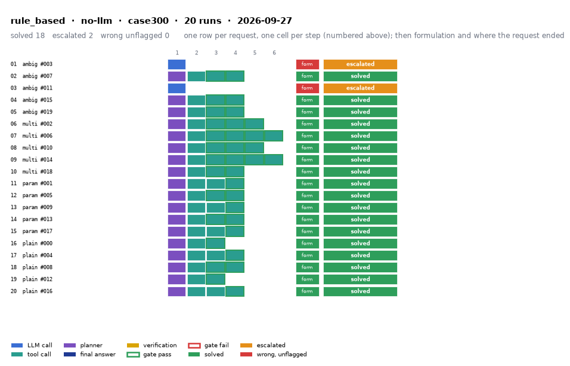

# rule_based on IEEE 300-bus with no-llm

Generated 2026-09-28 13:42 by evaluation/postprocess.py from `report.rescored.json`. Runs: 20. Scored by the unified evaluator (v2): every verdict below is read from the answer JSON, the same way for every method.

## Run

| field | value |
|---|---|
| date | 2026-09-27 |
| model | none:rule_based |
| method | rule_based |
| case | case300 |
| condition | normal |
| n | 20 |
| seed | 0 |
| k | 1 |
| max_rounds | 8 |
| tool_variant | load_split |
| plan_variant | text |
| temperature | 0.0 |
| system_prompt_hash | None |
| description | Deterministic regex parser maps the request to tool calls, no LLM (methods/deterministic/rule_based.py). The conventional-workflow row. |
| prompt files | none (no LLM) |

One row per request, one cell per step (blue LLM call, teal tool call, purple planner, gold verification; green or red edge is the gate verdict), then formulation and where the request ended. Each run also has its own figure next to its traces: `traces/NN_<request>.png`.

## Where every request ended

The three outcomes are exclusive and cover every request the method answered. Escalation takes precedence: a run the method handed to a person is not an autonomous answer, right or wrong. A request whose API call failed never reached an answer, so it is listed apart and excluded from the rates.

| outcome | count | share |
|---|---:|---:|
| Solved autonomously | 18 | 90.0% |
| Escalated to a person | 2 | 10.0% |
| Wrong, unflagged | 0 | 0.0% |
| **Total** | **20** | 100% |

## Metrics

| group | metric | value |
|---|---|---|
| Task utility | Formulation exact | 18/18 (100.0%) |
| Task utility | Voltage MAE, all runs | 1.93e-07 p.u. |
| Task utility | Voltage MAE, formulation-exact runs | 1.93e-07 p.u. |
| Task utility | Flow MAE, all runs | 2.48e-04 MW |
| Task utility | Flow MAE, formulation-exact runs | 2.48e-04 MW |
| Task utility | KCL mismatch, mean | 1.76e-04 MW |
| Solver-grounded correctness | Solved (computation right, any path) | 18/20 (90.0%) |
| Solver-grounded correctness | V-pass (all conditions, offline) | 18/20 (90.0%) |
| Reporting | Traceable answers | 18/20 (90.0%) |
| Reporting | Traceable numbers, mean share | 0.9 |
| Reporting | Stale state quoted | 0/20 |
| Cost and time | LLM calls / tool calls, mean | 0 / 2.9 |
| Cost and time | Prompt / completion tokens, mean | 0 / 0 |
| Cost and time | Cost, total | $0.0000 |
| Cost and time | Wall time, mean | 10.6 s |

### Cross-check against the runner's own scoreboard

Values the runner aggregated for the same rows (report.json scoreboard). They should agree with the table above; a disagreement means the rows were filtered differently.

| metric | runner scoreboard | this report |
|---|---:|---:|
| common_solved_count | 18 | 18 |
| common_escalated_count | 2 | 2 |
| common_wrong_count | 0 | 0 |
| common_formulation_count | 18 | 18 |
| common_traceable_count | 18 | 18 |
| common_n | 20 | 20 |

## By request difficulty

| difficulty | n | solved | escalated | wrong unflagged | formulation exact |
|---|---:|---:|---:|---:|---:|
| ambiguous | 5 | 3 | 2 | 0 | 3 |
| multistep | 5 | 5 | 0 | 0 | 5 |
| parameterized | 5 | 5 | 0 | 0 | 5 |
| plain | 5 | 5 | 0 | 0 | 5 |

## Escalated (2)

- `case300-ambiguous-003-s0` detected via cannot_answer, abstention_json, declared_inability, cannot_parse; formulation None; not scored: the answer declares no formulation (it reports that the request could not be completed)  ([narrative](traces/01_case300-ambiguous-003-s0.narrative.txt), [transcript](traces/01_case300-ambiguous-003-s0.transcript.txt))
- `case300-ambiguous-011-s0` detected via cannot_answer, abstention_json, declared_inability, cannot_parse; formulation None; not scored: the answer declares no formulation (it reports that the request could not be completed)  ([narrative](traces/03_case300-ambiguous-011-s0.narrative.txt), [transcript](traces/03_case300-ambiguous-011-s0.transcript.txt))

## Untraceable numbers in the answer (2)

- `case300-ambiguous-003-s0` 3 of 3 numbers; values ['0.0', '0.0', '0.0']  ([narrative](traces/01_case300-ambiguous-003-s0.narrative.txt), [transcript](traces/01_case300-ambiguous-003-s0.transcript.txt))
- `case300-ambiguous-011-s0` 3 of 3 numbers; values ['0.0', '0.0', '0.0']  ([narrative](traces/03_case300-ambiguous-011-s0.narrative.txt), [transcript](traces/03_case300-ambiguous-011-s0.transcript.txt))

## Run errors (2)

- `case300-ambiguous-003-s0` RuntimeError: formulation_failure: no tool calls could be formulated  ([narrative](traces/01_case300-ambiguous-003-s0.narrative.txt), [transcript](traces/01_case300-ambiguous-003-s0.transcript.txt))
- `case300-ambiguous-011-s0` RuntimeError: formulation_failure: no tool calls could be formulated  ([narrative](traces/03_case300-ambiguous-011-s0.narrative.txt), [transcript](traces/03_case300-ambiguous-011-s0.transcript.txt))

## Files

- `summary.csv`: one line per run, the fields above plus tokens and time.
- `traces/NN_<request>.narrative.txt`: what happened in each run, step by step, with the verdicts.
- `traces/NN_<request>.transcript.txt`: the raw exchange, every message, tool call and tool output.
- `traces/NN_<request>.png`: the run as a picture: steps, gate verdicts, formulation, verification, outcome, with a two-line narrative.
- `overview.png`: all runs of this folder on one page.
- `traces/NN_<request>.json`: the raw trace the runner wrote.
- `raw/`: the runner's own outputs (report.json, rescored report, logs).
- `requests.jsonl`: the request set, with the intended tool calls that define formulation exactness.
