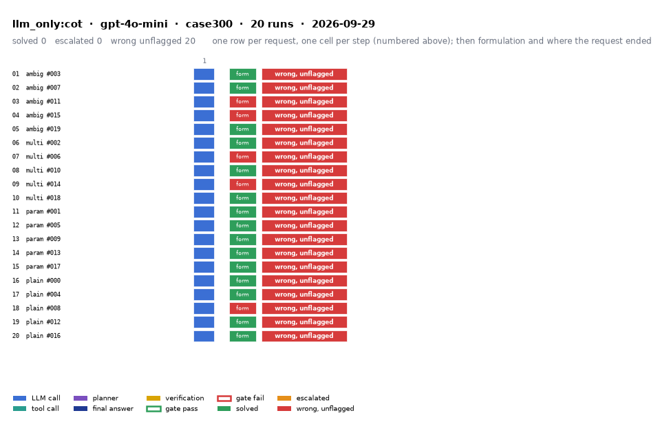

# llm_only:cot on IEEE 300-bus with gpt-4o-mini

Generated 2026-09-29 14:54 by evaluation/postprocess.py from `report.rescored.json`. Runs: 20. Scored by the unified evaluator (v2): every verdict below is read from the answer JSON, the same way for every method.

## Run

| field | value |
|---|---|
| date | 2026-09-29 |
| model | openrouter:openai/gpt-4o-mini |
| method | llm_only:cot |
| case | case300 |
| condition | normal |
| n | 20 |
| seed | 0 |
| k | 1 |
| max_rounds | 8 |
| tool_variant | load_split |
| plan_variant | text |
| temperature | 0.0 |
| system_prompt_hash | be09b0a3b7d2 |
| description | LLM answers from the case tables in the prompt. No tools. Structured prompt plus a reasoning section asking for step-by-step reasoning before the final JSON. |
| prompt files | _shared/llm_only_system_prompt.txt, _shared/llm_only_user_template.txt, _shared/llm_only_bus_id_note.txt, _shared/cot_system_suffix.txt, llm_only_cot/reasoning_section.txt |

One row per request, one cell per step (blue LLM call, teal tool call, purple planner, gold verification; green or red edge is the gate verdict), then formulation and where the request ended. Each run also has its own figure next to its traces: `traces/NN_<request>.png`.

## Where every request ended

The three outcomes are exclusive and cover every request the method answered. Escalation takes precedence: a run the method handed to a person is not an autonomous answer, right or wrong. A request whose API call failed never reached an answer, so it is listed apart and excluded from the rates.

| outcome | count | share |
|---|---:|---:|
| Solved autonomously | 0 | 0.0% |
| Escalated to a person | 0 | 0.0% |
| Wrong, unflagged | 20 | 100.0% |
| **Total** | **20** | 100% |

## Metrics

| group | metric | value |
|---|---|---|
| Task utility | Formulation exact | 15/20 (75.0%) |
| Task utility | Formulation error types | missed_step: 5 |
| Task utility | Voltage MAE, all runs | 0.0457 p.u. |
| Task utility | Voltage MAE, formulation-exact runs | 0.0315 p.u. |
| Task utility | Flow MAE, all runs | 98.2332 MW |
| Task utility | Flow MAE, formulation-exact runs | 74.8046 MW |
| Task utility | KCL mismatch, mean | 0.6469 MW |
| Solver-grounded correctness | Solved (computation right, any path) | 0/20 (0.0%) |
| Solver-grounded correctness | V-pass (all conditions, offline) | 0/20 (0.0%) |
| Reporting | Traceable answers | 0/20 (0.0%) |
| Reporting | Traceable numbers, mean share | 0.098 |
| Reporting | Stale state quoted | 0/20 |
| Cost and time | LLM calls / tool calls, mean | 1 / 0 |
| Cost and time | Prompt / completion tokens, mean | 25705 / 2444 |
| Cost and time | Cost, total | $0.1064 |
| Cost and time | Wall time, mean | 28.2 s |

### Cross-check against the runner's own scoreboard

Values the runner aggregated for the same rows (report.json scoreboard). They should agree with the table above; a disagreement means the rows were filtered differently.

| metric | runner scoreboard | this report |
|---|---:|---:|
| common_solved_count | 0 | 0 |
| common_escalated_count | 0 | 0 |
| common_wrong_count | 20 | 20 |
| common_formulation_count | 15 | 15 |
| common_traceable_count | 0 | 0 |
| common_n | 20 | 20 |

## By request difficulty

| difficulty | n | solved | escalated | wrong unflagged | formulation exact |
|---|---:|---:|---:|---:|---:|
| ambiguous | 5 | 0 | 0 | 5 | 3 |
| multistep | 5 | 0 | 0 | 5 | 3 |
| parameterized | 5 | 0 | 0 | 5 | 5 |
| plain | 5 | 0 | 0 | 5 | 4 |

## Wrong and unflagged (20)

- `case300-ambiguous-003-s0` formulation exact; declared:  ([narrative](traces/01_case300-ambiguous-003-s0.narrative.txt), [transcript](traces/01_case300-ambiguous-003-s0.transcript.txt))
- `case300-ambiguous-007-s0` formulation exact; declared:  ([narrative](traces/02_case300-ambiguous-007-s0.narrative.txt), [transcript](traces/02_case300-ambiguous-007-s0.transcript.txt))
- `case300-ambiguous-011-s0` formulation missed_step; the formulation declared in the answer omits load_case, which the request needs  ([narrative](traces/03_case300-ambiguous-011-s0.narrative.txt), [transcript](traces/03_case300-ambiguous-011-s0.transcript.txt))
- `case300-ambiguous-015-s0` formulation missed_step; the formulation declared in the answer omits load_case, which the request needs  ([narrative](traces/04_case300-ambiguous-015-s0.narrative.txt), [transcript](traces/04_case300-ambiguous-015-s0.transcript.txt))
- `case300-ambiguous-019-s0` formulation exact; declared:  ([narrative](traces/05_case300-ambiguous-019-s0.narrative.txt), [transcript](traces/05_case300-ambiguous-019-s0.transcript.txt))
- `case300-multistep-002-s0` formulation exact; declared:  ([narrative](traces/06_case300-multistep-002-s0.narrative.txt), [transcript](traces/06_case300-multistep-002-s0.transcript.txt))
- `case300-multistep-006-s0` formulation missed_step; the formulation declared in the answer omits load_case, which the request needs  ([narrative](traces/07_case300-multistep-006-s0.narrative.txt), [transcript](traces/07_case300-multistep-006-s0.transcript.txt))
- `case300-multistep-010-s0` formulation exact; declared:  ([narrative](traces/08_case300-multistep-010-s0.narrative.txt), [transcript](traces/08_case300-multistep-010-s0.transcript.txt))
- `case300-multistep-014-s0` formulation missed_step; the formulation declared in the answer omits load_case, which the request needs  ([narrative](traces/09_case300-multistep-014-s0.narrative.txt), [transcript](traces/09_case300-multistep-014-s0.transcript.txt))
- `case300-multistep-018-s0` formulation exact; declared:  ([narrative](traces/10_case300-multistep-018-s0.narrative.txt), [transcript](traces/10_case300-multistep-018-s0.transcript.txt))
- `case300-parameterized-001-s0` formulation exact; declared:  ([narrative](traces/11_case300-parameterized-001-s0.narrative.txt), [transcript](traces/11_case300-parameterized-001-s0.transcript.txt))
- `case300-parameterized-005-s0` formulation exact; declared:  ([narrative](traces/12_case300-parameterized-005-s0.narrative.txt), [transcript](traces/12_case300-parameterized-005-s0.transcript.txt))
- `case300-parameterized-009-s0` formulation exact; declared:  ([narrative](traces/13_case300-parameterized-009-s0.narrative.txt), [transcript](traces/13_case300-parameterized-009-s0.transcript.txt))
- `case300-parameterized-013-s0` formulation exact; declared:  ([narrative](traces/14_case300-parameterized-013-s0.narrative.txt), [transcript](traces/14_case300-parameterized-013-s0.transcript.txt))
- `case300-parameterized-017-s0` formulation exact; declared:  ([narrative](traces/15_case300-parameterized-017-s0.narrative.txt), [transcript](traces/15_case300-parameterized-017-s0.transcript.txt))
- `case300-plain-000-s0` formulation exact; declared:  ([narrative](traces/16_case300-plain-000-s0.narrative.txt), [transcript](traces/16_case300-plain-000-s0.transcript.txt))
- `case300-plain-004-s0` formulation exact; declared:  ([narrative](traces/17_case300-plain-004-s0.narrative.txt), [transcript](traces/17_case300-plain-004-s0.transcript.txt))
- `case300-plain-008-s0` formulation missed_step; the formulation declared in the answer omits load_case, which the request needs  ([narrative](traces/18_case300-plain-008-s0.narrative.txt), [transcript](traces/18_case300-plain-008-s0.transcript.txt))
- `case300-plain-012-s0` formulation exact; declared:  ([narrative](traces/19_case300-plain-012-s0.narrative.txt), [transcript](traces/19_case300-plain-012-s0.transcript.txt))
- `case300-plain-016-s0` formulation exact; declared:  ([narrative](traces/20_case300-plain-016-s0.narrative.txt), [transcript](traces/20_case300-plain-016-s0.transcript.txt))

## Formulation not exact (5)

- `case300-ambiguous-011-s0` missed_step: the formulation declared in the answer omits load_case, which the request needs  ([narrative](traces/03_case300-ambiguous-011-s0.narrative.txt), [transcript](traces/03_case300-ambiguous-011-s0.transcript.txt))
- `case300-ambiguous-015-s0` missed_step: the formulation declared in the answer omits load_case, which the request needs  ([narrative](traces/04_case300-ambiguous-015-s0.narrative.txt), [transcript](traces/04_case300-ambiguous-015-s0.transcript.txt))
- `case300-multistep-006-s0` missed_step: the formulation declared in the answer omits load_case, which the request needs  ([narrative](traces/07_case300-multistep-006-s0.narrative.txt), [transcript](traces/07_case300-multistep-006-s0.transcript.txt))
- `case300-multistep-014-s0` missed_step: the formulation declared in the answer omits load_case, which the request needs  ([narrative](traces/09_case300-multistep-014-s0.narrative.txt), [transcript](traces/09_case300-multistep-014-s0.transcript.txt))
- `case300-plain-008-s0` missed_step: the formulation declared in the answer omits load_case, which the request needs  ([narrative](traces/18_case300-plain-008-s0.narrative.txt), [transcript](traces/18_case300-plain-008-s0.transcript.txt))

## Untraceable numbers in the answer (20)

- `case300-ambiguous-003-s0` 9 of 9 numbers; values ['1.02', '0.0', '1.01', '0.0', '0.0', '0.0', '0.0', '0.0', '0.0']  ([narrative](traces/01_case300-ambiguous-003-s0.narrative.txt), [transcript](traces/01_case300-ambiguous-003-s0.transcript.txt))
- `case300-ambiguous-007-s0` 9 of 9 numbers; values ['1.02', '0.0', '1.01', '0.0', '0.0', '0.0', '0.0', '0.0', '0.0']  ([narrative](traces/02_case300-ambiguous-007-s0.narrative.txt), [transcript](traces/02_case300-ambiguous-007-s0.transcript.txt))
- `case300-ambiguous-011-s0` 20 of 20 numbers; values ['1234.5 MW', '1022.2 MW', '12.3 MW', '1.02', '0.0', '1.01', '5.0', '156.9', '44.8', '50.0', '80.0', '1234.5', '1022.2', '12.3']  ([narrative](traces/03_case300-ambiguous-011-s0.narrative.txt), [transcript](traces/03_case300-ambiguous-011-s0.transcript.txt))
- `case300-ambiguous-015-s0` 16 of 16 numbers; values ['12345.67 MW', '12345.67 MW', '0.0 MW', '1.05', '0.0', '1.02', '5.0', '156.9', '44.8', '12345.67', '12345.67', '0.0']  ([narrative](traces/04_case300-ambiguous-015-s0.narrative.txt), [transcript](traces/04_case300-ambiguous-015-s0.transcript.txt))
- `case300-ambiguous-019-s0` 9 of 9 numbers; values ['1.02', '0.0', '1.01', '0.0', '0.0', '0.0', '0.0', '0.0', '0.0']  ([narrative](traces/05_case300-ambiguous-019-s0.narrative.txt), [transcript](traces/05_case300-ambiguous-019-s0.transcript.txt))
- `case300-multistep-002-s0` 613 of 613 numbers; values ['105.2%', '102.3%', '1.02', '0.0', '1.01', '0.0', '1.00', '0.0', '1.00', '0.0', '1.00', '0.0', '1.00', '0.0', '1.00', '0.0', '1.00', '0.0', '1.00', '0.0']  ([narrative](traces/06_case300-multistep-002-s0.narrative.txt), [transcript](traces/06_case300-multistep-002-s0.transcript.txt))
- `case300-multistep-006-s0` 23 of 23 numbers; values ['85.3%', '82.5%', '1.02', '0.0', '1.01', '5.0', '1.05', '0.0', '56.3', '85.3', '50.6', '45.2', '82.5', '0.0', '0.0', '0.0']  ([narrative](traces/07_case300-multistep-006-s0.narrative.txt), [transcript](traces/07_case300-multistep-006-s0.transcript.txt))
- `case300-multistep-010-s0` 24 of 24 numbers; values ['105.3%', '102.1%', '1.02', '0.0', '1.01', '5.0', '1.00', '10.0', '1.03', '15.0', '1.00', '20.0', '1.00', '25.0', '150.0', '105.3', '120.0', '102.1', '2000.0', '1900.0']  ([narrative](traces/08_case300-multistep-010-s0.narrative.txt), [transcript](traces/08_case300-multistep-010-s0.transcript.txt))
- `case300-multistep-014-s0` 310 of 310 numbers; values ['0.9482 p.u.', '1.045', '1.034', '1.025', '1.020', '1.015', '1.010', '1.005', '1.002', '1.000', '0.998', '0.995', '0.993', '0.990', '0.988', '0.985', '0.983', '0.980', '0.978', '0.975']  ([narrative](traces/09_case300-multistep-014-s0.narrative.txt), [transcript](traces/09_case300-multistep-014-s0.transcript.txt))
- `case300-multistep-018-s0` 517 of 517 numbers; values ['95.3%', '92.1%', '91.5%', '1.02', '0.0', '1.01', '5.0', '1.00', '10.0', '1.00', '15.0', '1.00', '20.0', '1.00', '25.0', '1.00', '30.0', '1.00', '35.0', '1.00']  ([narrative](traces/10_case300-multistep-018-s0.narrative.txt), [transcript](traces/10_case300-multistep-018-s0.transcript.txt))
- `case300-parameterized-001-s0` 27 of 27 numbers; values ['0.934 p.u.', '0.928 p.u.', '0.925 p.u.', '1.05', '0.0', '0.934', '5.0', '1.02', '10.0', '0.928', '15.0', '1.01', '20.0', '0.925', '25.0', '150.0', '95.0', '120.0', '98.0', '130.0']  ([narrative](traces/11_case300-parameterized-001-s0.narrative.txt), [transcript](traces/11_case300-parameterized-001-s0.transcript.txt))
- `case300-parameterized-005-s0` 3 of 3 numbers; values ['0.0', '0.0', '0.0']  ([narrative](traces/12_case300-parameterized-005-s0.narrative.txt), [transcript](traces/12_case300-parameterized-005-s0.transcript.txt))
- `case300-parameterized-009-s0` 21 of 21 numbers; values ['1.02', '0.0', '1.01', '5.0', '0.98', '-5.0', '10.0', '0.97', '-10.0', '150.0', '110.0', '120.0', '105.0', '5000.0', '4800.0', '200.0', '0.98', '0.97', '110.0', '105.0']  ([narrative](traces/13_case300-parameterized-009-s0.narrative.txt), [transcript](traces/13_case300-parameterized-009-s0.transcript.txt))
- `case300-parameterized-013-s0` 3 of 3 numbers; values ['0.0', '0.0', '0.0']  ([narrative](traces/14_case300-parameterized-013-s0.narrative.txt), [transcript](traces/14_case300-parameterized-013-s0.transcript.txt))
- `case300-parameterized-017-s0` 17 of 17 numbers; values ['1.06', '1.05', '1.04', '1.03', '1.02', '1.01', '0.99', '0.98', '0.97', '150.0', '101.2', '5000.0', '4900.0', '100.0', '0.98', '101.2']  ([narrative](traces/15_case300-parameterized-017-s0.narrative.txt), [transcript](traces/15_case300-parameterized-017-s0.transcript.txt))
- `case300-plain-000-s0` 21 of 21 numbers; values ['0.95', '1.05 p.u.', '0.9345 p.u.', '1.045', '0.0', '1.038', '-2.0', '1.025', '-4.0', '1.020', '-5.0', '1.015', '-6.0', '0.9345', '-10.0', '156.9', '44.8', '5000.0', '4800.0', '200.0']  ([narrative](traces/16_case300-plain-000-s0.narrative.txt), [transcript](traces/16_case300-plain-000-s0.transcript.txt))
- `case300-plain-004-s0` 937 of 937 numbers; values ['120%', '1.02', '0.0', '1.01', '0.0', '0.0', '0.0', '0.0', '0.0', '0.0', '0.0', '0.0', '0.0', '0.0', '0.0', '0.0', '0.0', '0.0', '0.0', '0.0']  ([narrative](traces/17_case300-plain-004-s0.narrative.txt), [transcript](traces/17_case300-plain-004-s0.transcript.txt))
- `case300-plain-008-s0` 16 of 16 numbers; values ['1.02 p.u.', '85.0 MW', '80.0%', '1.02', '0.0', '1.01', '0.0', '85.0', '80.0', '500.0', '5.0']  ([narrative](traces/18_case300-plain-008-s0.narrative.txt), [transcript](traces/18_case300-plain-008-s0.transcript.txt))
- `case300-plain-012-s0` 34 of 34 numbers; values ['0.95', '1.05 p.u.', '12345.67 MW', '12345.67 MW', '0.00 MW', '1.02', '0.0', '1.01', '-5.0', '1.00', '-10.0', '1.03', '-2.0', '1.04', '1.0', '1.00', '-3.0', '1.01', '-1.0', '1.02']  ([narrative](traces/19_case300-plain-012-s0.narrative.txt), [transcript](traces/19_case300-plain-012-s0.transcript.txt))
- `case300-plain-016-s0` 27 of 27 numbers; values ['120%', '1.02', '0.0', '1.01', '1.5', '2.0', '3.0', '4.0', '5.0', '6.0', '7.0', '8.0', '9.0', '66.23', '120.0', '0.0', '0.0', '0.0', '120.0']  ([narrative](traces/20_case300-plain-016-s0.narrative.txt), [transcript](traces/20_case300-plain-016-s0.transcript.txt))

## Run errors (2)

- `case300-plain-000-s0` ValueError: json_parse_failed  ([narrative](traces/16_case300-plain-000-s0.narrative.txt), [transcript](traces/16_case300-plain-000-s0.transcript.txt))
- `case300-plain-004-s0` ValueError: no_json_object_found  ([narrative](traces/17_case300-plain-004-s0.narrative.txt), [transcript](traces/17_case300-plain-004-s0.transcript.txt))

## Files

- `summary.csv`: one line per run, the fields above plus tokens and time.
- `traces/NN_<request>.narrative.txt`: what happened in each run, step by step, with the verdicts.
- `traces/NN_<request>.transcript.txt`: the raw exchange, every message, tool call and tool output.
- `traces/NN_<request>.png`: the run as a picture: steps, gate verdicts, formulation, verification, outcome, with a two-line narrative.
- `overview.png`: all runs of this folder on one page.
- `traces/NN_<request>.json`: the raw trace the runner wrote.
- `raw/`: the runner's own outputs (report.json, rescored report, logs).
- `requests.jsonl`: the request set, with the intended tool calls that define formulation exactness.
