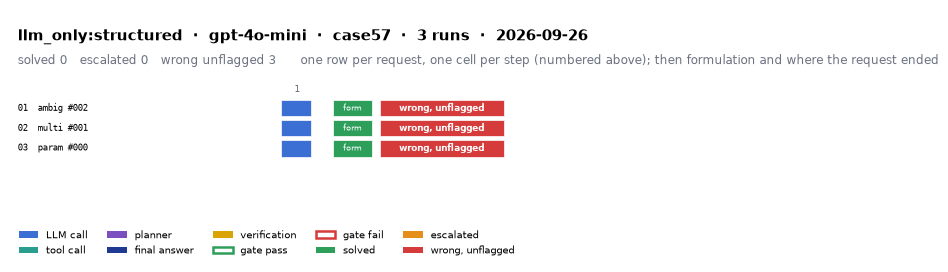

# llm_only:structured on IEEE 57-bus with gpt-4o-mini

Generated 2026-09-26 19:56 by evaluation/postprocess.py from `report.rescored.json`. Runs: 3. Scored by the unified evaluator (v2): every verdict below is read from the answer JSON, the same way for every method.

## Run

| field | value |
|---|---|
| date | 2026-09-26 |
| model | openrouter:openai/gpt-4o-mini |
| method | llm_only:structured |
| case | case57 |
| condition | normal |
| n | 3 |
| seed | 0 |
| k | 1 |
| max_rounds | 8 |
| tool_variant | load_split |
| plan_variant | text |
| temperature | 0.0 |
| system_prompt_hash | 183abd966fbd |
| description | LLM answers from the case tables in the prompt. No tools. Structured prompt: role, full case tables as system data, task, JSON output schema. |
| prompt files | _shared/llm_only_system_prompt.txt, _shared/llm_only_user_template.txt, _shared/llm_only_bus_id_note.txt |

One row per request, one cell per step (blue LLM call, teal tool call, purple planner, gold verification; green or red edge is the gate verdict), then formulation and where the request ended. Each run also has its own figure next to its traces: `traces/NN_<request>.png`.

## Where every request ended

The three outcomes are exclusive and sum to the run count. Escalation takes precedence: a run the method handed to a person is not an autonomous answer, right or wrong.

| outcome | count | share |
|---|---:|---:|
| Solved autonomously | 0 | 0.0% |
| Escalated to a person | 0 | 0.0% |
| Wrong, unflagged | 3 | 100.0% |
| **Total** | **3** | 100% |

## Metrics

| group | metric | value |
|---|---|---|
| Task utility | Formulation exact | 3/3 (100.0%) |
| Task utility | Voltage MAE, all runs | 0.1384 p.u. |
| Task utility | Voltage MAE, formulation-exact runs | 0.1384 p.u. |
| Task utility | Flow MAE, all runs | 24.411 MW |
| Task utility | Flow MAE, formulation-exact runs | 24.411 MW |
| Task utility | KCL mismatch, mean | 15.5118 MW |
| Solver-grounded correctness | Solved (computation right, any path) | 0/3 (0.0%) |
| Solver-grounded correctness | V-pass (all conditions, offline) | 0/3 (0.0%) |
| Reporting | Traceable answers | 0/3 (0.0%) |
| Reporting | Traceable numbers, mean share | 0.073 |
| Reporting | Stale state quoted | 0/3 |
| Cost and time | LLM calls / tool calls, mean | 1 / 0 |
| Cost and time | Prompt / completion tokens, mean | 6663 / 267 |
| Cost and time | Cost, total | $0.0078 |
| Cost and time | Wall time, mean | 30.2 s |

### Cross-check against the runner's own scoreboard

Values the runner aggregated for the same rows (report.json scoreboard). They should agree with the table above; a disagreement means the rows were filtered differently.

| metric | runner scoreboard | this report |
|---|---:|---:|
| common_solved_count | 0 | 0 |
| common_escalated_count | 0 | 0 |
| common_wrong_count | 3 | 3 |
| common_formulation_count | 3 | 3 |
| common_traceable_count | 0 | 0 |
| common_n | 3 | 3 |

## By request difficulty

| difficulty | n | solved | escalated | wrong unflagged | formulation exact |
|---|---:|---:|---:|---:|---:|
| ambiguous | 1 | 0 | 0 | 1 | 1 |
| multistep | 1 | 0 | 0 | 1 | 1 |
| parameterized | 1 | 0 | 0 | 1 | 1 |

## Wrong and unflagged (3)

- `case57-ambiguous-002-s0` formulation exact; declared:  ([narrative](traces/01_case57-ambiguous-002-s0.narrative.txt), [transcript](traces/01_case57-ambiguous-002-s0.transcript.txt))
- `case57-multistep-001-s0` formulation exact; declared:  ([narrative](traces/02_case57-multistep-001-s0.narrative.txt), [transcript](traces/02_case57-multistep-001-s0.transcript.txt))
- `case57-parameterized-000-s0` formulation exact; declared:  ([narrative](traces/03_case57-parameterized-000-s0.narrative.txt), [transcript](traces/03_case57-parameterized-000-s0.transcript.txt))

## Untraceable numbers in the answer (3)

- `case57-ambiguous-002-s0` 246 of 246 numbers; values ['1,000.0 MW', '1,000.0 MW', '0.0 MW', '1.04', '0.0', '1.01', '-1.0', '0.99', '-2.0', '-3.0', '-4.0', '0.98', '-5.0', '0.97', '-6.0', '1.02', '-7.0', '1.01', '-8.0', '-9.0']  ([narrative](traces/01_case57-ambiguous-002-s0.narrative.txt), [transcript](traces/01_case57-ambiguous-002-s0.transcript.txt))
- `case57-multistep-001-s0` 120 of 120 numbers; values ['0.9345 p.u.', '1.0400', '0.0', '1.0100', '-1.0', '0.9850', '-2.0', '0.9700', '-3.0', '0.9600', '-4.0', '0.9500', '-5.0', '0.9400', '-6.0', '0.9500', '-7.0', '0.9400', '-8.0', '0.9300']  ([narrative](traces/02_case57-multistep-001-s0.narrative.txt), [transcript](traces/02_case57-multistep-001-s0.transcript.txt))
- `case57-parameterized-000-s0` 120 of 120 numbers; values ['0.0 MW', '0.0 MW', '0.0 MW', '1.04', '0.0', '1.01', '0.0', '0.99', '0.0', '0.98', '0.0', '0.97', '0.0', '0.96', '0.0', '0.95', '0.0', '0.94', '0.0', '0.93']  ([narrative](traces/03_case57-parameterized-000-s0.narrative.txt), [transcript](traces/03_case57-parameterized-000-s0.transcript.txt))

## Files

- `summary.csv`: one line per run, the fields above plus tokens and time.
- `traces/NN_<request>.narrative.txt`: what happened in each run, step by step, with the verdicts.
- `traces/NN_<request>.transcript.txt`: the raw exchange, every message, tool call and tool output.
- `traces/NN_<request>.png`: the run as a picture: steps, gate verdicts, formulation, verification, outcome, with a two-line narrative.
- `overview.png`: all runs of this folder on one page.
- `traces/NN_<request>.json`: the raw trace the runner wrote.
- `raw/`: the runner's own outputs (report.json, rescored report, logs).
- `requests.jsonl`: the request set, with the intended tool calls that define formulation exactness.
