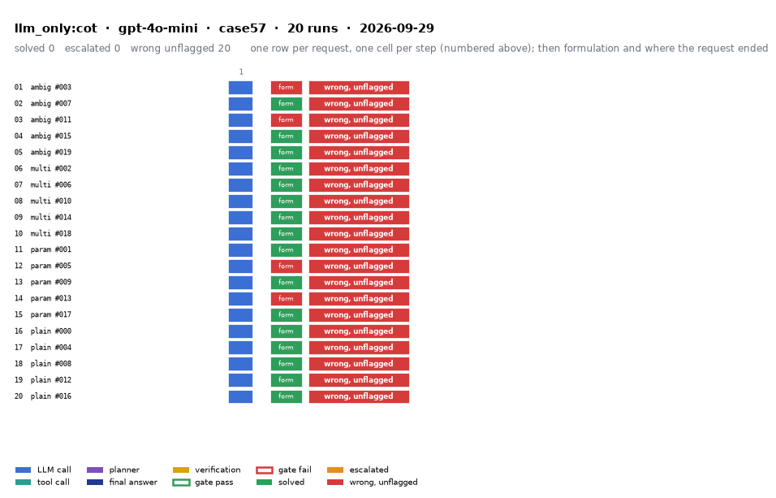

# llm_only:cot on IEEE 57-bus with gpt-4o-mini

Generated 2026-09-29 14:54 by evaluation/postprocess.py from `report.rescored.json`. Runs: 20. Scored by the unified evaluator (v2): every verdict below is read from the answer JSON, the same way for every method.

## Run

| field | value |
|---|---|
| date | 2026-09-29 |
| model | openrouter:openai/gpt-4o-mini |
| method | llm_only:cot |
| case | case57 |
| condition | normal |
| n | 20 |
| seed | 0 |
| k | 1 |
| max_rounds | 8 |
| tool_variant | load_split |
| plan_variant | text |
| temperature | 0.0 |
| system_prompt_hash | be09b0a3b7d2 |
| description | LLM answers from the case tables in the prompt. No tools. Structured prompt plus a reasoning section asking for step-by-step reasoning before the final JSON. |
| prompt files | _shared/llm_only_system_prompt.txt, _shared/llm_only_user_template.txt, _shared/llm_only_bus_id_note.txt, _shared/cot_system_suffix.txt, llm_only_cot/reasoning_section.txt |

One row per request, one cell per step (blue LLM call, teal tool call, purple planner, gold verification; green or red edge is the gate verdict), then formulation and where the request ended. Each run also has its own figure next to its traces: `traces/NN_<request>.png`.

## Where every request ended

The three outcomes are exclusive and cover every request the method answered. Escalation takes precedence: a run the method handed to a person is not an autonomous answer, right or wrong. A request whose API call failed never reached an answer, so it is listed apart and excluded from the rates.

| outcome | count | share |
|---|---:|---:|
| Solved autonomously | 0 | 0.0% |
| Escalated to a person | 0 | 0.0% |
| Wrong, unflagged | 20 | 100.0% |
| **Total** | **20** | 100% |

## Metrics

| group | metric | value |
|---|---|---|
| Task utility | Formulation exact | 16/20 (80.0%) |
| Task utility | Formulation error types | missed_step: 4 |
| Task utility | Voltage MAE, all runs | 0.1541 p.u. |
| Task utility | Voltage MAE, formulation-exact runs | 0.1639 p.u. |
| Task utility | Flow MAE, all runs | 29.359 MW |
| Task utility | Flow MAE, formulation-exact runs | 30.1145 MW |
| Task utility | KCL mismatch, mean | 18.0873 MW |
| Solver-grounded correctness | Solved (computation right, any path) | 0/20 (0.0%) |
| Solver-grounded correctness | V-pass (all conditions, offline) | 0/20 (0.0%) |
| Reporting | Traceable answers | 0/20 (0.0%) |
| Reporting | Traceable numbers, mean share | 0.055 |
| Reporting | Stale state quoted | 0/20 |
| Cost and time | LLM calls / tool calls, mean | 1 / 0 |
| Cost and time | Prompt / completion tokens, mean | 6858 / 3055 |
| Cost and time | Cost, total | $0.0572 |
| Cost and time | Wall time, mean | 31.3 s |

### Cross-check against the runner's own scoreboard

Values the runner aggregated for the same rows (report.json scoreboard). They should agree with the table above; a disagreement means the rows were filtered differently.

| metric | runner scoreboard | this report |
|---|---:|---:|
| common_solved_count | 0 | 0 |
| common_escalated_count | 0 | 0 |
| common_wrong_count | 20 | 20 |
| common_formulation_count | 16 | 16 |
| common_traceable_count | 0 | 0 |
| common_n | 20 | 20 |

## By request difficulty

| difficulty | n | solved | escalated | wrong unflagged | formulation exact |
|---|---:|---:|---:|---:|---:|
| ambiguous | 5 | 0 | 0 | 5 | 3 |
| multistep | 5 | 0 | 0 | 5 | 5 |
| parameterized | 5 | 0 | 0 | 5 | 3 |
| plain | 5 | 0 | 0 | 5 | 5 |

## Wrong and unflagged (20)

- `case57-ambiguous-003-s0` formulation missed_step; the formulation declared in the answer omits load_case, which the request needs  ([narrative](traces/01_case57-ambiguous-003-s0.narrative.txt), [transcript](traces/01_case57-ambiguous-003-s0.transcript.txt))
- `case57-ambiguous-007-s0` formulation exact; declared:  ([narrative](traces/02_case57-ambiguous-007-s0.narrative.txt), [transcript](traces/02_case57-ambiguous-007-s0.transcript.txt))
- `case57-ambiguous-011-s0` formulation missed_step; the formulation declared in the answer omits load_case, which the request needs  ([narrative](traces/03_case57-ambiguous-011-s0.narrative.txt), [transcript](traces/03_case57-ambiguous-011-s0.transcript.txt))
- `case57-ambiguous-015-s0` formulation exact; declared:  ([narrative](traces/04_case57-ambiguous-015-s0.narrative.txt), [transcript](traces/04_case57-ambiguous-015-s0.transcript.txt))
- `case57-ambiguous-019-s0` formulation exact; declared:  ([narrative](traces/05_case57-ambiguous-019-s0.narrative.txt), [transcript](traces/05_case57-ambiguous-019-s0.transcript.txt))
- `case57-multistep-002-s0` formulation exact; declared:  ([narrative](traces/06_case57-multistep-002-s0.narrative.txt), [transcript](traces/06_case57-multistep-002-s0.transcript.txt))
- `case57-multistep-006-s0` formulation exact; declared:  ([narrative](traces/07_case57-multistep-006-s0.narrative.txt), [transcript](traces/07_case57-multistep-006-s0.transcript.txt))
- `case57-multistep-010-s0` formulation exact; declared:  ([narrative](traces/08_case57-multistep-010-s0.narrative.txt), [transcript](traces/08_case57-multistep-010-s0.transcript.txt))
- `case57-multistep-014-s0` formulation exact; declared:  ([narrative](traces/09_case57-multistep-014-s0.narrative.txt), [transcript](traces/09_case57-multistep-014-s0.transcript.txt))
- `case57-multistep-018-s0` formulation exact; declared:  ([narrative](traces/10_case57-multistep-018-s0.narrative.txt), [transcript](traces/10_case57-multistep-018-s0.transcript.txt))
- `case57-parameterized-001-s0` formulation exact; declared:  ([narrative](traces/11_case57-parameterized-001-s0.narrative.txt), [transcript](traces/11_case57-parameterized-001-s0.transcript.txt))
- `case57-parameterized-005-s0` formulation missed_step; the formulation declared in the answer omits load_case, which the request needs  ([narrative](traces/12_case57-parameterized-005-s0.narrative.txt), [transcript](traces/12_case57-parameterized-005-s0.transcript.txt))
- `case57-parameterized-009-s0` formulation exact; declared:  ([narrative](traces/13_case57-parameterized-009-s0.narrative.txt), [transcript](traces/13_case57-parameterized-009-s0.transcript.txt))
- `case57-parameterized-013-s0` formulation missed_step; the formulation declared in the answer omits load_case, which the request needs  ([narrative](traces/14_case57-parameterized-013-s0.narrative.txt), [transcript](traces/14_case57-parameterized-013-s0.transcript.txt))
- `case57-parameterized-017-s0` formulation exact; declared:  ([narrative](traces/15_case57-parameterized-017-s0.narrative.txt), [transcript](traces/15_case57-parameterized-017-s0.transcript.txt))
- `case57-plain-000-s0` formulation exact; declared:  ([narrative](traces/16_case57-plain-000-s0.narrative.txt), [transcript](traces/16_case57-plain-000-s0.transcript.txt))
- `case57-plain-004-s0` formulation exact; declared:  ([narrative](traces/17_case57-plain-004-s0.narrative.txt), [transcript](traces/17_case57-plain-004-s0.transcript.txt))
- `case57-plain-008-s0` formulation exact; declared:  ([narrative](traces/18_case57-plain-008-s0.narrative.txt), [transcript](traces/18_case57-plain-008-s0.transcript.txt))
- `case57-plain-012-s0` formulation exact; declared:  ([narrative](traces/19_case57-plain-012-s0.narrative.txt), [transcript](traces/19_case57-plain-012-s0.transcript.txt))
- `case57-plain-016-s0` formulation exact; declared:  ([narrative](traces/20_case57-plain-016-s0.narrative.txt), [transcript](traces/20_case57-plain-016-s0.transcript.txt))

## Formulation not exact (4)

- `case57-ambiguous-003-s0` missed_step: the formulation declared in the answer omits load_case, which the request needs  ([narrative](traces/01_case57-ambiguous-003-s0.narrative.txt), [transcript](traces/01_case57-ambiguous-003-s0.transcript.txt))
- `case57-ambiguous-011-s0` missed_step: the formulation declared in the answer omits load_case, which the request needs  ([narrative](traces/03_case57-ambiguous-011-s0.narrative.txt), [transcript](traces/03_case57-ambiguous-011-s0.transcript.txt))
- `case57-parameterized-005-s0` missed_step: the formulation declared in the answer omits load_case, which the request needs  ([narrative](traces/12_case57-parameterized-005-s0.narrative.txt), [transcript](traces/12_case57-parameterized-005-s0.transcript.txt))
- `case57-parameterized-013-s0` missed_step: the formulation declared in the answer omits load_case, which the request needs  ([narrative](traces/14_case57-parameterized-013-s0.narrative.txt), [transcript](traces/14_case57-parameterized-013-s0.transcript.txt))

## Untraceable numbers in the answer (20)

- `case57-ambiguous-003-s0` 123 of 123 numbers; values ['0.0 MW', '0.0 MW', '1.04', '0.0', '1.01', '0.0', '0.99', '0.0', '0.98', '0.0', '0.97', '0.0', '0.96', '0.0', '0.95', '0.0', '1.02', '0.0', '1.03', '0.0']  ([narrative](traces/01_case57-ambiguous-003-s0.narrative.txt), [transcript](traces/01_case57-ambiguous-003-s0.transcript.txt))
- `case57-ambiguous-007-s0` 243 of 243 numbers; values ['1.04', '0.0', '1.01', '-1.0', '0.99', '-2.0', '0.98', '-3.0', '0.97', '-4.0', '0.96', '-5.0', '0.95', '-6.0', '0.94', '-7.0', '0.93', '-8.0', '0.92', '-9.0']  ([narrative](traces/02_case57-ambiguous-007-s0.narrative.txt), [transcript](traces/02_case57-ambiguous-007-s0.transcript.txt))
- `case57-ambiguous-011-s0` 124 of 124 numbers; values ['4.2 MW', '4.2 MW', '4.2', '4.2 MW', '1,000.0 MW', '1,000.0 MW', '0.0 MW', '1.04', '0.0', '1.01', '-2.0', '1.00', '-4.0', '1.00', '-6.0', '1.00', '-8.0', '0.99', '-10.0', '0.98']  ([narrative](traces/03_case57-ambiguous-011-s0.narrative.txt), [transcript](traces/03_case57-ambiguous-011-s0.transcript.txt))
- `case57-ambiguous-015-s0` 120 of 120 numbers; values ['0.0 MW', '0.0 MW', '0.0 MW', '1.04', '0.0', '1.01', '-1.0', '0.99', '-2.0', '0.98', '-3.0', '0.97', '-4.0', '0.96', '-5.0', '0.95', '-6.0', '0.94', '-7.0', '0.93']  ([narrative](traces/04_case57-ambiguous-015-s0.narrative.txt), [transcript](traces/04_case57-ambiguous-015-s0.transcript.txt))
- `case57-ambiguous-019-s0` 247 of 247 numbers; values ['110.5%', '105.3%', '1.04', '0.0', '1.02', '-5.0', '1.01', '-10.0', '1.00', '-15.0', '1.00', '-20.0', '1.00', '-25.0', '1.00', '-30.0', '1.00', '-35.0', '1.00', '-40.0']  ([narrative](traces/05_case57-ambiguous-019-s0.narrative.txt), [transcript](traces/05_case57-ambiguous-019-s0.transcript.txt))
- `case57-multistep-002-s0` 149 of 149 numbers; values ['39.085631 MW', '163.877637 MW', '85.3%', '90.1%', '95.2%', '110.5%', '82.4%', '1.04', '0.0', '1.01', '-2.0', '1.00', '-3.0', '0.99', '-4.0', '0.98', '-5.0', '0.97', '-6.0', '0.96']  ([narrative](traces/06_case57-multistep-002-s0.narrative.txt), [transcript](traces/06_case57-multistep-002-s0.transcript.txt))
- `case57-multistep-006-s0` 246 of 246 numbers; values ['1.04', '0.0', '1.01', '-5.0', '0.99', '-10.0', '0.98', '-15.0', '-20.0', '0.97', '-25.0', '1.02', '-30.0', '1.03', '-35.0', '1.01', '-40.0', '-45.0', '1.02', '-50.0']  ([narrative](traces/07_case57-multistep-006-s0.narrative.txt), [transcript](traces/07_case57-multistep-006-s0.transcript.txt))
- `case57-multistep-010-s0` 118 of 118 numbers; values ['0.9345 p.u.', '1.04', '0.0', '1.01', '-1.0', '0.98', '-2.0', '0.97', '-3.0', '0.96', '-4.0', '0.95', '-5.0', '0.94', '-6.0', '0.93', '-7.0', '0.92', '-8.0', '0.91']  ([narrative](traces/08_case57-multistep-010-s0.narrative.txt), [transcript](traces/08_case57-multistep-010-s0.transcript.txt))
- `case57-multistep-014-s0` 121 of 121 numbers; values ['0.9487 p.u.', '1.04', '0.0', '1.01', '0.0', '0.985', '0.0', '0.973', '0.0', '0.965', '0.0', '0.980', '0.0', '0.970', '0.0', '1.005', '0.0', '0.980', '0.0', '0.960']  ([narrative](traces/09_case57-multistep-014-s0.narrative.txt), [transcript](traces/09_case57-multistep-014-s0.transcript.txt))
- `case57-multistep-018-s0` 119 of 119 numbers; values ['0.9345 p.u.', '1.04', '0.0', '1.01', '0.0', '0.98', '0.0', '0.97', '0.0', '0.96', '0.0', '0.95', '0.0', '0.94', '0.0', '1.02', '0.0', '1.03', '0.0', '1.01']  ([narrative](traces/10_case57-multistep-018-s0.narrative.txt), [transcript](traces/10_case57-multistep-018-s0.transcript.txt))
- `case57-parameterized-001-s0` 124 of 124 numbers; values ['0.95 p.u.', '0.934 p.u.', '0.936 p.u.', '0.940 p.u.', '1.04', '0.0', '0.940', '0.0', '0.0', '0.0', '0.936', '0.0', '0.0', '0.0', '0.0', '0.0', '0.0', '0.0', '0.0', '0.0']  ([narrative](traces/11_case57-parameterized-001-s0.narrative.txt), [transcript](traces/11_case57-parameterized-001-s0.transcript.txt))
- `case57-parameterized-005-s0` 249 of 249 numbers; values ['391.850740 MW', '1.04', '0.0', '1.02', '-2.0', '1.01', '-4.0', '1.00', '-6.0', '1.00', '-8.0', '0.99', '-10.0', '0.98', '-12.0', '0.97', '-14.0', '0.96', '-16.0', '0.95']  ([narrative](traces/12_case57-parameterized-005-s0.narrative.txt), [transcript](traces/12_case57-parameterized-005-s0.transcript.txt))
- `case57-parameterized-009-s0` 252 of 252 numbers; values ['95.3%', '110.2%', '92.1%', '1.04', '0.0', '1.02', '-5.0', '1.01', '-10.0', '1.00', '-15.0', '0.99', '-20.0', '0.98', '-25.0', '0.97', '-30.0', '1.03', '-35.0', '1.01']  ([narrative](traces/13_case57-parameterized-009-s0.narrative.txt), [transcript](traces/13_case57-parameterized-009-s0.transcript.txt))
- `case57-parameterized-013-s0` 124 of 124 numbers; values ['0.0 MW', '0.0 MW', '1.04', '0.0', '1.01', '-1.0', '0.99', '-2.0', '1.00', '-3.0', '1.00', '-4.0', '0.98', '-5.0', '1.00', '-6.0', '1.02', '-7.0', '1.01', '-8.0']  ([narrative](traces/14_case57-parameterized-013-s0.narrative.txt), [transcript](traces/14_case57-parameterized-013-s0.transcript.txt))
- `case57-parameterized-017-s0` 119 of 119 numbers; values ['0.9345 p.u.', '1.04', '0.0', '1.01', '0.0', '0.98', '0.0', '0.97', '0.0', '0.96', '0.0', '0.95', '0.0', '0.94', '0.0', '0.93', '0.0', '0.92', '0.0', '0.91']  ([narrative](traces/15_case57-parameterized-017-s0.narrative.txt), [transcript](traces/15_case57-parameterized-017-s0.transcript.txt))
- `case57-plain-000-s0` 121 of 121 numbers; values ['0.95', '1.05 p.u.', '0.9345 p.u.', '1.0400', '0.0', '1.0100', '-0.5', '0.9850', '-2.0', '0.9700', '-3.5', '0.9600', '-4.0', '0.9500', '-5.0', '0.9400', '-6.0', '0.9500', '-7.0', '0.9400']  ([narrative](traces/16_case57-plain-000-s0.narrative.txt), [transcript](traces/16_case57-plain-000-s0.transcript.txt))
- `case57-plain-004-s0` 245 of 245 numbers; values ['120%', '1.04', '0.0', '1.02', '-5.0', '1.01', '-10.0', '-15.0', '0.99', '-20.0', '0.98', '-25.0', '0.97', '-30.0', '0.96', '-35.0', '0.95', '-40.0', '0.94', '-45.0']  ([narrative](traces/17_case57-plain-004-s0.narrative.txt), [transcript](traces/17_case57-plain-004-s0.transcript.txt))
- `case57-plain-008-s0` 11 of 11 numbers; values ['1.04 p.u.', '0.0 p.u.', '0.0 MW', '0.0 MW', '1.04', '0.0', '0.0', '0.0', '0.0', '0.0', '0.0']  ([narrative](traces/18_case57-plain-008-s0.narrative.txt), [transcript](traces/18_case57-plain-008-s0.transcript.txt))
- `case57-plain-012-s0` 246 of 246 numbers; values ['1,000.0 MW', '1,000.0 MW', '0.0 MW', '1.04', '0.0', '1.02', '-5.0', '1.01', '-10.0', '1.00', '-15.0', '1.00', '-20.0', '1.00', '-25.0', '1.00', '-30.0', '1.00', '-35.0', '1.00']  ([narrative](traces/19_case57-plain-012-s0.narrative.txt), [transcript](traces/19_case57-plain-012-s0.transcript.txt))
- `case57-plain-016-s0` 243 of 243 numbers; values ['1.04', '0.0', '1.02', '-2.5', '1.01', '-5.0', '1.00', '-7.5', '1.00', '-10.0', '1.00', '-12.5', '1.00', '-15.0', '1.00', '-17.5', '1.00', '-20.0', '1.00', '-22.5']  ([narrative](traces/20_case57-plain-016-s0.narrative.txt), [transcript](traces/20_case57-plain-016-s0.transcript.txt))

## Files

- `summary.csv`: one line per run, the fields above plus tokens and time.
- `traces/NN_<request>.narrative.txt`: what happened in each run, step by step, with the verdicts.
- `traces/NN_<request>.transcript.txt`: the raw exchange, every message, tool call and tool output.
- `traces/NN_<request>.png`: the run as a picture: steps, gate verdicts, formulation, verification, outcome, with a two-line narrative.
- `overview.png`: all runs of this folder on one page.
- `traces/NN_<request>.json`: the raw trace the runner wrote.
- `raw/`: the runner's own outputs (report.json, rescored report, logs).
- `requests.jsonl`: the request set, with the intended tool calls that define formulation exactness.
