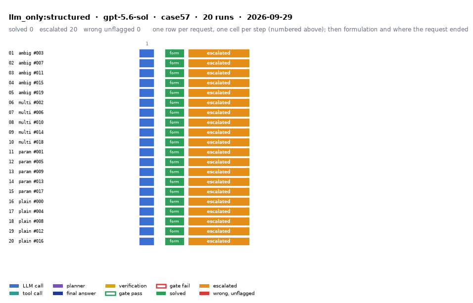

# llm_only:structured on IEEE 57-bus with gpt-5.6-sol

Generated 2026-09-29 17:26 by evaluation/postprocess.py from `report.rescored.json`. Runs: 20. Scored by the unified evaluator (v2): every verdict below is read from the answer JSON, the same way for every method.

## Run

| field | value |
|---|---|
| date | 2026-09-29 |
| model | openrouter:openai/gpt-5.6-sol |
| method | llm_only:structured |
| case | case57 |
| condition | normal |
| n | 20 |
| seed | 0 |
| k | 1 |
| max_rounds | 8 |
| tool_variant | load_split |
| plan_variant | text |
| temperature | 0.0 |
| system_prompt_hash | 183abd966fbd |
| description | LLM answers from the case tables in the prompt. No tools. Structured prompt: role, full case tables as system data, task, JSON output schema. |
| prompt files | _shared/llm_only_system_prompt.txt, _shared/llm_only_user_template.txt, _shared/llm_only_bus_id_note.txt |

One row per request, one cell per step (blue LLM call, teal tool call, purple planner, gold verification; green or red edge is the gate verdict), then formulation and where the request ended. Each run also has its own figure next to its traces: `traces/NN_<request>.png`.

## Where every request ended

The three outcomes are exclusive and cover every request the method answered. Escalation takes precedence: a run the method handed to a person is not an autonomous answer, right or wrong. A request whose API call failed never reached an answer, so it is listed apart and excluded from the rates.

| outcome | count | share |
|---|---:|---:|
| Solved autonomously | 0 | 0.0% |
| Escalated to a person | 20 | 100.0% |
| Wrong, unflagged | 0 | 0.0% |
| **Total** | **20** | 100% |

## Metrics

| group | metric | value |
|---|---|---|
| Task utility | Formulation exact | 20/20 (100.0%) |
| Task utility | Voltage MAE, all runs | n/a p.u. |
| Task utility | Voltage MAE, formulation-exact runs | n/a p.u. |
| Task utility | Flow MAE, all runs | n/a MW |
| Task utility | Flow MAE, formulation-exact runs | n/a MW |
| Task utility | KCL mismatch, mean | n/a MW |
| Solver-grounded correctness | Solved (computation right, any path) | 0/20 (0.0%) |
| Solver-grounded correctness | V-pass (all conditions, offline) | 0/20 (0.0%) |
| Reporting | Traceable answers | 0/20 (0.0%) |
| Reporting | Traceable numbers, mean share | 0.129 |
| Reporting | Stale state quoted | 0/20 |
| Cost and time | LLM calls / tool calls, mean | 1 / 0 |
| Cost and time | Prompt / completion tokens, mean | 6681 / 432 |
| Cost and time | Cost, total | $0.3537 |
| Cost and time | Wall time, mean | 7 s |

### Cross-check against the runner's own scoreboard

Values the runner aggregated for the same rows (report.json scoreboard). They should agree with the table above; a disagreement means the rows were filtered differently.

| metric | runner scoreboard | this report |
|---|---:|---:|
| common_solved_count | 0 | 0 |
| common_escalated_count | 20 | 20 |
| common_wrong_count | 0 | 0 |
| common_formulation_count | 20 | 20 |
| common_traceable_count | 0 | 0 |
| common_n | 20 | 20 |

## By request difficulty

| difficulty | n | solved | escalated | wrong unflagged | formulation exact |
|---|---:|---:|---:|---:|---:|
| ambiguous | 5 | 0 | 5 | 0 | 5 |
| multistep | 5 | 0 | 5 | 0 | 5 |
| parameterized | 5 | 0 | 5 | 0 | 5 |
| plain | 5 | 0 | 5 | 0 | 5 |

## Escalated (20)

- `case57-ambiguous-003-s0` detected via cannot_answer, abstention_json; formulation exact; declared:  ([narrative](traces/01_case57-ambiguous-003-s0.narrative.txt), [transcript](traces/01_case57-ambiguous-003-s0.transcript.txt))
- `case57-ambiguous-007-s0` detected via cannot_answer, abstention_json, declared_inability; formulation exact; declared:  ([narrative](traces/02_case57-ambiguous-007-s0.narrative.txt), [transcript](traces/02_case57-ambiguous-007-s0.transcript.txt))
- `case57-ambiguous-011-s0` detected via cannot_answer, abstention_json, declared_inability; formulation exact; declared:  ([narrative](traces/03_case57-ambiguous-011-s0.narrative.txt), [transcript](traces/03_case57-ambiguous-011-s0.transcript.txt))
- `case57-ambiguous-015-s0` detected via cannot_answer, abstention_json; formulation exact; declared:  ([narrative](traces/04_case57-ambiguous-015-s0.narrative.txt), [transcript](traces/04_case57-ambiguous-015-s0.transcript.txt))
- `case57-ambiguous-019-s0` detected via cannot_answer, abstention_json, declared_inability; formulation exact; declared:  ([narrative](traces/05_case57-ambiguous-019-s0.narrative.txt), [transcript](traces/05_case57-ambiguous-019-s0.transcript.txt))
- `case57-multistep-002-s0` detected via cannot_answer, abstention_json; formulation exact; declared:  ([narrative](traces/06_case57-multistep-002-s0.narrative.txt), [transcript](traces/06_case57-multistep-002-s0.transcript.txt))
- `case57-multistep-006-s0` detected via cannot_answer, abstention_json, declared_inability; formulation exact; declared:  ([narrative](traces/07_case57-multistep-006-s0.narrative.txt), [transcript](traces/07_case57-multistep-006-s0.transcript.txt))
- `case57-multistep-010-s0` detected via cannot_answer, abstention_json, declared_inability; formulation exact; declared:  ([narrative](traces/08_case57-multistep-010-s0.narrative.txt), [transcript](traces/08_case57-multistep-010-s0.transcript.txt))
- `case57-multistep-014-s0` detected via cannot_answer, abstention_json, declared_inability; formulation exact; declared:  ([narrative](traces/09_case57-multistep-014-s0.narrative.txt), [transcript](traces/09_case57-multistep-014-s0.transcript.txt))
- `case57-multistep-018-s0` detected via cannot_answer, abstention_json, declared_inability; formulation exact; declared:  ([narrative](traces/10_case57-multistep-018-s0.narrative.txt), [transcript](traces/10_case57-multistep-018-s0.transcript.txt))
- `case57-parameterized-001-s0` detected via cannot_answer, abstention_json; formulation exact; declared:  ([narrative](traces/11_case57-parameterized-001-s0.narrative.txt), [transcript](traces/11_case57-parameterized-001-s0.transcript.txt))
- `case57-parameterized-005-s0` detected via cannot_answer, abstention_json, declared_inability; formulation exact; declared:  ([narrative](traces/12_case57-parameterized-005-s0.narrative.txt), [transcript](traces/12_case57-parameterized-005-s0.transcript.txt))
- `case57-parameterized-009-s0` detected via cannot_answer, abstention_json, declared_inability; formulation exact; declared:  ([narrative](traces/13_case57-parameterized-009-s0.narrative.txt), [transcript](traces/13_case57-parameterized-009-s0.transcript.txt))
- `case57-parameterized-013-s0` detected via cannot_answer, abstention_json, declared_inability; formulation exact; declared:  ([narrative](traces/14_case57-parameterized-013-s0.narrative.txt), [transcript](traces/14_case57-parameterized-013-s0.transcript.txt))
- `case57-parameterized-017-s0` detected via cannot_answer, abstention_json, declared_inability; formulation exact; declared:  ([narrative](traces/15_case57-parameterized-017-s0.narrative.txt), [transcript](traces/15_case57-parameterized-017-s0.transcript.txt))
- `case57-plain-000-s0` detected via cannot_answer, abstention_json, declared_inability; formulation exact; declared:  ([narrative](traces/16_case57-plain-000-s0.narrative.txt), [transcript](traces/16_case57-plain-000-s0.transcript.txt))
- `case57-plain-004-s0` detected via cannot_answer, abstention_json, declared_inability; formulation exact; declared:  ([narrative](traces/17_case57-plain-004-s0.narrative.txt), [transcript](traces/17_case57-plain-004-s0.transcript.txt))
- `case57-plain-008-s0` detected via cannot_answer, abstention_json, declared_inability; formulation exact; declared:  ([narrative](traces/18_case57-plain-008-s0.narrative.txt), [transcript](traces/18_case57-plain-008-s0.transcript.txt))
- `case57-plain-012-s0` detected via cannot_answer, abstention_json, declared_inability; formulation exact; declared:  ([narrative](traces/19_case57-plain-012-s0.narrative.txt), [transcript](traces/19_case57-plain-012-s0.transcript.txt))
- `case57-plain-016-s0` detected via cannot_answer, abstention_json; formulation exact; declared:  ([narrative](traces/20_case57-plain-016-s0.narrative.txt), [transcript](traces/20_case57-plain-016-s0.transcript.txt))

## Untraceable numbers in the answer (20)

- `case57-ambiguous-003-s0` 6 of 6 numbers; values ['5.057650 Mvar', '0.0', '0.0', '0.0']  ([narrative](traces/01_case57-ambiguous-003-s0.narrative.txt), [transcript](traces/01_case57-ambiguous-003-s0.transcript.txt))
- `case57-ambiguous-007-s0` 3 of 3 numbers; values ['0.0', '0.0', '0.0']  ([narrative](traces/02_case57-ambiguous-007-s0.narrative.txt), [transcript](traces/02_case57-ambiguous-007-s0.transcript.txt))
- `case57-ambiguous-011-s0` 6 of 6 numbers; values ['4.2', '4.2 MW', '2.035657 Mvar', '0.0', '0.0', '0.0']  ([narrative](traces/03_case57-ambiguous-011-s0.narrative.txt), [transcript](traces/03_case57-ambiguous-011-s0.transcript.txt))
- `case57-ambiguous-015-s0` 3 of 3 numbers; values ['0.0', '0.0', '0.0']  ([narrative](traces/04_case57-ambiguous-015-s0.narrative.txt), [transcript](traces/04_case57-ambiguous-015-s0.transcript.txt))
- `case57-ambiguous-019-s0` 4 of 4 numbers; values ['0.0', '0.0', '0.0']  ([narrative](traces/05_case57-ambiguous-019-s0.narrative.txt), [transcript](traces/05_case57-ambiguous-019-s0.transcript.txt))
- `case57-multistep-002-s0` 7 of 7 numbers; values ['0.0', '0.0', '0.0']  ([narrative](traces/06_case57-multistep-002-s0.narrative.txt), [transcript](traces/06_case57-multistep-002-s0.transcript.txt))
- `case57-multistep-006-s0` 3 of 3 numbers; values ['0.0', '0.0', '0.0']  ([narrative](traces/07_case57-multistep-006-s0.narrative.txt), [transcript](traces/07_case57-multistep-006-s0.transcript.txt))
- `case57-multistep-010-s0` 3 of 3 numbers; values ['0.0', '0.0', '0.0']  ([narrative](traces/08_case57-multistep-010-s0.narrative.txt), [transcript](traces/08_case57-multistep-010-s0.transcript.txt))
- `case57-multistep-014-s0` 5 of 5 numbers; values ['0.0', '0.0', '0.0']  ([narrative](traces/09_case57-multistep-014-s0.narrative.txt), [transcript](traces/09_case57-multistep-014-s0.transcript.txt))
- `case57-multistep-018-s0` 3 of 3 numbers; values ['0.0', '0.0', '0.0']  ([narrative](traces/10_case57-multistep-018-s0.narrative.txt), [transcript](traces/10_case57-multistep-018-s0.transcript.txt))
- `case57-parameterized-001-s0` 3 of 3 numbers; values ['0.0', '0.0', '0.0']  ([narrative](traces/11_case57-parameterized-001-s0.narrative.txt), [transcript](traces/11_case57-parameterized-001-s0.transcript.txt))
- `case57-parameterized-005-s0` 5 of 5 numbers; values ['24.945405 Mvar', '0.0', '0.0', '0.0']  ([narrative](traces/12_case57-parameterized-005-s0.narrative.txt), [transcript](traces/12_case57-parameterized-005-s0.transcript.txt))
- `case57-parameterized-009-s0` 6 of 6 numbers; values ['0.0', '0.0', '0.0']  ([narrative](traces/13_case57-parameterized-009-s0.narrative.txt), [transcript](traces/13_case57-parameterized-009-s0.transcript.txt))
- `case57-parameterized-013-s0` 6 of 6 numbers; values ['0.636614 Mvar', '0.0', '0.0', '0.0']  ([narrative](traces/14_case57-parameterized-013-s0.narrative.txt), [transcript](traces/14_case57-parameterized-013-s0.transcript.txt))
- `case57-parameterized-017-s0` 3 of 3 numbers; values ['0.0', '0.0', '0.0']  ([narrative](traces/15_case57-parameterized-017-s0.narrative.txt), [transcript](traces/15_case57-parameterized-017-s0.transcript.txt))
- `case57-plain-000-s0` 3 of 3 numbers; values ['0.0', '0.0', '0.0']  ([narrative](traces/16_case57-plain-000-s0.narrative.txt), [transcript](traces/16_case57-plain-000-s0.transcript.txt))
- `case57-plain-004-s0` 3 of 3 numbers; values ['0.0', '0.0', '0.0']  ([narrative](traces/17_case57-plain-004-s0.narrative.txt), [transcript](traces/17_case57-plain-004-s0.transcript.txt))
- `case57-plain-008-s0` 3 of 3 numbers; values ['0.0', '0.0', '0.0']  ([narrative](traces/18_case57-plain-008-s0.narrative.txt), [transcript](traces/18_case57-plain-008-s0.transcript.txt))
- `case57-plain-012-s0` 3 of 3 numbers; values ['0.0', '0.0', '0.0']  ([narrative](traces/19_case57-plain-012-s0.narrative.txt), [transcript](traces/19_case57-plain-012-s0.transcript.txt))
- `case57-plain-016-s0` 3 of 3 numbers; values ['0.0', '0.0', '0.0']  ([narrative](traces/20_case57-plain-016-s0.narrative.txt), [transcript](traces/20_case57-plain-016-s0.transcript.txt))

## Files

- `summary.csv`: one line per run, the fields above plus tokens and time.
- `traces/NN_<request>.narrative.txt`: what happened in each run, step by step, with the verdicts.
- `traces/NN_<request>.transcript.txt`: the raw exchange, every message, tool call and tool output.
- `traces/NN_<request>.png`: the run as a picture: steps, gate verdicts, formulation, verification, outcome, with a two-line narrative.
- `overview.png`: all runs of this folder on one page.
- `traces/NN_<request>.json`: the raw trace the runner wrote.
- `raw/`: the runner's own outputs (report.json, rescored report, logs).
- `requests.jsonl`: the request set, with the intended tool calls that define formulation exactness.
